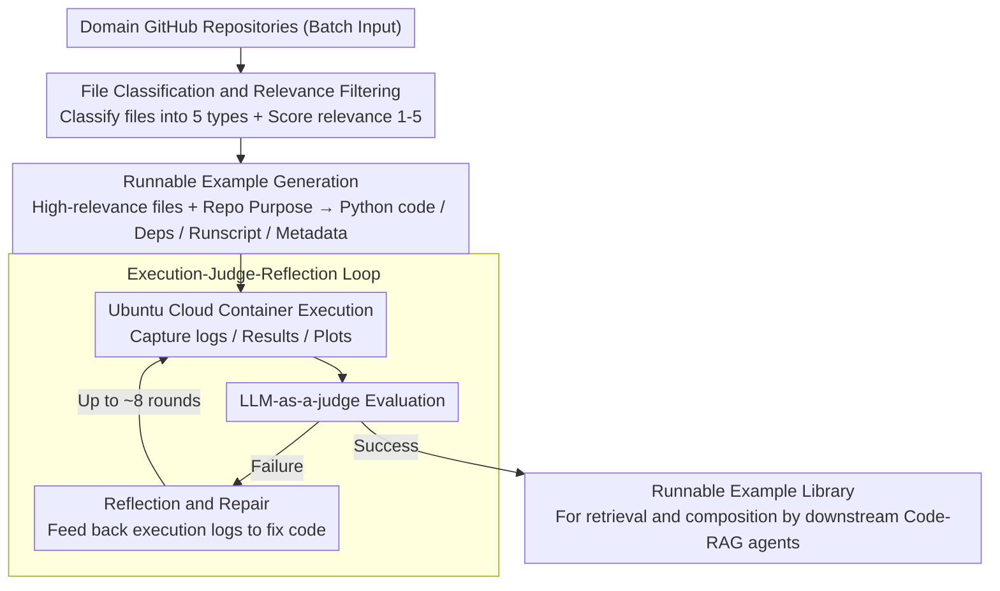

# CodeDistiller: Automatically Generating Code Libraries for Scientific Coding Agents

**Conference**: ACL2026  
**arXiv**: [2512.01089](https://arxiv.org/abs/2512.01089)  
**Code**: https://github.com/cognitiveailab/codedistiller  
**Area**: AI for Science / Code Agents  
**Keywords**: Automated Scientific Discovery, Code Agents, Code-RAG, Repository Distillation, LLM-as-a-judge

## TL;DR
CodeDistiller automatically distills scientific GitHub repositories into runnable and debugged example code libraries, enabling Code-RAG-style scientific discovery agents to invoke real domain tools. On 250 materials science repositories, the best model achieved a human-verified functional correctness rate of 74.1%, and downstream discovery tasks were more preferred by experts.

## Background & Motivation
**Background**: Automated scientific discovery systems are transitioning from literature-based discovery and data-driven discovery toward experiment-driven discovery. Many new systems receive research tasks, automatically generate code, run computational experiments, debug errors, and finally write experiment reports. In fields such as materials science, computational chemistry, or machine learning systems research, the ability to write correct experimental code directly determines discovery quality.

**Limitations of Prior Work**: Scientific experimental code often relies on highly specialized libraries, data formats, and operational workflows. When agents rely solely on parametric knowledge, they tend to generate unrunnable or scientifically non-compliant code based on "hallucinated" impressions. Relying on manually curated example libraries is expensive and scales slowly. Existing agent benchmarks mostly focus on reproducing a few repositories or writing code based on papers, and cannot directly build large-scale reusable examples for Code-RAG scientific discovery systems.

**Key Challenge**: Scientific agents require a large volume of realistic, runnable, and domain-specific code examples to enhance their capabilities. However, if these examples are maintained manually by experts, they cannot cover the rapidly growing open-source scientific software ecosystem; if fully automated, it is difficult to ensure the code runs and actually demonstrates the core functions of the repository.

**Goal**: The authors aim to build an automated pipeline to transform large batches of scientific GitHub repositories into "vetted code examples" that can be retrieved and composed by downstream discovery agents, and to quantify the trade-offs of different base models in terms of cost, runtime, and correctness.

**Key Insight**: Instead of attempting to have agents write experiments directly from parametric knowledge, CodeDistiller first scans repositories offline, identifies key files, and generates and debugs minimum working examples (MWEs). These examples then serve as a Code-RAG library for downstream tasks.

**Core Idea**: Use static file filtering combined with dynamic code generation/execution/reflective debugging to automatically distill open-source scientific repositories into executable example libraries, thereby supplementing the domain tool knowledge of scientific discovery agents.

## Method

### Overall Architecture
The input to CodeDistiller is a batch of domain-related GitHub repositories, and the output is the runnable example code and metadata for each repository. The process begins with large-scale static information collection: judging the type, purpose, relevance, and special execution requirements of each file to identify code, documentation, scripts, or existing examples most likely to assist in building the MWE. It then moves to the dynamic example generation phase: high-relevance files and the repository's core purpose are passed to a code generation system to produce Python code, dependencies, runscripts, and resource descriptions. The generated results are executed in Ubuntu cloud containers. If the LLM-as-a-judge determines a failure, the system feeds execution logs back to the model for reflection and repair until success or the debugging limit is reached.

### Key Designs

**1. Repository File Classification and Relevance Filtering: Screening hundreds of nested files to pick the ones that actually help**

Code generation models have finite contexts; stuffing an entire repository is expensive and noisy. CodeDistiller performs an initial large-scale static scan: each file is sent to a prompt and classified into `code`, `documentation`, `scripts`, `data`, or `other`. Within `code`, `documentation`, and `scripts`, files are further categorized into `existing examples`, `instructions`, `entry points`, etc. Simultaneously, the system assigns a relevance score of 1-5 to each file and records metadata such as GPU requirements, configuration instructions, and key task information. Subsequent generation phases then focus on APIs, documentation, and existing examples rather than being overwhelmed by peripheral files like test scripts or data dumps.

**2. Runnable Example Generation: Compressing core repository functions into a minimum experiment for downstream agent retrieval**

Downstream Code-RAG requires specific code that actually runs, not just a repository summary. CodeDistiller uses a modified version of CodeScientist to receive high-relevance files and the repository purpose, producing four bundled outputs: executable Python code, a list of Python dependencies, a bash runscript with Conda environment setup, and metadata—including usage descriptions, applicable/inapplicable scenarios, CPU/GPU/RAM/disk requirements, and whether user interaction is needed. The first three ensure the example is reproducible in a clean environment, while the metadata acts as a "manual" for the downstream agent to judge when to invoke the example.

**3. Execution-Evaluation-Reflection Loop: Turning "seemingly reasonable" code into "actually passing" code**

The correctness of scientific code cannot be judged solely by reading static text. Generated examples are executed in Ubuntu cloud containers, capturing human-readable outputs such as stdout/stderr, timestamped logs, JSON results, and plots. After execution, an LLM-as-a-judge determines if the repository's functionality was correctly demonstrated. If it fails, the current code and execution logs are fed back to the model for reflection and repair. This loop continues for up to 8 iterations to control costs. This closed "run-view-log-fix" loop distinguishes true code libraries from toy code that only passes "on paper."

### Loss & Training
CodeDistiller does not train a model but evaluates the performance of different foundation models as agent base models. Experiments utilize GPT-OSS-120B, GPT-5, and Claude Sonnet 4.5. Cheaper models from the same family (e.g., GPT-5-mini or Claude Haiku 4.5) can be used for the file classification phase. Evaluation metrics include automated LLM-as-a-judge, manual inspection by materials science experts, runtime, debugging rounds, and API costs. Downstream evaluation integrates generated example libraries into CodeScientist, comparing it via A/B testing against a baseline using only general materials science code examples.

## Key Experimental Results

### Main Results
Materials science experts first listed 30 common Python materials libraries (e.g., PyMatgen, ASE, LAMMPS, PyCalphad). The authors used the GitHub API to find 3,802 permissive-licensed repositories importing these libraries, then randomly sampled 250 for evaluation.

| Agent base model | Auto Success Rate | Human Error-free Execution | Human Functional Demo | Human Correct Function | Success Avg Runtime | Success Avg Cost |
|------------------|-----------:|-------------:|----------------:|-------------:|---------------:|-------------:|
| GPT-OSS-120B | 61.6% | 29.6% | 29.6% | 25.9% | 13.8 min | $0.09 |
| GPT-5 | 70.4% | 69.0% | 69.0% | 60.5% | 20.3 min | $0.70 |
| Claude Sonnet 4.5 | 75.6% | 75.6% | 75.6% | 74.1% | 19.0 min | $1.71 |

### Downstream A/B Testing

| Dimension | Key Data | Description |
|------|----------|------|
| Task Construction | 12 materials science repos, 5 problems each, 60 discovery problems total | Analyzed 50 problems where both baseline and enhanced systems produced solutions |
| Run Budget | Max 15 debug rounds, 6h total run, 60 min per round, LLM cost cap $5 | Claude Sonnet 4.5 used as CodeScientist base model |
| Expert Preference | CodeDistiller system was preferred in over half of cases for accuracy, completeness, soundness | Baseline preferred in only ~18%-24% of cases; others were ties |
| Reviewer Consistency | Cohen's $\kappa$: Accuracy 0.77, Soundness 0.70, Completeness 0.62 | Moderate to strong agreement between LLM-as-a-judge and experts |

### Key Findings
- Automated judges overestimate example quality; specifically, GPT-OSS-120B's 61.6% auto success rate differs significantly from its 25.9% human-verified functional correctness rate.
- Claude Sonnet 4.5 performs best but at an average success cost of $1.71, approximately 19x that of GPT-OSS-120B, showing a clear cost-quality trade-off.
- Successful samples usually require only ~2 debugging rounds; unsuccessful ones iterate until the limit, making failure costs non-negligible.
- Downstream A/B testing indicates these examples are useful not just for "repo reproduction" but also for improving the accuracy, completeness, and soundness of automated scientific discovery reports.

## Highlights & Insights
- **Transforming GitHub Repositories into Code-RAG Assets**: The paper focuses on building a retrievable, composable code library for scientific agents rather than just solving one repo at a time, aligning with long-term system construction goals.
- **Critical Importance of Human Expert Evaluation**: The gap between automated judges and human results serves as a reminder that "runnable" code does not equate to "scientifically correct" code; domain verification is essential.
- **Offline Distillation Reduces Online Discovery Complexity**: By having domain examples ready before executing specific research tasks, agents avoid having to learn every library from scratch during online inference.
- **Engineering Value of Cost Data**: Reporting runtime, debug rounds, and API costs—not just success rates—makes the deployability of the method easier to judge.

## Limitations & Future Work
- Human expert evaluation is still a time-constrained proxy: experts check if code and plots are reasonable but do not write full test suites or replicate original literature for every repo.
- Repository identification methods introduce noise. Using library imports to find repositories meant that about half of the samples were not "true" materials science repos but happened to import relevant libraries.
- Currently only evaluated in materials science; performance may change in biology, chemistry, or robotics due to data openness, software dependencies, and closed-source tools.
- The comparison between purpose-built agents and general coding agents remains unresolved due to differing budgets, models, and tools.
- Future work could introduce stronger automated unit test generation, domain benchmark verification, security filtering, and version update mechanisms for generated libraries.

## Related Work & Insights
- **vs CodeScientist**: CodeScientist depends on an existing vetted code library; CodeDistiller solves the problem of how to automatically expand that library.
- **vs AI Scientist / AgentLab**: These systems focus on executing research tasks or generating experimental code; CodeDistiller acts as the foundational infrastructure to prepare tool examples for subsequent agents.
- **vs SUPER / GISTIFY / RexBench**: These benchmarks test agent settings or single-repo reproduction; CodeDistiller evaluates on a larger scale of materials repos and focuses on downstream scientific discovery gains.
- **Insight**: To build domain research assistants, one can first offline distill the domain's GitHub ecosystem into a "runnable tool memory library," allowing the online agent to retrieve and compose examples instead of writing from scratch.

## Rating
- Novelty: ⭐⭐⭐⭐☆ The goal of repository-to-library transformation is practical; the pipeline combination is clear, though individual components are not entirely new.
- Experimental Thoroughness: ⭐⭐⭐⭐☆ Includes 250 repos, human expert evaluation, and downstream A/B testing; however, domain is limited to materials science.
- Writing Quality: ⭐⭐⭐⭐☆ Direct narrative with clear cost and failure mode analysis.
- Value: ⭐⭐⭐⭐⭐ Highly valuable as a reference for AI for Science agents and Code-RAG infrastructure.

<!-- RELATED:START -->

## Related Papers

- [\[ACL 2026\] SecureVibeBench: Evaluating Secure Coding Capabilities of Code Agents with Realistic Vulnerability Scenarios](securevibebench_evaluating_secure_coding_capabilities_of_code_agents_with_realis.md)
- [\[ACL 2026\] RExBench: Can coding agents autonomously implement AI research extensions?](rexbench_can_coding_agents_autonomously_implement_ai_research_extensions.md)
- [\[ICML 2026\] NEMO: Execution-Aware Optimization Modeling via Autonomous Coding Agents](../../ICML2026/code_intelligence/nemo_execution-aware_optimization_modeling_via_autonomous_coding_agents.md)
- [\[ACL 2026\] SciCoQA: Quality Assurance for Scientific Paper–Code Alignment](scicoqa_quality_assurance_for_scientific_paper--code_alignment.md)
- [\[ACL 2025\] UTBoost: Rigorous Evaluation of Coding Agents on SWE-Bench](../../ACL2025/code_intelligence/utboost_rigorous_evaluation_of_coding_agents_on_swe-bench.md)

<!-- RELATED:END -->
