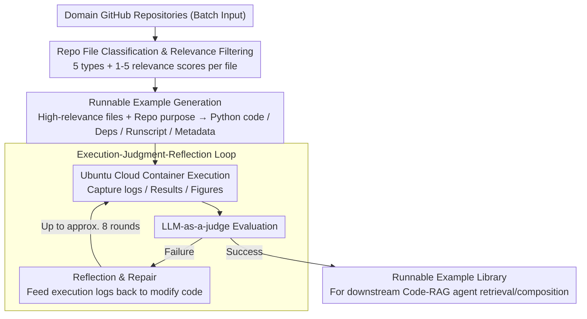

# CodeDistiller: Automatically Generating Code Libraries for Scientific Coding Agents

**Conference**: ACL2026  
**arXiv**: [2512.01089](https://arxiv.org/abs/2512.01089)  
**Code**: https://github.com/cognitiveailab/codedistiller  
**Area**: AI for Science / Code Agents  
**Keywords**: Automated Scientific Discovery, Code Agents, Code-RAG, Repository Distillation, LLM-as-a-judge

## TL;DR
CodeDistiller automatically distills scientific GitHub repositories into runnable and debugged example code libraries, enabling Code-RAG scientific discovery agents to utilize real-world domain tools; on 250 materials science repositories, the best model achieved a human-verified functional correctness rate of 74.1%, and downstream discovery tasks were more preferred by experts.

## Background & Motivation
**Background**: Automated scientific discovery systems are evolving from literature-based and data-driven discovery toward experiment-driven discovery. Many new systems receive research tasks, automatically generate code, execute computational experiments, debug errors, and ultimately produce experimental reports. In fields such as materials science, computational chemistry, or machine learning systems research, the ability to generate correct experimental code directly determines the quality of discovery.

**Limitations of Prior Work**: Scientific experimental code often depends on highly specialized libraries, data formats, and operational workflows. When agents rely solely on parametric knowledge, they tend to generate unrunnable or scientifically non-compliant code based on "impressions"; if they rely on manually curated example libraries, the costs are high and scalability is slow. Existing agent benchmarks mostly focus on reproducing a few repositories or writing code based on papers, failing to build reusable examples at scale for Code-RAG scientific discovery systems.

**Key Challenge**: Scientific agents require a large volume of authentic, runnable, and domain-specific code examples to enhance their capabilities. However, if these examples are maintained manually by experts, they cannot cover the rapidly growing open-source scientific software ecosystem; if fully automated, it is difficult to ensure the code is executable and truly demonstrates the core functionality of the repository.

**Goal**: The authors aim to construct an automated pipeline to transform large batches of GitHub scientific repositories into "vetted code examples" that can be retrieved and combined by downstream discovery agents, while quantifying the trade-offs of different base models in terms of cost, runtime, and correctness.

**Key Insight**: Instead of having agents write experiments directly from parametric knowledge, CodeDistiller performs offline repository scanning, identifies key files, generates and debugs minimum working examples (MWEs), and then provides these as Code-RAG libraries for downstream tasks.

**Core Idea**: Use static file filtering combined with dynamic code generation, execution, and reflection-based debugging to automatically distill open-source scientific repositories into executable example libraries, thereby supplementing the domain tool knowledge of scientific discovery agents.

## Method

### Overall Architecture
The input to CodeDistiller is a set of domain-specific GitHub repositories, and the output is runnable example code and metadata for each. The process begins with large-scale static information collection: determining file types, purposes, relevance, and special execution requirements file-by-file to identify code, documentation, scripts, or existing examples most likely to assist in building the MWE. It then proceeds to the dynamic example generation stage: high-relevance files and the core intended purpose of the repository are provided to a code generation system to produce Python code, dependencies, runscripts, and resource descriptions. The results are executed in Ubuntu cloud containers; if an LLM-as-a-judge identifies a failure, the system feeds execution logs back to the model for reflection and repair until success or the debugging limit is reached.

### Key Designs

**1. Repository file classification and relevance filtering: Sifting through hundreds of nested files to pick the most helpful ones**

Code generation models have limited context windows; feeding an entire repository is expensive and noisy. CodeDistiller first performs a large-scale static scan: each file is sent to a prompt and classified into five categories: code, documentation, scripts, data, and other. Within code, documentation, and scripts, it further refines categories into existing examples, instructions, entry points, etc. Simultaneously, the system assigns a relevance score from 1-5 and records metadata such as GPU requirements, configuration instructions, and key task info. This allows the generation stage to focus on APIs, documentation, and existing examples rather than being overwhelmed by test scripts or data dumps.

**2. Runnable example generation: Compressing core repository functionality into a minimal experiment for downstream agents**

Downstream Code-RAG requires specific runnable code rather than just a repository summary. CodeDistiller uses a modified CodeScientist to receive high-relevance files and repository purposes, producing four linked outputs: executable Python code, a Python dependency list, a bash runscript with Conda environment setup, and metadata—including descriptions of use, applicable/inapplicable scenarios, CPU/GPU/RAM/disk requirements, and whether user interaction is needed. The first three ensure the example is reproducible in a clean environment, while the metadata serves as a "user manual" for downstream agents to decide when to call the example.

**3. Execution-judgment-reflection loop: Forcing "reasonable-looking" code into "actually passing" code**

The correctness of scientific code cannot be judged by static text alone. Generated examples are executed in Ubuntu cloud containers, where the system captures stdout/stderr, timestamped logs, JSON results, and human-readable outputs like charts. An LLM-as-a-judge then determines if it correctly demonstrates repository functionality; if it fails, the current code and execution logs are fed back for reflection and repair. This loop continues for up to 8 iterations to control costs. This closed-loop process distinguishes between "paper-correct" toy code and genuinely usable code libraries.

### Loss & Training
CodeDistiller does not train a new model but compares the performance of various base models as agent backbones. Experiments utilize GPT-OSS-120B, GPT-5, and Claude Sonnet 4.5. Cheaper models from the same families (e.g., GPT-5-mini or Claude Haiku 4.5) are used for the file classification stage. Evaluation includes automated LLM-as-a-judge, human inspection by materials science experts, runtime, debugging rounds, and API costs. Downstream evaluation integrates CodeDistiller-generated example libraries into CodeScientist and conducts A/B comparisons against a baseline using only generic materials science examples.

## Key Experimental Results

### Main Results
Materials science experts first listed 30 common Python materials libraries (e.g., PyMatgen, ASE, LAMMPS, PyCalphad). The authors used the GitHub API to find 3,802 repositories importing these libraries with permissive licenses, then randomly sampled 250 for evaluation.

| Agent base model | Auto Success Rate | Human Error-free | Human Demo Func. | Human Correct Func. | Avg. Runtime (Succ) | Avg. Cost (Succ) |
|------------------|-----------:|-------------:|----------------:|-------------:|---------------:|-------------:|
| GPT-OSS-120B | 61.6% | 29.6% | 29.6% | 25.9% | 13.8 min | $0.09 |
| GPT-5 | 70.4% | 69.0% | 69.0% | 60.5% | 20.3 min | $0.70 |
| Claude Sonnet 4.5 | 75.6% | 75.6% | 75.6% | 74.1% | 19.0 min | $1.71 |

### Ablation Study (Downstream A/B Testing)

| Dimension | Key Data | Description |
|------|----------|------|
| Task Construction | 12 materials science repos, 5 questions each, 60 discovery problems total | Analyzed 50 problems where both baseline and enhanced system produced solutions |
| Runtime Budget | Max 15 debug rounds, 6h total execution, 60 min per round, LLM cost cap $5 | Used Claude Sonnet 4.5 as CodeScientist base model |
| Expert Preference | CodeDistiller enhanced system preferred for accuracy, completeness, and soundness | Baseline preferred in only ~18%-24% of cases; ~25% were ties |
| Reviewer Consistency | Cohen's $\kappa$: Accuracy 0.77, Soundness 0.70, Completeness 0.62 | Moderate to strong agreement between LLM-as-a-judge and experts in A/B tasks |

### Case Results

| Scenario | Baseline | CodeDistiller Enhanced System | Description |
|------|----------|------------------------|------|
| Tox21 Toxicity Prediction | Used synthetic data from 20 hand-picked molecules | Used 6,258 real compounds, 12 toxicity assays | Enhanced system is more scientifically valid |
| Ge/Sb/Te Structural Relaxation | Used generic Lennard-Jones potential (not parameterized for elements), 80%-93% volume collapse | Used CHGNet, volume change -16% to +75% | Enhanced system aligns better with material physics |
| Alloy Parameter Calculation | Manual database led to 3.60% atomic size difference in AlTiVNb | Used pymatgen and Parameter-Calculator-for-CCA, result 5.428% | Mature libraries are more reliable than ad-hoc implementations |

### Key Findings
- Automated judges overestimate example quality; GPT-OSS-120B’s auto-success rate (61.6%) significantly diverged from human-verified functional correctness (25.9%).
- Claude Sonnet 4.5 performed best but at an average success cost of $1.71—roughly 19x that of GPT-OSS-120B, showing a clear cost-quality trade-off.
- Successful cases usually required about 2 rounds of debugging; unsuccessful cases iterated until the limit, making failure costs non-negligible.
- Downstream A/B testing indicates these examples are useful not just for "repo reproduction" but also for improving the accuracy, completeness, and scientific soundness of automated discovery reports.

## Highlights & Insights
- **Transforming GitHub repositories into Code-RAG assets**: The focus is not on solving a single repo but on building a retrievable, composable code library for scientific agents, which is more aligned with long-term system construction.
- **Human expert evaluation is critical**: The gap between automated judges and human results serves as a reminder that scientific code "running" does not equate to it being "scientifically correct"; domain validation is essential.
- **Offline distillation reduces online discovery difficulty**: Downstream agents already possess domain examples before performing specific research tasks, meaning online inference does not require learning each library from scratch.
- **Engineering value of cost data**: The paper reports not just success rates but also runtime, debugging rounds, and API costs, making the feasibility of deployment easier to judge.

## Limitations & Future Work
- Human expert evaluation remains a time-limited proxy: experts checked if code, results, and charts were reasonable but did not write full test suites or replicate original literature for every repository.
- Repository identification methods may introduce noise. The authors searched for repositories importing certain libraries, but human analysis suggests about half were not actually focused on materials science, just incidentally importing the libraries.
- Currently evaluated only in materials science; performance may vary in biology, chemistry, GIS, or robotics due to data openness, software dependencies, closed-source tools, and experimental standards.
- The comparison between purpose-built agents and general coding agents remains unresolved; differences in budgets, models, tools, and outputs make perfectly fair control difficult.
- Future work could introduce stronger automated unit test generation, domain benchmark validation, licensing/security filtering, and version update mechanisms for the generated example libraries.

## Related Work & Insights
- **vs CodeScientist**: CodeScientist relies on an existing vetted code library; CodeDistiller addresses how to automatically expand that library.
- **vs AI Scientist / AgentLab**: These systems focus on executing research tasks or generating experimental code; CodeDistiller acts as front-end infrastructure, preparing tool examples for subsequent agents.
- **vs SUPER / GISTIFY / RexBench**: These benchmarks test an agent’s ability to set up, reproduce, or generate examples for a single repository; CodeDistiller evaluates on a larger scale of materials repositories and focuses on downstream scientific discovery gains.
- **Insight**: To build a domain research assistant, one should first distill the domain's GitHub ecosystem offline into a "runnable tool memory library," then allow the online agent to retrieve and combine these examples rather than writing code from scratch using only model weights.

## Rating
- Novelty: ⭐⭐⭐⭐☆ The goal of repo-to-runnable-library is highly practical; the pipeline combination is clear; individual agent components are not entirely new.
- Experimental Thoroughness: ⭐⭐⭐⭐☆ Includes 250 repositories, human expert evaluation, and downstream A/B testing; however, domain is limited to materials science and human verification is a proxy.
- Writing Quality: ⭐⭐⭐⭐☆ Direct narrative, clear explanation of costs and failure modes; some "Table 1/2" naming inconsistencies require attention.
- Value: ⭐⭐⭐⭐⭐ Extremely valuable reference for AI for Science agents and Code-RAG infrastructure.

<!-- RELATED:START -->

## Related Papers

- [\[ACL 2026\] RExBench: Can coding agents autonomously implement AI research extensions?](rexbench_can_coding_agents_autonomously_implement_ai_research_extensions.md)
- [\[ACL 2026\] SecureVibeBench: Evaluating Secure Coding Capabilities of Code Agents with Realistic Vulnerability Scenarios](securevibebench_evaluating_secure_coding_capabilities_of_code_agents_with_realis.md)
- [\[ACL 2026\] SciCoQA: Quality Assurance for Scientific Paper–Code Alignment](scicoqa_quality_assurance_for_scientific_paper--code_alignment.md)
- [\[ICLR 2026\] VisCoder2: Building Multi-Language Visualization Coding Agents](../../ICLR2026/code_intelligence/viscoder2_building_multi-language_visualization_coding_agents.md)
- [\[ICML 2026\] NEMO: Execution-Aware Optimization Modeling via Autonomous Coding Agents](../../ICML2026/code_intelligence/nemo_execution-aware_optimization_modeling_via_autonomous_coding_agents.md)

<!-- RELATED:END -->
## Related Papers

- [\[ACL 2026\] SecureVibeBench: Evaluating Secure Coding Capabilities of Code Agents with Realistic Vulnerability Scenarios](securevibebench_evaluating_secure_coding_capabilities_of_code_agents_with_realis.md)
- [\[ACL 2026\] RExBench: Can coding agents autonomously implement AI research extensions?](rexbench_can_coding_agents_autonomously_implement_ai_research_extensions.md)
- [\[ACL 2026\] SciCoQA: Quality Assurance for Scientific Paper–Code Alignment](scicoqa_quality_assurance_for_scientific_paper--code_alignment.md)
- [\[ICML 2026\] NEMO: Execution-Aware Optimization Modeling via Autonomous Coding Agents](../../ICML2026/code_intelligence/nemo_execution-aware_optimization_modeling_via_autonomous_coding_agents.md)
- [\[ACL 2025\] UTBoost: Rigorous Evaluation of Coding Agents on SWE-Bench](../../ACL2025/code_intelligence/utboost_rigorous_evaluation_of_coding_agents_on_swe-bench.md)

<!-- RELATED:END -->
