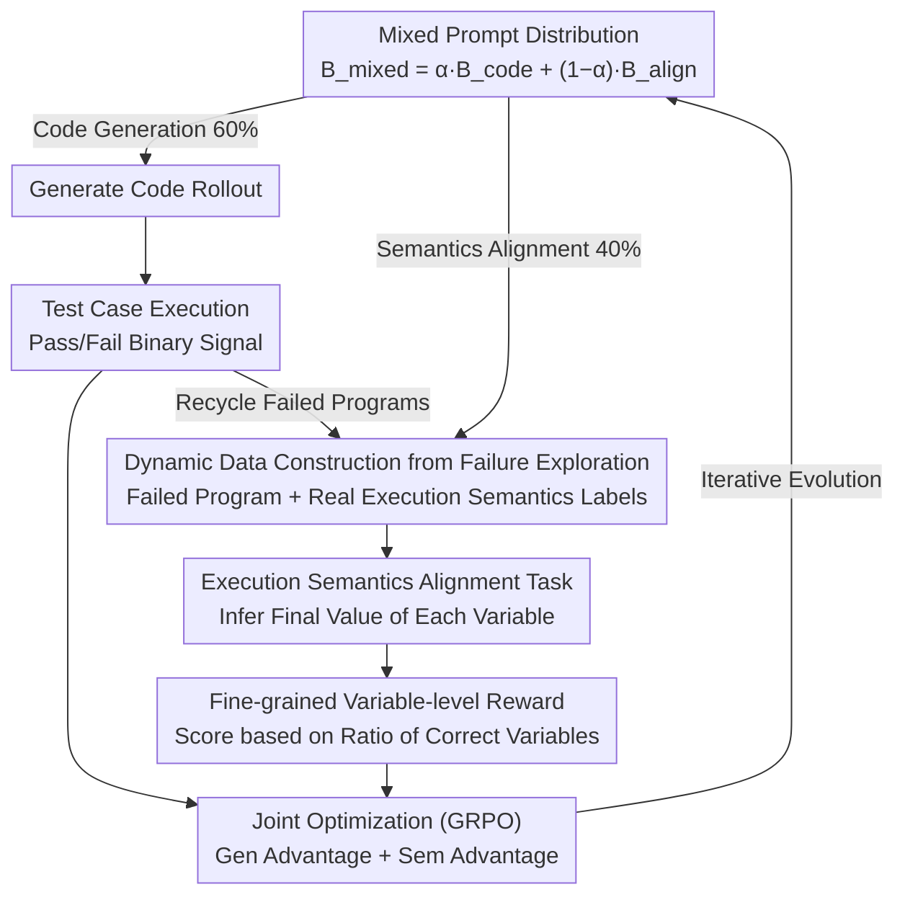

# CodeRL+: Improving Code Generation via Reinforcement with Execution Semantics Alignment

**Conference**: ACL 2026  
**arXiv**: [2510.18471](https://arxiv.org/abs/2510.18471)  
**Code**: [https://github.com/jiangxxxue/CODERLPLUS](https://github.com/jiangxxxue/CODERLPLUS)  
**Area**: Code Generation / Reinforcement Learning  
**Keywords**: Code generation, execution semantics alignment, RLVR, GRPO, program execution trajectories

## TL;DR

This paper proposes CodeRL+, which integrates execution semantics alignment into the RLVR training pipeline. By enabling models to infer variable-level execution trajectories, it bridges the gap between code textual representation and execution semantics. CodeRL+ achieves an average 4.6% improvement in pass@1 for code generation and improvements of 15.5% and 4.4% on code reasoning and test output generation benchmarks, respectively.

## Background & Motivation

**Background**: LLMs learn textual patterns of code through autoregressive pre-training, achieving strong code generation capabilities. RLVR (Reinforcement Learning with Verifiable Rewards) utilizes deterministic feedback from test case execution to bridge the semantic gap between textual patterns and functional correctness.

**Limitations of Prior Work**: RLVR relies solely on binary pass/fail signals, which is insufficient for establishing deep alignment between code text and execution semantics. Experiments show that models trained via RLVR only improve by 4% over baselines in execution trajectory inference tasks, failing to track basic execution semantics such as variable changes in loops.

**Key Challenge**: There is a fundamental misalignment between the pre-training objective (fitting textual distributions) and the evaluation criterion (execution correctness) of LLMs. Sparse rewards based only on final execution results prevent the model from learning to understand the runtime behavior of code.

**Goal**: To introduce execution semantics alignment within RLVR, enabling models to infer variable-level execution trajectories and provide direct learning signals for execution semantics.

**Key Insight**: Repurposing failed code explorations as training data for execution semantics alignment—training the model to infer the final values of each variable in programs that failed to pass test cases.

**Core Idea**: Code generation (synthesizing the state transition function $\Phi_p$) and execution semantics alignment (understanding $\Phi_p$) are complementary, and their joint optimization can surpass the learning of surface textual patterns.

## Method

### Overall Architecture

The core misalignment CodeRL+ addresses is that RLVR only uses binary test pass/fail signals, resulting in models that can write code but cannot explain how variables change during execution. It introduces a secondary objective into the GRPO pipeline: in addition to standard generation and verification, the model must infer the final values of all variables in a program. Two objectives are sampled and jointly optimized using a mixed prompt distribution $\mathcal{B}_{\text{mixed}} = \alpha \cdot \mathcal{B}_{\text{code}} + (1-\alpha) \cdot \mathcal{B}_{\text{align}}$, allowing "synthesizing logic" and "understanding logic" to mutually reinforce within a single set of weights.

### Key Designs

**1. Execution Semantics Alignment Task: Turning runtime behavior into a learnable target**

The blind spot of RLVR is sparse final rewards; models lack knowledge of how variable values evolve in loops. CodeRL+ provides the model with a program $p$ and input $x$, requiring it to infer the value of each variable $var_i$ at its last assignment in the execution trajectory. Inferring "final values" rather than full trajectories avoids state explosion in loops while serving as a viable approximation that encodes control flow and data dependencies.

**2. Dynamic Data Construction from Failed Explorations: Learning from mistakes**

The alignment task requires ground-truth labels. CodeRL+ observes that code generation rollouts produce numerous failed programs. It recycles these by constructing alignment prompts $q' = \langle p_{\text{fail}}, x, V \rangle$ and using the actual execution semantics $\mathcal{F}_{p_{\text{fail}}}(x)$ of these failed attempts as labels. Injected gradually, the alignment data evolves alongside the model's current capabilities, specifically correcting semantic misunderstandings revealed by failures.

**3. Fine-grained Variable-level Reward: Replacing binary signals with continuous feedback**

Code generation rewards are binary—the code either passes or fails. The alignment task instead scores the model based on the proportion of correct variable inferences $R_{\text{sem}}^{(i)} = \frac{1}{|V|}\sum_{v_k \in V} \mathbb{1}[\hat{v}_k^{\text{final}} = v_k^{\text{final},*}]$. This dense gradient provides "climbable steps" between learning nothing and full mastery, offering richer signals than binary feedback.

### Loss & Training

The joint optimization objective is $\mathcal{J}_{\text{CodeRL+}}(\theta) = \mathbb{E}[r(\theta) \cdot A_{\text{gen}}] + \mathbb{E}[r'(\theta) \cdot A_{\text{sem}}]$, where the two terms represent advantages for code generation and semantic alignment, respectively, updated within the GRPO framework. The mixing ratio is $\alpha = 0.6$. The base model is Qwen2.5-Coder-7B-Instruct, trained on 8×A100 with a batch size of 128 and 8 rollouts per prompt.

## Key Experimental Results

### Main Results

**Pass@1 (%) for Qwen2.5-Coder-7B-Instruct**

| Method | HumanEval | LeetCode | LiveCodeBench | Avg | Code Reasoning | Test Output |
| :--- | :--- | :--- | :--- | :--- | :--- | :--- |
| Base | 88.4 | 50.6 | 34.3 | 57.8 | 60.8 | 48.8 |
| GRPO | 87.2 | 60.0 | 35.4 | 60.9 | 66.0 | 48.4 |
| OlympicCoder | 75.6 | 45.3 | 30.9 | 50.6 | 68.5 | 31.1 |
| CodeReasoner | 88.4 | 50.0 | 34.8 | 57.7 | 78.5 | 65.1 |
| **Ours** | **90.9** | **63.3** | **36.9** | **63.7** | **85.0** | 53.2 |

### Ablation Study

| Config | Avg Code Gen | Code Reasoning | Description |
| :--- | :--- | :--- | :--- |
| GRPO (Baseline) | 60.9 | 66.0 | Code generation only |
| + Execution Semantics Alignment | **63.7** | **85.0** | Full CodeRL+ |
| Execution Semantics Alignment Only | - | Gain | Alignment alone is effective |
| Different RL Alg. (REINFORCE++, DAPO) | Gain | Gain | Consistent across algorithms |

### Key Findings

- CodeRL+ improves average pass@1 by 4.6% relative to GRPO and improves code reasoning by 15.5%.
- CodeRL+ successfully bridges the performance gap between generation and reasoning; previous methods often sacrificed one for the other.
- Stable improvements are observed across different models (Qwen, DeepSeek, Llama) and RL algorithms.
- Probing experiments demonstrate that the model considers execution semantics more heavily during code generation after training with CodeRL+.

## Highlights & Insights

- The repurposing of failed explorations is a key design highlight—no computational resources are wasted as local errors become training data for semantic alignment.
- Joint optimization creates a virtuous cycle between "Synthesis $\Phi_p$" and "Understanding $\Phi_p$".
- No additional data sources or teacher distillation are required; alignment data stems entirely from the model's own exploration.

## Limitations & Future Work

- Trajectory approximation (inferring only final values) may lose critical information from intermediate states.
- Dependence on executable test cases for rewards limits applicability to tasks that are difficult to automate (e.g., UI development).
- Only Python code generation was evaluated; generalization to other programming languages remains to be verified.

## Related Work & Insights

- **vs CODEI/O**: CODEI/O relies on teacher distillation + SFT, whereas CodeRL+ utilizes RL for self-exploration, potentially offering better generalization.
- **vs CodeReasoner/CodeBoost**: These methods tend to damage code generation while optimizing reasoning; CodeRL+ optimizes both jointly.
- **vs Standard GRPO**: Standard GRPO yields limited improvements in semantic understanding (4%), whereas CodeRL+ achieves significant gains through explicit alignment.

## Rating

- Novelty: ⭐⭐⭐⭐⭐ First to integrate execution semantics alignment into RLVR using failed explorations.
- Experimental Thoroughness: ⭐⭐⭐⭐⭐ Comprehensive evaluation across five benchmarks, multiple models, and multiple RL algorithms.
- Writing Quality: ⭐⭐⭐⭐ Clear motivation and rigorous formalization, though some notation is heavy.
- Value: ⭐⭐⭐⭐⭐ Provides critical execution semantics learning signals for code generation RL.

<!-- RELATED:START -->

## Related Papers

- [\[ACL 2026\] MARS2: Scaling Multi-Agent Tree Search via Reinforcement Learning for Code Generation](mars2_scaling_multi-agent_tree_search_via_reinforcement_learning_for_code_genera.md)
- [\[ICLR 2026\] Execution-Grounded Credit Assignment for GRPO in Code Generation](../../ICLR2026/code_intelligence/execution-grounded_credit_assignment_for_grpo_in_code_generation.md)
- [\[ACL 2026\] SciCoQA: Quality Assurance for Scientific Paper–Code Alignment](scicoqa_quality_assurance_for_scientific_paper--code_alignment.md)
- [\[ACL 2026\] ReCode: Reinforcing Code Generation with Reasoning-Process Rewards](recode_reinforcing_code_generation_with_reasoning-process_rewards.md)
- [\[ACL 2026\] ChipSeek: Optimizing Verilog Generation via EDA-Integrated Reinforcement Learning](chipseek_optimizing_verilog_generation_via_eda-integrated_reinforcement_learning.md)

<!-- RELATED:END -->
