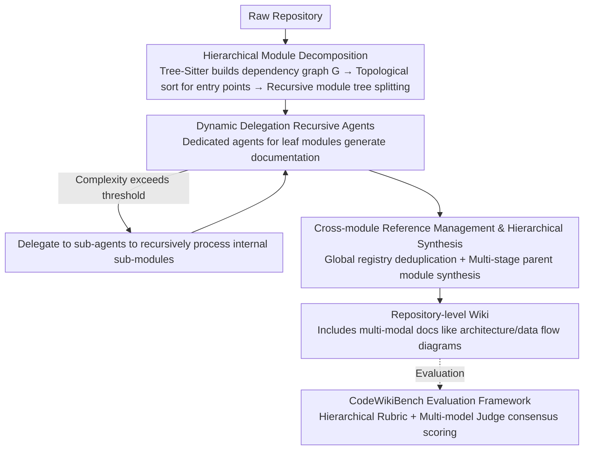

# CodeWiki: Evaluating AI's Ability to Generate Holistic Documentation for Large-Scale Codebases

**Conference**: ACL 2026  
**arXiv**: [2510.24428](https://arxiv.org/abs/2510.24428)  
**Code**: [GitHub](https://github.com/FSoft-AI4Code/CodeWiki)  
**Area**: Code Intelligence  
**Keywords**: Code Documentation Generation, Repository-level Understanding, Multi-agent Systems, Hierarchical Decomposition, Code Benchmark

## TL;DR

Ours proposes CodeWiki, an open-source framework based on hierarchical decomposition and recursive multi-agent processing for automatic repository-level code documentation generation. It also constructs the CodeWikiBench benchmark, where it surpasses the closed-source system DeepWiki (64.06%) with a quality score of 68.79% across seven programming languages.

## Background & Motivation

**Background**: As the scale and complexity of codebases grow, maintaining comprehensive and timely documentation has become a core bottleneck in software development. Approximately 31% of developers already heavily use AI to assist in code documentation, reflecting an urgent demand for automated solutions.

**Limitations of Prior Work**: Existing methods primarily focus on function-level and file-level documentation generation (e.g., CodeBERT, DocAgent), which are difficult to scale to the repository level. Repository-level documentation requires capturing architectural patterns, cross-module interactions, data flows, and system-level design decisions, but existing tools lack the capability to model these semantic dependencies and hierarchical structures. Furthermore, evaluation systems are inadequate—traditional BLEU/ROUGE metrics fail to capture the multi-dimensional features of documentation quality, and there is a lack of systematic benchmarks for repository-level documentation.

**Key Challenge**: Repository-level documentation generation requires simultaneous understanding of local implementation details and global architectural relationships. However, the limited context windows of LLMs prevent processing large codebases at once; existing multilingual support is also severely lacking, with most research focusing only on Python.

**Goal**: To build a scalable, multilingual framework for automatic repository-level documentation generation while providing a reliable evaluation methodology.

**Key Insight**: Drawing inspiration from dynamic programming, large repositories are partitioned into manageable modules via hierarchical decomposition, followed by recursive bottom-up document generation and synthesis.

**Core Idea**: The repository-level documentation generation is divided into three stages—static analysis and module decomposition, recursive agent documentation generation, and hierarchical assembly and synthesis—enabling adaptive processing of repositories of any size through a dynamic delegation mechanism.

## Method

### Overall Architecture

The contradiction CodeWiki addresses is that repository-level documentation must explain architecture, cross-module interactions, and system-level design, yet LLM context windows cannot accommodate entire large codebases. It adopts a "divide and conquer" approach inspired by dynamic programming to advance the process bottom-up in three stages: first, repository analysis uses AST/LLM parsing to build dependency graphs, identify high-level components, and recursively split them into a module tree; second, recursive document generation assigns a dedicated agent to each leaf module, capable of reading source code, browsing the module tree, operating a document workspace, and traversing dependency graphs, with the ability to dynamically delegate to sub-agents if a module is too complex; finally, hierarchical assembly synthesizes sub-module documents into parent module architecture overviews and produces a comprehensive wiki containing multi-modal content like architecture and data flow diagrams. The input is a raw repository, the intermediate stage is a module tree populated node-by-node by agents, and the output is an interconnected repository-level wiki, with quality scored via the CodeWikiBench evaluation framework.

### Key Designs

**1. Hierarchical Module Decomposition: Slicing Large Repositories into LLM-digestible Units**

LLM context windows are limited while repositories often reach millions of lines; feeding the entire repo directly leads to overflow. CodeWiki uses the Tree-Sitter parser to extract ASTs and construct a directed dependency graph $G=(V,E)$, then performs a topological sort to identify entry components with zero in-degree (e.g., main functions, API endpoints). It recursively partitions these into a module tree. A key engineering tradeoff is that module tree nodes retain only component IDs rather than full source code, minimizing the overhead of the decomposition process while ensuring the splitting follows real dependencies to maintain architectural consistency.

**2. Dynamic Delegation Recursive Agents: Adaptive Processing Depth Based on Module Complexity**

Fixed-granularity partitioning either over-splits simple modules or fails to fit complex ones. CodeWiki allows dedicated agents for each leaf module to assess cyclomatic complexity, nesting depth, semantic diversity, and current context window utilization in real-time. Once complexity crosses a threshold, internal sub-modules are delegated to new sub-agents recursively. This ensures that regardless of repository size, every unit processed by the LLM remains within a bounded complexity, guaranteeing scalability to any size while maintaining documentation quality for individual modules.

**3. Cross-module Reference Management & Hierarchical Synthesis: Avoiding Redundancy and Weaving a Global View**

Module-by-module generation easily leads to redundant descriptions of the same component and difficulties in achieving a unified architectural narrative. CodeWiki maintains a global registry to track documented components and their locations; when encountering external components, it creates cross-references instead of repeating the body text. Parent module synthesis follows a multi-stage LLM pipeline—first analyzing thematic patterns of sub-documents, then sequentially generating architecture overviews, feature summaries, usage guides, and visual diagrams. The resulting documentation is non-redundant and accurately maps the repository's true structure and interactions.

**4. CodeWikiBench Evaluation Framework: Replacing BLEU/ROUGE with Hierarchical Standards and Multi-model Consensus**

Traditional n-gram metrics fail to capture the multi-dimensional quality of repository-level documentation, and the industry lacks systematic benchmarks. The core of CodeWikiBench is a Hierarchical Rubric: evaluation criteria are automatically extracted from the official documentation of open-source projects, with the criteria structure mirroring the project architecture. During evaluation, multiple Judge Agents from different model families independently score leaf-level requirements, which are then weighted and aggregated bottom-up into final scores and reliability metrics. Multi-model consensus effectively mitigates single-model bias.

## Key Experimental Results

### Main Results

| Repository | Language | LOC | CodeWiki | DeepWiki | Gain |
|------|------|-----|----------|----------|------|
| OpenHands | Python | 229K | 82.45% | 73.04% | +9.41% |
| svelte | JavaScript | 125K | 71.96% | 68.51% | +3.45% |
| puppeteer | TypeScript | 136K | 83.00% | 64.46% | +18.54% |
| ml-agents | C# | 86K | 79.78% | 74.80% | +4.98% |
| logstash | Java | 117K | 57.90% | 54.80% | +3.10% |
| wazuh | C | 1.4M | 64.17% | 68.68% | -4.51% |
| electron | C++ | 184K | 42.30% | 44.10% | -1.80% |
| **Average** | | | **68.79%** | **64.06%** | **+4.73%** |

### Cross-language Analysis

| Language Category | CodeWiki | DeepWiki | Gain |
|---------|----------|----------|------|
| Scripting Languages (Python/JS/TS) | 79.14% | 68.67% | +10.47% |
| Managed Languages (C#/Java) | 68.84% | 64.80% | +4.04% |
| Systems Languages (C/C++) | 53.24% | 56.39% | -3.15% |

### Key Findings
- CodeWiki surpasses all baselines in 5 out of 7 repositories, with the largest gain (+18.54%) in the TypeScript repository.
- Advantages in high-level scripting languages are most significant (+10.47%), while performance is slightly lower than DeepWiki in systems programming languages (C/C++).
- Performance differences are primarily attributed to language features rather than repository scale.
- Preliminary human studies show CodeWiki was preferred in 7 out of 9 evaluations.

## Highlights & Insights
- **Ingenious Hierarchical Decomposition**: Applying dynamic programming to documentation generation solves scale scalability issues while maintaining architectural semantic consistency.
- **Innovative Evaluation Methodology**: CodeWikiBench’s hierarchical standard generation and multi-model consensus evaluation mechanism provide a systematic solution for repository-level documentation assessment.
- **Open-source Transparency**: Given the dominance of closed-source systems, the open-source release of CodeWiki holds significant community value.

## Limitations & Future Work
- **Suboptimal Performance in Systems Languages**: Performance is lower than DeepWiki in C/C++, suggesting insufficient parsing capabilities for low-level constructs like pointer operations and template metaprogramming.
- **Evaluation Standards Lack Full Human Validation**: Semantic reliability is 73.65%, and structural reliability is 70.84%.
- **Limited Human Evaluation Scale**: Only 3 participants $\times$ 3 repositories.
- Future directions: Developing specialized parsing modules for systems languages, multi-version document tracking, and utilizing documentation to support downstream tasks.

## Related Work & Insights
- **vs DocAgent**: DocAgent uses multi-agent collaboration for function-level documentation, whereas CodeWiki focuses on repository-level hierarchical synthesis.
- **vs DeepWiki**: A closed-source commercial system that performs well overall but lacks hierarchical decomposition capabilities.
- **vs OpenDeepWiki/deepwiki-open**: Open-source alternatives using direct whole-repository prompting show significantly lagged performance.

## Rating
- Novelty: ⭐⭐⭐⭐ The design of hierarchical decomposition and dynamic delegation is novel, and the CodeWikiBench methodology is innovative.
- Experimental Thoroughness: ⭐⭐⭐⭐ Covers 7 languages and 7 repositories with cross-language and scalability analysis, though human evaluation scale is small.
- Writing Quality: ⭐⭐⭐⭐ Clear structure with well-organized research questions.
- Value: ⭐⭐⭐⭐ Fills a critical gap in automatic repository-level documentation generation and evaluation; the open-source contribution is positive for the community.

<!-- RELATED:START -->

## Related Papers

- [\[ICLR 2026\] AetherCode: Evaluating LLMs' Ability to Win In Premier Programming Competitions](../../ICLR2026/code_intelligence/aethercode_evaluating_llms_ability_to_win_in_premier_programming_competitions.md)
- [\[ACL 2026\] SecureVibeBench: Evaluating Secure Coding Capabilities of Code Agents with Realistic Vulnerability Scenarios](securevibebench_evaluating_secure_coding_capabilities_of_code_agents_with_realis.md)
- [\[NeurIPS 2025\] MLR-Bench: Evaluating AI Agents on Open-Ended Machine Learning Research](../../NeurIPS2025/code_intelligence/mlr-bench_evaluating_ai_agents_on_open-ended_machine_learning_research.md)
- [\[ICML 2026\] SWE-rebench V2: Language-Agnostic SWE Task Collection at Scale](../../ICML2026/code_intelligence/swe-rebench_v2_language-agnostic_swe_task_collection_at_scale.md)
- [\[ACL 2026\] River-LLM: Large Language Model Seamless Exit Based on KV Share](river-llm_large_language_model_seamless_exit_based_on_kv_share.md)

<!-- RELATED:END -->
