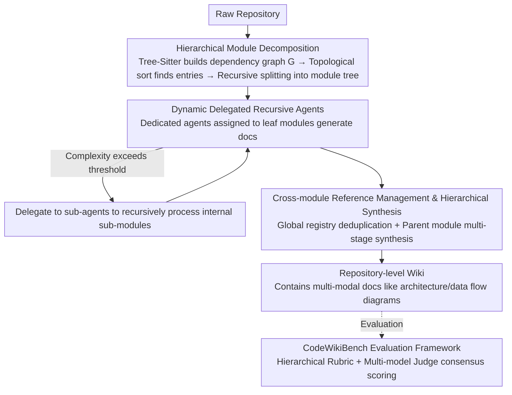

# CodeWiki: Evaluating AI's Ability to Generate Holistic Documentation for Large-Scale Codebases

**Conference**: ACL 2026  
**arXiv**: [2510.24428](https://arxiv.org/abs/2510.24428)  
**Code**: [GitHub](https://github.com/FSoft-AI4Code/CodeWiki)  
**Area**: Code Intelligence  
**Keywords**: Code Documentation Generation, Repository-level Understanding, Multi-agent Systems, Hierarchical Decomposition, Code Benchmark

## TL;DR

Ours proposes CodeWiki, an open-source framework based on hierarchical decomposition and recursive multi-agent processing for automatic repository-level code documentation generation. Ours also constructs the CodeWikiBench benchmark, achieving a quality score of 68.79% across seven programming languages, surpassing the closed-source system DeepWiki (64.06%).

## Background & Motivation

**Background**: As the scale and complexity of codebases continue to grow, maintaining comprehensive and timely documentation has become a core bottleneck in software development. Approximately 31% of developers already extensively use AI to assist in code documentation, reflecting an urgent need for automated generation.

**Limitations of Prior Work**: Existing methods primarily focus on function-level and file-level documentation generation (e.g., CodeBERT, DocAgent), making them difficult to scale to the repository level. Repository-level documentation requires capturing architectural patterns, cross-module interactions, data flows, and system-level design decisions, which existing tools lack the ability to model regarding these semantic dependencies and hierarchical structures. Furthermore, evaluation systems are inadequate—traditional BLEU/ROUGE metrics fail to capture the multi-dimensional features of documentation quality, and a systematic benchmark for repository-level documentation is missing.

**Key Challenge**: Repository-level documentation generation requires simultaneous understanding of local implementation details and global architectural relationships. However, LLMs have limited context windows and cannot process large codebases all at once. Existing multi-language support is also severely lacking, with most research focusing solely on Python.

**Goal**: To build an extensible, multi-language automated framework for repository-level documentation generation while providing a reliable evaluation methodology.

**Key Insight**: Drawing inspiration from dynamic programming, the framework decomposes large repositories into manageable modules through hierarchical decomposition, then recursively generates and synthesizes documentation from the bottom up.

**Core Idea**: Repository-level documentation generation is divided into three stages—static analysis and module decomposition, recursive agent documentation generation, and hierarchical assembly/synthesis. Adaptive processing of repositories of any scale is achieved through a dynamic delegation mechanism.

## Method

### Overall Architecture

CodeWiki addresses the following contradiction: repository-level documentation must clarify architecture, cross-module interactions, and system-level design, yet it is limited by LLM context windows that cannot accommodate an entire large codebase. It adopts a "divide and conquer" approach inspired by dynamic programming to advance the process in three bottom-up stages. First, repository analysis is performed using AST/LLM parsing to build dependency graphs, identify high-level components, and recursively split them into a module tree. Second, recursive documentation generation is conducted by assigning a dedicated agent to each leaf module; these agents can read source code, browse the module tree, manipulate the documentation workspace, and traverse dependency graphs. If a module is too complex, it can be dynamically delegated to sub-agents. Finally, hierarchical assembly synthesizes sub-module documentation layer-by-layer into architectural overviews for parent modules, producing comprehensive documentation with multi-modal content such as architecture and data flow diagrams. The input is a raw repository, the intermediate state is a module tree populated node-by-node by agents, and the output is an interconnected repository-level wiki, which is then scored by the CodeWikiBench evaluation framework.

### Key Designs

**1. Hierarchical Module Decomposition: Dividing Large Repositories into LLM-Digestible Units**

LLM context windows are limited while repositories often reach millions of lines; directly feeding the entire repository is bound to cause overflow. CodeWiki uses Tree-Sitter parsers to extract ASTs and build a directed dependency graph $G=(V,E)$, then applies topological sorting to identify entry components with zero in-degree (e.g., main functions, API endpoints). It recursively partitions from these entries into a module tree. A key engineering trade-off is that module tree nodes only store component IDs rather than complete source code, minimizing the overhead of the decomposition process itself while ensuring splits follow real dependencies to maintain architectural consistency.

**2. Dynamic Delegated Recursive Agents: Adaptive Processing Depth Based on Module Complexity**

Fixed-granularity partitioning either over-decomposes simple modules or fails to fit complex ones. CodeWiki allows the dedicated agent of each leaf module to evaluate cyclomatic complexity, nesting depth, semantic diversity, and current context window utilization in real time. Once complexity crosses a threshold, internal sub-modules are delegated to new sub-agents for recursive processing. This ensures that regardless of repository size, every unit processed by the LLM is controlled within a bounded complexity, guaranteeing scalability to any scale while maintaining documentation quality for individual modules.

**3. Cross-module Reference Management and Hierarchical Synthesis: Avoiding Redundancy and Weaving a Global View**

Module-by-module generation easily leads to redundant descriptions of the same component and makes it difficult to achieve a unified architectural narrative. CodeWiki maintains a global registry to track documented components and their locations; when encountering external components, it creates cross-references instead of repeating the body text. Parent module synthesis follows a multi-stage LLM pipeline—first analyzing thematic patterns of sub-documents, then sequentially generating architectural overviews, feature summaries, usage guides, and visual charts. This ensures the final documentation is non-redundant and accurately maps the repository's true structure and interactions.

**4. CodeWikiBench Evaluation Framework: Replacing BLEU/ROUGE with Hierarchical Standards and Multi-model Consensus**

Traditional n-gram metrics fail to capture the multi-dimensional quality of repository-level documentation, and the industry lacks a systematic benchmark. The core of CodeWikiBench is a Hierarchical Rubric: evaluation criteria are automatically extracted from official documentation of open-source projects, and the rubric structure mirrors the project architecture. During evaluation, multiple Judge Agents from different model families independently score leaf-level requirements, which are then weighted and aggregated bottom-up into a final score and reliability metric. Multi-model consensus effectively mitigates single-model bias.

## Key Experimental Results

### Main Results

| Repository | Language | LOC | CodeWiki | DeepWiki | Gain |
|------|------|-----|----------|----------|------|
| OpenHands | Python | 229K | 82.45% | 73.04% | +9.41% |
| svelte | JavaScript | 125K | 71.96% | 68.51% | +3.45% |
| puppeteer | TypeScript | 136K | 83.00% | 64.46% | +18.54% |
| ml-agents | C# | 86K | 79.78% | 74.80% | +4.98% |
| logstash | Java | 117K | 57.90% | 54.80% | +3.10% |
| wazuh | C | 1.4M | 64.17% | 68.68% | -4.51% |
| electron | C++ | 184K | 42.30% | 44.10% | -1.80% |
| **Average** | | | **68.79%** | **64.06%** | **+4.73%** |

### Cross-language Analysis

| Language Category | CodeWiki | DeepWiki | Gain |
|---------|----------|----------|------|
| Scripting (Python/JS/TS) | 79.14% | 68.67% | +10.47% |
| Managed (C#/Java) | 68.84% | 64.80% | +4.04% |
| Systems (C/C++) | 53.24% | 56.39% | -3.15% |

### Key Findings
- CodeWiki surpasses all baselines in 5 out of 7 repositories, with the largest gain in the TypeScript repository (+18.54%).
- The advantage is most significant in advanced scripting languages (+10.47%), but performance is slightly lower than DeepWiki in system programming languages (C/C++).
- Performance differences are primarily attributed to language features rather than repository scale.
- Preliminary human studies show that CodeWiki was preferred in 7 out of 9 evaluations.

## Highlights & Insights
- **Elegant Hierarchical Decomposition**: Applying dynamic programming concepts to documentation generation solves scalability issues while maintaining architectural semantic consistency.
- **Innovative Evaluation Methodology**: CodeWikiBench's hierarchical standard generation and multi-model consensus evaluation mechanism provide a systematic solution for repository-level documentation assessment.
- **Open-source Transparency**: Given the dominance of closed-source systems, the open-source release of CodeWiki holds significant community value.

## Limitations & Future Work
- **Performance in System Languages**: Ours lags behind DeepWiki in C/C++, showing insufficient parsing capability for low-level constructs like pointer operations and template metaprogramming.
- **Evaluation Standards Lack Full Human Validation**: Semantic reliability is 73.65%, and structural reliability is 70.84%.
- **Limited Human Evaluation Scale**: Only 3 participants × 3 repositories.
- Future directions: Developing dedicated parsing modules for system languages, multi-version document tracking, and utilizing documentation to support downstream tasks.

## Related Work & Insights
- **vs DocAgent**: DocAgent uses multi-agent collaboration for function-level documentation, whereas CodeWiki focuses on repository-level hierarchical synthesis.
- **vs DeepWiki**: A closed-source commercial system that performs well overall but lacks hierarchical decomposition capabilities.
- **vs OpenDeepWiki/deepwiki-open**: Open-source alternatives using direct whole-repository prompting, showing significantly inferior performance.

## Rating
- Novelty: ⭐⭐⭐⭐ The design of hierarchical decomposition and dynamic delegation is novel, and the CodeWikiBench evaluation methodology is innovative.
- Experimental Thoroughness: ⭐⭐⭐⭐ Covers 7 languages and 7 repositories with cross-language and scalability analysis, though human evaluation scale is small.
- Writing Quality: ⭐⭐⭐⭐ Clear structure with well-organized research questions.
- Value: ⭐⭐⭐⭐ Fills an important gap in automated repository-level documentation generation and evaluation; the open-source nature has a positive impact on the community.

<!-- RELATED:START -->

## Related Papers

- [\[NeurIPS 2025\] MLR-Bench: Evaluating AI Agents on Open-Ended Machine Learning Research](../../NeurIPS2025/code_intelligence/mlr-bench_evaluating_ai_agents_on_open-ended_machine_learning_research.md)
- [\[ACL 2026\] SecureVibeBench: Evaluating Secure Coding Capabilities of Code Agents with Realistic Vulnerability Scenarios](securevibebench_evaluating_secure_coding_capabilities_of_code_agents_with_realis.md)
- [\[ICML 2026\] SWE-rebench V2: Language-Agnostic SWE Task Collection at Scale](../../ICML2026/code_intelligence/swe-rebench_v2_language-agnostic_swe_task_collection_at_scale.md)
- [\[ACL 2026\] RExBench: Can coding agents autonomously implement AI research extensions?](rexbench_can_coding_agents_autonomously_implement_ai_research_extensions.md)
- [\[ACL 2026\] LogicEval: A Systematic Framework for Evaluating Automated Repair Techniques for Logical Vulnerabilities in Real-World Software](logiceval_a_systematic_framework_for_evaluating_automated_repair_techniques_for_.md)

<!-- RELATED:END -->
