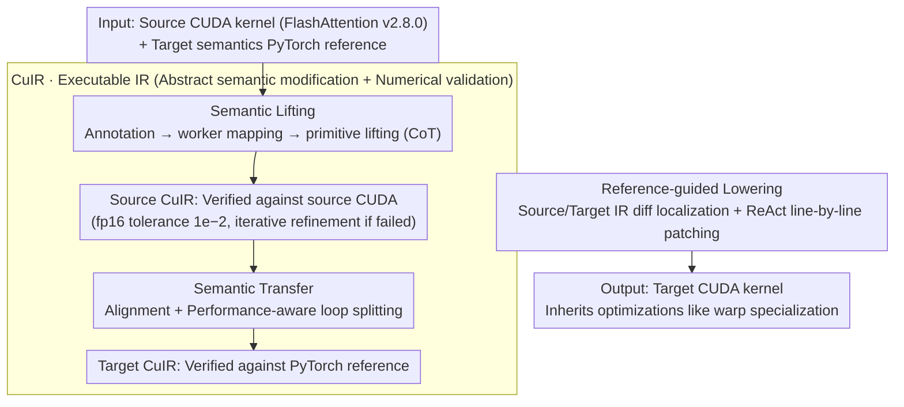

# CuBridge: An LLM-Based Framework for Understanding and Reconstructing High-Performance Attention Kernels

**Conference**: ACL 2026  
**arXiv**: [2605.05023](https://arxiv.org/abs/2605.05023)  
**Code**: Not yet public  
**Area**: Code Intelligence / HPC / GPU Kernel Auto-adaptation  
**Keywords**: CUDA, Attention Kernel, LLM Code Generation, Intermediate Representation, Lift-Transfer-Lower

## TL;DR
The authors transform the unreliable task of "modifying FlashAttention CUDA code directly via LLMs" into a three-stage workflow: "lifting to an executable IR (CuIR) → transferring according to PyTorch reference → differential lowering back to CUDA." This approach maintains 100% accuracy for 8 classes of attention variants on A100/H100, achieving an average speedup of 16.03× over PyTorch, 1.39× over FlexAttention, and 3.33× over the previous LLM-based method Qimeng-Attention.

## Background & Motivation
**Background**: The performance of modern deep learning relies on hand-written CUDA attention kernels (FlashAttention series, cuBLAS, CUTLASS). As model architectures evolve, new forms of attention continuously emerge, such as PrefixLM, Sliding Window, Sigmoid Attention, Softcap, and combinations like Sliding+Softcap.

**Limitations of Prior Work**: Existing paths have significant drawbacks: (1) High-level frameworks like PyTorch are flexible but slow due to fine-grained kernel launches and repeated global memory access; (2) Template-based compilers like FlexAttention allow limited customization but are constrained by templates and do not support non-standard variants; (3) Expert libraries like FlashAttention provide top-tier performance but require senior engineers to rewrite each variant; (4) Direct end-to-end generation or rewriting of CUDA kernels by LLMs (e.g., KernelBench) shows unstable accuracy and performance up to 34.9× slower than expert versions for complex operators like attention (Ouyang et al. 2025).

**Key Challenge**: Expert CUDA kernels hardcode correct and efficient "execution orchestration" within low-level PTX and asynchronous primitives. When LLMs face such code, they cannot distinguish semantic logic from execution orchestration—semantic modifications and syntax operations are entangled, causing the kernel to fail even with single-line changes.

**Goal**: To enable LLMs to accurately adapt existing expert kernels to new attention semantics while preserving all hardware-specific execution orchestrations without end-to-end generation.

**Key Insight**: Rather than forcing LLMs to handle complex PTX/CuTe syntax, CUDA should first be "lifted" into an executable IR where execution orchestration is made explicit. This allows the LLM to perform semantic modifications at an abstract level before "lowering" back to CUDA.

**Core Idea**: Design a Pythonic executable IR—CuIR—that exposes execution orchestration (tile shapes, memory hierarchy, instruction selection, dependencies, and parallelism granularity) through four primitive categories: memory, compute, sync, and control. This implements a lift-transfer-lower pipeline with IR-level execution validation at each stage, turning "LLM CUDA programming" into a reliable collaboration between "LLM IR authoring" and "automated lifting/lowering tools."

## Method

### Overall Architecture
CuBridge solves the problem of automatically producing a high-performance CUDA kernel for a target variant, given a manual source CUDA kernel (default: FlashAttention v2.8.0) and a PyTorch reference describing the target semantics (e.g., PrefixLM mask). Instead of exposing PTX to the LLM, it splits the adaptation into a three-stage pipeline: "lifting" the source CUDA into CuIR (an executable intermediate representation where execution orchestration is explicit), having the LLM "transfer" it into a Target CuIR based on target semantics, and finally "lowering" it back using IR diff to locate differences and apply minimal patches. A core guarantee is that each stage's CuIR can produce numerical results on a backend executor—validated against source CUDA after lifting (fp16 tolerance $10^{-2}$) and against PyTorch reference after transfer—bringing every LLM output back to a "provably equivalent" track.

### Key Designs

**1. CuIR: An Executable IR with Explicit Execution Orchestration**

The failure mode of LLMs modifying CUDA code is typically "inability to understand complex syntax while failing to locate target positions"—where semantics and PTX-level syntax are entangled. CuIR solves this by using Python syntax with a minimal set of primitives to extract performance-critical execution orchestration from syntactic noise: Memory primitives (`alloc / copy / copy_async`) expose tile shapes and hierarchy; Compute primitives (`gemm / gemm_async`) expose instruction variants; Sync primitives (`barrier.wait / arrive`) expose synchronization scopes; and Control primitives (`bind / commit`) expose parallelism granularity and dependencies. Details irrelevant to execution structure, like thread-level indexing, are abstracted away.

Crucially, CuIR is an executable artifact: its programs operate on tile-level data via PyTorch tensors and can be run by a backend executor. Independent parallel tasks are executed serially (without affecting correctness), and dependent tasks follow synchronization constraints, aligning with true CUDA behavior. This makes the "what / who / when" explicit for LLMs, and semantic equivalence can be verified through closed-loop numerical execution.

**2. Semantic Lifting: Annotation → Worker Mapping → Primitive Lifting (CoT)**

Expert kernels often use implicit warp specialization. The mapping between warps and code blocks is hidden behind `threadIdx`-based branches. If an LLM misattributes a code segment to the wrong worker, the subsequent transfer will fail. Lifting breaks the recovery into three Chain-of-Thought steps: Syntax Annotation (using documentation to comment low-level intrinsics), Code-to-Worker Mapping (analyzing predicates like `if (threadIdx.x < 128)` to attribute code to specific warp groups), and Primitive Lifting (translating worker-aligned code regions into CuIR primitives). This structured approach ensures the Source CuIR is numerically equivalent to the source CUDA before proceeding.

**3. Semantic Transformation: Correct Semantics with Performance-Awareness**

IR Transfer adapts the Source CuIR to the new variant at the abstract level. It performs Semantic Alignment by identifying differences between the source IR and target operator, mapping missing semantics to CuIR primitives. Furthermore, it performs Performance-Aware Transformation; for example, in PrefixLM, masks are only needed for boundary tiles. Transfer automatically performs loop splitting, creating a check-free Full Loop and a masked Partial Loop, avoiding unnecessary element-wise checks in the full-loop region.

**4. Reference-guided Lowering: IR Diff Localization + ReAct Minimal Patching**

Lowering follows a minimal-change strategy to avoid the brittleness of rewriting entire kernels. It performs Differential Analysis between Source and Target CuIR to find semantic differences and maps them back to specific CUDA regions. It then uses Reference-Guided Lowering, treating the Source CUDA as a style guide for implementing primitives (e.g., expanding abstract `copy_async` to PTX `cp.async.ca`). Finally, a ReAct framework applies line-level `Edit_Line` patches. Because only necessary lines are modified, the target kernel inherits nearly all hardware-specific optimizations from the source.

## Key Experimental Results

### Main Results
Testing on A100 and H100 with 8 attention variants (PrefixLM, Sliding Window, etc.) across various model configurations.

| Platform | vs PyTorch | vs FlexAttention | vs Qimeng-Attention |
|------|-----------|------------------|---------------------|
| A100 Avg | 12.69× | 1.18× | 2.54× |
| H100 Avg | 19.82× | 1.62× | 4.35× |
| Overall Avg | **16.03×** | **1.39×** | **3.33×** |

Ours achieved 100% accuracy across all variants. Comparisons with FlashInfer showed 1.07× performance on supported variants and a 3.49× lead on variants not natively supported by FlashInfer.

### Ablation Study
Evaluation of CuIR impact on H100 (96 cases):

| Method | Pass@1 | Pass@3 | Pass@5 | Normalized Speedup (vs Vanilla GPT-5) |
|------|--------|--------|--------|----------------------------------|
| Vanilla GPT-5 (Direct rewrite) | 0.21 | 0.33 | 0.38 | 1.00× |
| GPT-5 + ReAct (Iterative, no CuIR) | 0.41 | 0.54 | 0.58 | 1.23× |
| **GPT-5 + CuBridge (Ours)** | **0.70** | **0.85** | **1.00** | **4.19×** |

### Key Findings
- **CuIR is the Root of Accuracy**: Vanilla GPT-5 plateaus at Pass@5 = 0.38 while CuBridge reaches 1.00. This indicates that the problem is the lack of reasoning structure, not insufficient sampling.
- **Capacity Threshold**: Performance for GPT-5, Claude, and DeepSeek-V3 is within 5%. However, smaller models like Qwen-3-32B failed, indicating a minimum capability threshold for the "LLM system programmer" role.
- **Hardware Complexity Advantage**: The performance gap vs. FlexAttention and Qimeng-Attention increases from A100 to H100. CuBridge excels at preserving H100-specific optimizations that are difficult for LLMs to generate from scratch.
- **Value of Loop Splitting**: Higher efficiency is achieved by performing performance-aware transformations at the IR level compared to manual CUDA modifications.

## Highlights & Insights
- **Wisdom of "Not Facing CUDA Directly"**: CuIR acts similarly to MLIR or Triton—abstracting complexity to a level manageable for LLMs while delegating thread-level indexing and PTX to deterministic lowering.
- **Executable IR with Numerical Validation**: Every step is verifiable against reference data, converting unreliable LLM inference into a reliable engineering pipeline.
- **Minimal Patching vs. Rewriting**: By focusing on differences, the system inherits optimizations that were never explicitly explained to the LLM.
- **Mimicking Style (Reference-Guided)**: Mimicking the source kernel's implementation style is a transferable pattern for ISA-specific intrinsics or platform porting.

## Limitations & Future Work
- **Limitations**: (1) Strong dependency on high-quality source kernels; (2) Evaluation limited to attention-related operators; (3) High inference costs due to multiple validation steps; (4) Lowering may fail during massive restructuring (e.g., swapping nested loops).
- **Future Work**: Extending CuIR for general HPC operators (conv, scan); introducing partial-lift fallbacks; distilling CuIR capabilities into smaller models (7-32B); and integrating with reinforcement learning for automated schedule search.

## Related Work & Insights
- Unlike **FlexAttention**, CuBridge breaks template constraints via IR-level rewriting.
- Unlike **Qimeng-Attention** or **Kevin**, it avoids end-to-end generation, narrowing the search space from unstructured CUDA to structured CuIR.
- **Insight**: The paradigm of "LLM writing executable IR + automated lowering" is applicable to SQL optimization, hardware design (HDL), and kernel porting.

## Rating
- Novelty: ⭐⭐⭐⭐
- Experimental Thoroughness: ⭐⭐⭐⭐⭐
- Writing Quality: ⭐⭐⭐⭐⭐
- Value: ⭐⭐⭐⭐⭐

<!-- RELATED:START -->

## Related Papers

- [\[ACL 2026\] ChatHLS: Towards Systematic Design Automation and Optimization for High-Level Synthesis](chathls_towards_systematic_design_automation_and_optimization_for_high-level_syn.md)
- [\[NeurIPS 2025\] A Stochastic Differential Equation Framework for Multi-Objective LLM Interactions](../../NeurIPS2025/code_intelligence/a_stochastic_differential_equation_framework_for_multi-objective_llm_interaction.md)
- [\[ACL 2026\] Sense and Sensitivity: Examining the Influence of Semantic Recall on Long Context Code Understanding](sense_and_sensitivity_examining_the_influence_of_semantic_recall_on_long_context.md)
- [\[ACL 2026\] Discover and Prove: An Open-source Agentic Framework for Hard Mode Automated Theorem Proving in Lean 4](discover_and_prove_an_open-source_agentic_framework_for_hard_mode_automated_theo.md)
- [\[ACL 2026\] LogicEval: A Systematic Framework for Evaluating Automated Repair Techniques for Logical Vulnerabilities in Real-World Software](logiceval_a_systematic_framework_for_evaluating_automated_repair_techniques_for_.md)

<!-- RELATED:END -->
