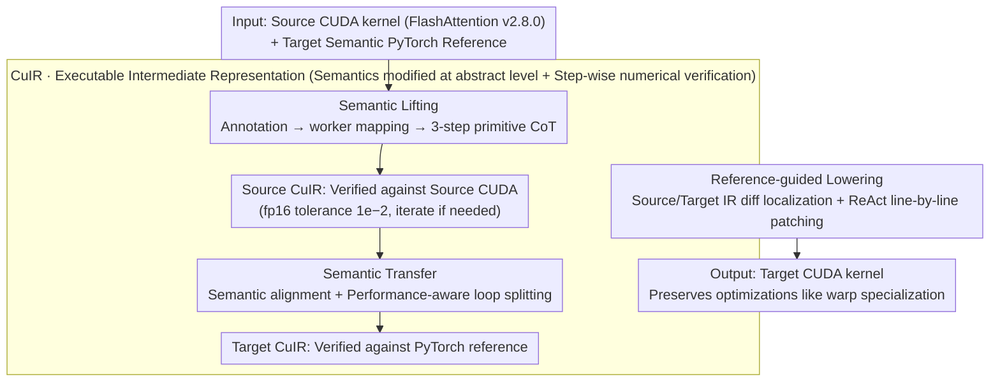

# CuBridge: An LLM-Based Framework for Understanding and Reconstructing High-Performance Attention Kernels

**Conference**: ACL 2026  
**arXiv**: [2605.05023](https://arxiv.org/abs/2605.05023)  
**Code**: Not yet public  
**Area**: Code Intelligence / HPC / GPU Kernel Auto-adaptation  
**Keywords**: CUDA, Attention Kernel, LLM Code Generation, Intermediate Representation, Lift-Transfer-Lower

## TL;DR
The authors transform the unreliable task of "modifying FlashAttention CUDA code directly via LLMs" into a three-stage workflow: "lifting to executable IR (CuIR) → transferring per PyTorch reference → differential lowering back to CUDA." This maintains 100% accuracy across 8 attention variants on A100/H100, achieving an average speedup of 16.03× over PyTorch, 1.39× over FlexAttention, and 3.33× over the previous LLM-based method Qimeng-Attention.

## Background & Motivation
**Background**: The performance of modern deep learning relies on hand-written CUDA attention kernels (FlashAttention series, cuBLAS, CUTLASS). However, as model architectures evolve, new attention forms constantly emerge—such as PrefixLM, Sliding Window, Sigmoid Attention, Softcap, and combinations like Sliding+Softcap.

**Limitations of Prior Work**: Existing approaches have significant drawbacks: (1) High-level frameworks like PyTorch are flexible but slow, as they decompose operations into multiple fine-grained kernels with frequent launches and repeated global memory access; (2) Template-based compilers like FlexAttention allow limited customization but are constrained by their templates, failing to support non-standard variants; (3) Expert libraries like FlashAttention offer top-tier performance but require senior engineers to manually rewrite each variant; (4) Direct end-to-end generation or modification of CUDA kernels via LLMs, as shown by benchmarks like KernelBench, yields unstable accuracy and performance up to 34.9× slower than expert versions (Ouyang et al. 2025) on complex operators.

**Key Challenge**: Expert CUDA kernels hard-code "correct and efficient execution orchestration" into low-level PTX and asynchronous primitives. When LLMs face such code, they cannot easily distinguish "what each block does" or "which warp a segment belongs to"—semantic modifications and syntax operations are entangled, causing even single-line modifications to fail.

**Goal**: To enable LLMs to accurately adapt existing high-performance kernels to new attention semantics while preserving all hardware-specific execution orchestration, without relying on end-to-end kernel generation.

**Key Insight**: Instead of making the LLM confront the complex syntax of PTX/CuTe, it is better to first "lift" CUDA into an IR that makes execution orchestration explicit and is itself executable. This allows the LLM to perform semantic modifications at an abstract level before "lowering" back to CUDA.

**Core Idea**: Designing a Pythonic executable IR—CuIR—that exposes four types of primitives (memory, compute, sync, control) to reflect execution orchestration (tile shape, memory hierarchy, instruction selection, dependencies, and parallel granularity). This creates a reliable collaboration where the "LLM writes IR + tools handle lift/lower" through a three-stage pipeline with IR-level execution verification at every step.

## Method

### Overall Architecture
CuBridge addresses the following problem: given a high-performance source CUDA kernel (defaulting to FlashAttention v2.8.0) and a PyTorch reference describing the target semantics (e.g., PrefixLM mask), it automatically produces a high-performance CUDA kernel for that variant. Rather than making the LLM handle PTX, the adaptation is split into a lift-transfer-lower pipeline: first, the source CUDA is "lifted" into CuIR, an executable intermediate representation that makes execution orchestration explicit. The LLM then "transfers" this into Target CuIR at an abstract level according to the target semantics. Finally, the target is "lowered" back to CUDA via IR diffing to locate changes and apply minimal patches. The core reliability comes from the fact that every produced CuIR can be executed on a backend executor—lifted code is verified against source CUDA (fp16 tolerance $10^{-2}$), and transferred code against the PyTorch reference—ensuring every LLM output remains on a "provably equivalent" path.

### Key Designs

**1. CuIR: An Executable IR Exposing Execution Orchestration**
Historically, LLMs failed at CUDA modification because they could neither understand complex syntax nor locate modification targets—semantic changes were entangled with PTX-level syntax. CuIR solves this by using Python syntax with a minimal set of primitives to extract performance-critical orchestration from syntactic noise: Memory primitives (`alloc / copy / copy_async`) expose tile shapes and hierarchy; Compute primitives (`gemm / gemm_async`) expose instruction variants; Sync primitives (`barrier.wait / arrive`) expose synchronization scopes; and Control primitives (`bind / commit`) expose parallel granularity and dependencies. Details irrelevant to execution structure, such as thread-level indexing, are abstracted away. Crucially, CuIR is executable: its programs operate on tile-level data via PyTorch tensors, allowing the backend executor to run them—executing parallel tasks serially (without affecting correctness) and following synchronization constraints—to align with real CUDA behavior. This makes "what is done / by whom / in what order" readable to the LLM and verifiable through numerical execution.

**2. Semantic Lifting: Annotation → Worker Mapping → Primitive CoT Recovery**
In expert kernels, warp specialization is asynchronous and implicit; the mapping between warps and code blocks is hidden in numerous `threadIdx` conditional branches. If an LLM misidentifies "who does what," the transfer will fail. Lifting breaks this into a three-step Chain-of-Thought (CoT) within a single LLM call: (1) Syntax Annotation adds semantic comments to each low-level intrinsic using documentation; (2) Code-to-Worker Mapping analyzes control-flow predicates to assign blocks to warp groups or warps; (3) Primitive Lifting translates each worker's code segment into CuIR primitives, recovering parameters like tile shape and memory placement. This explicit "identification → attribution → translation" ensures the LLM handles one task at a time with a structured checklist, verified by numerical equivalence between Source CuIR and Source CUDA.

**3. Semantic Transformation: Ensuring Semantic Correctness with Performance-Awareness**
The lifted Source CuIR is a faithful replica of the source; to adapt to a new variant, the IR Transfer step modifies semantics at the abstract level. It performs Semantic Alignment by identifying differences between the source IR and the PyTorch reference, mapping missing semantics to CuIR primitives while maintaining structural alignment—which is critical for precise lowering via IR diffing. Furthermore, Transfer performs Performance-Aware Transformation; for instance, in PrefixLM, masks only need element-wise checks on boundary tiles. Transfer automatically performs loop splitting, using a "check-free Full Loop" for complete tiles and a "masked Partial Loop" for boundary tiles, avoiding redundant checks. These optimizations are safer to perform at the IR level than in generated CUDA.

**4. Reference-guided Lowering: IR Diff Localization + ReAct Minimal Patching**
Asking an LLM to "rewrite the entire CUDA kernel" almost always fails due to long context and loss of implicit optimizations. Lowering therefore adopts a minimal-change route: Differential Analysis compares Source/Target CuIR to find semantic differences, localized to specific CUDA regions using the mapping preserved during lifting. Then, Reference-Guided Lowering uses the Source CUDA as a "style guide" for implementation, expanding abstract primitives (like `copy_async`) into PTX intrinsics (like `cp.async.ca`) and tile-level operations into thread-level indexing. Finally, the ReAct framework applies line-level patches (`Edit_Line`). If compilation or numerical tests fail, the LLM is provided with full error logs to iterate. By only touching necessary lines, the target kernel inherits almost all hardware-specific optimizations (warp specialization, tensor/CUDA core overlap) from the expert source.

**5. Loss & Training**: This is a pure inference-time pipeline with no model training. LLM sampling uses temperature $=0$ and best-of-$k$ ($k=10$). Numerical verification follows the CUTLASS convention with an fp16 tolerance of $10^{-2}$. The default source kernel is FlashAttention v2.8.0.

## Key Experimental Results

### Main Results
Testing on A100 and H100 with 8 attention variants (PrefixLM, Global Sliding Window, Share Question Mask, Causal Blockwise, Relative Position Embedding, ReLU, Sigmoid, and a composite "comb" variant) across 3 model configurations (Llama2-7B, Qwen2.5-72B, Llama3.1-405B):

| Platform | vs PyTorch | vs FlexAttention | vs Qimeng-Attention |
|------|-----------|------------------|---------------------|
| A100 Avg | 12.69× | 1.18× | 2.54× |
| H100 Avg | 19.82× | 1.62× | 4.35× |
| Overall Avg | **16.03×** | **1.39×** | **3.33×** |

Performance GAINS vs FlexAttention reached 1.66× on H100. Compared to Qimeng-Attention, speedups reached 11.47× for complex "comb" variants on H100. Accuracy was 100% across all variants.

### Ablation Study
Evaluation of the "CuIR" impact on H100 (96 cases):

| Method | Pass@1 | Pass@3 | Pass@5 | Normalized Speedup (vs Vanilla GPT-5) |
|------|--------|--------|--------|----------------------------------|
| Vanilla GPT-5 (Direct rewrite) | 0.21 | 0.33 | 0.38 | 1.00× |
| GPT-5 + ReAct (Iterative, no CuIR) | 0.41 | 0.54 | 0.58 | 1.23× |
| **GPT-5 + CuBridge** | **0.70** | **0.85** | **1.00** | **4.19×** |

### Key Findings
- **CuIR is the key to accuracy**: Vanilla GPT-5 saturates at a Pass@5 of 0.38; CuBridge achieves 1.00. This suggests the bottleneck is not "sampling," but the lack of a reason-able intermediate structure.
- **Complexity Advantage**: The gain over baseline methods increases with hardware complexity (H100 > A100). CuBridge preserves H100-specific optimizations that are difficult for LLMs to generate from scratch.
- **Loop Splitting Value**: Applying loop splitting at the IR level for PrefixLM significantly improves performance safely compared to manual CUDA modification.

## Highlights & Insights
- **"Do not let LLMs confront CUDA directly"**: The abstraction level of CuIR is the key engineering insight. It handles semantic reasoning while leaving thread-level indexing to deterministic lowering.
- **Grounding through Execution**: Making the IR executable allows for numerical verification at every step, turning unreliable LLM generation into a reliable engineering system.
- **Reference-Guided Consistency**: Treating source code as a style guide ensures that new code inherits the engineering wisdom of the expert authors.

## Limitations & Future Work
- **Ours**: Heavily dependent on the quality of the expert source kernel; currently validated primarily on attention-like operators.
- **Analysis**: The CuIR primitive set might need expansion for non-attention tasks (e.g., convolution or sparse operators). The multi-turn verification process introduces significant LLM inference costs.
- **Future Work**: Extending CuIR to other HPC domains, distilling CuIR capabilities into smaller models (7B-32B), and integrating with reinforcement learning for automated schedule search.

## Related Work & Insights
- **vs FlashAttention**: CuBridge acts as an "intelligent extender" for expert libraries rather than a replacement.
- **vs FlexAttention**: Provides more flexibility for non-standard variants (like Sigmoid/ReLU) than template-based compilers.
- **vs Qimeng-Attention / Kevin**: By narrowing the search space from raw CUDA to structured CuIR, CuBridge significantly reduces the hallucination rate in complex kernel generation.

## Rating
- Novelty: ⭐⭐⭐⭐ Systematic application of lift-transfer-lower for kernel adaptation.
- Experimental Thoroughness: ⭐⭐⭐⭐⭐ Extensive cross-platform and cross-variant testing.
- Writing Quality: ⭐⭐⭐⭐⭐ Very clear logic and intuitive diagrams.
- Value: ⭐⭐⭐⭐⭐ Effectively bridges the gap between LLM code generation and high-performance system engineering.

<!-- RELATED:START -->

## Related Papers

- [\[ACL 2026\] ChatHLS: Towards Systematic Design Automation and Optimization for High-Level Synthesis](chathls_towards_systematic_design_automation_and_optimization_for_high-level_syn.md)
- [\[NeurIPS 2025\] A Stochastic Differential Equation Framework for Multi-Objective LLM Interactions](../../NeurIPS2025/code_intelligence/a_stochastic_differential_equation_framework_for_multi-objective_llm_interaction.md)
- [\[ACL 2026\] Sense and Sensitivity: Examining the Influence of Semantic Recall on Long Context Code Understanding](sense_and_sensitivity_examining_the_influence_of_semantic_recall_on_long_context.md)
- [\[ACL 2026\] QAQ: Bidirectional Semantic Coherence for Selecting High-Quality Synthetic Code Instructions](qaq_bidirectional_semantic_coherence_for_selecting_high-quality_synthetic_code_i.md)
- [\[ACL 2026\] Discover and Prove: An Open-source Agentic Framework for Hard Mode Automated Theorem Proving in Lean 4](discover_and_prove_an_open-source_agentic_framework_for_hard_mode_automated_theo.md)

<!-- RELATED:END -->
