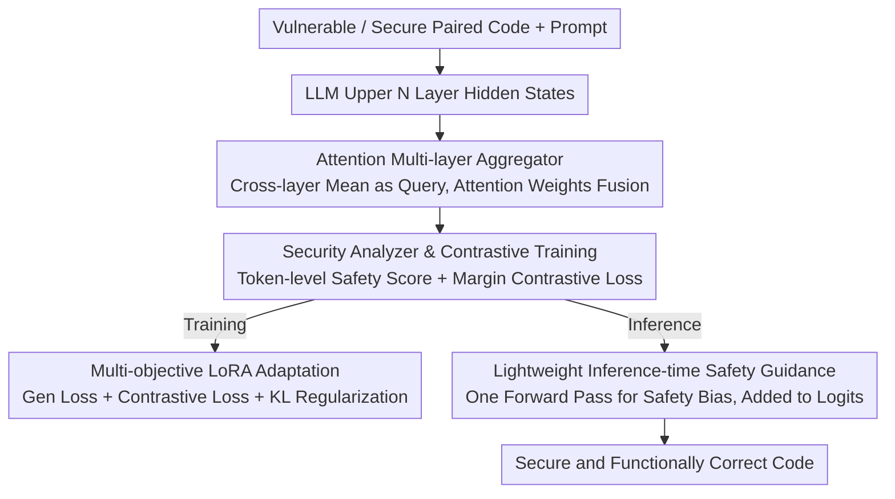

# DeepGuard: Secure Code Generation via Multi-Layer Semantic Aggregation

**Conference**: ACL 2026  
**arXiv**: [2604.09089](https://arxiv.org/abs/2604.09089)  
**Code**: [https://github.com/unknownhl/DeepGuard](https://github.com/unknownhl/DeepGuard)  
**Area**: Code Intelligence / Security  
**Keywords**: Secure Code Generation, Multi-layer Aggregation, Vulnerability Detection, Contrastive Learning, Inference Guidance  

## TL;DR
DeepGuard is proposed to overcome the "last-layer bottleneck" by aggregating multi-layer representations from the upper Transformer layers using an attention mechanism. Combined with multi-objective training and a lightweight inference-time safety guidance strategy, it improves the secure-and-correct generation rate by an average of 11.9% across five code LLMs.

## Background & Motivation

**Background**: Code LLMs have demonstrated exceptional performance in code generation, with GitHub Copilot reportedly assisting in the generation of up to 46% of code on the platform. However, these models also replicate unsafe coding patterns found in their training data—approximately 40% of Copilot-generated code contains vulnerabilities, and developers often fail to recognize these AI-generated flaws.

**Limitations of Prior Work**: Existing safety hardening methods (e.g., prefix tuning in SVEN, safety instruction fine-tuning in SafeCoder) almost exclusively extract supervisory signals from the final Transformer layer. However, final layer representations are primarily optimized for next-token prediction rather than fine-grained vulnerability discrimination. The authors discovered that vulnerability discriminative signals are strongest in the middle-to-upper layers and actually decay in the final layer—a phenomenon termed the "last-layer bottleneck."

**Key Challenge**: Preventing unsafe code requires integrating diverse syntactic and semantic evidence (e.g., identifying syntactic patterns of string concatenation alongside reasoning about the semantic properties of untrusted data flows). This information is distributed across Transformer layers—shallow layers capture local syntax while deep layers encode abstract semantics—yet the final layer optimizes for token prediction at the cost of vulnerability discriminative power.

**Goal**: To enhance secure code generation by leveraging safety-related clues distributed across multiple internal layers of the model, rather than relying solely on the final layer.

**Key Insight**: Through layer-wise linear probe diagnostics—training linear classifiers at each layer to detect vulnerability patterns—it was found that probe confidence peaks in the middle-to-upper layers and decays towards the final layer.

**Core Idea**: Use an attention mechanism to aggregate hidden states from multiple upper layers to construct a safety analysis signal stronger than that of any single final layer, supporting both multi-objective training and inference-time guidance.

## Method

### Overall Architecture
DeepGuard addresses the "last-layer bottleneck": vulnerability signals in code LLMs are strongest in middle-to-upper layers and decay at the final layer, whereas previous hardening methods rely entirely on the final layer. Its approach involves aggregating hidden states from multiple upper Transformer layers into a safety analysis signal stronger than any single layer, and then using this signal to support both training and inference pipelines. During training, LoRA-based multi-objective adaptation (security contrastive loss + generation loss + KL regularization) is performed on paired (vulnerable/secure) code data. During inference, a lightweight prompt-conditioned bias pulls the decoding process toward secure tokens.

### Key Designs

**1. Attention Multi-layer Aggregator: Adaptive Layer Selection**

Different Transformer layers exhibit varying sensitivities to different types of vulnerabilities—shallow layers capture syntax while deep layers encode semantics. Fixed-weight fusion is less effective than allowing attention to adaptively select layers. Specifically: for each token position $j$, the hidden states of the upper $N$ layers are stacked as $h^{(j)} \in \mathbb{R}^{N \times D}$. The cross-layer mean is used as a query vector to provide a "consensus" summary, and layers are fused via attention weighting $h_{agg}^{(j)} = \text{Softmax}(\frac{QK^\top}{\sqrt{D}})V$. This allows the model to adaptively focus on the layers most valuable for safety analysis. The resulting aggregated representation is more suitable for vulnerability discrimination than any single layer (especially the final layer, which is occupied by token prediction semantics).

**2. Security Analyzer and Contrastive Training: Learning "Secure vs. Vulnerable" Separability**

Simply classifying code as secure or insecure is insufficiently robust. The authors instead use contrastive learning to directly increase the distance between the two classes. The security analyzer $f_{sa}$ consumes the aggregated representation $H_{agg}$ and learned token-level safety embeddings $E_{sec}$ to output a safety score $s_i(x) \in [0,1]$ for each token. Sequence-level scores are calculated for each pair of (vulnerable, secure) code, and a margin contrastive loss $\mathcal{L}_{sec} = \max(0, \Delta - (s_{sec} - s_{vul}))$ is applied, forcing the score of the secure sample to be higher than the vulnerable one by a margin $\Delta$. Semantic analysis of $E_{sec}$ reveals that the model indeed learns meaningful associations between secure and insecure tokens.

**3. Lightweight Inference-time Safety Guidance: Single Forward Pass Reuse**

Rerunning the security analyzer at every decoding step would incur unacceptable overhead. Therefore, the authors condense the safety signal into a bias in advance. During training, token appearance tendencies in secure/vulnerable samples are statistically recorded to obtain a token-level safety prior vector $T_{stats}$. During inference, a single forward pass over the input prompt is performed to obtain the safety score $\bar{s}_{prompt}$, and the bias is calculated as $b = (1 - \bar{s}_{prompt}) \cdot T_{stats}$—the less secure the prompt, the stronger the bias. This bias is then added to the logits at every decoding step. The total additional overhead is merely one forward pass and one logit addition, making deployment nearly seamless.

### Loss & Training
$\mathcal{L}_{total} = \mathcal{L}_{gen} + w_{sec}\mathcal{L}_{sec} + w_{kl}\mathcal{L}_{kl}$, where $\mathcal{L}_{gen}$ is the standard generation loss on secure code, and $\mathcal{L}_{kl}$ is the KL divergence relative to the frozen base model to prevent catastrophic forgetting. All adaptations are completed via LoRA.

## Key Experimental Results

### Main Results (Qwen2.5-Coder-3B)

| Method | pass@1 | sec@1_pass | sec-pass@1 | SVEN-SR |
|------|--------|-----------|------------|---------|
| Base | 91.00 | 76.47 | 69.59 | 77.95 |
| SVEN | 83.00 | 84.90 | 70.47 | 82.60 |
| SafeCoder | 63.94 | 82.34 | 52.65 | 87.02 |
| **Ours** | **86.65** | **93.21** | **80.76** | **94.11** |

### Ablation Study

| Configuration | Description |
|------|------|
| Final Layer Only (Standard) | Weak safety signals, limited improvement |
| Multi-layer Mean Fusion | Better than final layer but inferior to attention fusion |
| Attention Multi-layer Aggregation | **Optimal**, adaptively selects most relevant layers |
| w/o Inference Guidance | Training improvements remain but lacks extra protection during inference |

### Key Findings
- Ours improves sec-pass@1 by an average of 11.9% across 5 models while maintaining functional correctness.
- Semantic analysis of safety embeddings $E_{sec}$ shows the model effectively learns meaningful associations between secure/insecure tokens.
- Demonstrates generalization capabilities even for vulnerability types not seen during training (held-out CWEs).

## Highlights & Insights
- **Layer-wise linear probe diagnostics** provide direct evidence for the "last-layer bottleneck" hypothesis—this diagnostic methodology can be generalized to understand information distribution in other Transformer tasks.
- **Ultra-lightweight design of inference-time guidance**—requires only one additional forward pass and logit addition, making the practical deployment overhead negligible.
- **Balanced Security-Correctness Trade-off**—many baselines sacrifice significant functional correctness for safety (e.g., SafeCoder's pass@1 is only 63.94%), whereas DeepGuard maintains an 86.65% pass@1 while significantly enhancing security.

## Limitations & Future Work
- Token-level safety prior $T_{stats}$ is a coarse-grained statistical association that may yield incorrect biases in specific contexts.
- Training requires paired vulnerable/secure code, which can be costly to acquire.
- Currently only validated on Python code; cross-language generalization remains unknown.

## Related Work & Insights
- **vs SVEN**: Uses prefix tuning to extract signals from the final layer, limited by the last-layer bottleneck; DeepGuard aggregates multiple layers.
- **vs SafeCoder**: Fine-tunes via safety instructions, which sacrifices considerable functional correctness; DeepGuard balances both via multi-objective training.

## Rating
- Novelty: ⭐⭐⭐⭐ The multi-layer aggregation idea is clear, with a complete diagnostic and solution framework.
- Experimental Thoroughness: ⭐⭐⭐⭐⭐ Comprehensive testing across 5 models, multiple baselines, generalization, and ablations.
- Writing Quality: ⭐⭐⭐⭐ Clear logical progression from diagnosis to solution.
- Value: ⭐⭐⭐⭐ Direct practical value for secure code generation.

<!-- RELATED:START -->

## Related Papers

- [\[ACL 2026\] Aligned Multi-View Scripts for Universal Chart-to-Code Generation](aligned_multi-view_scripts_for_universal_chart-to-code_generation.md)
- [\[ACL 2026\] SecureVibeBench: Evaluating Secure Coding Capabilities of Code Agents with Realistic Vulnerability Scenarios](securevibebench_evaluating_secure_coding_capabilities_of_code_agents_with_realis.md)
- [\[ACL 2026\] MARS2: Scaling Multi-Agent Tree Search via Reinforcement Learning for Code Generation](mars2_scaling_multi-agent_tree_search_via_reinforcement_learning_for_code_genera.md)
- [\[ACL 2026\] Sense and Sensitivity: Examining the Influence of Semantic Recall on Long Context Code Understanding](sense_and_sensitivity_examining_the_influence_of_semantic_recall_on_long_context.md)
- [\[ACL 2026\] QAQ: Bidirectional Semantic Coherence for Selecting High-Quality Synthetic Code Instructions](qaq_bidirectional_semantic_coherence_for_selecting_high-quality_synthetic_code_i.md)

<!-- RELATED:END -->
