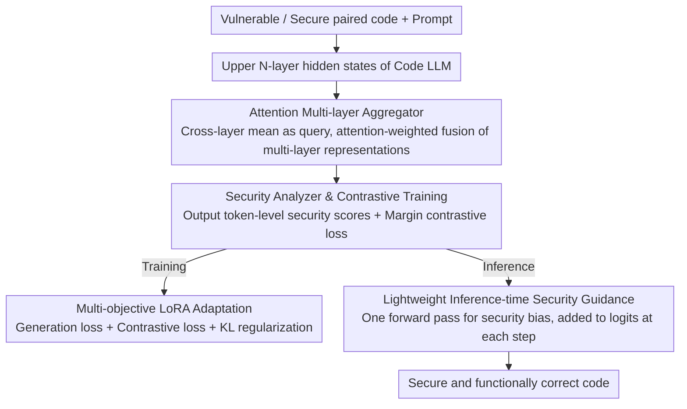

# DeepGuard: Secure Code Generation via Multi-Layer Semantic Aggregation

**Conference**: ACL 2026  
**arXiv**: [2604.09089](https://arxiv.org/abs/2604.09089)  
**Code**: [https://github.com/unknownhl/DeepGuard](https://github.com/unknownhl/DeepGuard)  
**Area**: Code Intelligence / Security  
**Keywords**: Secure Code Generation, Multi-layer Aggregation, Vulnerability Detection, Contrastive Learning, Inference-time Guidance

## TL;DR
DeepGuard is proposed to overcome the "final-layer bottleneck" by aggregating multi-layer representations from the upper Transformer layers through an attention mechanism. Combined with multi-objective training and a lightweight inference-time security guidance strategy, it improves the security-correctness generation rate by an average of 11.9% across 5 Code LLMs.

## Background & Motivation

**Background**: Code LLMs perform exceptionally well in code generation; GitHub Copilot reportedly assists in generating up to 46% of code on the platform. However, these models also replicate unsafe coding patterns from training data—about 40% of Copilot-generated code contains vulnerabilities, and developers often fail to identify these AI-generated flaws.

**Limitations of Prior Work**: Existing security hardening methods (e.g., SVEN's prefix tuning, SafeCoder's security instruction fine-tuning) almost exclusively extract supervisory signals from the final Transformer layer. However, the final layer representation is primarily optimized for next-token prediction rather than fine-grained vulnerability discrimination. The authors found that vulnerability discriminative signals are strongest in the middle to upper layers and decay in the final layer—the "final-layer bottleneck."

**Key Challenge**: Preventing unsafe code requires integrating diverse syntactic and semantic evidence (e.g., identifying syntactic patterns of string concatenation + reasoning about semantic properties of untrusted data flows). This information is distributed across Transformer layers—shallow layers capture local syntax, deep layers encode abstract semantics, while the final layer optimizes token prediction at the cost of vulnerability discriminative power.

**Goal**: To enhance secure code generation by leveraging security-related cues distributed across internal layers of the model, rather than relying solely on the final layer.

**Key Insight**: Through layer-wise linear probe diagnostics—training linear classifiers at each layer to detect vulnerability patterns—it was discovered that probe confidence peaks in the middle-to-upper layers and decays toward the final layer.

**Core Idea**: Use an attention mechanism to aggregate hidden states from multiple upper layers to construct a security analysis signal stronger than that of a single final layer, supporting both multi-objective training and inference-time guidance.

## Method

### Overall Architecture
DeepGuard addresses the "final-layer bottleneck": vulnerability signals in code LLMs are strongest in the middle-to-upper layers but decay at the final layer, whereas previous hardening methods utilize signals only from the final layer. The approach aggregates multiple upper-layer hidden states of the Transformer into a security analysis signal stronger than any single layer, then uses this signal to support both training and inference paths. During the training phase, multi-objective adaptation (security contrastive loss + generation loss + KL regularization) is performed via LoRA on paired (vulnerable/secure) code data. During inference, a lightweight prompt-conditional bias is used to steer decoding toward secure tokens.

### Key Designs

**1. Attention Multi-layer Aggregator: Allowing the model to adaptively select layers**

Different Transformer layers exhibit varying sensitivities to different types of vulnerabilities—shallow layers capture syntax, while deep layers encode semantics. Fixed-weight fusion is inferior to letting attention adaptively select. Specifically, for each token position $j$, the hidden states of the upper $N$ layers are stacked as $h^{(j)} \in \mathbb{R}^{N \times D}$. The cross-layer mean is used as the query vector to provide a "consensus" summary, and the layers are fused via attention weighting $h_{agg}^{(j)} = \text{Softmax}(\frac{QK^\top}{\sqrt{D}})V$, allowing the model to adaptively focus on layers most valuable for security analysis. The aggregated representation is better suited for vulnerability discrimination than any single layer (especially the final layer, where semantics are preoccupied with token prediction).

**2. Security Analyzer and Contrastive Training: Learning "Secure vs. Vulnerable" separability directly**

Simply classifying code into secure/unsecure categories is not robust; the authors use contrastive learning to directly increase the distance between the two. The security analyzer $f_{sa}$ processes the aggregated representation $H_{agg}$ and a learned token-level security embedding $E_{sec}$, outputting a security score $s_i(x) \in [0,1]$ for each token. Sequence-level scores are calculated for each (vulnerable, secure) code pair, and a margin contrastive loss $\mathcal{L}_{sec} = \max(0, \Delta - (s_{sec} - s_{vul}))$ is applied to force the security sample's score to exceed the vulnerable sample's score by a margin $\Delta$. Semantic analysis of $E_{sec}$ shows the model indeed learns meaningful security-related token associations.

**3. Lightweight Inference-time Security Guidance: Reusing a single forward pass throughout**

Re-running the security analyzer at every decoding step is computationally expensive. Therefore, the authors condense the security signal into a bias beforehand. During training, token-level occurrence tendencies in secure vs. vulnerable samples are calculated to obtain a security prior vector $T_{stats}$. At inference, a single forward pass is performed on the input prompt to get a security score $\bar{s}_{prompt}$, and the bias $b = (1 - \bar{s}_{prompt}) \cdot T_{stats}$ is calculated—the less secure the prompt, the stronger the bias. This bias is added to the logits at each decoding step. The extra overhead is just one forward pass and one logit addition, making deployment seamless.

### Loss & Training
$\mathcal{L}_{total} = \mathcal{L}_{gen} + w_{sec}\mathcal{L}_{sec} + w_{kl}\mathcal{L}_{kl}$, where $\mathcal{L}_{gen}$ is the standard generation loss on secure code, and $\mathcal{L}_{kl}$ is the KL divergence from the frozen base model to prevent catastrophic forgetting. All adaptations are completed via LoRA.

## Key Experimental Results

### Main Results (Qwen2.5-Coder-3B)

| Method | pass@1 | sec@1_pass | sec-pass@1 | SVEN-SR |
|------|--------|-----------|------------|---------|
| Base | 91.00 | 76.47 | 69.59 | 77.95 |
| SVEN | 83.00 | 84.90 | 70.47 | 82.60 |
| SafeCoder | 63.94 | 82.34 | 52.65 | 87.02 |
| **DeepGuard** | **86.65** | **93.21** | **80.76** | **94.11** |

### Ablation Study

| Configuration | Description |
|------|------|
| Final layer only (standard method) | Weak security signals, limited improvement |
| Multi-layer mean fusion | Better than final layer but inferior to attention fusion |
| Attention multi-layer aggregation | **Optimal**, adaptively selects the most relevant layers |
| w/o Inference guidance | Training improvements remain, but no additional protection during inference |

### Key Findings
- DeepGuard improves sec-pass@1 by an average of 11.9% across 5 models while basically maintaining functional correctness.
- Semantic analysis of the security embedding $E_{sec}$ shows that the model learns meaningful security-related token associations.
- The model exhibits generalization capabilities for vulnerability types not seen during training (held-out CWEs).

## Highlights & Insights
- **Layer-wise linear probe diagnostics** provide direct evidence supporting the "final-layer bottleneck" hypothesis—this diagnostic methodology can be generalized to understand information distribution in other Transformer tasks.
- **Extremely lightweight inference-time guidance design**—requiring only one extra forward pass and logit addition, the practical deployment overhead is negligible.
- **Security-correctness trade-off** is well-handled—many baselines sacrifice significant functional correctness for security (e.g., SafeCoder pass@1 is only 63.94%), whereas DeepGuard maintains a pass@1 of 86.65% while significantly enhancing security.

## Limitations & Future Work
- The token-level security prior $T_{stats}$ is a coarse-grained statistical association, which may provide incorrect biases in specific contexts.
- Training requires paired vulnerable/secure code data, which is expensive to acquire.
- Currently only validated on Python code; cross-language generalization remains unknown.

## Related Work & Insights
- **vs SVEN**: Uses prefix tuning to extract signals from the final layer, which is limited by the final-layer bottleneck; DeepGuard aggregates multiple layers.
- **vs SafeCoder**: Uses security instruction fine-tuning, sacrificing significant functional correctness; DeepGuard balances both through multi-objective training.

## Rating
- Novelty: ⭐⭐⭐⭐ The multi-layer aggregation concept is clear, and the path from diagnosis to solution is complete.
- Experimental Thoroughness: ⭐⭐⭐⭐⭐ Conducted on 5 models with multiple baselines, generalization testing, and thorough ablation.
- Writing Quality: ⭐⭐⭐⭐ The logical chain from diagnosis to methodology is clear.
- Value: ⭐⭐⭐⭐ Practical value for secure code generation is direct.

<!-- RELATED:START -->

## Related Papers

- [\[ICLR 2026\] RESCUE: Retrieval Augmented Secure Code Generation](../../ICLR2026/code_intelligence/rescue_retrieval_augmented_secure_code_generation.md)
- [\[ACL 2026\] MARS2: Scaling Multi-Agent Tree Search via Reinforcement Learning for Code Generation](mars2_scaling_multi-agent_tree_search_via_reinforcement_learning_for_code_genera.md)
- [\[ACL 2026\] Sense and Sensitivity: Examining the Influence of Semantic Recall on Long Context Code Understanding](sense_and_sensitivity_examining_the_influence_of_semantic_recall_on_long_context.md)
- [\[ACL 2026\] SecureVibeBench: Evaluating Secure Coding Capabilities of Code Agents with Realistic Vulnerability Scenarios](securevibebench_evaluating_secure_coding_capabilities_of_code_agents_with_realis.md)
- [\[ICLR 2026\] FHE-Coder: Benchmarking Secure Agentic Code Generation for Fully Homomorphic Encryption](../../ICLR2026/code_intelligence/fhe-coder_benchmarking_secure_agentic_code_generation_for_fully_homomorphic_encr.md)

<!-- RELATED:END -->
## Related Papers

- [\[ACL 2026\] SecureVibeBench: Evaluating Secure Coding Capabilities of Code Agents with Realistic Vulnerability Scenarios](securevibebench_evaluating_secure_coding_capabilities_of_code_agents_with_realis.md)
- [\[ACL 2026\] MARS2: Scaling Multi-Agent Tree Search via Reinforcement Learning for Code Generation](mars2_scaling_multi-agent_tree_search_via_reinforcement_learning_for_code_genera.md)
- [\[ACL 2026\] Sense and Sensitivity: Examining the Influence of Semantic Recall on Long Context Code Understanding](sense_and_sensitivity_examining_the_influence_of_semantic_recall_on_long_context.md)
- [\[ACL 2026\] QAQ: Bidirectional Semantic Coherence for Selecting High-Quality Synthetic Code Instructions](qaq_bidirectional_semantic_coherence_for_selecting_high-quality_synthetic_code_i.md)
- [\[AAAI 2026\] MoSE: Hierarchical Self-Distillation Enhances Early Layer Embeddings](../../AAAI2026/code_intelligence/mose_hierarchical_self-distillation_enhances_early_layer_embeddings.md)

<!-- RELATED:END -->
