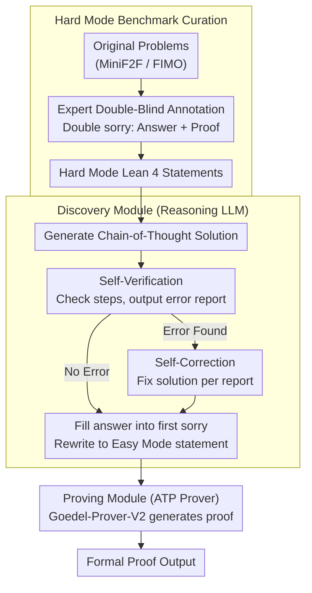

# Discover and Prove: An Open-source Agentic Framework for Hard Mode Automated Theorem Proving in Lean 4

**Conference**: ACL 2026  
**arXiv**: [2604.15839](https://arxiv.org/abs/2604.15839)  
**Code**: [GitHub](https://github.com/liuchengwucn/discover-and-prove)  
**Area**: LLM Agent  
**Keywords**: Automated Theorem Proving, Hard Mode, Lean 4, Answer Discovery, Formal Verification

## TL;DR
DAP introduces the concept of Hard Mode ATP (where AI must discover answers before constructing proofs, rather than using Easy Mode statements with embedded answers), releases MiniF2F-Hard and FIMO-Hard benchmarks, and designs a "discover-and-prove" two-stage framework. By using LLMs for natural language reasoning to discover answers and rewriting them into Easy Mode statements for formal provers, DAP increases solved problems from 7 to 10 on CombiBench and proves 36 theorems on PutnamBench Hard Mode for the first time.

## Background & Motivation

**Background**: Automated Theorem Proving (ATP) has progressed rapidly, with Seed-Prover nearing saturation on MiniF2F. However, existing benchmarks typically adopt "Easy Mode"—embedding the final answer within formal statements—which lowers task difficulty compared to human competitions where participants must discover the answer themselves.

**Limitations of Prior Work**: (1) Easy Mode significantly reduces problem difficulty; for many competition problems, discovering the answer is the primary challenge, while proving it once known is relatively simple. (2) Some formal statements lack semantic alignment with the original problem, such as proving only one direction of an implication when a biconditional is required. (3) A massive capability gap exists where LLMs achieve >80% accuracy in informal reasoning but formal provers succeed in less than 10% of cases.

**Key Challenge**: Easy Mode leads to overly optimistic evaluations of AI's mathematical capabilities by omitting the "discovery" phase, which is the most challenging part of human problem-solving.

**Goal**: (1) Establish fairer Hard Mode ATP benchmarks; (2) Design a framework capable of handling Hard Mode problems.

**Key Insight**: Hard Mode problems are decomposed into two steps: discovering the answer via informal LLM reasoning (Discovery) and then formalizing the proof (Proving), simulating the cognitive process of human mathematicians.

**Core Idea**: Decouple "answer discovery" from "proof construction" to leverage strong informal reasoning capabilities of LLMs to compensate for the weaknesses of formal provers.

## Method

### Overall Architecture
DAP addresses Hard Mode ATP: problems no longer embed answers in formal statements, requiring the AI to discover the answer first. The process is decoupled into a two-module pipeline. Given a Hard Mode Lean 4 statement, the Discovery Module uses a reasoning LLM to perform informal reasoning to find the answer, fill it back into the statement, and rewrite it into Easy Mode. This is then passed to the Proving Module, where a formal prover (Goedel-Prover-V2) generates the proof. The mechanism leverages the >80% answer accuracy of LLMs in informal reasoning to bridge the <10% success rate of formal provers.

### Key Designs

**1. Discovery Module: Answer Discovery via Generate-Verify-Correct-Rewrite**

For many competition problems, "finding the answer" is the main challenge. DAP isolates discovery using a strong reasoning LLM (GPT-OSS-120B) in four steps: generating a Chain-of-Thought solution, self-verification to detect potential errors, self-correction based on error reports, and finally filling the answer into the first `sorry` placeholder of the Hard Mode statement to generate an Easy Mode statement. Self-verification and self-correction are the primary drivers of answer accuracy improvements.

**2. Hard Mode Benchmark Curation: Double `sorry` Framework**

Easy Mode formalizations may be semantically weaker than original problems (e.g., omitting reachability proofs), causing benchmarks to overestimate AI performance. Experts re-annotated MiniF2F and FIMO, encoding "answer-oriented" problems with two `sorry` placeholders (one for the answer, one for the proof), fixing alignment issues, and providing Lean 4 versions of FIMO. This ensures the AI faces the same challenges as human participants.

**3. Modularity and Scalability: Independent Capability Curves**

The Discovery and Proving modules use different LLMs and do not depend on each other. Any advancement in reasoning models or ATP systems directly improves DAP's overall performance. This design allows the framework to maximize the benefits of rapid progress in informal LLM reasoning even while formal theorem proving remains constrained.

### Loss & Training
No training is involved. The Discovery Module is driven by carefully designed prompts, and the Proving Module uses the pre-trained Goedel-Prover-V2.

## Key Experimental Results

### Main Results

| Benchmark | Method | Solved | Description |
|------|------|--------|------|
| CombiBench Hard | Prev. SOTA (Kimina) | 7-8 | Pass@16 |
| CombiBench Hard | **Ours (DAP)** | **10** | New SOTA |
| PutnamBench Hard | Previous | 0 | No public results |
| PutnamBench Hard | **Ours (DAP)** | **36** | First Hard Mode results |

### Ablation Study

| Configuration | Description |
|------|------|
| Discovery only (No Proving) | Answer accuracy >80%, but no formal guarantee |
| Proving only (Easy Mode) | Formal proof rate <10% |
| Discovery + Proving | Complementary; formal proofs significantly increased |

### Key Findings
- LLM answer accuracy in informal reasoning (>80%) far exceeds formal proof rates (<10%), highlighting the unique measurement value of Hard Mode benchmarks.
- The Discovery Module contributes most to final performance; incorrect answer discovery leads to unprovable statements.
- Self-verification and self-correction steps significantly enhance answer accuracy.
- The performance gap between Easy Mode and Hard Mode is more pronounced in difficult problems.

## Highlights & Insights
- **Distinguishing Easy Mode vs. Hard Mode** is a significant contribution to ATP evaluation methodology, exposing potential over-optimism in existing benchmarks.
- The gap between 80% informal reasoning and 10% formal proof quantifies the chasm between "knowing the answer" and "rigorous proof."
- The DAP framework is simple yet effective, requiring no complex search or RL training, relying instead on prompt engineering and modular decoupling.

## Limitations & Future Work
- Discovery Module accuracy is not 100%; incorrect answers lead to unprovable statements and waste prover computation.
- Dependence on a single reasoning LLM; ensembles of reasoning models might improve answer discovery.
- Reliability of self-verification is limited; LLMs may fail to detect subtle reasoning errors.

## Related Work & Insights
- **vs. DSP/DSP+**: DSP uses natural language drafts for proof guidance; DAP uses them for answer discovery and statement rewriting. DAP directly addresses the discovery issue in Hard Mode.
- **vs. Seed-Prover**: Seed-Prover is a lemma-style full-proof reasoning model; DAP decouples discovery and proving for greater flexibility.
- **vs. AlphaProof**: AlphaProof utilizes reinforcement learning; DAP is fully open-source and prompt-based, offering better reproducibility.

## Rating
- Novelty: ⭐⭐⭐⭐⭐ Introduction of Hard Mode ATP concept + benchmark + framework.
- Experimental Thoroughness: ⭐⭐⭐⭐ Multiple benchmarks and ablations, though data scale is limited.
- Writing Quality: ⭐⭐⭐⭐⭐ Extremely clear motivation regarding the Easy/Hard Mode distinction.
- Value: ⭐⭐⭐⭐⭐ Significant impact on ATP evaluation and practice.

<!-- RELATED:START -->

## Related Papers

- [\[ACL 2026\] Benchmarking Testing in Automated Theorem Proving](benchmarking_testing_in_automated_theorem_proving.md)
- [\[ACL 2026\] FormalScience: Scalable Human-in-the-Loop Autoformalisation of Science with Agentic Code Generation in Lean](formalscience_scalable_human-in-the-loop_autoformalisation_of_science_with_agent.md)
- [\[ACL 2026\] LogicEval: A Systematic Framework for Evaluating Automated Repair Techniques for Logical Vulnerabilities in Real-World Software](logiceval_a_systematic_framework_for_evaluating_automated_repair_techniques_for_.md)
- [\[ACL 2026\] CuBridge: An LLM-Based Framework for Understanding and Reconstructing High-Performance Attention Kernels](cubridge_an_llm-based_framework_for_understanding_and_reconstructing_high-perfor.md)
- [\[AAAI 2026\] Why Do Open-Source LLMs Struggle with Data Analysis? A Systematic Empirical Study](../../AAAI2026/code_intelligence/why_do_open-source_llms_struggle_with_data_analysis_a_systematic_empirical_study.md)

<!-- RELATED:END -->
