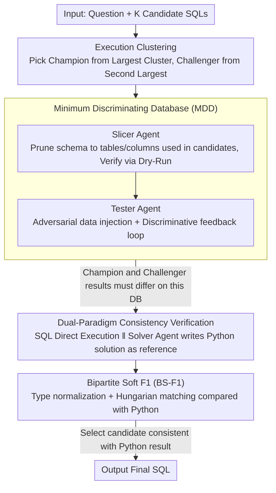

# DPC: Training-Free Text-to-SQL Candidate Selection via Dual-Paradigm Consistency

**Conference**: ACL 2026  
**arXiv**: [2604.15163](https://arxiv.org/abs/2604.15163)  
**Code**: [GitHub](https://github.com/HKUSTDial/DPC)  
**Area**: LLM Reasoning  
**Keywords**: SQL Selection, Dual-Paradigm Consistency, Minimum Discriminating Database, Training-Free, Adversarial Environment Synthesis

## TL;DR
DPC transforms Text-to-SQL candidate selection from "guessing on hidden data" to "deterministic verification on visible data": it constructs a Minimum Discriminating Database (MDD) to force conflicting SQLs to produce different results, and then uses a Python/Pandas solution as a reference anchor to select the correct candidate through cross-paradigm consistency, outperforming Self-Consistency by up to 2.2% on BIRD and Spider.

## Background & Motivation

**Background**: Text-to-SQL adopts a "generate-then-select" paradigm—generating $K$ candidate SQLs and selecting the optimal one. However, a significant "generation-selection gap" exists: Pass@$K$ is much higher than Pass@1 (e.g., 58.8% vs. ~50% on BIRD), indicating that the correct SQL is often present in the candidates but the selection fails.

**Limitations of Prior Work**: (1) Self-Consistency (majority voting) fails when there is systematic model bias—the model consistently converges to the wrong answer; (2) LLM-as-Judge fails to "mentalize" the execution state of complex SQL due to "symbolic blindness"; (3) Trained verifiers require expensive annotation and suffer from domain vulnerability.

**Key Challenge**: The triple challenge of SQL verification—partial observability (the real database is too large to fit in context), symbolic blindness (LLMs cannot internally simulate SQL execution), and inherent confirmation bias (models are biased toward their own generated candidates).

**Goal**: Design a training-free SQL selection framework to transform verification from probabilistic guessing into deterministic judgment.

**Key Insight**: Construct a meticulously designed small database that forces conflicting SQLs to produce different outcomes, then use Python code as an independent reasoning path for cross-paradigm verification.

**Core Idea**: Adversarial environment synthesis (MDD) + Dual-paradigm execution (SQL vs. Python) + Consistency voting.

## Method

### Overall Architecture

DPC reformulates the probabilistic problem of "guessing which candidate SQL is correct on a hidden real database" into a "deterministic verification on a controllable small database." Given the question and $K$ candidate SQLs, DPC first clusters candidates by execution results to identify a champion from the largest cluster and a challenger from the second-largest cluster. It then synthesizes a Minimum Discriminating Database (MDD) on-the-fly where these two conflicting SQLs must yield different results. Finally, two independent reasoning paths (SQL and Python) are executed on this database. The candidate whose result aligns with the Python reference is selected as the final SQL.

### Key Designs

**1. Minimum Discriminating Database (MDD): From "Partial Observability" to "Full Observability"**

Real databases are often too large to fit into the context, forcing models to guess blindly without full visibility of the data—this is the root cause of SQL selection failure. DPC uses two agents to synthesize a database small enough to be fully observable yet precise enough to expose candidate differences. The Slicer Agent iteratively prunes the schema to retain only the tables and columns used by the candidate SQLs, confirming structural validity via Dry-Run. The Tester Agent then injects data adversarially, using a discriminative feedback loop to adjust records until the champion and challenger yield different results. This construction is "targeted": to differentiate `INNER JOIN` from `LEFT JOIN`, specific records with non-matching keys must be created—something random sampling rarely achieves.

**2. Dual-Paradigm Consistency Verification: Breaking Confirmation Bias with a Second Language**

Using the same model to judge its own generated SQL naturally carries confirmation bias, and LLMs suffer from "symbolic blindness" regarding declarative SQL. DPC exploits a capability gap: LLMs are often more reliable at writing imperative Python/Pandas than declarative SQL, as Python has broader coverage in pre-training and imperative code forces explicit step-by-step planning of data operations. Thus, a Solver Agent independently writes a Python solution for the MDD, whose execution result acts as a proxy ground truth. Consistency between the two paradigms indicates high probability of correctness, while the reliable Python path serves as an anchor for arbitration in case of conflict.

**3. Bipartite Soft F1 (BS-F1): Robust Comparison of Cross-Paradigm Results**

Using standard Execution Accuracy (EX) to compare SQL results with Python results leads to excessive false negatives due to type incompatibility (e.g., SQL `DECIMAL` vs. Python `float`) and ordering ambiguity (un-ordered sets in SQL). BS-F1 performs type normalization and uses the Hungarian algorithm to find the optimal matching between rows of the two result sets. It computes a soft F1 score based on column overlap of matched rows, tolerating representational differences while remaining sensitive to semantic equivalence.

### Loss & Training

DPC is a pure inference-time framework and involves no training. Agents like Slicer, Tester, and Solver are implemented via prompt engineering, sharing the same LLM backbone.

## Key Experimental Results

### Main Results

| Dataset | Method | Execution Accuracy | vs. Self-Consistency |
|---------|--------|---------------------|----------------------|
| BIRD    | DPC    | **SOTA**            | +2.2%                |
| Spider  | DPC    | **SOTA**            | +1-2%                |

### Ablation Study

| Configuration | Key Metric | Description |
|---------------|------------|-------------|
| w/o MDD (Direct sampling) | Significant drop | Adversarial data construction is critical |
| w/o Python Paradigm | Drop | Dual-paradigm verification is superior to single paradigm |
| w/o BS-F1 (Strict EX) | Drop | Cross-paradigm comparison requires soft matching |

### Key Findings
- The discriminative feedback loop in MDD is the core—random data sampling fails to differentiate conflicting SQLs in most cases.
- The Python paradigm is more reliable as a verification anchor than SQL itself, confirming the hypothesis that LLMs possess stronger capabilities in imperative languages.
- BS-F1 significantly reduces misjudgments in cross-paradigm verification compared to strict EX.
- DPC consistently outperforms Self-Consistency across multiple LLM backbones.

## Highlights & Insights
- **Elegant shift from selection to construction**: Rather than guessing which SQL is correct, it constructs an "experiment" to reveal their differences.
- **Cross-paradigm consistency**: It leverages the LLM's capability variance across programming languages—using Python as a "second opinion" to cross-verify SQL is analogous to independent replication in science.
- The adversarial construction logic of MDD can be generalized to any selection task requiring the differentiation of similar candidates.

## Limitations & Future Work
- MDD construction requires multiple LLM calls, increasing inference latency and cost.
- Focusing only on a "champion vs. challenger" binary choice might miss correct candidates ranked lower in the cluster.
- The quality of the Python solution depends on the LLM's programming proficiency and is not always infallible.
- For extremely complex SQL (e.g., multi-layer nested subqueries), the success rate of MDD construction may decrease.

## Related Work & Insights
- **vs. Self-Consistency**: While SC relies on majority voting and fails under systematic bias, DPC replaces probabilistic voting with deterministic execution evidence.
- **vs. LLM-as-Judge**: While Judge modes are limited by symbolic blindness and cannot simulate execution, DPC obtains deterministic evidence through actual execution.
- **vs. Trained Verifiers**: Unlike verifiers that require labeled data and lack domain robustness, DPC is entirely training-free.

## Rating
- Novelty: ⭐⭐⭐⭐⭐ The combination of adversarial environment synthesis and dual-paradigm consistency is a fresh approach.
- Experimental Thoroughness: ⭐⭐⭐⭐ Evaluated on standard benchmarks BIRD and Spider across multiple LLM backbones.
- Writing Quality: ⭐⭐⭐⭐⭐ Clear problem formalization and a logically fluent pipeline description.

<!-- RELATED:START -->

## Related Papers

- [\[ACL 2026\] R$^3$-SQL: Ranking Reward and Resampling for Text-to-SQL](r3-sql_ranking_reward_and_resampling_for_text-to-sql.md)
- [\[ACL 2026\] ReFEree: Reference-Free and Fine-Grained Method for Evaluating Factual Consistency in Real-World Code Summarization](referee_reference-free_and_fine-grained_method_for_evaluating_factual_consistenc.md)
- [\[ACL 2026\] PV-SQL: Synergizing Database Probing and Rule-based Verification for Text-to-SQL Agents](pv-sql_synergizing_database_probing_and_rule-based_verification_for_text-to-sql_.md)
- [\[ACL 2026\] PExA: Parallel Exploration Agent for Complex Text-to-SQL](pexa_parallel_exploration_agent_for_complex_text-to-sql.md)
- [\[ACL 2025\] STaR-SQL: Self-Taught Reasoner for Text-to-SQL](../../ACL2025/code_intelligence/star-sql_self-taught_reasoner_for_text-to-sql.md)

<!-- RELATED:END -->
