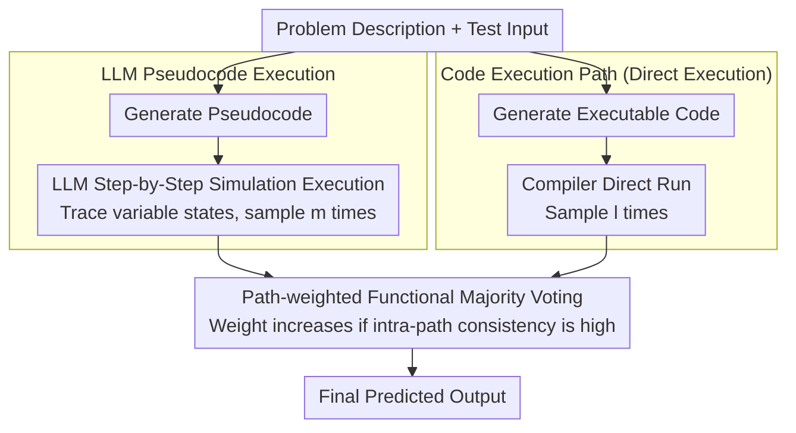

# DUET: Dual Execution for Test Output Prediction with Generated Code and Pseudocode

**Conference**: ACL 2026 Findings  
**arXiv**: [2604.11514](https://arxiv.org/abs/2604.11514)  
**Code**: [GitHub](https://github.com/ldilab/DuET)  
**Area**: LLM Safety  
**Keywords**: Test Output Prediction, Pseudocode Execution, Dual Execution, Code Generation, Functional Majority Voting

## TL;DR

This paper proposes DUET, a dual-path framework that combines direct code execution and LLM-based pseudocode execution. By performing functional majority voting to fuse two complementary execution paths—deterministic execution (reliable when code is correct but fragile to implementation errors) and pseudocode execution (bypasses implementation details but prone to hallucinations)—the method improves Pass@1 on LiveCodeBench test output prediction by 13.6 percentage points.

## Background & Motivation

**Background**: Test case generation is a critical stage in code generation pipelines. Test output prediction (predicting the correct output given a problem description and test input) is a challenging task requiring precise program reasoning. Methods like TestChain perform predictions by first generating code and then executing it directly.

**Limitations of Prior Work**: (1) The fatal flaw of direct code execution is that a model may understand the correct algorithmic logic (enabling it to generate correct pseudocode) but introduce subtle errors when implementing it as executable code (e.g., using `len(nums)` instead of `i+1` for calculating cumulative averages), leading to execution failure or incorrect output; (2) In end-to-end code generation, using generated code execution results to filter candidate programs suffers from the "zero-advantage problem"—if the generated test code is also incorrect, the filtering becomes ineffective.

**Key Challenge**: Direct code execution relies on code correctness (deterministic but fragile), while LLM reasoning does not rely on executable code but may suffer from execution hallucinations (flexible but uncertain). Their failure modes are complementary.

**Goal**: (1) Propose LLM pseudocode execution to decouple correct logic from implementation errors; (2) Design the DUET dual-path framework to fuse the complementary advantages of both execution paths.

**Key Insight**: Logic correctness and implementation correctness in code generation should be decoupled. Pseudocode captures algorithmic intent without being constrained by syntax details, allowing LLM simulation execution on pseudocode to bypass implementation errors.

**Core Idea**: The two paths for test output prediction—direct execution (reliable when code is correct) and pseudocode simulation (bypassing implementation errors but prone to hallucinations)—are naturally complementary. Their advantages can be leveraged through functional majority voting.

## Method

### Overall Architecture

DUET addresses test output prediction: given a problem description and test input, it predicts the expected program output. The core observation is that output prediction has two paths with complementary failure modes. One path generates executable code for direct execution, which is precise when correctly written but often misled by implementation bugs. The other generates pseudocode for step-by-step LLM simulation, which bypasses implementation details but may hallucinate during complex control flows. DUET samples multiple results from both paths and aggregates them into a final prediction using path-weighted functional majority voting.

### Key Designs

**1. LLM Pseudocode Execution: Decoupling "Logical Correctness" from "Implementation Correctness"**

The primary issue with direct execution is that the model may understand the correct algorithm but introduce subtle bugs when translating it into runnable code—such as using `len(nums)` instead of $i+1$ in a cumulative average calculation, where the logic is sound but the result is wrong. The paper decomposes code generation $g$ into two steps $g = t \circ p$: $p$ translates the problem description into high-level pseudocode, and $t$ translates the pseudocode into executable code. Direct execution follows the full $g(d)=t\circ p(d)$, where the translation step $t$ is the source of subtle bugs. The pseudocode path in DUET **skips the translation step $t$** and directly uses $p(d)$ for step-by-step LLM simulation to track variable states and reach an output. Pseudocode is more precise than natural language yet more tolerant than executable code; it resides at a higher level of abstraction, naturally bypassing implementation details like loop boundaries or variable name confusion. A key byproduct of this path is that its prediction signal is **orthogonal** to the correctness of the generated code. When used to filter candidate programs in pipelines like CODET, the pseudocode path can provide valid signals even when candidate code and test code fail together (the "zero-advantage problem" which caused TestChain's performance to drop 5.6pp), thereby avoiding this trap.

**2. Dual Execution + Path-weighted Functional Majority Voting: Mutually Backing Up Complementary Failure Modes**

The failure distributions of the two paths are distinct—code execution fails on implementation errors, while pseudocode execution fails on reasoning hallucinations in deep nested loops. DUET samples $l$ and $m$ times (where $l=m=5$ in experiments) from code execution and pseudocode execution respectively, collects all outputs, and performs majority voting based on functional equivalence (rather than literal string matching). If an output appears in both paths or constitutes a majority, it is more likely to be correct. Beyond standard majority voting, DUET introduces **path weighting**: each path seeds votes based on its matching outputs. If all valid outputs within a single path **unanimously agree** on the same result, the weight of that path increases from $w_{base}$ to $w_{high}$. This allows a path with high internal consistency to have a greater say during aggregation. Consequently, even if one path fails collectively on its weakness, the other path's votes can often correct the result, leading to significantly higher reliability than any single-path approach.

### Loss & Training

DUET does not involve model training and utilizes off-the-shelf LLMs (e.g., Llama-3.1-8B-Instruct) for inference. Code execution and pseudocode execution are each sampled 5 times (10 calls total), with the final predicted output selected via functional majority voting.

## Key Experimental Results

### Main Results

**LiveCodeBench Test Output Prediction**

| Method | Pass@1 | Gain |
|------|--------|---------|
| Direct (Code Exec Only) | Baseline | - |
| TestChain | +5.6pp | - |
| Pseudocode Exec | Competitive | - |
| **DUET** | **+13.6pp** | **SOTA** |

**End-to-End Code Generation (CODET Pipeline + Llama-3.1-8B-Instruct)**

| Prediction Method | Pass@1 Change |
|---------|-----------|
| No Filtering | Baseline |
| TestChain | -5.6pp (Zero-advantage problem) |
| **DUET** | **+3.2pp** |

### Ablation Study

**End-to-End Code Generation on LiveCodeBench-Easy/BigCodeBench-Hard/DevEval/HumanEval(+)**

| Method | LCB-Easy | BCB-Hard | DevEval | HumanEval(+) |
|------|----------|----------|---------|---------------|
| DUET | **Best** | **Best** | **Best** | **Best** |

### Key Findings

- DUET achieves a +13.6pp gain in test output prediction, significantly outperforming single-path methods, validating the complementarity of the two paths.
- TestChain actually reduces performance by 5.6pp in the CODET pipeline, while DUET improves it by 3.2pp, demonstrating that the zero-advantage problem is a major obstacle in practical deployment.
- The distribution of implementation errors and execution hallucinations is complementary: problems with complex functional logic are more prone to implementation errors (where the pseudocode path is more reliable), while deep nested loops are more prone to execution hallucinations (where code execution is more reliable).
- The abstraction level of pseudocode makes it inherently more fault-tolerant than executable code; even with the same logic, pseudocode "implementation" is less likely to result in errors.

## Highlights & Insights

- Decoupling "correct logic" from "correct implementation" is an elegant problem analysis—pseudocode execution is a natural byproduct of this decoupling.
- The identification and resolution of the zero-advantage problem are of great significance for the practical deployment of code generation pipelines.
- Functional majority voting is a general fusion strategy that can be extended to more execution paths.

## Limitations & Future Work

- Pseudocode execution requires additional LLM calls (2N vs. N), doubling the computational cost.
- For extremely complex algorithmic problems, both pseudocode and executable code may fail simultaneously.
- The quality of pseudocode generation depends on the model's meta-language capabilities.
- Specialized training for pseudocode execution to reduce hallucinations has not yet been explored.

## Related Work & Insights

- **vs TestChain**: TestChain only utilizes direct code execution and is susceptible to the zero-advantage problem; DUET’s dual-path design addresses this issue.
- **vs AlphaCode**: AlphaCode focuses only on test input generation, while DUET simultaneously addresses output prediction.
- **vs CODET**: The CODET framework relies on accurate test output filtering; DUET provides more reliable test outputs for this purpose.

## Rating

- Novelty: ⭐⭐⭐⭐ The ideas of pseudocode execution and dual-path fusion are novel; the discovery of the zero-advantage problem is valuable.
- Experimental Thoroughness: ⭐⭐⭐⭐⭐ Comprehensive evaluation covering test output prediction and end-to-end code generation across multiple benchmarks.
- Writing Quality: ⭐⭐⭐⭐⭐ In-depth problem analysis and clear visual illustrations.
- Value: ⭐⭐⭐⭐ Significant practical utility for test prediction within code generation pipelines.

<!-- RELATED:START -->

## Related Papers

- [\[ACL 2026\] PaT: Planning-after-Trial for Efficient Test-Time Code Generation](pat_planning-after-trial_for_efficient_test-time_code_generation.md)
- [\[ACL 2026\] SolidCoder: Bridging the Mental-Reality Gap in LLM Code Generation through Concrete Execution](solidcoder_bridging_the_mental-reality_gap_in_llm_code_generation_through_concre.md)
- [\[ICML 2026\] BoostAPR: Boosting Automated Program Repair via Execution-Grounded Reinforcement Learning with Dual Reward Models](../../ICML2026/code_intelligence/boostapr_boosting_automated_program_repair_via_execution-grounded_reinforcement_.md)
- [\[ACL 2026\] CodeRL+: Improving Code Generation via Reinforcement with Execution Semantics Alignment](coderl_improving_code_generation_via_reinforcement_with_execution_semantics_alig.md)
- [\[ACL 2026\] To Diff or Not to Diff? Structure-Aware and Adaptive Output Formats for Efficient LLM-based Code Editing](to_diff_or_not_to_diff_structure-aware_and_adaptive_output_formats_for_efficient.md)

<!-- RELATED:END -->
