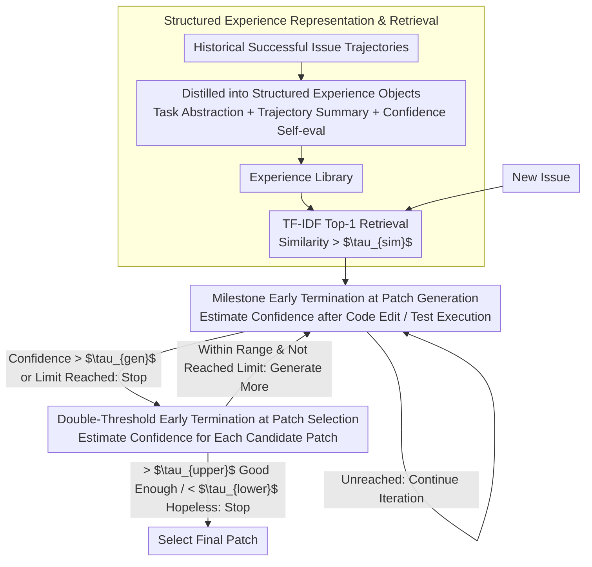

# EET: Experience-Driven Early Termination for Cost-Efficient Software Engineering Agents

**Conference**: ACL 2026 Findings  
**arXiv**: [2601.05777](https://arxiv.org/abs/2601.05777)  
**Code**: [GitHub](https://github.com/IanWalls/EET)  
**Area**: Code Intelligence  
**Keywords**: Software Engineering Agent, Cost Optimization, Experience-Driven, Early Termination Strategy, SWE-bench

## TL;DR

This paper proposes EET—an experience-driven early termination method that identifies invalid iterations during patch generation and selection. It reduces the total cost of SE Agents by 19%-55% (averaging 32%) with negligible performance loss (maximum 0.2%).

## Background & Motivation

**Background**: LLM-based Software Engineering (SE) Agents have achieved significant progress in automated issue fixing. Models like Agentless, Mini-SWE-Agent, and Trae Agent demonstrate strong performance on SWE-bench.

**Limitations of Prior Work**: The high monetary cost of SE Agents is a major barrier to practical deployment (53% of developers cite cost as an obstacle). Due to the "token snowball" effect, increasing conversation history leads to super-linear cost growth; invalid iterations on difficult or unsolvable problems further amplify waste.

**Key Challenge**: Existing cost optimization methods (e.g., turn-control) significantly impair task performance (averaging a 10.7% drop). Reducing costs while maintaining performance is a core challenge.

**Goal**: To propose a general early termination method that integrates seamlessly into various SE Agents, significantly reducing costs while maintaining task performance.

**Key Insight**: Experienced developers can often locate solutions directly without excessive trial and error. This intuition is leveraged by using structured historical experience to guide Agents in skipping redundant iterations.

**Core Idea**: Historical issue-solving experiences are distilled into structured knowledge (task abstraction + trajectory summary + confidence evaluation), which is used during the patch generation and selection phases to determine if termination is appropriate.

## Method

### Overall Architecture

EET aims to resolve the problem of SE Agents repeatedly performing invalid iterations on difficult or unsolvable problems, which drives up costs. Inspired by senior developers who can pinpoint solutions based on experience, EET distills successful historical issue trajectories into structured experience objects stored in a library (offline). When a new task arrives, relevant experiences are retrieved. EET then assesses whether a solution is "good enough" or "hopeless" during both the patch generation and selection stages to terminate early, thereby cutting redundant iterations without sacrificing performance.

### Key Designs

**1. Structured Experience Representation & Retrieval: Distilling Noisy Trajectories into Reusable Knowledge**

Original execution trajectories are long, noisy, and consume massive tokens, yet simple compression risks losing useful signals. EET constructs a structured experience object for each successfully solved issue, containing `task_description` (issue abstraction), `execution_summary` (trajectory summary), `evaluation_result` (always pass), as well as `confidence` and `confidence_reason` (quality self-assessment). Only successful experiences are stored. For new tasks, relevant experiences are retrieved using TF-IDF similarity (threshold $\tau_{sim}$). This representation balances information density and utility: it is significantly more compact than raw trajectories while retaining key clues for early termination decisions.

**2. Milestone Early Termination at Patch Generation: Timely Cessation within Single Generations**

During individual patch generation, quality signals typically emerge at two points—after a code modification (structural alignment) or after test execution (dynamic feedback). EET defines "code modification" and "test execution" as milestone checkpoints. After each milestone, a confidence score is evaluated based on retrieved experience, and the generation is terminated immediately if the score exceeds the threshold $\tau^{gen}$. This dual-milestone design covers both static and dynamic signal sources, preventing the model from idling once a patch is formed.

**3. Double-Threshold Early Termination at Patch Selection: Stopping for Success or Failure**

Generating a fixed $k$ candidate patches before selection is wasteful—simple problems may only need one, while difficult ones may not be solved by many. For each patch generated, EET calculates a confidence score based on the patch content, trajectory, and historical experience. It sets two boundaries: an upper threshold $\tau^{sel}_{upper}$ (the patch is good enough, stop) and a lower threshold $\tau^{sel}_{lower}$ (the problem is likely unsolvable, stop). The double-threshold approach accounts for both "success-based stopping" and "loss-cutting," fitting the real-world distribution better than a single threshold.

### Loss & Training

EET is an inference-time optimization method involving no training. Key hyperparameters include the TF-IDF similarity threshold $\tau_{sim}$, the generation termination threshold $\tau^{gen}$, and the selection thresholds $\tau^{sel}_{upper}$ / $\tau^{sel}_{lower}$. These were tuned on 100 independent validation samples from SWE-bench; the experience library was generated from SWE-bench Lite (207 unique problems).

## Key Experimental Results

### Main Results

| Agent + Backend | Success Rate Change | API Calls | Input Tokens | Output Tokens | Total Cost Change |
|-------------|-----------|---------|-----------|-----------|-----------|
| Agentless + GPT-5-mini | +7.8% | -26.4% | -51.8% | -51.0% | **-55.1%** |
| Agentless + DeepSeek-V3.2 | +7.2% | -25.5% | -31.9% | -35.0% | -32.2% |
| Mini-SWE + GPT-5-mini | +1.0% | -7.9% | -13.7% | -3.7% | -19.4% |
| Mini-SWE + DeepSeek-V3.2 | +0.6% | -8.4% | -13.6% | -4.4% | -19.3% |
| Trae + GPT-5-mini | 0.0% | -29.9% | -30.4% | -28.0% | -28.2% |
| Trae + DeepSeek-V3.2 | -0.2% | -26.5% | -37.7% | -28.2% | -36.7% |
| **Average** | **+2.7%** | **-20.8%** | **-29.9%** | **-25.1%** | **-31.8%** |

### Ablation Study

| Variant (Trae + GPT-5-mini) | Success Rate Change | Total Cost Change |
|--------------------------|-----------|-----------|
| Full EET | 0.0% | -28.2% |
| W/O Experience Injection | -10.4% | -58.9% |
| W/O Early Termination | +0.4% | +3.1% |

### Key Findings

- EET achieved early termination for an average of 11.3% of issues (8.6%-14.0%), where cost savings were most significant.
- The greatest improvement was seen in Agentless (success rate actually increased by 7.2-7.8%), as experience guidance compensated for its fixed-process limitations.
- Comparison with Turn-control: While Turn-control reduces cost more (-41.4%), it causes a sharp decline in success rate (-10.7%).
- LLM confidence scores are well-calibrated: patches with confidence >90 have pass rates of 63.6%-92.6%, while those <40 only pass 8.7%-13.8% of the time.
- Cross-repository experiments suggest that the experience captures general debugging patterns rather than repository-specific clues.

## Highlights & Insights

- The method is highly versatile and can be integrated plug-and-play into SE Agents of different paradigms (fixed-flow, autonomous planning, or generation+selection).
- The "Experience" concept is elegantly designed: instead of simple RAG retrieval of raw trajectories, it distills them into structured knowledge containing confidence evaluations.
- The double-threshold design for "good enough" and "hopeless" scenarios is more logical than single-threshold mechanisms.
- Ablation studies clearly demonstrate the complementary relationship between experience injection and the early termination mechanism.

## Limitations & Future Work

- Dependency on historical data for building the experience library creates a cold-start problem for entirely new domains.
- Evaluation was limited to SWE-bench Verified; generalization in industrial scenarios remains to be validated.
- Early termination decisions rely on LLM confidence output; the calibration quality may vary across different models.
- Currently focused on SE Agents, but the design philosophy (experience-driven early termination) is domain-agnostic and could be extended to general multi-step reasoning agents.

## Related Work & Insights

- Difference from RAG-based agent memory (e.g., MetaGPT, MemoryBank): EET's experience is specifically tuned for cost optimization rather than just performance enhancement.
- Fan et al.'s analysis of the "token snowball" reveals the root of the cost issue; EET provides a solution from the perspective of experience reuse.
- Insights for Agent system design: Cost optimization should be treated as a first-class citizen rather than a secondary consideration to performance.

## Rating

- Novelty: ⭐⭐⭐⭐ Systematic use of experience-driven early termination for SE Agent cost issues is both novel and practical.
- Experimental Thoroughness: ⭐⭐⭐⭐⭐ Covers 3 Agents × 2 LLM backends, including baselines, ablations, and cross-repo analysis.
- Writing Quality: ⭐⭐⭐⭐ Clear structure, accurate methodology description, and comprehensive experimental design.

<!-- RELATED:START -->

## Related Papers

- [\[ICML 2025\] Training Software Engineering Agents and Verifiers with SWE-Gym](../../ICML2025/code_intelligence/training_software_engineering_agents_and_verifiers_with_swe-gym.md)
- [\[ICLR 2026\] Ambig-SWE: Interactive Agents to Overcome Underspecificity in Software Engineering](../../ICLR2026/code_intelligence/ambig-swe_interactive_agents_to_overcome_underspecificity_in_software_engineerin.md)
- [\[ACL 2026\] Taming System Complexity: Demystifying Software Engineering Agents in Diagnosing Linux Kernel Faults](taming_system_complexity_demystifying_software_engineering_agents_in_diagnosing_.md)
- [\[NeurIPS 2025\] SWE-rebench: An Automated Pipeline for Task Collection and Decontaminated Evaluation of Software Engineering Agents](../../NeurIPS2025/code_intelligence/swe-rebench_an_automated_pipeline_for_task_collection_and_decontaminated_evaluat.md)
- [\[ACL 2026\] CollabCoder: Plan-Code Co-Evolution via Collaborative Decision-Making for Efficient Code Generation](collabcoder_plan-code_co-evolution_via_collaborative_decision-making_for_efficie.md)

<!-- RELATED:END -->
