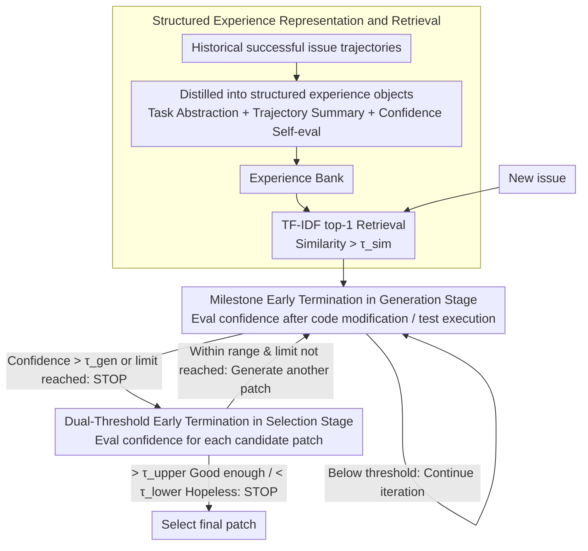

# EET: Experience-Driven Early Termination for Cost-Efficient Software Engineering Agents

**Conference**: ACL 2026 Findings  
**arXiv**: [2601.05777](https://arxiv.org/abs/2601.05777)  
**Code**: [GitHub](https://github.com/IanWalls/EET)  
**Area**: Code Intelligence  
**Keywords**: Software Engineering Agents, Cost Optimization, Experience-Driven, Early Termination Strategy, SWE-bench

## TL;DR

Ours proposes EET—an experience-driven early termination method that identifies invalid iterations and terminates them early during the patch generation and selection stages. It reduces the total cost of SE Agents by 19%-55% (average 32%) while incurring almost no loss in task performance (maximum 0.2%).

## Background & Motivation

**Background**: LLM-based Software Engineering (SE) Agents have made significant progress in automated issue fixing, with frameworks like Agentless, Mini-SWE-Agent, and Trae Agent performing exceptionally well on SWE-bench.

**Limitations of Prior Work**: The high monetary cost of SE Agents is a major barrier to practical deployment (53% of developers consider cost a barrier). Due to the "token snowball" effect, increasing dialogue history leads to super-linear cost growth; invalid iterations on difficult or unsolvable problems further amplify waste.

**Key Challenge**: Existing cost optimization methods (e.g., turn-control) significantly damage task performance while reducing costs (average decrease of 10.7%). The core challenge is how to significantly reduce costs while maintaining performance.

**Goal**: Propose a universal early termination optimization method that can be seamlessly integrated into various SE Agents to significantly reduce costs while maintaining task performance.

**Key Insight**: Drawing on the intuition that experienced developers can directly locate solutions without extensive trial and error, structured historical experience is used to guide the Agent to skip redundant iterations.

**Core Idea**: Distill historical issue-solving experience into structured knowledge (task abstraction + trajectory summary + confidence evaluation), which is then used to judge whether early termination is feasible during the patch generation and selection stages of new tasks.

## Method

### Overall Architecture

EET aims to solve the problem of SE Agents repeatedly performing invalid iterations on difficult or unsolvable problems, leading to escalating costs. Inspired by senior developers—who can directly locate solutions based on experience—EET distills successful historical issue resolution records into a structured experience bank (offline). When a new task arrives, relevant experiences are retrieved to judge "whether it is already good enough, or already hopeless" during the patch generation and patch selection stages. Once conditions are met, termination occurs early, cutting redundant iterations with almost no performance loss.

### Key Designs

**1. Structured Experience Representation and Retrieval: Distilling noisy trajectories into reusable knowledge**

Original execution trajectories are long and noisy, consuming massive tokens, yet simple compression risks losing useful signals. EET constructs a structured experience object for each successfully resolved issue, containing `task_description` (issue abstraction), `execution_summary` (trajectory summary), `evaluation_result` (always pass), as well as `confidence` and `confidence_reason` (quality self-evaluation). Only successful experiences are stored. When a new task arrives, TF-IDF similarity (threshold $\tau_{sim}$) is used to retrieve relevant experience. This representation balances information density and utility: it is much more compact than raw trajectories while retaining key clues for early termination decisions.

**2. Milestone Early Termination in Patch Generation Stage: Stopping timely within a single generation**

During a single patch generation process, quality signals may emerge at two moments—after the code is modified (structural alignment) or after tests are run (dynamic feedback passing). EET defines "code modification" and "test execution" as milestone checkpoints. After each milestone, a confidence score is evaluated combined with retrieved experience. If it exceeds threshold $\tau^{gen}$, the current generation terminates immediately. This dual-milestone design covers both static and dynamic signal sources, preventing the model from idling on an already completed patch.

**3. Dual-Threshold Early Termination in Patch Selection Stage: Stop when good, stop when hopeless**

Generating a fixed $k$ candidate patches and then selecting the best is wasteful—one is enough for simple problems, and more do not help for unsolvable ones. As EET generates each patch, it calculates a confidence score based on patch content, execution trajectory, and historical experience using two gates: if higher than the upper threshold $\tau^{sel}_{upper}$, the patch is good enough, STOP; if lower than the lower threshold $\tau^{sel}_{lower}$, the current problem is too difficult to solve, also STOP. The dual thresholds characterize both "good enough to stop" and "too hard, cut losses" scenarios, fitting the real distribution better than a single threshold.

### Loss & Training

EET is an inference-time optimization method and does not involve training. Key hyperparameters include the TF-IDF similarity threshold $\tau_{sim}$, generation early termination threshold $\tau^{gen}$, and selection upper/lower thresholds $\tau^{sel}_{upper}$ / $\tau^{sel}_{lower}$, all tuned on 100 independent validation samples from SWE-bench. The experience bank is generated from SWE-bench Lite (207 unique problems).

## Key Experimental Results

### Main Results

| Agent + Backend | Success Rate Change | API Calls | Input Tokens | Output Tokens | Total Cost Change |
|-------------|-----------|---------|-----------|-----------|-----------|
| Agentless + GPT-5-mini | +7.8% | -26.4% | -51.8% | -51.0% | **-55.1%** |
| Agentless + DeepSeek-V3.2 | +7.2% | -25.5% | -31.9% | -35.0% | -32.2% |
| Mini-SWE + GPT-5-mini | +1.0% | -7.9% | -13.7% | -3.7% | -19.4% |
| Mini-SWE + DeepSeek-V3.2 | +0.6% | -8.4% | -13.6% | -4.4% | -19.3% |
| Trae + GPT-5-mini | 0.0% | -29.9% | -30.4% | -28.0% | -28.2% |
| Trae + DeepSeek-V3.2 | -0.2% | -26.5% | -37.7% | -28.2% | -36.7% |
| **Average** | **+2.7%** | **-20.8%** | **-29.9%** | **-25.1%** | **-31.8%** |

### Ablation Study

| Variant (Trae + GPT-5-mini) | Success Rate Change | Total Cost Change |
|--------------------------|-----------|-----------|
| Full EET | 0.0% | -28.2% |
| w/o Experience Injection | -10.4% | -58.9% |
| w/o Early Termination | +0.4% | +3.1% |

### Key Findings

- EET achieves early termination for an average of 11.3% of issues (8.6%-14.0%), where cost savings are most significant.
- The greatest improvement is seen in Agentless (success rate actually increases by 7.2-7.8%), as experience guidance compensates for its fixed workflow deficiencies.
- Comparison with Turn-control: While Turn-control reduces costs more (-41.4%), it results in a massive drop in success rate (-10.7%).
- LLM confidence scores are well-calibrated: patches with confidence >90 have a pass rate of 63.6%-92.6%, while those <40 are only 8.7%-13.8%.
- Cross-repository transfer experiments show that the experience captures general debugging patterns rather than repository-specific clues.

## Highlights & Insights

- The method is highly universal and can be integrated plug-and-play into SE Agents of different paradigms (fixed workflow / autonomous planning / generate-then-select).
- The "experience" concept is elegantly designed: not simple RAG retrieval of raw trajectories, but distillation into structured knowledge with confidence evaluation.
- The dual-threshold design covers both "good enough to stop" and "too hard to stop" scenarios, which is more rational than a single threshold.
- Ablation experiments clearly reveal the complementary relationship between experience injection and early termination mechanisms.

## Limitations & Future Work

- Reliance on historical data to build the experience bank leads to cold-start issues in entirely new domains.
- Evaluated only on SWE-bench Verified; generalization in industrial scenarios remains to be verified.
- Early termination decisions depend on LLM confidence outputs, and calibration quality may vary across different models.
- Currently focused on SE Agents, but the design philosophy (experience-driven early termination) is domain-agnostic and can be extended to general multi-step reasoning Agents.

## Related Work & Insights

- Difference from RAG-based agent memory (e.g., MetaGPT, MemoryBank): EET's experience specifically serves cost optimization rather than just performance improvement.
- Fan et al.'s "token snowball" analysis reveals the root cause of cost issues; EET provides a solution from an experience reuse perspective.
- Implications for Agent system design: Cost optimization should be considered a first-class citizen rather than a byproduct of performance.

## Rating

- Novelty: ⭐⭐⭐⭐ Systematic use of experience-driven early termination for SE Agent cost issues is a novel and practical perspective.
- Experimental Thoroughness: ⭐⭐⭐⭐⭐ 3 Agents × 2 LLM backends, including baseline comparisons, ablations, and cross-repo transfer analysis.
- Writing Quality: ⭐⭐⭐⭐ Clear structure, accurate method description, and comprehensive experimental design.

<!-- RELATED:START -->

## Related Papers

- [\[ICML 2025\] Training Software Engineering Agents and Verifiers with SWE-Gym](../../ICML2025/code_intelligence/training_software_engineering_agents_and_verifiers_with_swe-gym.md)
- [\[ICLR 2026\] Ambig-SWE: Interactive Agents to Overcome Underspecificity in Software Engineering](../../ICLR2026/code_intelligence/ambig-swe_interactive_agents_to_overcome_underspecificity_in_software_engineerin.md)
- [\[ICLR 2026\] BOAD: Discovering Hierarchical Software Engineering Agents via Bandit Optimization](../../ICLR2026/code_intelligence/boad_discovering_hierarchical_software_engineering_agents_via_bandit_optimizatio.md)
- [\[ICLR 2026\] Process-Level Trajectory Evaluation for Environment Configuration in Software Engineering Agents](../../ICLR2026/code_intelligence/process-level_trajectory_evaluation_for_environment_configuration_in_software_en.md)
- [\[ACL 2026\] Taming System Complexity: Demystifying Software Engineering Agents in Diagnosing Linux Kernel Faults](taming_system_complexity_demystifying_software_engineering_agents_in_diagnosing_.md)

<!-- RELATED:END -->
