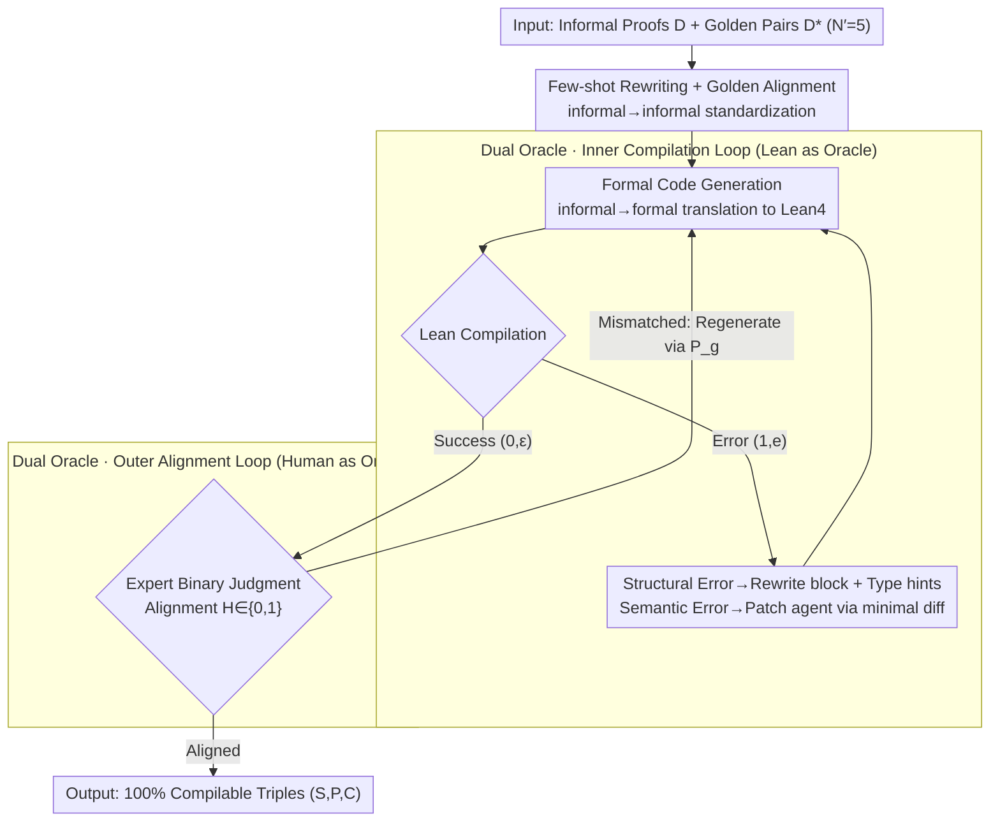

# FormalScience: Scalable Human-in-the-Loop Autoformalisation of Science with Agentic Code Generation in Lean

**Conference**: ACL 2026  
**arXiv**: [2604.23002](https://arxiv.org/abs/2604.23002)  
**Code**: https://github.com/jmeadows17/formal-science  
**Area**: Code Intelligence / Formalization / Lean4 / Auto-formalization  
**Keywords**: Auto-formalization, Lean4, Physics Formalization, Agent, Human-in-the-loop, Semantic Drift

## TL;DR
FormalScience proposes a domain-agnostic human-in-the-loop (HITL) agent pipeline that enables a single domain expert, without proficiency in Lean, to transcribe informal scientific reasoning (specifically physics) into 100% compilable Lean4 code. It introduces FormalPhysics, the first benchmark of 200 university-level physics problems, and systematically characterizes the phenomenon where code "passes compilation" yet suffers from "semantic drift."

## Background & Motivation

**Background**: Automatically translating mathematical derivations written in natural language into formal code for theorem provers like Lean or Coq (auto-formalization) is a prominent direction in LLM $\times$ formal methods. Existing benchmarks (miniF2F, ProofNet, Lean Workbook, Herald, etc.) focus almost exclusively on Olympiad or undergraduate mathematics. While recent works like FormalMath and Herald-Proof have scaled to the order of $10^4$ to $10^5$, the **domain remains pure mathematics**.

**Limitations of Prior Work**: Formalization in scientific fields (especially physics) is virtually non-existent. Reasons include: (1) Physics extensively uses domain-specific notation like Dirac notation $\ket{\Psi}$ and vector calculus $\nabla\times\vec{E}$, which are not directly supported by Lean4/Mathlib; (2) LLM hallucination rates explode with complexity in out-of-distribution, long-chain reasoning; (3) The Formal Validity (FV) of existing datasets like Herald-Proof is as low as 2%, indicating a massive gap between "automatically generated" and "truly compilable" code.

**Key Challenge**: The authors discovered a core trade-off—**Formal Validity (FV)** and **semantic alignment (FQ/LP/MC)** are nearly orthogonal (Spearman coefficient $\approx 0$, $p>0.9$). In other words, small models optimized specifically for compilation (e.g., Kimina-7B reaching 51.5% FV) "cheat" by producing compilable but semantically incorrect code, while large models with high alignment scores, such as GPT-5.1, achieve only 14.5% FV in zero-shot settings.

**Goal**: (i) Design a low-cost pipeline (1 person / 1 month / $50) capable of producing 100% FV formal datasets; (ii) Provide the first high-quality benchmark for the physics domain, FormalPhysics; (iii) Systematically characterize the phenomenon of "compilation with semantic drift" to address the epistemic question: **"What does Lean actually verify?"**

**Key Insight**: The authors position the human expert as a **binary classifier** $\mathcal{H}\in\{0,1\}$ isomorphic to the compiler $\mathcal{L}$. Since LLMs alone cannot handle semantic alignment, the expert acts as a lightweight oracle for the "alignment" stage without being required to write Lean code—they only judge if the formal code matches the original statement.

**Core Idea**: Auto-formalization is decomposed into a nested loop of "statement generation + formal code generation + compilation error correction + expert alignment verification." The compilation loop uses Lean as the oracle, while the alignment loop uses the human as the oracle, alternating until convergence.

## Method

### Overall Architecture

FormalScience decomposes the translation of informal scientific reasoning into compilable Lean4 into a three-stage, dual-oracle nested pipeline (Alg.1). The input consists of informal proofs $\mathcal{D}$ (e.g., LaTeX derivations) and a few golden pairs $\mathcal{D}^*=\{(\mathcal{S}_i,\mathcal{P}_i)\}_{i=1}^{N'}$ ($N'=5$). First, few-shot rewriting standardizes rough proofs into consistent statement-proof pairs. Then, the process enters an "inner compilation loop" to iteratively fix Lean code until it passes. Finally, a physics expert in the "outer alignment loop" judges whether the formalization matches the original intent. The compilation loop uses Lean as a rigorous oracle, and the alignment loop uses a human as an oracle, alternating until a 100% compilable triple $(S,P,C)$ is produced.

### Key Designs

**1. Few-shot Rewriting + Golden Alignment: Increasing SNR Before Translation**

Physics proofs often skip many steps ("by symmetry, we have..."), whereas Lean requires explicit steps. Direct formalization often leads to an explosion of iterations in the compilation loop. This step uses in-context learning to feed the granularity of golden standards $\mathcal{D}^*$ to the model, rewriting each rough proof $d$ into a consistent statement-proof pair $X=\sum_{d\in\mathcal{D}} S\big(\mathcal{M}(T_{fs}(d,\mathcal{D}^*);P_a)\big)$. This "informal→informal" restructuring suppresses noise, significantly reducing compilation error correction cycles downstream.

**2. Dual-Oracle Nested Loop: Compiler for Syntax, Human for Semantics**

Since semantic alignment metrics (LP/MC) are nearly orthogonal to FV ($\rho\approx 0$), a single oracle cannot maximize both. LLM-as-judge for the outer loop often leads to "models deceiving models." Goals are thus decoupled: the inner loop $\mathcal{R}$ treats the Lean compiler as a tool $\mathcal{L}(C)$, returning $(0,\varepsilon)$ for success or $(1,e)$ for failure, with $C^{(t+1)}=\mathcal{M}'(T_c(x,C^{(t)},e))$ iteratively rewriting code until $t^*=\min\{t:\mathcal{L}(C^{(t)})=(0,\varepsilon)\}$. The outer loop uses a physics expert as a binary classifier $\mathcal{H}^{(k)}\in\{0,1\}$ to judge alignment. If mismatched, it triggers regeneration under $P_g$ and re-enters the compilation loop $\mathcal{R}$, controlled by a patience parameter $\mathcal{P}$. Experts only make yes/no judgments (aided by LLM-generated self-evaluations), keeping costs significantly lower than line-by-line Lean authoring. FormalPhysics was completed by one physics PhD in one month for $50.

**3. Structural vs. Semantic Error Branching: Enabling Lean as a Tool for Mid-sized Models**

In the agentic baseline (CodeAgent + ReAct based on smolagents), a surface guard first rejects code containing forbidden tokens or incomplete blocks. Upon compilation failure, errors are branched: **structural errors** (syntax, unknown identifiers, missing modules) trigger full-block rewrites with type hints; **semantic errors** (type mismatch, unsolved goals) prompt a patch agent to output minimal unified diffs. This granularity allows mid-sized open-source models like GPT-OSS-20B to improve FV from 4.5% (zero-shot) to 31% without losing alignment. Conversely, 7B models (e.g., DeepSeek-Prover-7B) often see FV drop (13%→4.5%) under feedback, highlighting their limited ability to learn from error signals.

### Loss & Training
No models are trained in this work; it focuses on inference-time pipeline design. Experiments utilize off-the-shelf models: GPT-5.1 and Claude-Opus-4.5 for data construction; Qwen2.5-Coder-7B, DeepSeek-Prover-V2-7B, Kimina-Autoformalizer-7B, GPT-OSS-20B, Qwen3-Sonnet-14B, Qwen3-Coder-30B, and GPT-5.1 for baselines. GPT-4.1-mini is used as a judge (temperature 0.2), with Qwen2.5-Coder-7B-Instruct used for inter-judge agreement on $\approx 6000$ pairs.

## Key Experimental Results

### Main Results

Statement formalization scores on FormalPhysics (judged by GPT-4.1-mini):

| Method | Model | FV (%) | FQ (%) | LP (%) | MC (%) |
|------|------|--------|--------|--------|--------|
| Zero-Shot | Kimina-7B | 51.5 | 6.5 | 10.5 | 9.5 |
| Zero-Shot | GPT-OSS-20B | 4.5 | 68.5 | 73.0 | 72.5 |
| Zero-Shot | GPT-5.1 | 14.5 | 79.5 | 76.5 | 77.0 |
| Self-Refine | GPT-5.1 | 17.0 | 82.5 | 82.0 | 82.0 |
| Agentic | Qwen3-Sonnet-14B | 52.0 | 1.0 | 10.5 | 6.5 |
| Agentic | GPT-OSS-20B | **31.0** | 73.0 | 72.5 | 73.0 |
| **FormalScience (ours)** | GPT-5.1 + Claude-4.5 | **100.0** | **73.5** | 72.0 | 72.5 |

Statistical comparison of FormalPhysics and existing Lean4 benchmarks (random sample of 200):

| Dataset | Objects | Formulae | FV (%) | LP (%) | MC (%) |
|--------|---------|----------|--------|--------|--------|
| miniF2F | 3.14 ± 1.55 | 3.21 ± 1.53 | 88.0 | 92.0 | 92.0 |
| ProofNet | 3.67 ± 1.48 | 3.62 ± 1.52 | 95.5 | 77.5 | 77.5 |
| FormalMATH | 4.47 ± 2.45 | 4.53 ± 2.62 | 97.5 | 98.0 | 96.5 |
| Herald-Proof | 6.57 ± 2.32 | 6.42 ± 2.37 | 2.0 | 94.5 | 94.0 |
| **FormalPhysics** | **6.41 ± 2.34** | **6.22 ± 2.13** | **100.0** | 72.0 | 72.5 |

### Ablation Study

Ablation by increasing pipeline complexity (GPT-OSS-20B):

| Configuration | FV (%) | FQ (%) | LP (%) | MC (%) | Description |
|------|--------|--------|--------|--------|------|
| Zero-shot | 4.5 | 68.5 | 73.0 | 72.5 | Prompting only |
| + Self-refine | 7.5 | 70.5 | 77.0 | 79.0 | Compilation feedback, FV +3pp |
| + Agentic (ReAct + diff) | **31.0** | 73.0 | 72.5 | 73.0 | Structural/Semantic branching, FV +26.5pp |
| + Human (FormalScience) | **100.0** | 73.5 | 72.0 | 72.5 | Human alignment oracle, FV → 100% |

### Key Findings

- **FV and Semantic Alignment are Orthogonal**: The Spearman and Pearson coefficients between FV and the average of FQ/LP/MC are near zero ($p>0.9$), proving the trade-off is structural. Kimina-7B represents an extreme case: using compilation shortcuts to achieve 51.5% FV with only 6.5% FQ.
- **The Failure of Self-refinement as a Free Lunch**: Adding 2× token cost resulted in < 3pp improvements in FV/alignment. Gains are sensitive to the choice of the judge.
- **Agentic Methods Close the FV Gap**: GPT-OSS-20B surged from 4.5% to 31% FV without dropping alignment scores, showing ReAct + branching enables mid-sized models to use Lean effectively.
- **Auto-formalization as an Emergent Ability**: Performance is not strictly proportional to size; it requires the convergence of **parameters $\times$ neuro-symbolic integration $\times$ test-time scaling**. GPT-5.1 achieves 100% FV only within the FormalScience pipeline.
- **Physics is Harder than Math Competitions**: FormalPhysics contains approximately **twice as many** Objects/Formulae as miniF2F or ProofNet. While comparable to Herald-Proof, FormalScience achieves 100% FV vs. the latter's 2%.

## Highlights & Insights

- **Human as Oracle, Not Annotator**: Instead of writing code, experts provide binary "alignment yes/no" judgments. This abstraction of humans as lightweight classifiers can be transferred to other tasks like RLHF or code review.
- **Quantifying "Compilation $\neq$ Alignment"**: The introduction of terms like "Notational Collapse" and "Abstraction Elevation" highlights epistemic risks—e.g., when Lean treats $\ket{\Psi}$ as a complex scalar $\Psi$, it is no longer verifying quantum mechanics.
- **Existence of the Trade-off**: The finding that $\rho\approx 0$ between FV and alignment is a significant domain-level result, suggesting that compilation pass rates should not be used as the sole RL reward for auto-formalization.
- **Scalability**: One expert performing at $0.25/problem suggests that a small team could produce thousands of problems in a month, making the creation of fine-tuning sets for science formalization feasible.

## Limitations & Future Work

- **Scale and Scope**: FormalPhysics is currently 200 problems—useful for evaluation but small for extensive fine-tuning. It covers only quantum mechanics and electromagnetism, excluding relativity and statistical mechanics.
- **Mathlib Support**: The lack of native support for vector calculus and Dirac notation in Lean4/Mathlib naturally lowers LP/MC scores (72%); this is a library limitation, not a pipeline failure.
- **Expert Effort**: Judging alignment requires the expert to be able to read (if not write) Lean code, which remains a entry barrier. The single-judgment latency and human-in-the-loop iteration count per problem were not fully reported.
- **Future Directions**: (1) Developing DSLs for physics within Mathlib; (2) Replacing the human oracle with a fine-tuned alignment verifier; (3) Using drift classifications as negative rewards in RL.

## Related Work & Insights

- **vs miniF2F / ProofNet**: Focuses on university physics rather than Olympiad math; complexity (Objects $\sim 6.5$) is double that of math benchmarks.
- **vs Herald-Proof**: Achieves 100% FV compared to Herald-Proof’s 2% on similar complexity, proving humans are a necessity, not an option, in complex domains.
- **vs Kimina-Autoformalizer**: Reveals that optimizing for FV alone (as Kimina does) follows Goodhart’s Law, sacrificing semantic integrity.
- **vs DeepSeek-Prover-V2**: Adapts ReAct/tool-calling frameworks but adds surface guards and structural/semantic error branching, which can be generalized to other code-agent tasks.

## Rating
- Novelty: ⭐⭐⭐⭐ (Dual oracle + physics domain is novel, though HITL formalization itself is known).
- Experimental Thoroughness: ⭐⭐⭐⭐ (Extensive cross-pipeline/model comparisons and inter-judge agreement).
- Writing Quality: ⭐⭐⭐⭐ (Clear algorithms and intuitive drift categorization).
- Value: ⭐⭐⭐⭐⭐ (Opens the door to "formalization of science" and provides a rigorous analysis of semantic drift).

<!-- RELATED:START -->

## Related Papers

- [\[ICML 2026\] CentaurEval: Benchmarking Human-in-the-Loop Value in Agentic Coding](../../ICML2026/code_intelligence/centaureval_benchmarking_human-in-the-loop_value_in_agentic_coding.md)
- [\[ACL 2026\] Discover and Prove: An Open-source Agentic Framework for Hard Mode Automated Theorem Proving in Lean 4](discover_and_prove_an_open-source_agentic_framework_for_hard_mode_automated_theo.md)
- [\[ACL 2026\] ReCode: Reinforcing Code Generation with Reasoning-Process Rewards](recode_reinforcing_code_generation_with_reasoning-process_rewards.md)
- [\[ACL 2026\] Aligned Multi-View Scripts for Universal Chart-to-Code Generation](aligned_multi-view_scripts_for_universal_chart-to-code_generation.md)
- [\[ACL 2026\] StoryCoder: Narrative Reformulation for Structured Reasoning in LLM Code Generation](storycoder_narrative_reformulation_for_structured_reasoning_in_llm_code_generati.md)

<!-- RELATED:END -->
