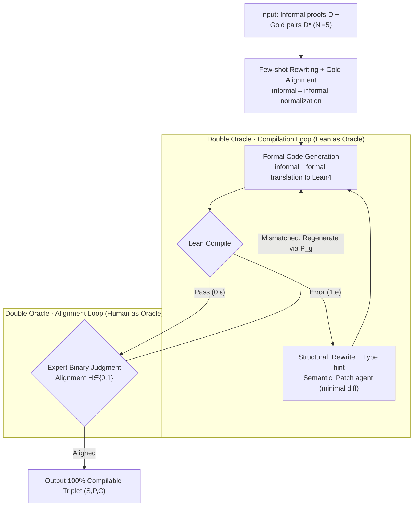

# FormalScience: Scalable Human-in-the-Loop Autoformalisation of Science with Agentic Code Generation in Lean

**Conference**: ACL 2026  
**arXiv**: [2604.23002](https://arxiv.org/abs/2604.23002)  
**Code**: https://github.com/jmeadows17/formal-science  
**Area**: Code Intelligence / Formalization / Lean4 / Auto-formalization  
**Keywords**: Auto-formalization, Lean4, Physics Formalization, Agent, Human-in-the-loop, Semantic Drift

## TL;DR
FormalScience proposes a domain-agnostic Human-in-the-Loop (HITL) agent pipeline, enabling a single domain expert without Lean proficiency to translate informal scientific reasoning (specifically physics) into 100% compilable Lean4 code. It constructs FormalPhysics, the first benchmark of 200 university-level physics problems, and systematically characterizes the phenomenon where code is "compiled" but "semantically drifted."

## Background & Motivation

**Background**: Automatically translating mathematical derivations written in natural language into formal code for theorem provers like Lean / Coq (auto-formalization) is a prominent direction in LLM × Formal Methods. Existing benchmarks (miniF2F, ProofNet, Lean Workbook, Herald, etc.) focus almost entirely on Olympiad or undergraduate mathematics. Although FormalMath and Herald-Proof have scaled to tens or hundreds of thousands of entries, the **domain remains pure mathematics**.

**Limitations of Prior Work**: Formalization in scientific fields (especially physics) is nearly non-existent. Reasons include: (1) Physics extensively uses domain-specific notations like Dirac notation $\ket{\Psi}$ and vector calculus $\nabla\times\vec{E}$, which are not directly supported by Lean4/Mathlib; (2) LLM hallucination rates explode with complexity in out-of-distribution, long-chain reasoning; (3) The Formal Validity (FV) of existing datasets like Herald-Proof is as low as 2%, indicating a massive gap between "auto-generation" and "actual compilation."

**Key Challenge**: The authors discovered a core trade-off—**Formal Validity (FV)** and **Semantic Alignment (FQ/LP/MC)** are nearly orthogonal (Spearman coefficient $\approx 0$, $p>0.9$). In other words, small models optimized specifically for compilation (e.g., Kimina-7B achieving 51.5% FV) "cheat" by producing compilable but semantically incorrect code, while high-alignment large models like GPT-5.1 achieve only 14.5% FV in zero-shot settings.

**Goal**: (i) Design a low-cost (1 person / 1 month / $50) HITL pipeline capable of producing 100% FV formal datasets; (ii) Provide the first high-quality benchmark for physics, FormalPhysics; (iii) Systematically characterize the "compiled but semantically drifted" phenomenon to address the epistemic question: **"What does Lean actually verify?"**

**Key Insight**: Position the human expert as a **binary classifier $\mathcal{H}\in\{0,1\}$ isomorphic to the compiler $\mathcal{L}$**. Since LLMs alone cannot handle semantic alignment, the expert acts as a lightweight oracle for "alignment," **without needing to write Lean**, simply judging if the "formal code matches the original statement."

**Core Idea**: Decompose auto-formalization into four nested loops: "Statement Generation + Formal Code Generation + Compile Error Correction + Expert Alignment Verification." Lean acts as the oracle for the compilation loop, while the human acts as the oracle for the alignment loop, alternating until convergence.

## Method

### Overall Architecture

FormalScience decomposes the task of "translating informal scientific reasoning into compilable Lean4" into a nested pipeline of three phases and two oracles (Alg. 1). The input consists of informal proofs $\mathcal{D}$ (e.g., LaTeX derivations) and a few gold-standard pairs $\mathcal{D}^*=\{(\mathcal{S}_i,\mathcal{P}_i)\}_{i=1}^{N'}$ ($N'=5$). First, few-shot rewriting standardizes rough proofs into uniform statement-proof pairs. Then, the "Compile Error Correction" inner loop iteratively fixes Lean code. Finally, a physics expert in the "Alignment Verification" outer loop judges if the formalization matches the original intent. The compilation loop uses Lean as a strict oracle, while the alignment loop uses the human as an oracle.

### Key Designs

**1. Few-shot Rewriting + Gold Alignment: Cleaning Signal before Translation**

Physics proofs often skip steps ("by symmetry"), whereas Lean requires explicit steps. Direct formalization causes the compilation loop to explode. This step uses in-context learning to feed gold-standard $\mathcal{D}^*$ granularity rules to the model, rewriting each rough proof $d$ into a consistent statement-proof pair $X=\sum_{d\in\mathcal{D}} S\big(\mathcal{M}(T_{fs}(d,\mathcal{D}^*);P_a)\big)$. This is essentially an "informal→informal" restructuring that suppresses noise and significantly reduces the number of compilation iterations.

**2. Double Oracle Nested Loop: Compiler for Syntax, Human for Semantics**

Since semantic alignment (LP/MC) and FV are nearly orthogonal ($\rho\approx 0$), a single oracle cannot maximize both. Using an LLM-as-judge for the outer loop leads to "models deceiving models." Thus, targets are decoupled: the inner loop $\mathcal{R}$ treats the Lean compiler as a tool $\mathcal{L}(C)$, returning $(0,\varepsilon)$ for success or $(1,e)$ for failure, iteratively rewriting via $C^{(t+1)}=\mathcal{M}'(T_c(x,C^{(t)},e))$. The outer loop uses a physics expert as a binary classifier $\mathcal{H}^{(k)}\in\{0,1\}$ to judge alignment. If unaligned, the code is regenerated via $P_g$. Experts **do not need to write Lean**; they only make yes/no judgments, making the process significantly cheaper than manual coding. FormalPhysics was completed by one Physics PhD in one month for $50.

**3. Structural vs. Semantic Error Routing in Agent Baseline: Tool-use for Mid-sized Models**

In the agentic baseline (CodeAgent + ReAct based on smolagents), a surface guard first rejects code with forbidden tokens or incomplete proofs. Failures are then routed: **structural errors** (syntax, unknown identifier) trigger full-segment rewriting with type hints; **semantic errors** (type mismatch, unsolved goals) are handled by a patch agent outputting minimal unified diffs (up to 25 ReAct cycles). This allows models like GPT-OSS-20B to increase FV from 4.5% (zero-shot) to 31% without losing alignment. Smaller 7B models (e.g., DeepSeek-Prover-7B) actually saw FV drop (13%→4.5%), lacking the capacity to learn from error signals.

### Loss & Training
No models were trained; this is an inference-time pipeline. Models used: GPT-5.1 and Claude-Opus-4.5 for data construction. Baseline evaluations include Qwen2.5-Coder-7B, DeepSeek-Prover-V2-7B, Kimina-Autoformalizer-7B, GPT-OSS-20B, Qwen3-Sonnet-14B (distilled from Claude-Sonnet-4.5), Qwen3-Coder-30B, and GPT-5.1. GPT-4.1-mini (temp 0.2) served as the LLM-as-judge, with Qwen2.5-Coder-7B-Instruct performing inter-judge agreement on ≈6000 pairs.

## Key Experimental Results

### Main Results

Formalization scores for different pipelines on FormalPhysics (Judged by GPT-4.1-mini):

| Method | Model | FV (%) | FQ (%) | LP (%) | MC (%) |
|------|------|--------|--------|--------|--------|
| Zero-Shot | Kimina-7B | 51.5 | 6.5 | 10.5 | 9.5 |
| Zero-Shot | GPT-OSS-20B | 4.5 | 68.5 | 73.0 | 72.5 |
| Zero-Shot | GPT-5.1 | 14.5 | 79.5 | 76.5 | 77.0 |
| Self-Refine | GPT-5.1 | 17.0 | 82.5 | 82.0 | 82.0 |
| Agentic | Qwen3-Sonnet-14B | 52.0 | 1.0 | 10.5 | 6.5 |
| Agentic | GPT-OSS-20B | **31.0** | 73.0 | 72.5 | 73.0 |
| **FormalScience (Ours)** | GPT-5.1 + Claude-4.5 | **100.0** | **73.5** | 72.0 | 72.5 |

Statistical comparison of FormalPhysics with existing Lean4 benchmarks (200 random samples):

| Dataset | Objects | Formulae | FV (%) | LP (%) | MC (%) |
|--------|---------|----------|--------|--------|--------|
| miniF2F | 3.14 ± 1.55 | 3.21 ± 1.53 | 88.0 | 92.0 | 92.0 |
| ProofNet | 3.67 ± 1.48 | 3.62 ± 1.52 | 95.5 | 77.5 | 77.5 |
| FormalMATH | 4.47 ± 2.45 | 4.53 ± 2.62 | 97.5 | 98.0 | 96.5 |
| Herald-Proof | 6.57 ± 2.32 | 6.42 ± 2.37 | 2.0 | 94.5 | 94.0 |
| **FormalPhysics** | **6.41 ± 2.34** | **6.22 ± 2.13** | **100.0** | 72.0 | 72.5 |

### Ablation Study

Ablation on pipeline complexity (GPT-OSS-20B):

| Configuration | FV (%) | FQ (%) | LP (%) | MC (%) | Description |
|------|-----------|-----------|-----------|-----------|------|
| Zero-shot | 4.5 | 68.5 | 73.0 | 72.5 | Prompt only, no feedback |
| + Self-refine | 7.5 | 70.5 | 77.0 | 79.0 | Compilation feedback added |
| + Agentic (ReAct + diff) | **31.0** | 73.0 | 72.5 | 73.0 | Structural/Semantic routing |
| + Human (FormalScience) | **100.0** | 73.5 | 72.0 | 72.5 | Human-alignment oracle added |

### Key Findings

- **FV and Semantic Alignment are Orthogonal**: Spearman and Pearson coefficients between FV and alignment metrics (FQ/LP/MC) are nearly zero ($p>0.9$), proving the trade-off is structural. Kimina-7B is an extreme case: 51.5% FV via shortcuts but only 6.5% FQ.
- **Ambiguous Gains from Self-Refinement**: Doubling token costs yielded < 3pp improvements in FV/alignment; however, scores varied significantly with different judges.
- **Agents Bridge the FV Gap**: GPT-OSS-20B increased from 4.5% to 31% FV without losing alignment, demonstrating that ReAct + routing enables mid-sized models to use Lean effectively.
- **Auto-formalization as an Emergent Ability**: Performance is not strictly proportional to model size; it requires the intersection of **parameters × neuro-symbolic integration × test-time scaling**.
- **Physics is Harder than Olympiad Math**: FormalPhysics contains ~2x more Objects/Formulae than miniF2F or ProofNet, yet achieves 100% FV compared to Herald-Proof's 2%.

## Highlights & Insights

- **Human as Oracle, Not Annotator**: Instead of writing code, humans provide binary "yes/no" alignment feedback. This abstraction as a "lightweight classifier" is transferable to RLHF or code review.
- **Quantifying "Compiled $\neq$ Aligned"**: Introduced categories like Notational Collapse and Abstraction Elevation. For instance, if $\ket{\Psi}$ is treated as a complex scalar $\Psi$, Lean is no longer verifying quantum mechanics.
- **Existence of the Trade-off is Key**: The discovery that $\rho\approx 0$ for FV vs. alignment is a domain-level negative result, suggesting that compilation pass rates alone should not be used as RL rewards.
- **Scalability**: One expert / 1 month / $50 / 200 problems ≈ $0.25/problem suggests a 10-person team could produce 2,000 problems in a month, making fine-tuning physics models feasible.

## Limitations & Future Work

- **Sample Size**: FormalPhysics (200 problems) is an evaluation set rather than a full training set.
- **Domain Coverage**: Currently limited to Quantum Mechanics and Electromagnetism; lacks General Relativity and Statistical Mechanics.
- **Mathlib Limitations**: Poor native support for vector calculus and Dirac notation leads to inherently lower LP/MC scores (72%).
- **Future Directions**: (1) Build a DSL for Dirac notation in Mathlib; (2) Replace the human oracle with a fine-tuned alignment verifier; (3) Use drift classification as a negative penalty in RL.

## Related Work & Insights

- **vs. miniF2F / ProofNet**: Those focus on Olympiad/undergraduate math; this focuses on university physics with double the complexity and domain-specific notation.
- **vs. Herald-Proof**: Similar complexity, but Herald-Proof's fully automated approach yields only 2% FV. HITL is shown to be necessary for complex domains.
- **vs. Kimina-Autoformalizer**: Reveals that optimizing for FV alone according to Goodhart's Law sacrifices semantics.
- **vs. DeepSeek-Prover-V2**: This work adapts agentic frameworks with specific structural/semantic error routing, a strategy transferable to other code-agent tasks.

## Rating
- Novelty: ⭐⭐⭐⭐ (Combination of double oracles, physics domain, and drift classification).
- Experimental Thoroughness: ⭐⭐⭐⭐ (Cross-pipeline, cross-model, and inter-judge agreement analysis).
- Writing Quality: ⭐⭐⭐⭐ (Clear notation, complete pseudo-code in Alg. 1/2).
- Value: ⭐⭐⭐⭐⭐ (Opens the door for "Scientific Formalization" and highlights critical trade-offs).

<!-- RELATED:START -->

## Related Papers

- [\[ICML 2026\] CentaurEval: Benchmarking Human-in-the-Loop Value in Agentic Coding](../../ICML2026/code_intelligence/centaureval_benchmarking_human-in-the-loop_value_in_agentic_coding.md)
- [\[ACL 2026\] Discover and Prove: An Open-source Agentic Framework for Hard Mode Automated Theorem Proving in Lean 4](discover_and_prove_an_open-source_agentic_framework_for_hard_mode_automated_theo.md)
- [\[ACL 2026\] ReCode: Reinforcing Code Generation with Reasoning-Process Rewards](recode_reinforcing_code_generation_with_reasoning-process_rewards.md)
- [\[ICLR 2026\] RPG: A Repository Planning Graph for Unified and Scalable Codebase Generation](../../ICLR2026/code_intelligence/rpg_a_repository_planning_graph_for_unified_and_scalable_codebase_generation.md)
- [\[ACL 2026\] StoryCoder: Narrative Reformulation for Structured Reasoning in LLM Code Generation](storycoder_narrative_reformulation_for_structured_reasoning_in_llm_code_generati.md)

<!-- RELATED:END -->
