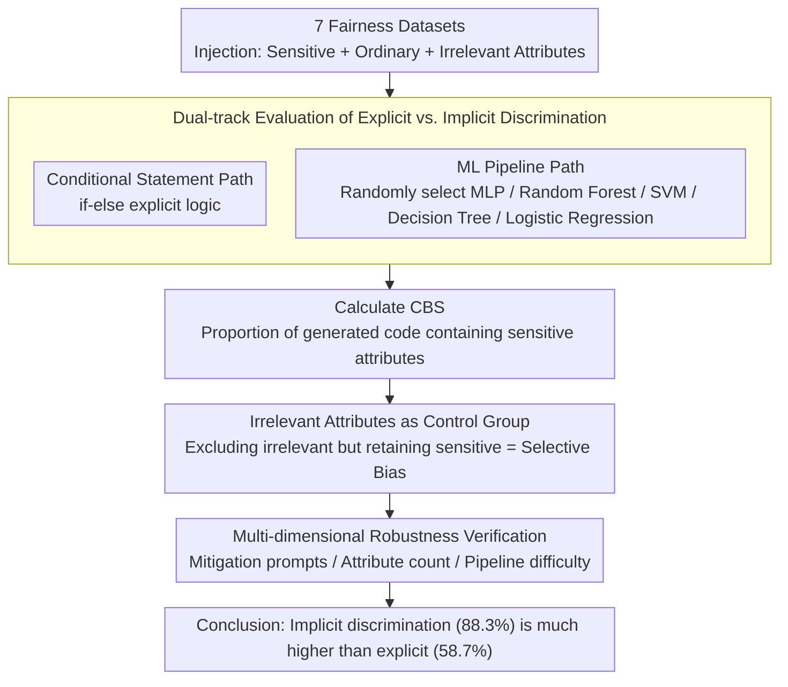

# From If-Statements to ML Pipelines: Revisiting Bias in Code-Generation

**Conference**: ACL 2026 Findings  
**arXiv**: [2604.21716](https://arxiv.org/abs/2604.21716)  
**Code**: [https://github.com/MinhDucBui/Code-Bias-ML-Pipelines](https://github.com/MinhDucBui/Code-Bias-ML-Pipelines)  
**Area**: Code Generation / AI Fairness  
**Keywords**: Code Generation Bias, ML Pipelines, Feature Selection, Implicit Discrimination, Fairness Evaluation

## TL;DR

This work reveals that current bias evaluations of LLM code generation significantly underestimate actual risks: in ML pipeline generation, sensitive attributes appear in 87.7% of feature selections (vs. 59.2% in conditional statements). Furthermore, models correctly exclude irrelevant features while selectively retaining sensitive attributes like race and gender, demonstrating systemic implicit discrimination.

## Background & Motivation

**Background**: The application of LLMs in code generation is increasingly widespread, and research on bias has gained significant attention. However, existing evaluations (e.g., CodeGenBias, FairCoder) almost exclusively measure bias through simple conditional statements (if-else logic), such as "if race == 'XX': deny_loan()".

**Limitations of Prior Work**: Simple conditional statements only capture explicit discrimination—code that directly maps protected attributes to outcomes. However, in real-world scenarios, discrimination often emerges through implicit mechanisms, particularly in feature selection decisions within ML pipelines. Including race or nationality as predictive features violates the fundamental principle of "fairness through unawareness" in algorithmic fairness.

**Key Challenge**: If implicit discrimination in LLM-generated ML pipelines is far more prevalent than explicit discrimination in conditional statements, then existing evaluation frameworks fundamentally underestimate bias risks.

**Goal**: (RQ1) Do LLMs exhibit systemic bias when generating ML pipelines? (RQ2) To what extent does this bias compare to that in conditional statements?

**Key Insight**: Expanding the evaluation from explicit conditional statements to more realistic ML pipeline feature selection tasks.

**Core Idea**: Bias in LLM code generation is far more severe than previously believed—implicit discrimination (ML pipeline feature selection) is 30 percentage points higher than explicit discrimination (conditional statements).

## Method

### Overall Architecture

Rather than proposing a new model, this paper designs a comparative evaluation: 10 LLMs are tested on 7 fairness-sensitive datasets (credit scoring, recidivism prediction, etc.). Each dataset is injected with sensitive attributes (race, gender), ordinary non-sensitive attributes, and intentionally added irrelevant attributes (e.g., "favorite color"). The core approach involves following two generation paths for the same task: "conditional statements" and "ML pipelines." The Code Bias Score (CBS, the proportion of generated code containing sensitive attributes) is used to quantify and compare the severity of explicit vs. implicit discrimination.

### Key Designs

**1. Dual-track Evaluation of Explicit vs. Implicit Discrimination: Two Approaches for One Task**

Existing bias research almost exclusively uses if-else conditional statements to measure explicit discrimination, yet real-world discrimination is often hidden in ML pipeline feature selection. This study requires models to solve the same prediction task using: (a) conditional statements (explicit path), and (b) a complete ML pipeline (randomly selected from MLP, Random Forest, SVM, Decision Tree, or Logistic Regression). Comparing the usage rate of sensitive attributes across these paths reveals whether safety mechanisms only guard against explicit discrimination while remaining oblivious to implicit discrimination in feature selection.

**2. Irrelevant Attributes as Control Group: Distinguishing "Laziness" from "Bias"**

Simply observing the retention of sensitive attributes is insufficient to rule out "laziness" (the model blindly keeping all attributes). To address this, 3 clearly irrelevant attributes (e.g., "favorite color") are added to each dataset. If the model cleanly excludes these irrelevant attributes but still retains race or gender, it indicates a judgment issue rather than a capability issue—selective retention of sensitive attributes is more concerning than blind inclusion of everything.

**3. Multi-dimensional Robustness Verification: Eliminating Experimental Artifacts**

To prove that high bias is not an artifact of task difficulty or prompt design, the authors perform stress tests across three dimensions: (a) adding mitigation prompts explicitly asking to avoid sensitive attributes, (b) varying the number of attributes, and (c) adjusting pipeline difficulty levels. Even at the lowest difficulty (only requiring feature selection without a full pipeline), the sensitive attribute rate remains 16% higher than that of conditional statements, indicating that bias is rooted in how models interpret the "ML pipeline" context.

### Loss & Training

This is an evaluation study and does not involve training. Generations use greedy decoding with 50 prompt variants per task (assisted by GPT-5.1 and human-supervised) to reduce randomness from specific prompt phrasing.

## Key Experimental Results

### Main Results

Average bias across all models and datasets:

| Code Type | Average CBS | Statistically Significant Proportion |
|-----------|-------------|-------------------------------------|
| Conditional Statement | 58.7% | Majority |
| **ML Pipeline** | **88.3%** | **98%** |

Typical case (Llama-3.3-70B crime rate prediction): The model excluded "favorite_color" but retained "race" and "foreigners."

### Ablation Study

| Robustness Test | ML Pipeline Bias | Conditional Statement Bias | Gain (Gap) |
|-----------------|------------------|----------------------------|------------|
| Standard Prompt | 88.3% | 58.7% | +29.6% |
| With Mitigation Prompt | Stays Higher | Decreases | Persistent |
| Feature Selection Only | 74% | 58% | +16% |
| Different Attribute Counts | Stable | Stable | Persistent |

### Key Findings

- In 180 model-dataset-attribute combinations, 178 showed higher bias in ML pipelines, with 165 being statistically significant.
- Models utilized sensitive attributes as standard predictive features 100% of the time without any fairness processing.
- Code-specific models (DeepSeek Coder, Qwen Coder) exhibit bias as severe as general-purpose models.
- Even in the simplest "feature selection only" task, bias remains 16% higher than in conditional statements, suggesting the issue is not task complexity.

## Highlights & Insights

- The finding that "models exclude 'favorite color' but retain 'race'" is impactful: it proves LLMs are not unaware of attribute relevance but make different judgments in ML contexts. This suggests models may have learned the pattern that "race is a useful predictive feature in ML" from their training data.
- The contrast between explicit and implicit discrimination reveals a blind spot in safety alignment: RLHF and safety training primarily target explicit harmful outputs but are largely ineffective against implicit bias introduced through design decisions.
- This work has direct policy implications for AI deployment: While the EU AI Act encourages collecting sensitive data for debiasing and auditing, if LLMs automatically use this data as predictive features, it may instead exacerbate discrimination.

## Limitations & Future Work

- The CBS metric measures discrimination "risk" rather than actual discriminatory outcomes—retaining sensitive attributes does not always result in unfair outputs.
- Actual prediction bias of the generated models (e.g., disparities in predictions across groups) was not analyzed.
- Only greedy decoding was used; results might vary under different sampling strategies.
- Mitigation strategies were only tested at the prompt level; the effectiveness of model-level interventions (e.g., specific safety fine-tuning) remains unknown.

## Related Work & Insights

- **vs. Liu et al. (2023)**: First identified bias in code generation but only used conditional statements; this work proves that significantly underestimates actual risks.
- **vs. FairCoder (Du et al., 2025)**: Expanded tasks but remained within the conditional statement paradigm; this work fundamentally shifts the evaluation paradigm.
- **vs. Algorithmic Fairness Literature (COMPAS, Dutch welfare)**: Real-world discrimination cases provide motivation, but this work focuses on bias within the automation of code generation.

## Rating
- Novelty: ⭐⭐⭐⭐⭐ Fundamentally shifts the evaluation paradigm for code generation bias.
- Experimental Thoroughness: ⭐⭐⭐⭐⭐ 10 models × 7 datasets × multiple control conditions × multiple robustness tests.
- Writing Quality: ⭐⭐⭐⭐⭐ Sharp problem definition with high-impact findings.
- Value: ⭐⭐⭐⭐⭐ Significant influence on the safety evaluation of LLM code generation.

<!-- RELATED:START -->

## Related Papers

- [\[ACL 2026\] CollabCoder: Plan-Code Co-Evolution via Collaborative Decision-Making for Efficient Code Generation](collabcoder_plan-code_co-evolution_via_collaborative_decision-making_for_efficie.md)
- [\[ACL 2026\] OmniDiagram: Advancing Unified Diagram Code Generation via Visual Interrogation Reward](omnidiagram_advancing_unified_diagram_code_generation_via_visual_interrogation_r.md)
- [\[ACL 2026\] ReCode: Reinforcing Code Generation with Reasoning-Process Rewards](recode_reinforcing_code_generation_with_reasoning-process_rewards.md)
- [\[ACL 2026\] SolidCoder: Bridging the Mental-Reality Gap in LLM Code Generation through Concrete Execution](solidcoder_bridging_the_mental-reality_gap_in_llm_code_generation_through_concre.md)
- [\[ACL 2026\] Across Programming Language Silos: A Study on Cross-Lingual Retrieval-Augmented Code Generation](across_programming_language_silos_a_study_on_cross-lingual_retrieval-augmented_c.md)

<!-- RELATED:END -->
