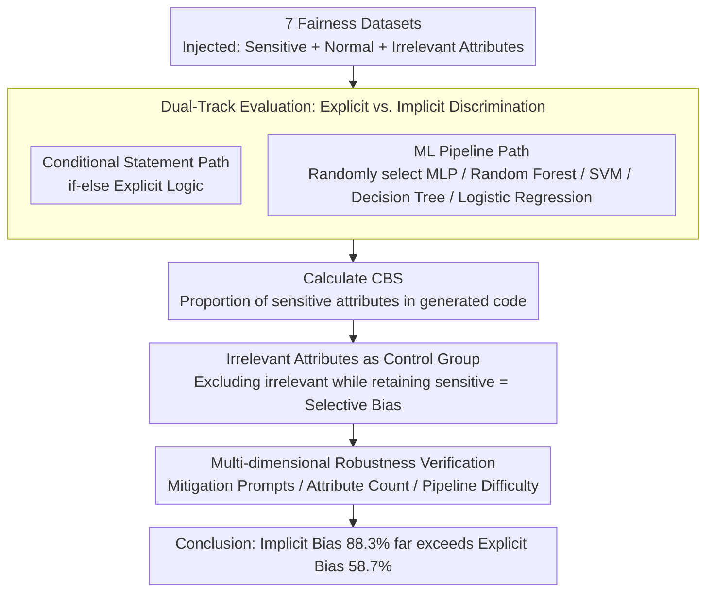

# From If-Statements to ML Pipelines: Revisiting Bias in Code-Generation

**Conference**: ACL 2026 Findings  
**arXiv**: [2604.21716](https://arxiv.org/abs/2604.21716)  
**Code**: [https://github.com/MinhDucBui/Code-Bias-ML-Pipelines](https://github.com/MinhDucBui/Code-Bias-ML-Pipelines)  
**Area**: Code Generation / AI Fairness  
**Keywords**: Code Generation Bias, ML Pipelines, Feature Selection, Implicit Discrimination, Fairness Evaluation

## TL;DR

Research reveals that bias evaluations for LLM code generation significantly underestimate actual risks: in ML pipeline generation, sensitive attributes appear in $87.7\%$ of feature selections (vs. $59.2\%$ in conditional statements). Models correctly exclude irrelevant features but choose to retain sensitive attributes like race and gender, demonstrating systemic implicit discrimination.

## Background & Motivation

**Background**: LLMs are increasingly applied in code generation, bringing attention to bias research. However, existing evaluations (e.g., CodeGenBias, FairCoder) almost entirely measure bias via simple conditional statements (if-else logic), such as `if race == 'XX': deny_loan()`.

**Limitations of Prior Work**: Simple conditional statements only capture explicit discrimination—code that directly maps protected attributes to outcomes. In the real world, discrimination more commonly emerges through implicit mechanisms, particularly feature selection decisions in ML pipelines. Including race or nationality as predictive features violates the fundamental principle of "Fairness through Unawareness" in algorithmic fairness.

**Key Challenge**: If the implicit discrimination in ML pipelines generated by LLMs is far more prevalent than the explicit discrimination in conditional statements, then existing evaluation frameworks fundamentally underestimate bias risks.

**Goal**: (RQ1) Do LLMs exhibit systemic bias when generating ML pipelines? (RQ2) How does the magnitude of these biases compare to conditional statements?

**Key Insight**: Extend the evaluation from explicit conditional statements to more realistic ML pipeline feature selection tasks.

**Core Idea**: Bias in LLM code generation is far more severe than previously assumed—implicit discrimination (ML pipeline feature selection) is $30$ percentage points higher than explicit discrimination (conditional statements).

## Method

### Overall Architecture

Ours does not propose a new model but designs a comparative evaluation: $10$ LLMs generate code for $7$ fairness-sensitive datasets (credit scoring, recidivism prediction, etc.). Each dataset is injected with sensitive attributes (race, gender), common non-sensitive attributes, and deliberately added irrelevant attributes (e.g., "favorite color"). The core mechanism involves following two separate generation paths—"conditional statements" and "ML pipelines"—for the same task. The Code Bias Score (CBS, the proportion of generated code containing sensitive attributes) is used to quantify the degree of discrimination in each path, enabling a comparison between explicit and implicit discrimination.

### Key Designs

**1. Dual-track Evaluation of Explicit vs. Implicit Discrimination: Two Implementations for the Same Task**

Existing bias research almost exclusively uses if-else conditional statements to measure explicit discrimination, yet real-world discrimination is often hidden in ML pipeline feature selection. Consequently, for the same dataset, models are required to: (a) solve the prediction task using conditional statements (explicit path), and (b) implement a complete ML pipeline (randomly selected from MLP / Random Forest / SVM / Decision Tree / Logistic Regression). Comparing the usage rate of sensitive attributes in both paths reveals whether the safety mechanisms of the models only block explicit discrimination while remaining oblivious to implicit discrimination introduced by feature selection.

**2. Irrelevant Attributes as Control Group: Differentiating "Laziness" from "Bias"**

Observing the retention of sensitive attributes is insufficient; one must rule out the possibility that the model is simply "lazily retaining all attributes." To this end, $3$ clearly irrelevant attributes (e.g., "favorite color") are inserted into each dataset to observe whether the model correctly filters them. If a model cleanly excludes irrelevant attributes yet retains race or gender, it indicates a judgment issue rather than a capability issue—selective retention of sensitive attributes is more concerning than blind retention of all features.

**3. Multi-dimensional Robustness Verification: Eliminating Experimental Artifacts**

To prove that high bias is not an artifact of task difficulty or prompt design, the authors conducted stress tests across three dimensions: (a) adding mitigation prompts explicitly requesting the avoidance of sensitive attributes, (b) varying the number of attributes, and (c) adjusting the difficulty level of the pipeline. Even at the lowest difficulty (only requiring feature selection without writing the full pipeline), the occurrence rate of sensitive attributes remained $16\%$ higher than in conditional statements, indicating that bias is rooted in the model's distinct understanding of the "ML pipeline" context rather than difficulty or prompt phrasing.

### Loss & Training

As this is an evaluation study, no training is involved. Generation uses greedy decoding with $50$ prompt variants per task (assisted by GPT-5.1 and verified by humans) to minimize bias introduced by specific prompt phrasing.

## Key Experimental Results

### Main Results

Average bias across all models and datasets:

| Code Type | Average CBS | Statistically Significant Share |
|---------|---------|------------|
| Conditional Statement | $58.7\%$ | Majority |
| **ML Pipeline** | **$88.3\%$** | **$98\%$** |

Typical case (Llama-3.3-70B crime rate prediction): excluded "favorite_color" and other irrelevant attributes but retained "race" and "foreigners".

### Ablation Study

| Robustness Test | ML Pipeline Bias | Conditional Bias | Gap |
|-----------|------------|------------|------|
| Standard Prompt | $88.3\%$ | $58.7\%$ | $+29.6\%$ |
| Mitigation Prompt Added | Remains higher | Decreased | Persists |
| Feature Selection Only | $74\%$ | $58\%$ | $+16\%$ |
| Varying Attribute Counts | Stable | Stable | Persists |

### Key Findings

- In $180$ model-dataset-attribute combinations, $178$ showed higher bias in ML pipelines, with $165$ reaching statistical significance.
- Models utilized sensitive attributes as standard predictive features $100\%$ of the time without any fairness processing.
- Code-specific models (DeepSeek Coder, Qwen Coder) exhibit bias as severe as general-purpose models.
- Even in the simplest "feature selection only" tasks, bias remains $16\%$ higher than in conditional statements—indicating the issue is not task complexity.

## Highlights & Insights

- The finding that "models exclude 'favorite color' but retain 'race'" is highly impactful: it proves LLMs are not unaware of which attributes should be avoided, but rather make different judgments in ML contexts. This suggests models may have learned the pattern that "race is a useful predictive feature in ML," which is prevalent in training data.
- The contrast between explicit and implicit discrimination reveals a blind spot in safety alignment: RLHF and safety training primarily target explicit harmful outputs but are largely ineffective against implicit bias introduced through design decisions.
- This work has direct policy implications for AI deployment: The EU AI Act encourages collecting sensitive data for debiasing and auditing, but if LLMs automatically use this data as predictive features, it may exacerbate discrimination.

## Limitations & Future Work

- The CBS metric measures discrimination "risk" rather than actual discriminatory outcomes—retaining sensitive attributes does not automatically result in unfair outputs.
- Lack of analysis regarding the actual prediction bias of the generated models (e.g., disparities in predictions across different groups).
- Only greedy decoding was utilized; results might vary under different sampling strategies.
- Mitigation strategies were only tested at the prompt level; the effectiveness of model-level interventions (e.g., specific safety fine-tuning) remains unknown.

## Related Work & Insights

- **vs. Liu et al. (2023)**: First to identify bias in code generation but only using conditional statements; Ours proves this significantly underestimates actual risk.
- **vs. FairCoder (Du et al., 2025)**: Extended to more tasks but still based on the conditional statement paradigm; Ours fundamentally shifts the evaluation paradigm.
- **vs. Algorithmic Fairness Literature (COMPAS, Dutch welfare)**: Real-world discriminatory cases provided motivation for this study, which focuses on bias in automated code generation.

## Rating
- Novelty: ⭐⭐⭐⭐⭐ Fundamentally shifts the evaluation paradigm for code generation bias.
- Experimental Thoroughness: ⭐⭐⭐⭐⭐ 10 models × 7 datasets × multiple control conditions × multiple robustness tests.
- Writing Quality: ⭐⭐⭐⭐⭐ Sharp problem definition with highly impactful findings.
- Value: ⭐⭐⭐⭐⭐ Profound impact on the safety evaluation of LLM code generation.

<!-- RELATED:START -->

## Related Papers

- [\[ICML 2026\] SWE-IF: Aligning Code Evaluation with Human Preference](../../ICML2026/code_intelligence/swe-if_aligning_code_evaluation_with_human_preference.md)
- [\[ICLR 2026\] The Matthew Effect of AI Programming Assistants: A Hidden Bias in Software Evolution](../../ICLR2026/code_intelligence/the_matthew_effect_of_ai_programming_assistants_a_hidden_bias_in_software_evolut.md)
- [\[ACL 2026\] CollabCoder: Plan-Code Co-Evolution via Collaborative Decision-Making for Efficient Code Generation](collabcoder_plan-code_co-evolution_via_collaborative_decision-making_for_efficie.md)
- [\[ACL 2026\] OmniDiagram: Advancing Unified Diagram Code Generation via Visual Interrogation Reward](omnidiagram_advancing_unified_diagram_code_generation_via_visual_interrogation_r.md)
- [\[ACL 2026\] SolidCoder: Bridging the Mental-Reality Gap in LLM Code Generation through Concrete Execution](solidcoder_bridging_the_mental-reality_gap_in_llm_code_generation_through_concre.md)

<!-- RELATED:END -->
