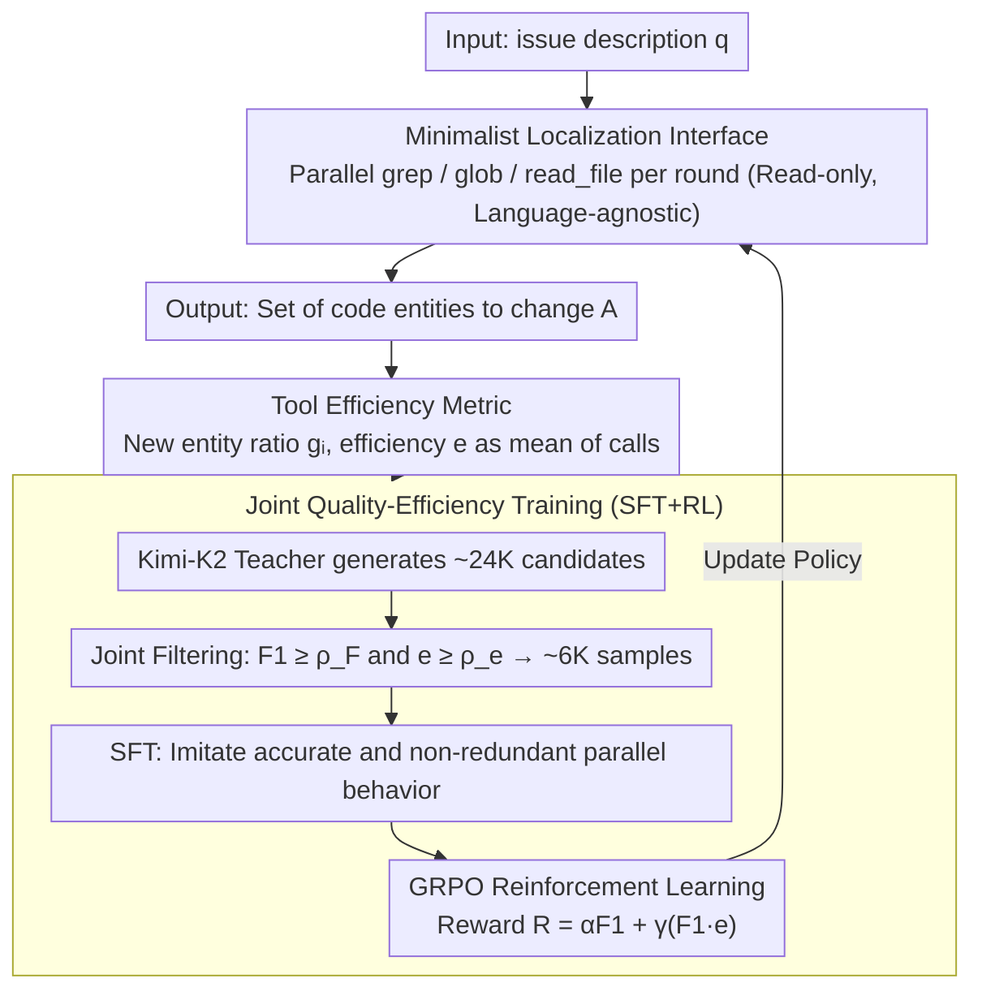

# Learning Adaptive Parallel Execution for Efficient Code Localization

**Conference**: ACL2026 Findings  
**arXiv**: [2601.19568](https://arxiv.org/abs/2601.19568)  
**Code**: No public code link found in cache  
**Area**: Code Intelligence / LLM Agent  
**Keywords**: Code Localization, Parallel Tool Use, GRPO, Tool Efficiency, SWE-bench Verified  

## TL;DR
FuseSearch models parallel tool calling in code localization as a joint quality-efficiency optimization problem. Through SFT+RL, it learns to adaptively adjust search width based on task stages, achieving high F1 scores on SWE-bench Verified with compact models while significantly reducing time and token costs.

## Background & Motivation
**Background**: Automated software development agents typically locate the files, functions, or code snippets requiring modification before generating patches. Code localization has become a major bottleneck in the pipeline; recent results cited in the paper show that SOTA agents spend over 50% of computational resources on localization.

**Limitations of Prior Work**: Traditional agents often call tools sequentially, which easily leads to information starvation under tight turn budgets. Conversely, forcing a fixed number of parallel tool calls in each round generates a large amount of redundant or useless retrieval. The authors observe that 34.9% of enforced parallel tool calls are redundant, offsetting the benefits of parallelism.

**Key Challenge**: Code localization requires covering sufficient context as quickly as possible within limited interaction rounds. However, larger coverage increases the likelihood of redundant searches or irrelevant noise. Pursuing low cost alone leads to missing critical files, while pursuing high recall causes search costs and context noise to explode.

**Goal**: The authors aim to train a localization agent capable of deciding "when to parallelize, how much to parallelize, and where to search," simultaneously maximizing localization F1 and the information gain of each tool call.

**Key Insight**: Instead of constructing complex code graphs or language-specific ASTs, the paper retains only three language-agnostic read-only tools (`grep`, `glob`, `read_file`) and uses whether a tool call brings new code entities as an explicit efficiency signal.

**Core Idea**: Tool efficiency is used to measure the proportion of new information in tool calls, which is integrated with file/function F1 into SFT filtering and GRPO rewards. This allows the model to learn an adaptive parallel strategy that evolves from broad exploration to focused refinement.

## Method
The design of FuseSearch is minimalist: only three tools are used during inference, while trajectory quality and efficiency metrics are introduced only during training. A strong teacher is first used to generate candidate search trajectories, followed by filtering trajectories that are both accurate and efficient for SFT. Finally, GRPO is used to further optimize a reward that multiplies F1 and efficiency.

### Overall Architecture
The input is an issue description $q$. The agent generates a set of tool calls $a_t$ across $T$ discrete turns, observes the returned results $o_t$, and finally outputs the set of code entities to be modified $\mathcal{A}$. Unlike sequential agents that call one tool at a time, FuseSearch can issue multiple `grep`/`glob`/`read_file` calls in parallel per round. These read-only tools have no synchronous side effects, and their results are aggregated into the context before the next round.

The training process consists of two stages. In the SFT stage, Kimi-K2-Instruct is used to generate approximately 24K candidate trajectories for 6K training queries, and about 6K high-quality trajectories are filtered based on both file/function F1 and tool efficiency metrics. In the RL stage, the SFT model serves as the initial policy, and GRPO is used to sample multiple trajectories. Rewards are calculated based on localization quality and tool efficiency, encouraging the model to reduce redundant exploration without sacrificing final accuracy.

### Key Designs

**1. Minimalist Localization Interface: Read-only tools for cross-language support and parallelism**

Graph-navigation agents usually require constructing code graphs, parsing ASTs, or starting language servers—tasks that are language-dependent and have high preprocessing costs. FuseSearch simply retains `grep` (regex content search), `glob` (file path matching), and `read_file` (reading specific files or line ranges), all of which are language-agnostic with zero indexing overhead. Crucially, these three are read-only and lack side effects, making it safe to issue multiple calls in parallel within the same round. This minimalist interface also shifts the modeling pressure from "understanding code structure" to "learning how to search."

**2. Tool Efficiency Metric: Internalizing the penalty for redundant information**

The cost of parallelism is redundancy. With fixed parallel execution, the authors observed that 34.9% of calls repeat searches in areas already seen. Simply penalizing trajectory length fails to distinguish between "searching new areas" and "re-searching old ones." FuseSearch maintains a history of discovered entities $\mathcal{H}$. For the entity set $\mathcal{E}_i$ returned by the $i$-th tool, the information gain is defined as $g_i=|\mathcal{E}_i\setminus\mathcal{H}|/|\mathcal{E}_i|$. The efficiency of the entire trajectory is the mean of all calls: $e=\frac{1}{k}\sum_i g_i$. This way, redundant retrieval is directly penalized while exploration is encouraged.

**3. SFT+RL Joint Quality-Efficiency Training: Learning phase-adaptive width**

Efficiency metrics alone are insufficient; the model must treat both F1 and efficiency as objectives. FuseSearch uses a two-stage approach: the SFT stage filters trajectories meeting $F_1\geq\rho_F$ and $e\geq\rho_e$, allowing the model to imitate "accurate yet non-redundant" parallel behavior. The RL stage uses GRPO with a reward designed as $R(\tau)=\alpha F_1(\tau)+\gamma\big(F_1(\tau)\cdot e(\tau)\big)$, where $F_1$ is the weighted sum of file-level and function-level F1.

The multiplicative term $F_1\cdot e$ is critical: if localization fails ($F_1=0$), the reward is zero regardless of efficiency, preventing the model from learning to be "efficient by not searching." Efficiency acts as a bonus only when localization is successful. This pushed the model toward an adaptive rhythm of "broad exploration in early stages, focused refinement in late stages."

### Loss & Training
Training data is derived from 233 high-quality GitHub repositories. Samples where patches add new files/functions or where issue descriptions are too short are removed. From approximately 21K filtered samples, ground truth files, functions/methods, and line ranges are extracted. The SFT model is required to generate 2-8 tool calls per round. RL employs GRPO with multiple output sampling. The authors compared F1-only, $F_1+e$, and $F_1+F_1\cdot e$ rewards, ultimately choosing the multiplicative interaction term.

## Key Experimental Results

### Main Results
Evaluation is conducted on SWE-bench Verified, excluding samples where patches introduce brand-new files or functions (retaining 386/500 examples). Results indicate that the trained FuseSearch-4B improves both localization quality and efficiency.

| Method / Config | File F1 | Func F1 | Efficiency / Cost Results | Note |
|---|---|---|---|---|
| RepoSearcher (Qwen3-4B backbone) | 38.1 | 21.7 | Comparison baseline | Specialized localization agent |
| FuseSearch-4B (Ours) | 84.7 | 56.4 | 93.6% Speedup, 67.7% fewer turns, 68.9% fewer tokens | Core result |
| Qwen3-4B Base | 64.50 | 38.91 | e=59.50, T=6.12s, Tok=47.9k | Before two-stage training |
| Qwen3-4B SFT+RL | 84.65 | 56.43 | e=69.00, T=5.43s, Tok=30.9k | After two-stage training |
| Qwen3-30B-A3B SFT+RL | 83.01 | 58.62 | e=64.53, T=10.6s, Tok=43.2k | Large models also benefit |

### Ablation Study

| Config | File F1 | Func F1 | #Turn | T(s) | Tok.(k) | Note |
|---|---|---|---|---|---|---|
| Seq SFT+RL | 78.82 | 50.21 | 7.52 | 8.03 | 59.4 | 1 tool per round |
| Par SFT+RL | 84.65 | 56.45 | 5.60 | 5.43 | 30.9 | Parallel significantly better |
| SFT only | 78.86 | 47.94 | 4.96 | 9.17 | 54.8 | Learns parallel but redundant |
| RL reward: F1 only | 81.84 | 54.90 | N/A | 7.28 | 39.4 | Improved quality, sub-optimal efficiency |
| RL reward: $F_1+e$ | 79.22 | 51.98 | N/A | 9.40 | 45.7 | High efficiency, lower quality |
| RL reward: $F_1+F_1\cdot e$ | 84.65 | 56.45 | N/A | 5.43 | 30.9 | Optimal quality, efficiency, and cost |

### Key Findings
- SFT teaches the model to parallelize aggressively, improving F1 but introducing redundancy. After RL, the model learns a "wide-then-narrow" strategy: broad exploration early on, focused refinement later.
- Joint filtering is more stable than filtering by F1 or efficiency alone. SFT without filtering yields File F1/Func F1/e of 75.44/43.52/55.77, while joint filtering improves this to 78.86/47.94/62.03.
- FuseSearch accelerates downstream repair agents. Kimi-K2 without localization achieves a 68.4 pass rate with 41.1 turns; with Pre-Search, it achieves 68.1 pass rate with only 31.6 turns and nearly half the tokens (562k vs 1053k).
- The minimalist toolset is competitive even in sequential mode, suggesting that code localization does not strictly require language-specific graph structures; the real gain comes from effective parallelism.

## Highlights & Insights
- **Tool Efficiency** is the most reusable concept in this paper. It doesn't bluntly punish "too many tool calls" but rather "calls without new information," which aligns better with actual search quality.
- The **Multiplicative Reward** design is highly rational: efficiency is meaningless if localization fails. This prevents the agent from being "lazy for the sake of efficiency."
- The paper transforms parallel tool execution from an engineering capability into a **learning objective**. While most frameworks support parallel calls, models don't naturally know when to use them; FuseSearch explicitly trains this decision.
- The results are inspiring for **small model agents**: a 4B model, through task-specific training and efficiency rewards, can approach or even replace expensive large models in the localization stage.

## Limitations & Future Work
- The authors note that the golden patch represents only one viable repair path, potentially missing other correct localizations; thus, the F1 ground truth itself is biased.
- SWE-bench Verified primarily covers Python repositories. While the tools are language-agnostic, effectiveness on static languages like Java/C++ requires more training and evaluation.
- The current benchmark focuses on issue-driven localization and does not evaluate broader code search tasks like repository QA or document generation.
- Tool efficiency relies on a definition of "new code entities." Future work could incorporate semantic novelty, invocation costs, and file importance into efficiency metrics.

## Related Work & Insights
- **vs Agentless**: Agentless uses a fixed hierarchical process from file to function to line. It is stable but lacks task adaptation; FuseSearch uses a learned policy to decide search width.
- **vs LocAgent / CoSIL**: Graph navigation agents utilize structural relationships but require language-dependent graph construction. FuseSearch lowers the deployment barrier.
- **vs RepoSearcher**: RepoSearcher is also a lightweight localization agent but largely sequential. FuseSearch's core improvement comes from parallel tool calls and efficiency rewards.
- **Inspiration**: General coding agents could use "information gain per tool call" as online feedback to train or distill retrieval strategies with less redundancy and lower token costs.

## Rating
- Novelty: ⭐⭐⭐⭐☆ Tool efficiency metrics and multiplicative rewards are practical and clear.
- Experimental Thoroughness: ⭐⭐⭐⭐☆ Covers SWE-bench Verified, training stages, parallel modes, and downstream repair; cross-language evaluation remains slightly limited.
- Writing Quality: ⭐⭐⭐⭐☆ Clear methodology and ablation logic.
- Value: ⭐⭐⭐⭐⭐ High practical value for cost reduction and speedup in code agents.

<!-- RELATED:START -->

## Related Papers

- [\[ACL 2026\] To Diff or Not to Diff? Structure-Aware and Adaptive Output Formats for Efficient LLM-based Code Editing](to_diff_or_not_to_diff_structure-aware_and_adaptive_output_formats_for_efficient.md)
- [\[ICLR 2026\] Improving Code Localization with Repository Memory](../../ICLR2026/code_intelligence/improving_code_localization_with_repository_memory.md)
- [\[ACL 2026\] CodeRL+: Improving Code Generation via Reinforcement with Execution Semantics Alignment](coderl_improving_code_generation_via_reinforcement_with_execution_semantics_alig.md)
- [\[ACL 2026\] PaT: Planning-after-Trial for Efficient Test-Time Code Generation](pat_planning-after-trial_for_efficient_test-time_code_generation.md)
- [\[ACL 2026\] PExA: Parallel Exploration Agent for Complex Text-to-SQL](pexa_parallel_exploration_agent_for_complex_text-to-sql.md)

<!-- RELATED:END -->
