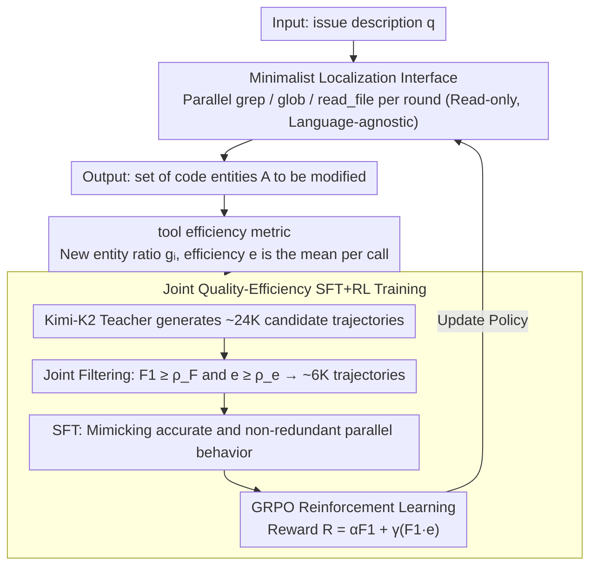

# Learning Adaptive Parallel Execution for Efficient Code Localization

**Conference**: ACL2026 Findings  
**arXiv**: [2601.19568](https://arxiv.org/abs/2601.19568)  
**Code**: No public code link found in cache  
**Area**: Code Intelligence / LLM Agent  
**Keywords**: Code Localization, Parallel Tool Calling, GRPO, Tool Efficiency, SWE-bench Verified  

## TL;DR
FuseSearch models parallel tool calling in code localization as a joint quality-efficiency optimization problem. By using SFT+RL, the model learns to adaptively adjust search width according to task stages, achieving high F1 scores and significantly lower time/token costs on SWE-bench Verified using a compact model.

## Background & Motivation
**Background**: Automated software development agents typically locate files, functions, or code snippets needing modification before proceeding to patch generation. Code localization has become the primary bottleneck of the entire pipeline; recent results cited in the paper show that SOTA agents spend over 50% of computational resources on localization.

**Limitations of Prior Work**: Traditional agents often call tools sequentially, making them prone to information starvation under tight turn budgets. Conversely, if a fixed number of tools is called in parallel each round, it generates a large amount of redundant or useless retrieval. The paper observes that 34.9% of enforced parallel tool calls are redundant, offsetting the benefits of parallelism.

**Key Challenge**: Code localization requires covering sufficient context as quickly as possible within limited interaction rounds. However, larger coverage increases the risk of redundant searches or irrelevant noise. Pursuing low cost alone leads to missing critical files, while pursuing high recall causes search costs and context noise to explode.

**Goal**: The authors aim to train a localization agent that can autonomously decide "when to parallelize, how much to parallelize, and where to search," simultaneously maximizing localization F1 and the information gain per tool call.

**Key Insight**: Instead of constructing complex code graphs or language-specific ASTs, the paper retains only three language-agnostic read-only tools (grep, glob, read_file) and uses whether a tool call brings new code entities as an explicit efficiency signal.

**Core Idea**: Tool efficiency measures the proportion of new information in tool calls and is incorporated into SFT filtering and GRPO rewards alongside file/function F1. This enables the model to learn an adaptive parallel strategy, transitioning from broad exploration to focused refinement.

## Method
The design of FuseSearch is minimalist: only three tools are used during inference, while trajectory quality and efficiency metrics are introduced only during training. It first uses a strong teacher to generate candidate search trajectories, filters for trajectories that are both accurate and efficient for SFT, and finally utilizes GRPO to optimize a reward combining F1 and efficiency.

### Overall Architecture
The input is an issue description $q$. The agent generates a set of tool calls $a_t$ across $T$ discrete rounds, observes results $o_t$, and finally outputs a set of code entities $\mathcal{A}$ to be modified. Unlike sequential agents that call one tool at a time, FuseSearch can issue multiple grep/glob/read_file calls in parallel per round. These read-only tools have no synchronous side effects, and results are aggregated into the context before the next round.

The training process consists of two stages. In the SFT stage, Kimi-K2-Instruct generates approximately 24K candidate trajectories for 6K training queries, from which ~6K high-quality trajectories are selected based on file/function F1 and tool efficiency. In the RL stage, using the SFT model as the initial policy, GRPO is used to sample multiple trajectories. Rewards are calculated based on localization quality and tool efficiency, encouraging the model to reduce redundant exploration without sacrificing final accuracy.

### Key Designs

**1. Minimalist Localization Interface: Trading for Cross-language Parallelism with Read-only Tools**

Graph navigation agents often require building code graphs, parsing ASTs, or starting language servers—heavy, language-dependent tasks with high preprocessing costs that must be repeated for Java or C++. FuseSearch simplifies this by keeping only grep (regex content search), glob (file path matching), and read_file (reading specific files or line ranges), which are language-agnostic with zero indexing overhead. Crucially, these are read-only and lack side effects, making it safe to issue multiple parallel calls in one round. This clears the path for "multi-search per round" strategies and shifts modeling pressure from "understanding code structure" to "learning how to search."

**2. tool efficiency Metric: Penalizing Redundancy, Not the Calls Themselves**

The cost of parallelism is redundancy—fixed parallel calls result in 34.9% of calls searching areas already covered. Simply penalizing trajectory length fails to distinguish between "searching new areas" and "re-searching old areas." FuseSearch maintains a history of discovered entities $\mathcal{H}$. For the entity set $\mathcal{E}_i$ returned by the $i$-th tool, information gain is defined as $g_i=|\mathcal{E}_i\setminus\mathcal{H}|/|\mathcal{E}_i|$, representing the proportion of new entities. The total trajectory efficiency $e$ is the mean of all calls: $e=\frac{1}{k}\sum_i g_i$. Thus, redundant retrieval is directly penalized with low scores, while exploring new areas is recognized, aligning the efficiency signal with "search quality" rather than "search quantity."

**3. Joint Quality-Efficiency SFT+RL: Learning Adaptive Width by Phase**

Efficiency metrics alone are insufficient; the model must treat F1 and efficiency as joint objectives. FuseSearch uses two stages: the SFT stage retains only trajectories satisfying $F_1\geq\rho_F$ and $e\geq\rho_e$, teaching the model to mimic accurate, non-redundant parallel behavior. The RL stage uses GRPO with a reward designed as $R(\tau)=\alpha F_1(\tau)+\gamma\big(F_1(\tau)\cdot e(\tau)\big)$, where $F_1$ is the weighted sum of file-level and function-level F1.

The multiplicative term $F_1\cdot e$ is key: if localization fails ($F_1=0$), the reward is zero regardless of efficiency, preventing the model from learning "high efficiency through searching less." Efficiency acts as a bonus only when localization is successful. Comparing F1-only, $F_1+e$, and $F_1+F_1\cdot e$, the multiplicative term achieves the best balance of quality, efficiency, and cost, pushing the model toward an "early broad exploration, late focused refinement" adaptive rhythm.

### Loss & Training
Training data comes from 233 high-quality GitHub repositories, excluding samples with new file/function additions, short issue descriptions, or no code changes. Ground truth files, functions/methods, and line ranges are extracted from ~21K filtered samples. The SFT model generates 2-8 tool calls per round. RL employs GRPO with multi-output sampling; the reward is calculated based on file/function F1 and efficiency.

## Key Experimental Results

### Main Results
Evaluation uses SWE-bench Verified, excluding samples where patches introduce new files or functions (386/500 examples). Results show that the trained FuseSearch-4B improves both localization quality and efficiency.

| Method / Config | File F1 | Func F1 | Efficiency / Cost Result | Description |
|-----------------|---------|---------|--------------------------|-------------|
| RepoSearcher, Qwen3-4B backbone | 38.1 | 21.7 | Baseline for comparison | Specialized localization agent |
| FuseSearch-4B trained | 84.7 | 56.4 | 93.6% Speed-up, 67.7% fewer turns, 68.9% fewer tokens | Core result reported in abstract |
| Qwen3-4B Base | 64.50 | 38.91 | e=59.50, T=6.12s, Tok=47.9k | No two-stage training |
| Qwen3-4B SFT+RL | 84.65 | 56.43 | e=69.00, T=5.43s, Tok=30.9k | After two-stage training |
| Qwen3-30B-A3B SFT+RL | 83.01 | 58.62 | e=64.53, T=10.6s, Tok=43.2k | Large models also benefit |

### Ablation Study

| Config | File F1 | Func F1 | #Turn | T(s) | Tok.(k) | Description |
|--------|---------|---------|-------|------|---------|-------------|
| Seq SFT+RL | 78.82 | 50.21 | 7.52 | 8.03 | 59.4 | 1 tool per round |
| Par SFT+RL | 84.65 | 56.45 | 5.60 | 5.43 | 30.9 | Parallel execution is superior |
| SFT only | 78.86 | 47.94 | 4.96 | 9.17 | 54.8 | Learns parallel but stays redundant |
| RL reward: F1 only | 81.84 | 54.90 | N/A | 7.28 | 39.4 | Increases quality, not best efficiency |
| RL reward: $F_1+e$ | 79.22 | 51.98 | N/A | 9.40 | 45.7 | High efficiency, low quality |
| RL reward: $F_1+F_1\cdot e$ | 84.65 | 56.45 | N/A | 5.43 | 30.9 | Optimal quality, efficiency, and cost |

### Key Findings
- SFT encourages more aggressive parallelism and higher F1 but introduces redundancy; RL enables a "broad-then-narrow" strategy—broad exploration early on, followed by precise refinement.
- Joint filtering is more stable than filtering by F1 or efficiency alone. Without filtering, SFT yields 75.44/43.52/55.77 (File F1/Func F1/e); joint filtering improves this to 78.86/47.94/62.03.
- FuseSearch accelerates downstream repair agents. Kimi-K2 without localization: 68.4 pass rate, 41.1 turns, 312s, 1053k tokens; with Pre-Search: 68.1 pass rate, 31.6 turns, 223s, 562k tokens.
- Minimalist toolsets remain competitive in sequential mode, suggesting localization does not strictly depend on language-specific graphs; however, the primary gain stems from learned effective parallelism.

## Highlights & Insights
- The tool efficiency metric is the most reusable concept in this paper. It does not blindly penalize "too many calls" but rather "calls with no new information," which is closer to actual agent search quality.
- The multiplicative reward design is logical: efficiency is meaningless if localization fails, but acts as a bonus if successful. This prevents the agent from learning "efficiency through avoidance."
- This work turns parallel tool calling from an engineering feature into a learning objective. While many frameworks support parallel calls, models do not naturally know when to use them; FuseSearch explicitly trains this decision.
- Results are inspiring for small-model agents: a 4B model, through task-specific training and efficiency rewards, can approach or even replace expensive large models in the localization phase.

## Limitations & Future Work
- The authors note that the golden patch represents only one viable repair path, potentially missing other correct localizations; thus, F1 ground truth is inherently biased.
- SWE-bench Verified primarily covers Python; while tools are language-agnostic, effectiveness on static languages like Java/C++ requires more training/evaluation data.
- Current benchmarks focus on issue-driven localization, omitting broader code search tasks like repository QA, code understanding, or documentation generation.
- Tool efficiency currently relies on whether code entities are "new." Future work could incorporate semantic novelty, invocation cost, and file importance into efficiency measures.

## Related Work & Insights
- **vs Agentless**: Agentless uses a fixed hierarchical flow from files to functions to lines—stable but lacks task adaptation. FuseSearch utilizes a learned policy to determine search width.
- **vs LocAgent / CoSIL**: Graph navigation agents utilize structural relationships but require language-dependent graph construction. FuseSearch lowers the deployment barrier via grep/glob/read_file.
- **vs RepoSearcher**: RepoSearcher is also a lightweight localization agent but mostly sequential. FuseSearch's core improvement comes from parallel tool calling and efficiency rewards.
- **Insights for Future Work**: General coding agents could use "information gain per tool call" as online feedback to train or distill retrieval strategies with less redundancy and lower token costs.

## Rating
- Novelty: ⭐⭐⭐⭐☆ Tool efficiency metrics and multiplicative quality-efficiency rewards are practical with a clear direction.
- Experimental Thoroughness: ⭐⭐⭐⭐☆ Covers SWE-bench Verified, training phases, parallel modes, filtering strategies, rewards, and downstream repair; cross-language repository coverage is limited.
- Writing Quality: ⭐⭐⭐⭐☆ Methodology definitions and ablation logic are clear; some tables are dense.
- Value: ⭐⭐⭐⭐⭐ High practical value for reducing costs and increasing speed for code agents, particularly as a preprocessing step for repair.

<!-- RELATED:START -->

## Related Papers

- [\[ACL 2026\] To Diff or Not to Diff? Structure-Aware and Adaptive Output Formats for Efficient LLM-based Code Editing](to_diff_or_not_to_diff_structure-aware_and_adaptive_output_formats_for_efficient.md)
- [\[ICLR 2026\] Improving Code Localization with Repository Memory](../../ICLR2026/code_intelligence/improving_code_localization_with_repository_memory.md)
- [\[ACL 2026\] CodeRL+: Improving Code Generation via Reinforcement with Execution Semantics Alignment](coderl_improving_code_generation_via_reinforcement_with_execution_semantics_alig.md)
- [\[ACL 2026\] PaT: Planning-after-Trial for Efficient Test-Time Code Generation](pat_planning-after-trial_for_efficient_test-time_code_generation.md)
- [\[ACL 2026\] CollabCoder: Plan-Code Co-Evolution via Collaborative Decision-Making for Efficient Code Generation](collabcoder_plan-code_co-evolution_via_collaborative_decision-making_for_efficie.md)

<!-- RELATED:END -->
