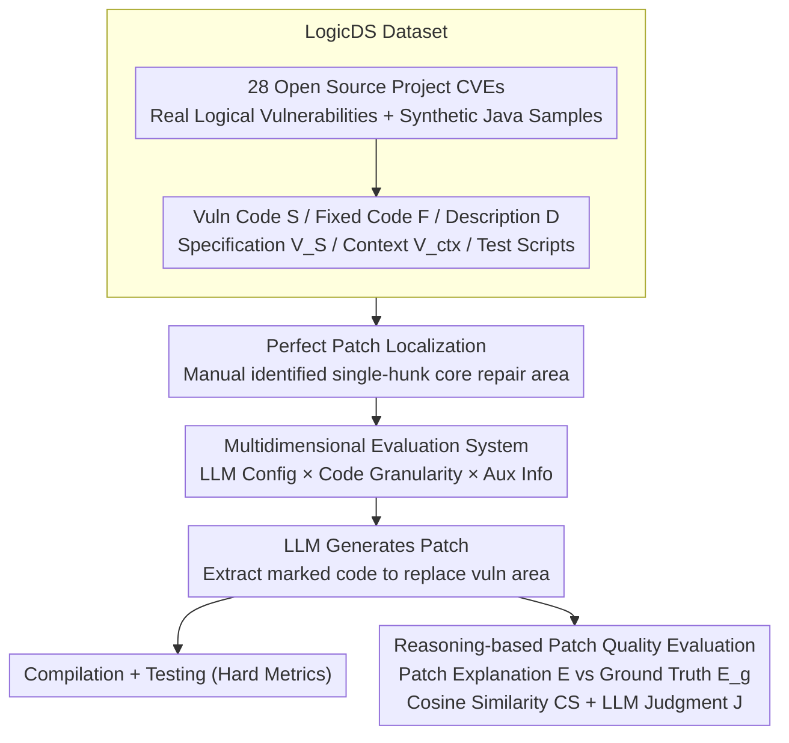

# LogicEval: A Systematic Framework for Evaluating Automated Repair Techniques for Logical Vulnerabilities in Real-World Software

**Conference**: ACL 2026  
**arXiv**: [2604.12994](https://arxiv.org/abs/2604.12994)  
**Code**: [GitHub](https://github.com/LogicEval)  
**Area**: Code Intelligence / Vulnerability Repair Evaluation  
**Keywords**: Logical Vulnerabilities, Automated Repair Evaluation, LLM Code Repair, Patch Generation, Benchmark Dataset

## TL;DR

This paper constructs LogicEval, the first evaluation framework for logical vulnerability repair, and LogicDS (61 real-world logical vulnerabilities + 61 synthetic Java samples). It systematically evaluates the capabilities of traditional AVR tools and LLMs in repairing logical vulnerabilities, finding that LLMs perform best when provided with auxiliary information, yet the overall repair rate remains very low (only 5 out of 61 real samples were correctly repaired), and identifies key bottlenecks such as prompt sensitivity, context loss, and patch localization difficulties.

## Background & Motivation

**Background**: Logical vulnerabilities stem from the incorrect implementation of program logic or functionality rather than memory safety violations. They can be exploited for authentication bypass, sensitive data leakage, or system operation disruption without triggering traditional security defenses (such as Address Sanitizers). Existing automated vulnerability repair (AVR) techniques primarily target memory corruption vulnerabilities.

**Limitations of Prior Work**: (1) Logical vulnerabilities lack consistent, reusable repair templates or patterns; repairing each vulnerability requires a deep understanding of program semantics and expected behavior. (2) Logical vulnerabilities do not necessarily lead to crashes or illegal memory access; traditional signals (compilation logs, runtime logs, memory sanitizers) provide limited help for localization. (3) Existing datasets primarily focus on memory safety bugs and lack logical vulnerability samples with actual security impact.

**Key Challenge**: LLMs have demonstrated strong capabilities in code understanding and generation, but there is no systematic framework to analyze their capabilities and limitations in repairing logical vulnerabilities—this hinders the expansion of AVR from memory safety to more subtle logical vulnerability domains.

**Goal**: Construct the first systematic evaluation framework to analyze the capabilities, limitations, and failure modes of traditional and LLM-based methods in repairing real-world logical vulnerabilities.

**Key Insight**: The particularity of logical vulnerability repair lies in its high dependence on context (vulnerability descriptions, behavioral specifications, repair steps). Therefore, the impact of different dimensions is evaluated by systematically varying auxiliary information.

**Core Idea**: Construct the LogicDS dataset + LogicEval evaluation framework. Systematically evaluate from three dimensions: LLM configuration, source code granularity, and auxiliary information. Introduce reasoning-based automated evaluation metrics (Cosine Similarity + LLM Judgment) to supplement traditional compilation and testing evaluations.

## Method

### Overall Architecture

LogicEval is an end-to-end logical vulnerability repair evaluation pipeline designed to decouple the effects of factors such as "auxiliary information, source code granularity, and LLM configuration" on repair performance. The input consists of the vulnerable source code $S$, the fixed code $F$, the vulnerability description $D$, and optional behavioral specifications $V_S$, context $V_{ctx}$, and compilation/test scripts. The pipeline first assumes perfect patch localization (manually identified single-hunk core repair regions), then uses prompts combined from different dimensions to drive the LLM to generate patches, extracts the marked code to replace the vulnerable region, and evaluates along two paths—running hard metrics like compilation and testing, and performing reasoning-based semantic evaluation to compare whether the patch explanation aligns with the ground truth repair explanation. This design allows "patch logic correctness" and "patch compilability/test-pass" to be measured separately, exposing failure modes unique to logical vulnerability repair.

### Key Designs

**1. LogicDS Dataset: Filling the gap for "security-impacting logical defects"**

Unlike memory corruption vulnerabilities, logical vulnerabilities do not necessarily crash but can cause authentication bypass or data leakage. Existing datasets like Defects4J and Vul4J almost exclusively focus on memory safety bugs, lacking logical samples with real security impact. LogicDS filters 61 real-world logical vulnerabilities from CVEs of 28 popular open-source projects. each sample is equipped with vulnerable/fixed code, CVE descriptions, manually located core repair regions, compilation scripts, and test cases. To ensure compatibility with traditional Java-only repair tools, an additional 61 synthetic Java samples were created. This combination of "real CVEs + executable tests" is the prerequisite for quantitative evaluation of logical vulnerability repair, at a construction cost of approximately 10 person-hours per data point.

**2. Multidimensional Evaluation System: Decoupling factors into three axes**

Logical vulnerability repair depends heavily on context, but "which information is most useful" has not been systematically answered. LogicEval systematically varies prompts along three orthogonal axes: first is **LLM Configuration**—temperature (0.2/0.5/0.9), direction (role vs. task), and strategy (zero-shot/few-shot/CoT); second is **Source Code Granularity**—providing only the vulnerable block $V_b$, the full function $V_f$, and whether to include context $V_{ctx}$; third is **Auxiliary Information**—different combinations of None, Vuln Description $D$, Behavioral Specification $V_S$, and Repair Steps $R$. The configuration matrix resulting from crossing these three axes allows the marginal contribution of each factor to be identified individually rather than being mixed into a total score.

**3. Reasoning-based Patch Quality Evaluation: Asking "Does the model understand the bug?" beyond compilation/tests**

Logical vulnerabilities have no unified repair template. A patch might pass compilation and coincidentally pass testing while the repair logic remains incorrect—traditional static analysis and testing are powerless against this. To address this, the framework requires the LLM to write natural language explanations $E$ and $E_g$ for the generated patch and the ground truth repair, respectively. It then measures the semantic alignment between the two explanations using Cosine Similarity $CS$ and LLM Judgment $J$: a higher $CS$ indicates that the patch's repair strategy is closer to the ground truth. This reasoning channel captures "whether the patch understands the problem," complementing hard metrics and providing the measurement basis for the key discovery that "compilation rate is highest without auxiliary info but reasoning scores are lowest."

## Key Experimental Results

### Main Results

**Baseline AVR Tools (Synthetic Java Samples)**

| Tool | Compilation Rate | Test Pass Rate | Cosine Similarity | LLM Judgment Consistency |
|------|------------------|----------------|-------------------|--------------------------|
| SimFix | 0.01 | 0.00 | 0.62-0.64 | 0.00-0.01 |
| KNOD | 0.35 | 0.00 | 0.64-0.65 | 0.00-0.02 |
| VRPilot | 0.56 | 0.09 | 0.65 | 0.03-0.15 |

**LLM Zero-shot Repair (Real Vulnerabilities, providing $V_b$ + $D$)**

| LLM | Compilation Rate | Test Pass Rate | Reasoning Similarity (CS) |
|-----|------------------|----------------|---------------------------|
| Llama 3.1 | 0.50 | 0.06 | 0.76-0.81 |
| Qwen 2.5 | 0.66 | 0.04 | 0.73-0.81 |
| o3-mini | 0.58 | 0.07 | 0.77 |

### Ablation Study

**Impact of Auxiliary Information (Real Vulnerabilities, Llama 3.1)**

| Auxiliary Information | Compilation Rate | Test Rate | LLM Judgment Consistency |
|-----------------------|------------------|-----------|--------------------------|
| No Aux Info | 0.66 | 0.04 | 0.02-0.10 |
| +Vuln Description $D$ | 0.55 | 0.03 | 0.13-0.41 |
| +Description+Spec $V_S$ | 0.49 | 0.00 | 0.18-0.51 |
| +Description+Repair $R$ | 0.62 | 0.07 | 0.46-0.72 |

### Key Findings

- LLMs achieve the highest compilation rate without auxiliary information but the lowest reasoning scores—LLMs tend to repair logical vulnerabilities as if they were memory vulnerabilities, generating patches that "pass compilation but have incorrect logic."
- Providing repair steps $R$ yields the highest reasoning scores (LLM judgment consistency 0.46-0.72) but may lead to compilation failure (LLM creating undeclared variables).
- Zero-shot is generally superior to CoT—the reasoning steps in CoT introduce additional undefined variables leading to compilation errors.
- Temperature and direction (role/task) have no significant impact on performance.
- In the real world, LLMs correctly repaired only 5 out of 61 samples, indicating that logical vulnerability repair remains a significant challenge.

## Highlights & Insights

- The distinction between "logical vulnerabilities vs. memory vulnerabilities" reveals an overlooked yet important direction in the AVR field.
- The introduction of reasoning evaluation metrics compensates for the inadequacies of traditional compilation/testing in evaluating logical vulnerabilities.
- The finding of "No Aux Info → High Compilation Rate but Low Reasoning Score" is profound—it shows that surface-level compilation success masks fundamental repair failures.

## Limitations & Future Work

- Assumes perfect patch localization; in real-world scenarios, localizing logical vulnerabilities is itself a major challenge.
- The dataset size is relatively small (61 real samples), limiting statistical significance.
- Only single-hunk repairs were evaluated; multi-location repair evaluation is not covered.
- Reasoning evaluation depends on LLMs as judges, and its reliability requires further verification.

## Related Work & Insights

- **vs VRPilot**: VRPilot is currently the strongest LLM repair method, but its CoT strategy actually yields lower reasoning scores than zero-shot for logical vulnerabilities.
- **vs SimFix/KNOD**: Traditional template/learning methods are almost entirely ineffective for logical vulnerabilities, confirming their unique challenges.
- **vs Pearce et al.**: Previous LLM repair evaluations do not consider auxiliary information, lack reasoning evaluation, and use CodeQL tests which are unsuitable for logical vulnerabilities.

## Rating

- Novelty: ⭐⭐⭐⭐ First systematic evaluation framework and dataset for logical vulnerability repair.
- Experimental Thoroughness: ⭐⭐⭐⭐⭐ Extremely detailed analysis with 21 prompt configurations × 3 LLMs × 2 datasets.
- Writing Quality: ⭐⭐⭐⭐ Clear structure and organized analysis.
- Value: ⭐⭐⭐⭐ Reveals key bottlenecks in LLM-based logical vulnerability repair and points the way for future AVR research.

<!-- RELATED:START -->

## Related Papers

- [\[ACL 2026\] ReFEree: Reference-Free and Fine-Grained Method for Evaluating Factual Consistency in Real-World Code Summarization](referee_reference-free_and_fine-grained_method_for_evaluating_factual_consistenc.md)
- [\[ACL 2025\] CompileAgent: Automated Real-World Repo-Level Compilation with Tool-Integrated LLM-based Agent System](../../ACL2025/code_intelligence/compileagent_automated_real-world_repo-level_compilation_with_tool-integrated_ll.md)
- [\[ACL 2026\] Discover and Prove: An Open-source Agentic Framework for Hard Mode Automated Theorem Proving in Lean 4](discover_and_prove_an_open-source_agentic_framework_for_hard_mode_automated_theo.md)
- [\[ACL 2026\] ChatHLS: Towards Systematic Design Automation and Optimization for High-Level Synthesis](chathls_towards_systematic_design_automation_and_optimization_for_high-level_syn.md)
- [\[ACL 2026\] QiMeng-PRepair: Precise Code Repair via Edit-Aware Reward Optimization](qimeng-prepair_precise_code_repair_via_edit-aware_reward_optimization.md)

<!-- RELATED:END -->
