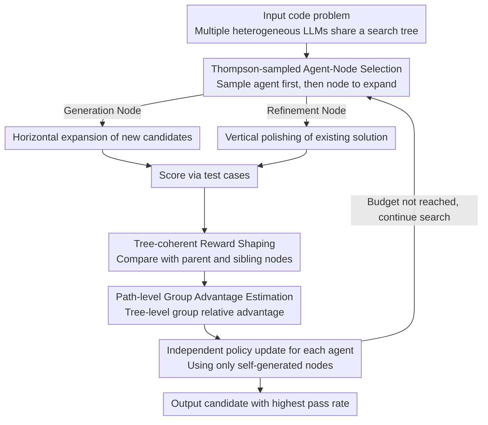

# MARS2: Scaling Multi-Agent Tree Search via Reinforcement Learning for Code Generation

**Conference**: ACL 2026  
**arXiv**: [2604.14564](https://arxiv.org/abs/2604.14564)  
**Code**: [https://github.com/TsinghuaC3I/MARTI](https://github.com/TsinghuaC3I/MARTI)  
**Area**: Code Intelligence  
**Keywords**: Multi-Agent, Tree Search, Reinforcement Learning, Code Generation, GRPO

## TL;DR

MARS2 proposes a multi-agent reinforcement tree search framework that embeds multiple independently optimized policies within a shared search tree for collaborative exploration. Through Thompson sampling for agent-node selection, tree-coherent reward shaping, and path-level group advantage estimation, it consistently improves single-model Pass@1 by up to 8.0% and system-level Pass@1(MCTS) by up to 6.5% on code generation benchmarks.

## Background & Motivation

**Background**: RLVR paradigms like GRPO have achieved significant progress in reasoning tasks such as code generation. Search-augmented RL (e.g., TreeRL) provides more diverse exploration signals by introducing MCTS tree structures. Multi-agent RL (MARL) generates non-stationary data distributions through multi-policy interactions, offering potential to break the exploration limits of single-policy approaches.

**Limitations of Prior Work**: (1) Single-agent tree search constraints—the entire search tree is driven by a single policy distribution; in later training stages, search behavior concentrates on a few high-probability branches, leading to diminishing exploration gains. (2) Disconnect between multi-agent methods and structured search—existing multi-agent reasoning frameworks (debate, voting, etc.) perform only lightweight coordination and lack structured search support such as branching, backtracking, and budget allocation.

**Key Challenge**: Single-policy search converges to local optima (Challenge 1), while multi-agent collaboration lacks a search structure (Challenge 2). There is a need to unify the two.

**Goal**: To build a multi-agent collaborative tree search RL framework where heterogeneous agents collaborate to generate and refine candidate solutions within a shared search tree.

**Key Insight**: Treat the search tree as a learnable multi-agent interaction environment where different agents contribute different policy priors and exploration budgets are dynamically allocated via Thompson sampling.

**Core Idea**: Multiple agents collaborate to expand nodes on a shared search tree. Each agent is independently optimized. Reward signals are processed using tree-coherent reward shaping, combining information from parent and sibling nodes, while path-level group advantages ensure stable credit assignment across complex search trajectories.

## Method

### Overall Architecture

The core problem MARS2 addresses is that single-policy driven tree search converges to a few high-probability branches in later training stages, while multi-agent collaboration often stays at lightweight coordination like debate or voting. MARS2 integrates these by allowing multiple independently optimized heterogeneous LLMs (such as Qwen3 and AReaL) to share a single search tree. Once a code problem is input, each step uses Thompson sampling to select an agent and then an expansion node. Generation nodes expand new candidates horizontally, while refinement nodes polish existing solutions vertically. Each expanded node is graded via test cases, and rewards are processed through tree-coherent reward shaping and path-level group advantage estimation. These signals flow back to the respective agents for independent policy updates. Finally, the candidate code with the highest pass rate in the tree is output.

### Key Designs

**1. Thompson-sampled Agent-Node Selection: Allocating exploration budget to "who is more likely to win"**

Heterogeneous agents have different strengths; fixed polling or greedy selection wastes budget on suboptimal branches. MARS2 maintains a Beta prior for each agent-node pair. During expansion, it performs Thompson sampling on the agents first, then on the expandable nodes associated with that agent. Nodes are classified as generation nodes (new candidates, horizontal exploration) and refinement nodes (improving candidates, vertical depth). The inherent randomness of sampling maintains an exploration-exploitation balance between action types and agent strengths, adaptively directing more opportunities to the more promising agents.

**2. Tree-Coherent Reward Shaping: Quality relative to ancestors and peers**

Pure global tree-level rewards fail to capture whether a child node is an improvement over its origin. MARS2 constructs a hybrid baseline for each non-root node $v$: $b(v) = (1-\lambda) r_{p(v)} + \lambda \cdot \mu_{C(p(v)) \setminus v}$. This weights the parent reward $r_{p(v)}$ against the mean sibling reward $\mu_{C(p(v))\setminus v}$ by $\lambda$—the former measures vertical improvement, the latter horizontal competition. This yields a structural consistency gain $\Delta(v) = r_v - b(v)$, resulting in a shaped reward $\hat{r}_v = r_v + \gamma \cdot \Delta(v)$. A node receives an extra bonus only if it outperforms its origin and its peers, encouraging truly progressive exploration paths during collaboration.

**3. Path-Level Group Advantage Estimation: Moving GRPO group relative baselines to the tree**

Standard GRPO assumes trajectories are sampled independently from the same prompt, but nodes in a tree search have hierarchical dependencies, violating the i.i.d. assumption. MARS2 observes that all nodes in a tree originate from the same problem, forming a natural semantic group. It computes the tree-level group relative advantage on shaped rewards: $\hat{A}_{v,j} = (\hat{r}_{v,j} - \text{mean}) / \text{std}$. Critically, each agent uses only its self-generated nodes to update parameters, reusing the tree-wide statistical baseline while avoiding incorrect credit assignment from others' trajectories.

### Loss & Training

Building on the advantage estimation above, MARS2 extends the GRPO objective to a multi-agent version. Each agent independently optimizes its own policy, employing the DAPO clip-higher technique to relax the upper bound for exploration and adding KL regularization. The training data consists of 7,992 filtered DeepCoder problems, with benchmarks evaluated on LiveCodeBench v6 (2025.01–05).

## Key Experimental Results

### Main Results

| Model/System | Method | Pass@1 | Pass@1(MCTS) | Pass@N |
|-----------|------|--------|-------------|--------|
| Qwen3-8B | Base | 50.3 | 54.3 | 68.6 |
| Qwen3-8B | GRPO | 52.5 (+2.2) | 57.1 (+2.8) | 73.1 |
| Qwen3-8B | RS2 | 55.4 (+5.1) | 60.6 (+6.3) | 71.4 |
| Qwen3-8B | **MARS2** | **58.3 (+8.0)** | **60.8 (+6.5)** | 72.3 |
| AReaL-14B | GRPO | 58.9 (+0.5) | 60.7 (-2.2) | 75.4 |
| AReaL-14B | **MARS2** | **64.6 (+6.2)** | **68.1 (+5.2)** | 80.2 |

### Ablation Study

| Configuration | Key Metrics | Explanation |
|------|---------|------|
| GRPO (Single-agent, no search) | +2.2 Pass@1 | Baseline |
| RS2 (Single-agent + tree search) | +5.1 Pass@1 | Search structure is effective |
| MARS2 (Multi-agent + tree search) | +8.0 Pass@1 | Multi-agent provides further improvement |
| Including weak agent (DeepCoder) | Performance still gains | Robust to agent heterogeneity |

### Key Findings

- MARS2 consistently outperforms GRPO and single-agent tree search (RS2) across all models, with Pass@1 gains of up to 8.0%.
- For highly optimized code models (AReaL), where GRPO is nearly ineffective or stagnates, MARS2 still provides a 6.2% gain.
- The multi-agent system-level Pass@1(MCTS) increases by up to 6.0%, proving that multi-agent training generates complementary strategies.
- Performance improves even with the inclusion of a weak agent (DeepCoder-14B), demonstrating the framework's robustness to agent heterogeneity.
- AReaL-14B with MARS2 reaches 64.6% Pass@1, exceeding O4-Mini (Low) at 63.7%.

## Highlights & Insights

- Treating the search tree as a "learnable multi-agent interaction environment" rather than a static sampling process is a paradigm innovation. Each node expansion is a collaborative decision among agents.
- Tree-coherent reward shaping considers both vertical improvement (vs. parent) and horizontal competition (vs. siblings), representing a natural extension of multi-agent credit assignment to tree structures.
- The experimental design is rigorous: training and inference configurations are clearly separated, with all methods sharing the same data budget and inference framework.

## Limitations & Future Work

- Evaluation is limited to code generation; other RLVR scenarios like mathematical reasoning remain to be verified.
- The number of agents is fixed at 2; the scaling behavior of more agents has not been explored.
- The prior update rules for Thompson sampling are relatively simple; more complex bandit strategies might be superior.
- Multi-agent training requires running multiple models simultaneously, significantly increasing GPU resource demands.

## Related Work & Insights

- **vs TreeRL**: TreeRL uses a single policy to drive the search tree, leading to diminishing exploration gains in late-stage training. MARS2 introduces multi-policy interaction to break single-policy prior constraints.
- **vs MAPoRL**: MAPoRL uses multi-agent conversational collaboration but lacks a search structure. MARS2 embeds multi-agent interactions into tree search, providing support for branching and backtracking.

## Rating

- Novelty: ⭐⭐⭐⭐⭐ First to unify multi-agent RL with tree search; tree-coherent reward shaping is elegantly designed.
- Experimental Thoroughness: ⭐⭐⭐⭐ Multiple models and scales, though focused only on code generation.
- Writing Quality: ⭐⭐⭐⭐ Clear framework and rigorous formulas.
- Value: ⭐⭐⭐⭐⭐ Provides a new paradigm for search-augmented RL with significant performance gains.

<!-- RELATED:START -->

## Related Papers

- [\[AAAI 2026\] ReCode: Updating Code API Knowledge with Reinforcement Learning](../../AAAI2026/code_intelligence/recode_updating_code_api_knowledge_with_reinforcement_learning.md)
- [\[ACL 2026\] CodeRL+: Improving Code Generation via Reinforcement with Execution Semantics Alignment](coderl_improving_code_generation_via_reinforcement_with_execution_semantics_alig.md)
- [\[ACL 2026\] ChipSeek: Optimizing Verilog Generation via EDA-Integrated Reinforcement Learning](chipseek_optimizing_verilog_generation_via_eda-integrated_reinforcement_learning.md)
- [\[ACL 2025\] Tree-of-Code: A Tree-Structured Exploring Framework for End-to-End Code Generation](../../ACL2025/code_intelligence/tree-of-code_a_tree-structured_exploring_framework_for_end-to-end_code_generatio.md)
- [\[ICLR 2026\] ReasoningBank: Scaling Agent Self-Evolving with Reasoning Memory](../../ICLR2026/code_intelligence/reasoningbank_scaling_agent_self-evolving_with_reasoning_memory.md)

<!-- RELATED:END -->
