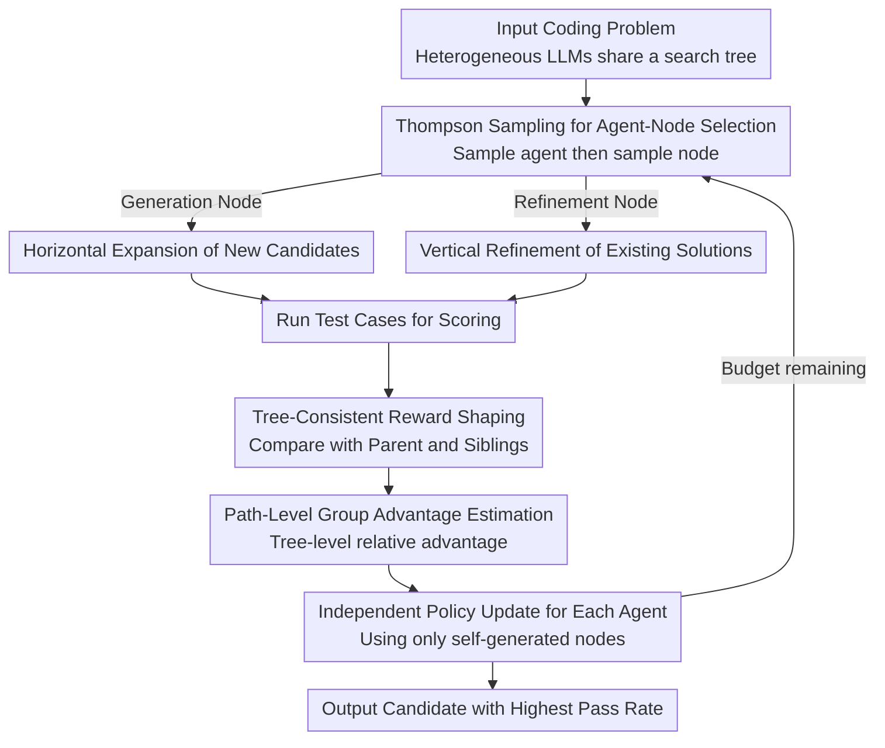

# MARS2: Scaling Multi-Agent Tree Search via Reinforcement Learning for Code Generation

**Conference**: ACL 2026  
**arXiv**: [2604.14564](https://arxiv.org/abs/2604.14564)  
**Code**: [https://github.com/TsinghuaC3I/MARTI](https://github.com/TsinghuaC3I/MARTI)  
**Area**: Code Intelligence  
**Keywords**: Multi-Agent, Tree Search, Reinforcement Learning, Code Generation, GRPO

## TL;DR

MARS2 proposes a multi-agent reinforced tree search framework that embeds multiple independently optimized policies into a shared search tree for collaborative exploration. By employing Thompson sampling for agent-node selection, tree-consistent reward shaping, and path-level group advantage estimation, it consistently improves single-model Pass@1 by up to 8.0% and system-level Pass@1(MCTS) by up to 6.5% on code generation benchmarks.

## Background & Motivation

**Background**: RLVR paradigms such as GRPO have achieved significant progress in reasoning tasks like code generation. Search-augmented RL (e.g., TreeRL) provides more diverse exploration signals by introducing MCTS tree structures. Multi-agent RL (MARL) generates non-stationary data distributions through multi-policy interactions, potentially breaking the exploration limits of single-policy approaches.

**Limitations of Prior Work**: (1) Single-agent tree search is constrained—the entire search tree is driven by a single policy distribution, causing search behavior to converge on a few high-probability branches during late training, which diminishes exploration gains. (2) Multi-agent methods are decoupled from structured search—existing multi-agent reasoning frameworks (e.g., debate, voting) only perform lightweight coordination and lack structured search support such as branching, backtracking, and budget allocation.

**Key Challenge**: Single-policy search converges to local optima (Challenge 1); multi-agent collaboration lacks search structures (Challenge 2). There is a need to unify both.

**Goal**: Construct a multi-agent collaborative tree search RL framework where heterogeneous agents collaborate to generate and refine candidate solutions within a shared search tree.

**Key Insight**: View the search tree as a learnable multi-agent interaction environment where different agents contribute distinct policy priors, and exploration budgets are dynamically allocated via Thompson sampling.

**Core Idea**: Multiple agents collaborate to expand nodes on a shared search tree. Each agent is optimized independently. Reward signals are processed through tree-consistent reward shaping, combining information from parent and sibling nodes, while path-level group advantage ensures stable credit assignment across complex search trajectories.

## Method

### Overall Architecture

MARS2 addresses the issue where single-policy driven tree search converges to high-probability branches, and multi-agent collaboration remains at the level of lightweight coordination. MARS2 integrates these by allowing multiple independently optimized heterogeneous LLMs (e.g., Qwen3 and AReaL) to share the same search tree. Given a coding problem, each step uses Thompson sampling to select an agent and then an expandable node. It performs horizontal expansion for generation nodes and vertical refinement for refinement nodes. Each expanded node is tested against cases to receive a reward. These rewards are processed via tree-consistent reward shaping and path-level group advantage estimation before being used for independent policy updates for each agent. The final output is the candidate code with the highest pass rate in the tree.

### Key Designs

**1. Thompson Sampling for Agent-Node Selection: Allocating Budget to "Who is More Likely to Win"**

Heterogeneous agents have different strengths; fixed rotation or greedy selection wastes budget on suboptimal branches. MARS2 maintains a Beta prior for each agent-node pair. During expansion, it performs Thompson sampling first for the agent and then for that agent's expandable nodes. Nodes are categorized into generation nodes (horizontal exploration) and refinement nodes (vertical depth). The inherent randomness of sampling maintains an exploration-exploitation balance between action types and agents, adaptively directing more opportunities to the most promising agents.

**2. Tree-Consistent Reward Shaping: Evaluating Relative Progress**

Pure global tree-level rewards fail to capture whether a child node improved relative to its origin. MARS2 constructs a hybrid baseline for each non-root node $v$: $b(v) = (1-\lambda) r_{p(v)} + \lambda \cdot \mu_{C(p(v)) \setminus v}$. This weights the parent reward $r_{p(v)}$ against the average reward of siblings $\mu_{C(p(v))\setminus v}$. The former measures vertical improvement while the latter measures horizontal competition. The structural consistency gain is defined as $\Delta(v) = r_v - b(v)$, and the shaped reward is $\hat{r}_v = r_v + \gamma \cdot \Delta(v)$. A node receives extra credit only if it outperforms both its origin and its peers, encouraging progress-oriented exploration.

**3. Path-Level Group Advantage Estimation: Adapting GRPO Baselines to Trees**

Standard GRPO assumes trajectories are sampled independently from the same prompt, but nodes in a search tree have hierarchical dependencies, violating the i.i.d. assumption. MARS2 treats all nodes in a tree as a natural semantic group since they derive from the same problem. It calculates tree-level relative advantage on shaped rewards: $\hat{A}_{v,j} = (\hat{r}_{v,j} - \text{mean}) / \text{std}$. Crucially, each agent only uses its own generated nodes to update parameters, utilizing tree-level statistics while avoiding incorrect credit assignment from other agents' trajectories.

### Loss & Training

Based on the advantage estimation, MARS2 extends the GRPO objective to a multi-agent version. Each agent independently optimizes its policy using the DAPO clip-higher technique to retain exploration, constrained by KL regularization. Training data includes 7,992 filtered DeepCoder problems, with evaluation on LiveCodeBench v6 (2025.01–05).

## Key Experimental Results

### Main Results

| Model/System | Method | Pass@1 | Pass@1(MCTS) | Pass@N |
|-----------|------|--------|-------------|--------|
| Qwen3-8B | Base | 50.3 | 54.3 | 68.6 |
| Qwen3-8B | GRPO | 52.5 (+2.2) | 57.1 (+2.8) | 73.1 |
| Qwen3-8B | RS2 | 55.4 (+5.1) | 60.6 (+6.3) | 71.4 |
| Qwen3-8B | **MARS2** | **58.3 (+8.0)** | **60.8 (+6.5)** | 72.3 |
| AReaL-14B | GRPO | 58.9 (+0.5) | 60.7 (-2.2) | 75.4 |
| AReaL-14B | **MARS2** | **64.6 (+6.2)** | **68.1 (+5.2)** | 80.2 |

### Ablation Study

| Configuration | Key Metrics | Description |
|------|---------|------|
| GRPO (Single-agent, no search) | +2.2 Pass@1 | Baseline |
| RS2 (Single-agent + Tree Search) | +5.1 Pass@1 | Search structure is effective |
| MARS2 (Multi-agent + Tree Search) | +8.0 Pass@1 | Multi-agent synergy provides further gains |
| Inclusion of weak agent (DeepCoder) | Performance still gains | Robust to agent heterogeneity |

### Key Findings

- MARS2 consistently outperforms GRPO and single-agent tree search (RS2) across all models, with Pass@1 gains up to 8.0%.
- For highly optimized code models (AReaL) where GRPO shows negligible effect or degradation, MARS2 still provides a 6.2% improvement.
- Multi-agent system-level Pass@1 (MCTS) improved by up to 6.0%, proving that multi-agent training produces complementary policies.
- Performance gains persist even when including a weak agent (DeepCoder-14B), demonstrating robustness.
- AReaL-14B with MARS2 reaches 64.6% Pass@1, exceeding O4-Mini (Low) at 63.7%.

## Highlights & Insights

- Treating the search tree as a "learnable multi-agent interaction environment" rather than a static sampling process is a paradigm innovation. Every node expansion is a collaborative decision among agents.
- Tree-consistent reward shaping, considering both vertical improvement (vs. parent) and horizontal competition (vs. siblings), is a natural extension of multi-agent credit assignment to tree structures.
- The experimental design is rigorous, with distinct training and inference configurations, ensuring all methods share the same data budget and inference framework.

## Limitations & Future Work

- Evaluation is limited to code generation; other RLVR scenarios like mathematical reasoning remain to be validated.
- The number of agents is fixed at 2; scaling behavior with more agents is unexplored.
- The prior update rules for Thompson sampling are relatively simple; more complex bandit strategies might yield better results.
- Multi-agent training requires running multiple models simultaneously, significantly increasing GPU resource demands.

## Related Work & Insights

- **vs TreeRL**: TreeRL uses a single policy to drive search, leading to diminishing exploration gains. MARS2 introduces multi-policy interaction to break single-policy prior constraints.
- **vs MAPoRL**: MAPoRL uses multi-agent dialogue but lacks a search structure. MARS2 embeds agents into tree search, providing branching and backtracking support.

## Rating

- Novelty: ⭐⭐⭐⭐⭐ First to unify multi-agent RL with tree search; reward shaping design is elegant.
- Experimental Thoroughness: ⭐⭐⭐⭐ Multiple models and scales, but task variety is limited to code.
- Writing Quality: ⭐⭐⭐⭐ Clear framework and rigorous formulations.
- Value: ⭐⭐⭐⭐⭐ Provides a new paradigm for search-augmented RL with significant performance gains.

<!-- RELATED:START -->

## Related Papers

- [\[AAAI 2026\] ReCode: Updating Code API Knowledge with Reinforcement Learning](../../AAAI2026/code_intelligence/recode_updating_code_api_knowledge_with_reinforcement_learning.md)
- [\[ACL 2026\] CodeRL+: Improving Code Generation via Reinforcement with Execution Semantics Alignment](coderl_improving_code_generation_via_reinforcement_with_execution_semantics_alig.md)
- [\[CVPR 2026\] MM-ReCoder: Advancing Chart-to-Code Generation with Reinforcement Learning and Self-Correction](../../CVPR2026/code_intelligence/mm-recoder_advancing_chart-to-code_generation_with_reinforcement_learning_and_se.md)
- [\[ICLR 2026\] Breaking the SFT Plateau: Multimodal Structured Reinforcement Learning for Chart-to-Code Generation](../../ICLR2026/code_intelligence/breaking_the_sft_plateau_multimodal_structured_reinforcement_learning_for_chart-.md)
- [\[ACL 2026\] ChipSeek: Optimizing Verilog Generation via EDA-Integrated Reinforcement Learning](chipseek_optimizing_verilog_generation_via_eda-integrated_reinforcement_learning.md)

<!-- RELATED:END -->
