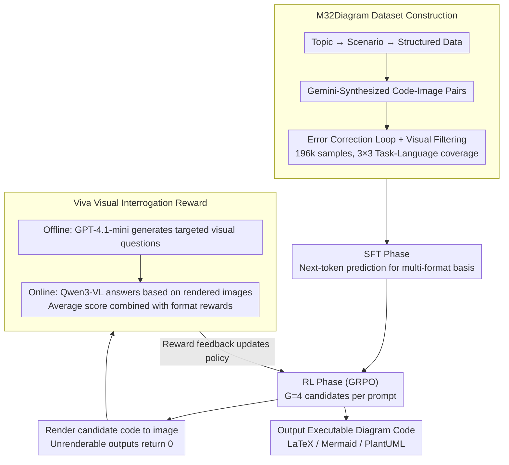

# OmniDiagram: Advancing Unified Diagram Code Generation via Visual Interrogation Reward

**Conference**: ACL 2026 Findings  
**arXiv**: [2604.05514](https://arxiv.org/abs/2604.05514)  
**Code**: [GitHub](https://github.com/Haoyue-Yang/OmniDiagram)  
**Area**: Code Intelligence / Multimodal Code Generation  
**Keywords**: Diagram code generation, VQA reward, Reinforcement Learning, Unified framework, Multimodal  

## TL;DR

This paper proposes OmniDiagram, a unified diagram code generation framework that covers three languages (LaTeX/Mermaid/PlantUML) and three tasks (Diagram-to-Code, Diagram Editing, and Text-to-Code). It introduces the Viva reward mechanism based on Visual Question Answering (VQA) to guide Reinforcement Learning (RL) training, achieving SOTA performance across multiple benchmarks.

## Background & Motivation

**Background**: The programmable diagram generation paradigm is rapidly evolving and plays a critical role in structured visualization. Multimodal Large Language Models (MLLMs) enable direct processing of unstructured diagrams (e.g., PNG raster formats) to generate executable code. However, existing methods are typically limited to a single task or a few programming languages.

**Limitations of Prior Work**: (1) StarFlow only supports JSON output, ignoring diverse diagram languages; while JanusCoder attempts to unify text-to-code and diagram-to-code, it relies solely on SFT, limiting visual alignment and code execution robustness. (2) Methods combining RL with visual feedback (e.g., MSRL, RLRF) target specific image-to-code tasks and lack cross-task flexibility. (3) Existing visual feedback methods either use fixed prompt templates (limited by evaluator model capability and prone to prompt hacking) or calculate global visual similarity (biasing towards surface structures while ignoring fine-grained details).

**Key Challenge**: Diagram code generation requires simultaneously ensuring code logical correctness and rendered visual fidelity. However, existing RL reward mechanisms struggle to unify the verification of critical structural details in heterogeneous tasks—the structural diversity of Text-to-Code precludes a single reference image, and the non-bijective nature of Diagram-to-Code means different code snippets can produce visually identical outputs.

**Goal**: Construct a unified framework covering multiple diagram languages and task modalities, and design an RL reward mechanism capable of unified visual fidelity assessment across tasks.

**Key Insight**: Drawing inspiration from the metacognitive review mechanism humans use in complex construction tasks—systematically checking structural and semantic constraints through targeted questions rather than overall similarity.

**Core Idea**: The Viva (Visual Interrogation Verifies All) mechanism—generating targeted visual questions offline for each training sample and having a reward model answer them based on the rendered image online to evaluate visual fidelity, providing fine-grained intermediate feedback.

## Method

### Overall Architecture

The difficulty of diagram code generation lies in achieving both logical correctness and rendered visual fidelity. Finding a unified visual reward is hard across heterogeneous tasks: Text-to-Code lacks a unique reference image, while Diagram-to-Code is non-bijective. OmniDiagram addresses this with a "Data—SFT—RL" pipeline: first, a top-down synthesis method creates the M32Diagram dataset (196k samples) covering a 3×3 task-language matrix; then, SFT establishes basic multi-format diagram code generation capabilities; finally, a GRPO stage driven by Viva rewards iterates on visual fidelity through a render-interrogate-feedback loop, outputting executable code in LaTeX, Mermaid, or PlantUML.

### Key Designs

**1. M32Diagram Large-scale Dataset: Top-down synthesis + strict filtering to fill the 3×3 task-language data gap**

Diagram code generation has long lacked large-scale data covering multiple languages and tasks. OmniDiagram employs scenario-driven top-down synthesis (topic → scenario → structured data → code-image pairs), utilizing Gemini-2.5-Flash. After error correction and visual validation, 165k high-quality samples were filtered from 300k candidates, combined with 31k open-source samples (196k total), plus 77k reasoning-enhanced samples. Each language covers about 15 diagram types, with hierarchical clustering based on perceptual hashing used to balance the distribution of difficulty and topological complexity between SFT and RL sets.

**2. SFT-to-RL Two-stage Training Pipeline: Establishing base capabilities before refining visual fidelity with RL**

Applying RL directly lead to mode collapse—ablations show that pure RL models (without SFT) only generate Mermaid code regardless of instructions. Thus, OmniDiagram first uses standard next-token prediction for SFT. In the RL phase, it uses GRPO with $G=4$ candidates per prompt, rendering them to calculate Viva rewards online and penalize unrenderable rollouts. The execution rate improved from 88.6% (SFT) to 93.0% (RL).

**3. Viva (Visual Interrogation Verifies All) Reward Mechanism: Using "Interrogation" instead of global similarity**

This is the core reward driving the RL phase. Fixed template rewards are limited by evaluator capability and vulnerable to prompt hacking, while global similarity ignores fine-grained details. Viva decouples question generation and answer verification: offline, GPT-4.1-mini generates targeted visual questions (designed so "Yes" is the correct answer); online, each rollout is rendered, and Qwen3-VL-32B serves as the reward model to answer these questions. The Viva reward is the mean of question scores, combined as $R_i = \alpha \cdot R_{\text{Viva}} + (1-\alpha) \cdot R_{\text{fmt}}$ ($\alpha=0.9$). Question-driven verification focuses on logical consistency rather than strict global imitation, rewarding more diverse rollouts.

### Loss & Training

The SFT phase uses standard cross-entropy loss on 8 H800 GPUs with a global batch size of 32 for 2 epochs. The RL phase uses GRPO (Equations 4-5) with $G=4$, $\alpha=0.9$, and a global batch size of 128, based on the ms-swift and EasyR1 frameworks. Theoretical stability of the Viva reward is supported by variance analysis showing that multi-dimensional question aggregation dampages the uncertainty of individual VQA instances.

## Key Experimental Results

### Main Results

| Model | M32Bench D2C $S_{vis}$ | M32Bench Edit $S_{pres}$/$S_{task}$ | VisPlot Mermaid $S_{vis}$/$S_{task}$ |
|--------|------|------|------|
| Qwen2.5-VL-72B | 55.0 | 36.8/54.0 | 31.0/46.0 |
| Qwen3-VL-32B | 58.0 | 45.6/51.8 | 40.4/55.1 |
| OmniDia-3B (RL) | 72.2 | 59.0/64.8 | 49.4/64.5 |
| OmniDia-7B (RL) | **75.5** | **57.2/65.2** | **51.0/66.9** |
| Gemini-3-Flash | 73.6 | 77.8/82.0 | 58.4/80.2 |

### Ablation Study

| Configuration | Key Metrics | Description |
|------|---------|------|
| Pure RL (No SFT) | Exec 30.2% | Mode collapse, only generates Mermaid |
| Pure SFT (No RL) | Exec 88.6% | Complete base ability but lower visual fidelity |
| Full Pipeline (SFT+RL) | Exec **93.0%** | Two stages complement each other for optimality |
| Adding Reasoning Traces | Edit improved, others declined | Reasoning context may distract focus |
| Small Reward Model (30B-A3B) | Minimal gap | Offline questions are more critical than RM scale |

### Key Findings
- The 3B model (OmniDia-3B) outperforms the 72B open-source model (Qwen2.5-VL-72B), demonstrating the leverage of data and training strategy.
- The RL phase significantly improves the execution rate (88.6% → 93.0%) by penalizing unrenderable outputs.
- Viva is relatively insensitive to the reward model's scale, indicating that offline questions provide essential visual focus.
- The effect of reasoning traces varies by task: they help with Diagram Editing (instruction analysis) but may hinder other tasks.

## Highlights & Insights
- The "every sample deserves careful interrogation" philosophy of the Viva mechanism elegantly solves the unified reward problem for heterogeneous tasks.
- Decoupling question generation and answer verification reduces online overhead while maintaining instance-specificity.
- The 3B model's success over 72B models proves the importance of specialized training data and strategies.
- Reward model scale experiments reveal a counter-intuitive find: the key is "what to ask" rather than "who answers."

## Limitations & Future Work
- The visual/format weight $\alpha$ is fixed at 0.9; task-adaptive adjustment might further optimize performance.
- Only the GRPO algorithm was used; comparative experiments with other RL paradigms (PPO/DPO) are missing.
- Data synthesis and evaluation rely on external models (Gemini-2.5-Flash, GPT-4.1), incurring high computational costs.
- Complexity is limited; the study does not yet cover 3D diagrams or interactive charts.

## Related Work & Insights
- **vs JanusCoder**: JanusCoder uses only SFT; OmniDiagram significantly improves visual fidelity and execution rate via Viva RL.
- **vs RLRF/MSRL**: These use global similarity or fixed templates as rewards; OmniDiagram’s Viva provides more fine-grained and robust feedback.
- **vs VisCoder2**: VisCoder2 builds on code-specific LLMs (Qwen-Coder), whereas OmniDiagram starts from general VLMs to achieve larger gains.

## Rating
- Novelty: ⭐⭐⭐⭐ The Viva VQA reward mechanism is novel, and the 3×3 unified framework is valuable, though the approach builds on the existing GRPO+visual feedback paradigm.
- Experimental Thoroughness: ⭐⭐⭐⭐⭐ Comprehensive ablation studies (strategy, reasoning, RM scale) and extensive multi-benchmark comparisons.
- Writing Quality: ⭐⭐⭐⭐ Clear structure, detailed method descriptions, and theoretical depth added by reward stability analysis.
- Value: ⭐⭐⭐⭐ The M32Diagram dataset and Viva mechanism are generalizable to other visual-to-code generation scenarios.

<!-- RELATED:START -->

## Related Papers

- [\[CVPR 2026\] MM-ReCoder: Advancing Chart-to-Code Generation with Reinforcement Learning and Self-Correction](../../CVPR2026/code_intelligence/mm-recoder_advancing_chart-to-code_generation_with_reinforcement_learning_and_se.md)
- [\[CVPR 2026\] GeoTikzBridge: Advancing Multimodal Code Generation for Geometric Perception and Reasoning](../../CVPR2026/code_intelligence/geotikzbridge_advancing_multimodal_code_generation_for_geometric_perception_and_.md)
- [\[ACL 2026\] QiMeng-PRepair: Precise Code Repair via Edit-Aware Reward Optimization](qimeng-prepair_precise_code_repair_via_edit-aware_reward_optimization.md)
- [\[ACL 2026\] R$^3$-SQL: Ranking Reward and Resampling for Text-to-SQL](r3-sql_ranking_reward_and_resampling_for_text-to-sql.md)
- [\[ACL 2025\] ExploraCoder: Advancing Code Generation for Multiple Unseen APIs via Planning and Chained Exploration](../../ACL2025/code_intelligence/exploracoder_advancing_code_generation_for_multiple_unseen_apis_via_planning_and.md)

<!-- RELATED:END -->
