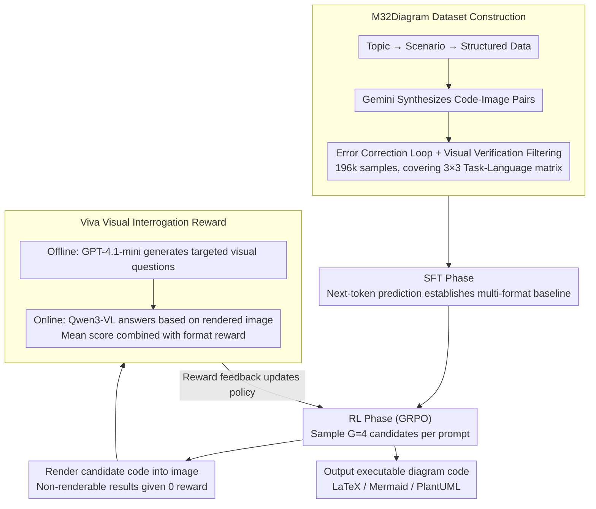

# OmniDiagram: Advancing Unified Diagram Code Generation via Visual Interrogation Reward

**Conference**: ACL 2026 Findings  
**arXiv**: [2604.05514](https://arxiv.org/abs/2604.05514)  
**Code**: [GitHub](https://github.com/Haoyue-Yang/OmniDiagram)  
**Area**: Code Intelligence / Multimodal Code Generation  
**Keywords**: Diagram code generation, VQA reward, Reinforcement Learning, Unified framework, Multimodal

## TL;DR

This paper proposes OmniDiagram, a unified diagram code generation framework covering three languages (LaTeX/Mermaid/PlantUML) and three tasks (Diagram-to-Code, Diagram Editing, Text-to-Code). It introduces the Viva reward mechanism based on Visual Question Answering to guide RL training, achieving SOTA performance across multiple benchmarks.

## Background & Motivation

**Background**: The programmable diagram generation paradigm is evolving rapidly and playing a key role in structured visualization. Multimodal Large Language Models (MLLMs) enable direct processing of unstructured diagrams (such as PNG raster formats) to generate executable code. However, existing methods are typically limited to a single task or a few programming languages.

**Limitations of Prior Work**: (1) StarFlow only supports JSON output, ignoring diverse diagram languages; although JanusCoder attempts to unify Text-to-Code and Diagram-to-Code, it relies solely on SFT, which limits visual alignment and code execution robustness. (2) Methods combining RL with visual feedback (e.g., MSRL, RLRF) are targeted only at specific image-to-code tasks and lack cross-task flexibility. (3) Existing visual feedback methods either use fixed prompt templates (limited by the evaluator model's capability and susceptible to prompt hacking) or calculate global visual similarity (biased towards surface structures while ignoring fine-grained details).

**Key Challenge**: Diagram code generation must ensure both code logical correctness and post-rendering visual fidelity. However, existing RL reward mechanisms struggle to uniformly verify key structural details across heterogeneous tasks—the structural diversity of Text-to-Code excludes a single reference image, and the non-bijectivity of Diagram-to-Code means different code can produce visually identical outputs.

**Goal**: To build a unified framework covering multiple diagram languages and task modalities, and to design an RL reward mechanism capable of uniformly evaluating visual fidelity across tasks.

**Key Insight**: Drawing inspiration from the meta-cognitive review mechanism humans use in complex construction tasks—systematically checking structural and semantic constraints through targeted questions rather than judging by overall similarity.

**Core Idea**: The Viva (Visual Interrogation Verifies All) mechanism—generating targeted visual questions offline for each training sample and having a reward model answer these questions online based on rendered images to evaluate visual fidelity, providing fine-grained intermediate score feedback.

## Method

### Overall Architecture

The difficulty of diagram code generation lies in achieving both logical correctness and post-rendering visual fidelity. Unified visual rewards are hard to find in heterogeneous tasks: Text-to-Code lacks a unique reference image, and Diagram-to-Code is non-bijective (different code can render identical images). OmniDiagram employs a "Data—SFT—RL" pipeline to address this: first, a top-down synthesis method creates the M32Diagram dataset (196k samples) covering a 3×3 task-language matrix; then, SFT establishes basic multi-format diagram code generation capabilities; finally, a GRPO stage driven by the Viva visual question-answering reward allows the model to iteratively improve visual fidelity through a render-interrogate-feedback loop, outputting executable code in LaTeX, Mermaid, or PlantUML.

### Key Designs

**1. M32Diagram Large-scale Dataset: Top-down Synthesis + Strict Filtering to Fill the 3×3 Task-Language Data Gap**

Diagram code generation has long lacked large-scale data covering multiple languages and tasks. OmniDiagram adopts scenario-driven top-down synthesis (topic → scenario → structured data → code-image pairs) using Gemini-2.5-Flash, followed by error-correction loops and visual verification. This filtered 165k high-quality samples from 300k candidates, combined with 31k open-source data for a total of 196k, plus 77k reasoning-enhanced samples. Each language covers approximately 15 diagram types. Hierarchical clustering based on perceptual hashing balances the distribution of difficulty and topological complexity between SFT and RL training sets.

**2. SFT-to-RL Two-stage Training Pipeline: Establishing Baseline then Refining Visual Fidelity with RL**

Directly applying RL leads to mode collapse—ablations show that a pure RL model (without SFT) only generates Mermaid code and ignores specific instructions. Therefore, OmniDiagram first uses standard next-token prediction for SFT to establish foundational cross-format diagram code generation. In the RL phase, GRPO samples $G=4$ candidates per prompt, renders the images online to calculate Viva rewards, and penalizes non-renderable rollouts. The stages are complementary: SFT ensures the ability to "draw," while RL maximizes "visual similarity" (completion/execution rate improved from 88.6% in SFT to 93.0%).

**3. Viva (Visual Interrogation Verifies All) Reward Mechanism: Scoring via "Interrogation" instead of Global Similarity**

This is the core reward driving the RL phase. Fixed template rewards are limited by evaluator capabilities and prone to prompt hacking, while global similarity ignores fine-grained details. Viva draws on human meta-cognitive mechanisms during complex construction review, decoupling question generation from answer verification: the offline phase uses GPT-4.1-mini to generate targeted visual questions for each sample (designed so "Yes" is the correct answer); the online phase renders each rollout's code into an image and uses Qwen3-VL-32B as the reward model to answer these questions. The Viva reward is the average score of all questions, combined with a format reward as $R_i = \alpha \cdot R_{\text{Viva}} + (1-\alpha) \cdot R_{\text{fmt}}$ ($\alpha=0.9$). Candidates failing to render are scored 0. Question-driven verification focuses on logical consistency rather than strict global imitation, thereby rewarding more diverse rollouts. Aggregating multiple questions is also proven via variance analysis to effectively suppress reward noise from single VQA calls.

### Loss & Training

The SFT phase uses standard cross-entropy loss on 8 H800 GPUs with a global batch size of 32 for 2 epochs. The RL phase employs GRPO (Eq. 4-5) with $G=4$ candidates, $\alpha=0.9$, and a global batch size of 128, based on the ms-swift and EasyR1 frameworks. The theoretical stability of the Viva reward is supported by variance analysis showing that multi-dimensional question aggregation dampens the impact of individual VQA uncertainty.

## Key Experimental Results

### Main Results

| Model | M32Bench D2C $S_{vis}$ | M32Bench Edit $S_{pres}$/$S_{task}$ | VisPlot Mermaid $S_{vis}$/$S_{task}$ |
|--------|------|------|------|
| Qwen2.5-VL-72B | 55.0 | 36.8/54.0 | 31.0/46.0 |
| Qwen3-VL-32B | 58.0 | 45.6/51.8 | 40.4/55.1 |
| OmniDia-3B (RL) | 72.2 | 59.0/64.8 | 49.4/64.5 |
| OmniDia-7B (RL) | **75.5** | **57.2/65.2** | **51.0/66.9** |
| Gemini-3-Flash | 73.6 | 77.8/82.0 | 58.4/80.2 |

### Ablation Study

| Configuration | Key Metrics | Note |
|------|---------|------|
| Pure RL (No SFT) | Exec 30.2% | Mode collapse, only generates Mermaid |
| Pure SFT (No RL) | Exec 88.6% | Complete baseline but lower visual fidelity |
| Full Pipeline (SFT+RL) | Exec **93.0%** | Two-stage complementarity reaches optimum |
| Adding Reasoning Trajectories | Edit improved, others declined | Reasoning context may distract focus |
| Small Reward Model (30B→3B) | Minimal performance gap | Offline questions are more critical than model size |

### Key Findings
- The 3B model (OmniDia-3B) outperforms the 72B open-source model (Qwen2.5-VL-72B), demonstrating the high leverage of data and training strategies.
- The RL phase significantly improves the execution rate (SFT 88.6% → RL 93.0%) because RL penalizes non-renderable outputs.
- Viva is insensitive to the scale of the reward model, indicating that offline-generated visual questions provide crucial visual focus.
- The effect of reasoning trajectories varies by task: beneficial for Diagram Editing (enhanced instruction analysis) but potentially detrimental to other tasks.

## Highlights & Insights
- The Viva mechanism's philosophy that "every sample deserves careful interrogation" elegantly solves the unified reward problem for heterogeneous tasks.
- The decoupling of question generation and answer verification is clever—offline question generation reduces online overhead while maintaining instance specificity.
- The success of the 3B model over 72B models strongly proves the importance of focused training data and strategy.
- Reward model scale experiments reveal a counter-intuitive but important finding: the key lies in "what to ask" rather than "who answers."

## Limitations & Future Work
- The visual/format weight $\alpha$ in the Viva reward is fixed at 0.9; task-adaptive adjustments might offer further optimization.
- Only the GRPO algorithm is used; comparative experiments with alternative RL paradigms like PPO or DPO are missing.
- Data synthesis and evaluation rely on external models (Gemini-2.5-Flash, GPT-4.1), incurring high computational costs.
- More complex diagram types (e.g., 3D diagrams, interactive charts) are not yet covered.

## Related Work & Insights
- **vs JanusCoder**: JanusCoder uses only SFT, while OmniDiagram significantly improves visual fidelity and execution rate via Viva RL.
- **vs RLRF/MSRL**: These methods use global visual similarity or fixed templates as rewards, whereas OmniDiagram's Viva provides more fine-grained and robust feedback.
- **vs VisCoder2**: VisCoder2 is based on code-specific LLMs (Qwen-Coder), while OmniDiagram starts from general VLMs to achieve greater gains.

## Rating
- Novelty: ⭐⭐⭐⭐ The Viva VQA reward mechanism is novel, and the 3×3 unified framework is valuable, though the overall approach builds on established GRPO+visual feedback paradigms.
- Experimental Thoroughness: ⭐⭐⭐⭐⭐ Comprehensive ablation studies (training strategy, reasoning trajectories, reward model scale) and extensive multi-benchmark comparisons.
- Writing Quality: ⭐⭐⭐⭐ Clear structure and detailed method description; theoretical analysis of reward stability adds depth.
- Value: ⭐⭐⭐⭐ The M32Diagram dataset and Viva mechanism are generalizable to other visual code generation scenarios.

<!-- RELATED:START -->

## Related Papers

- [\[ICLR 2026\] RPG: A Repository Planning Graph for Unified and Scalable Codebase Generation](../../ICLR2026/code_intelligence/rpg_a_repository_planning_graph_for_unified_and_scalable_codebase_generation.md)
- [\[ICLR 2026\] JanusCoder: Towards a Foundational Visual-Programmatic Interface for Code Intelligence](../../ICLR2026/code_intelligence/januscoder_towards_a_foundational_visual-programmatic_interface_for_code_intelli.md)
- [\[ICLR 2026\] Code Aesthetics with Agentic Reward Feedback](../../ICLR2026/code_intelligence/code_aesthetics_with_agentic_reward_feedback.md)
- [\[ACL 2025\] ExploraCoder: Advancing Code Generation for Multiple Unseen APIs via Planning and Chained Exploration](../../ACL2025/code_intelligence/exploracoder_advancing_code_generation_for_multiple_unseen_apis_via_planning_and.md)
- [\[ACL 2026\] QiMeng-PRepair: Precise Code Repair via Edit-Aware Reward Optimization](qimeng-prepair_precise_code_repair_via_edit-aware_reward_optimization.md)

<!-- RELATED:END -->
