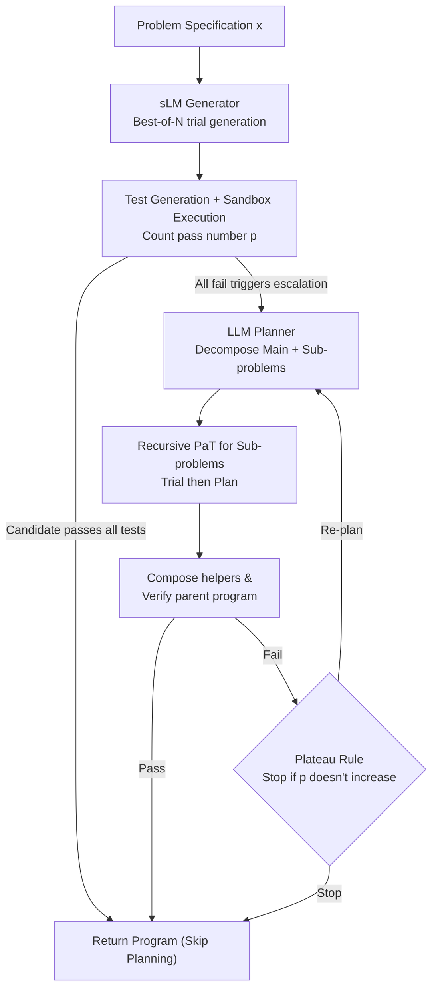

# PaT: Planning-after-Trial for Efficient Test-Time Code Generation

**Conference**: ACL2026  
**arXiv**: [2605.07248](https://arxiv.org/abs/2605.07248)  
**Code**: No public code (not provided in the paper)  
**Area**: Code Intelligence  
**Keywords**: Test-time computation, Code generation, Adaptive planning, Execution verification, Heterogeneous models

## TL;DR
PaT shifts the paradigm from "planning-before-trial" to "trial-then-plan-on-failure." It uses execution feedback to trigger expensive decomposition steps and significantly improves the Pareto front between Pass@1 and inference cost through a heterogeneous configuration with small-model generation and large-model planning.

## Background & Motivation
**Background**: LLM-based code generation is evolving from single few-shot generation toward test-time computation scaling. Common pathways include Best-of-N sampling, candidate filtering using generated tests, iterative debugging, and decomposing complex problems into multiple helper functions to be synthesized. A representative of the latter explicit decomposition approach is FunCoder, which aims to solve algorithmic problems by "understanding problem structure first, then implementing sub-problems separately."

**Limitations of Prior Work**: While decomposition improves success rates for difficult tasks, it incurs full planning overhead even for simple tasks. The paper notes that small models under standard inference can already solve many foundational code problems; for example, Qwen3-4B achieves an average Standard Pass@1 of 76.05% on foundational benchmarks. If every problem is planned first, many that could be solved directly are subjected to unnecessary planning, helper generation, and verification, leading to rapid cost inflation.

**Key Challenge**: The key to test-time computation is not just "spending more compute," but "on which samples to spend it." Planning-before-Trial (PbT) treats planning as a default pre-step, which suits hard samples but fails to identify simple ones. Conversely, direct generation is cost-effective but lacks a mechanism to escalate strategies upon failure. The fundamental trade-off is: earlier planning is more stable but prone to waste; later planning is more efficient but requires a reliable failure signal.

**Goal**: The authors address three sub-problems: first, how to determine whether a problem deserves the planning workflow in a training-free manner; second, how to reuse verified sub-solutions after planning to avoid repeating work; third, how to allocate models of different scales to different roles so that common trials are cheap while critical planning is sufficiently powerful.

**Key Insight**: Code generation provides a harder signal than general natural language reasoning: programs can be executed, and candidate solutions can be verified with test cases. PaT observes that if a model fails to pass tests after multiple direct trials, this is more credible than a model's self-evaluation of "problem difficulty." It indicates the problem likely exceeds the direct generation capability, making it the rational point to initiate planning.

**Core Idea**: Use execution failure as a trigger for planning, changing "plan every sample first" to "plan only samples that fail verification," thereby concentrating expensive test-time computation on code problems that truly require decomposition.

## Method
PaT does not propose a new code model but reorganizes the test-time inference workflow. It treats a code problem as a natural language specification $x$, with the goal of generating a program $\mathcal{F}$ satisfying the spec. The system involves two collaborating roles: a generator $M_G$ responsible for direct code generation or sub-problem implementation, and a planner $M_P$ responsible for decomposing the original problem into a top-level implementation and sub-problem specifications $\{x_i\}$ upon failure. Finally, a Compose operation merges the main function and verified helper functions.

### Overall Architecture
The input is a code generation problem, and the output is the final program. The core of the workflow is delaying the "whether to plan" decision until after execution feedback. PaT first performs Best-of-N trial sampling of multiple candidates for a specification, then generates a test set $\mathcal{T}(x)$ to execute in a sandbox Python runtime, measuring quality via the count of passed tests $p = \textsc{Evaluate}(\mathcal{F}, \mathcal{T}(x))$. If any candidate passes all tests, the process returns immediately, allowing simple problems to skip the planner and helper generation—this is the source of PaT's efficiency.

Only when all direct candidates fail is the planner activated. Based on the original problem and the current set of helpers, the planner provides a new draft implementation and several sub-problems. Each unimplemented sub-problem recursively calls PaT (likewise attempting direct generation first). Sub-solutions are merged into the helper set after passing their respective tests and combined into the parent program for overall verification. If the composite program passes all tests, it is returned; if it still fails, the system enters a re-planning loop where the planner decomposes again given successfully verified helpers. A plateau rule (stopping if the new pass count does not exceed the previous round) prevents the system from being trapped in high-cost cycles by noisy tests or invalid decompositions.

### Key Designs

**1. Failure-Triggered Adaptive Planning: Escalation over Default Pre-planning**
Methods like FunCoder (PbT) decompose every problem, incurring planning costs even for simple tasks, which constitute a significant portion of benchmarks. PaT executes Best-of-N candidate generation first and verifies them with tests. If a candidate passes, it returns immediately; if all fail, it interprets this as "direct solution insufficient" and triggers the planner. By using execution as a hard feedback mechanism ($p = |\mathcal{T}(x)|$) rather than subjective self-evaluation, PaT concentrated compute on difficult samples, significantly lowering average costs.

**2. Test Generation and Plateau Rule: Binary Switches Against Noisy Tests**
PaT requires a clear binary signal for the planning trigger rather than consensus scoring (like CodeT). It generates an average of 6.7 tests per problem and requires a candidate to pass all tests to succeed. While strict passing reduces false positives, generated tests can be noisy. PaT records the pass count $p^{(t)}$ for each round; if $p^{(t)} \leq p^{(t-1)}$, the plateau rule stops the cycle and returns the best result from the previous round to avoid over-planning for false positives. Figure 3 shows this signal is practical: for Qwen3-4B, 63.4% of HumanEval problems had generated tests with zero false positives.

**3. Heterogeneous Configuration: Small Generator + Large Planner**
Using only small models leads to frequent failures and excessive planner calls, while using only large models raises the baseline cost of every trial. PaT decouples these: the generator handles high-frequency, local candidates and sub-problem implementations (suited for cost-efficient sLMs), while the planner handles low-frequency, global decomposition (suited for stronger LLMs). Since the planner is only called upon failure, the high overhead of the large model is amortized across a few hard samples.

### Loss & Training
PaT does not train new models; it is a pure inference-time policy implemented via prompts, sampling, test generation, and sandbox execution. For fair comparison, PaT uses the same $N=5$, temperature=0.8 as Best-of-N. Token pricing analysis indicates that if planning costs are lower than the generation savings from a heterogeneous setup, there exists an sLM generator that yields lower expected costs than a homogeneous LLM strategy.

## Key Experimental Results

### Main Results
Evaluated across foundational benchmarks (HumanEval+, MBPP+) and hard benchmarks (xCodeEval).

| Setup | Method | Avg Pass@1 | Gain | Rel. Cost | Conclusion |
|-------|--------|------------|------|-----------|------------|
| Qwen3-4B | Standard | 76.05 | - | 1.00 | sLMs solve many simple problems |
| Qwen3-4B | FunCoder | 81.18 | +5.13 | 8.31 | PbT improves performance but is costly |
| Qwen3-4B | PaT | 83.13 | +7.08 | 4.85 | Outperforms FunCoder at 58% of the cost |
| Qwen3-32B | FunCoder | 87.66 | +4.31 | 8.93 | PbT remains expensive for LLMs |
| Qwen3-32B | PaT | 88.37 | +5.02 | 5.09 | Highest Pass@1 with significant savings |

On xCodeEval (harder benchmarks), PaT's advantage persists, though cost dynamics shift. For Qwen3-4B, PaT is more expensive than FunCoder because it triggers planning more frequently due to failures, but it raises the "All" score from 29.00 to 34.20. For 8B+ models, PaT achieves both higher performance and lower costs.

### Ablation Study
The study focuses on the heterogeneous configuration (Generator + Planner).

| Generator | Planner | Avg Pass@1 | Rel. Cost | Insight |
|-----------|---------|------------|-----------|---------|
| Qwen3-32B | Qwen3-32B | 88.37 | 1.00 | Homogeneous upper bound |
| Qwen3-14B | Qwen3-32B | 87.53 | 0.49 | Near 32B performance at <50% cost |
| Qwen3-8B | Qwen3-32B | 87.39 | 0.31 | **Sweet spot**: <1% gap from 32B, 31% cost |
| Qwen3-4B | Qwen3-32B | 84.78 | 0.18 | 4B generator becomes the bottleneck |

### Key Findings
- **Skipping unnecessary planning** is the primary source of gain.
- **Execution feedback** is a reliable trigger. Even with noisy tests, the plateau rule stabilizes the loop.
- **Heterogeneous scaling** allows a small generator (8B) combined with a large planner (32B) to approximate full large-model performance with major cost reductions.
- **Complexity-awareness**: On extremely hard data, PaT actively spends more budget by triggering planning, whereas on easy data, it remains as cheap as standard inference.

## Highlights & Insights
- **Failure as a budget signal**: Using execution failure to trigger planning avoids the need for a separate difficulty classifier.
- **Inversion of PbT assumptions**: By defaulting to direct generation and only escalating if needed, PaT aligns with the difficulty distribution of real-world benchmarks where many problems are "medium" or "easy."
- **Practical Heterogeneity**: The division of labor—sLM for high-frequency generation, LLM for low-frequency planning—is a template applicable to other reasoning tasks with reliable feedback loops.

## Limitations & Future Work
- **Verification Dependency**: PaT relies on the ability to execute and test code. It is harder to apply to open-ended generation or UI tasks without clear pass/fail signals.
- **Expert Problems**: Even with recursion, expert-level problems (xCodeEval) show low absolute success rates, suggesting decomposition cannot fully replace inherent algorithmic reasoning.
- **Test Quality**: False positives in generated tests may cause premature stopping or incorrect planning triggers.

## Related Work & Insights
- **vs FunCoder**: FunCoder uses fixed PbT; PaT uses adaptive Planning-after-Trial. PaT avoids waste on simple tasks but may incur more rounds on hard tasks with weak models.
- **vs CodeT**: CodeT uses tests for selection; PaT uses tests for control flow (escalation).
- **vs Best-of-N**: PaT can change the problem structure when a candidate pool fails, whereas Best-of-N is limited to the initial sampling space.

## Rating
- **Novelty**: ⭐⭐⭐⭐ Effective inversion of the planning workflow.
- **Experimental Thoroughness**: ⭐⭐⭐⭐ Deep cross-model analysis and cost-performance modeling.
- **Writing Quality**: ⭐⭐⭐⭐ Clear motivation and well-structured algorithm.
- **Value**: ⭐⭐⭐⭐⭐ High engineering value for deploying cost-effective code generation systems.

<!-- RELATED:START -->

<!-- Related papers would be listed here -->

<!-- RELATED:END -->

## Related Papers

- [\[ACL 2026\] Ro-SLM: Onboard Small Language Models for Robot Task Planning and Operation Code Generation](ro-slm_onboard_small_language_models_for_robot_task_planning_and_operation_code_.md)
- [\[NeurIPS 2025\] Program Synthesis via Test-Time Transduction](../../NeurIPS2025/code_intelligence/program_synthesis_via_test-time_transduction.md)
- [\[ACL 2026\] CollabCoder: Plan-Code Co-Evolution via Collaborative Decision-Making for Efficient Code Generation](collabcoder_plan-code_co-evolution_via_collaborative_decision-making_for_efficie.md)
- [\[ACL 2026\] DUET: Dual Execution for Test Output Prediction with Generated Code and Pseudocode](duet_dual_execution_for_test_output_prediction_with_generated_code_and_pseudocod.md)
- [\[ICLR 2026\] IMSE: Intrinsic Mixture of Spectral Experts Fine-tuning for Test-Time Adaptation](../../ICLR2026/code_intelligence/imse_intrinsic_mixture_of_spectral_experts_fine-tuning_for_test-time_adaptation.md)

<!-- RELATED:END -->
