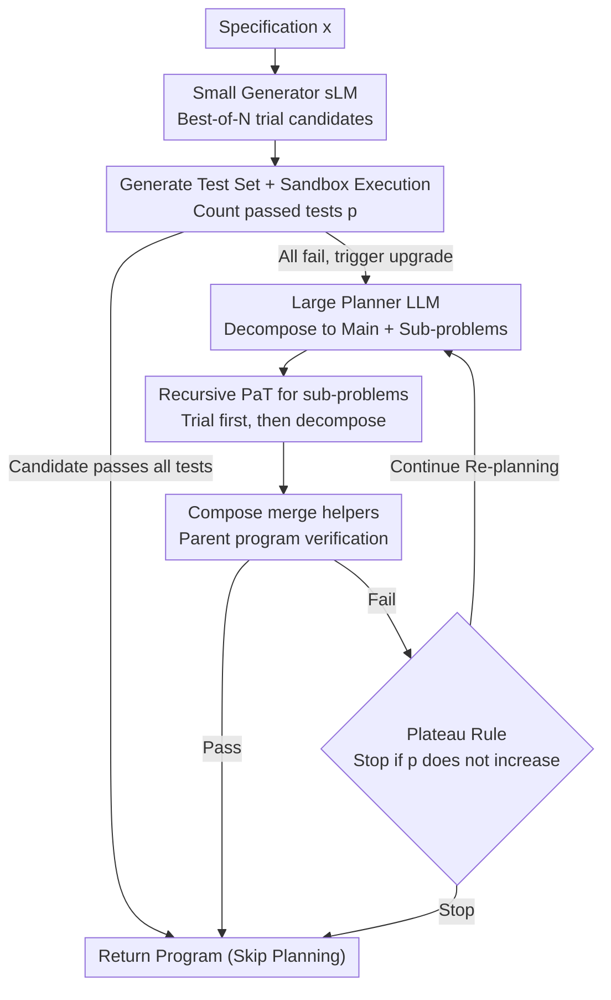

# PaT: Planning-after-Trial for Efficient Test-Time Code Generation

**Conference**: ACL2026  
**arXiv**: [2605.07248](https://arxiv.org/abs/2605.07248)  
**Code**: No public code (not provided in the paper)  
**Area**: Code Intelligence  
**Keywords**: Test-time computation, code generation, adaptive planning, execution verification, heterogeneous models

## TL;DR
PaT shifts the paradigm from "planning before trial" to "planning after trial (and failure)." It uses execution feedback to trigger expensive decomposition steps and significantly improves the trade-off between Pass@1 and inference cost through a heterogeneous configuration consisting of small-model generation and large-model planning.

## Background & Motivation
**Background**: LLM code generation has evolved from single-shot few-shot generation toward test-time computation scaling. Common approaches include Best-of-N sampling, candidate filtering via test generation, iterative debugging, and decomposing complex problems into helper functions. A representative of explicit decomposition is FunCoder, which aims to solve difficult algorithmic problems by "understanding problem structure before implementing sub-problems."

**Limitations of Prior Work**: While decomposition improves success rates for difficult problems, it incurs full planning overhead even for simple ones. The paper notes that small models under standard inference can already solve many foundational code problems; for instance, Qwen3-4B achieves an average Pass@1 of 76.05% on foundational benchmarks. If all problems are planned upfront, many that could be solved directly suffer from unnecessary planning, extra helper generation, and additional verification, causing costs to balloon.

**Key Challenge**: The key to test-time computation is not just "spending more compute," but "on which samples to spend it." Planning-before-Trial (PbT) treats planning as a default pre-step, which suits difficult samples but fails to identify simple ones. Conversely, direct generation is cost-effective but lacks a mechanism to upgrade strategies upon failure. The fundamental trade-off is: earlier planning is more stable but prone to waste; later planning is more efficient but requires a reliable failure signal.

**Goal**: The authors aim to address three sub-problems: first, how to determine if a problem warrants a planning workflow without additional training; second, how to reuse verified sub-solutions after planning to avoid starting from scratch; and third, how to allocate models of different scales to different roles so that common attempts are cheap while critical planning is sufficiently strong.

**Key Insight**: Code generation provides a harder signal than general natural language reasoning: programs can be executed, and candidate solutions can be verified against test cases. PaT observes that if a model fails to pass tests after multiple direct attempts, this is a more credible indicator than a model self-evaluating the problem as "difficult." It suggests the problem likely exceeds direct generation capabilities, making it the appropriate time to initiate planning.

**Core Idea**: Use execution failure as a planning trigger, switching from "plan all samples" to "plan only if verification fails," thereby concentrating expensive test-time computation on code problems that truly require decomposition.

## Method
PaT does not propose a new code model but re-organizes the test-time inference workflow. It treats a code problem as a natural language specification $x$, with the goal of generating a program $\mathcal{F}$ that satisfies the specification. The system involves two collaborating roles: a generator $M_G$ responsible for writing code directly or implementing sub-problems, and a planner $M_P$ responsible for decomposing the original problem into a top-level implementation and several sub-problem specifications $\{x_i\}$ after failure. Finally, a Compose operation merges the main function with verified helper functions into a complete program.

### Overall Architecture
The input is a code generation problem, and the output is the final program. The core of the process is postponing the "to plan or not" decision until after execution feedback is received. PaT first allows the generator to perform Best-of-N trials by sampling multiple candidates for the same specification, then generates a test set $\mathcal{T}(x)$ to execute in a sandboxed Python runtime. The quality of candidates is measured by the number of passed tests $p=\textsc{Evaluate}(\mathcal{F}, \mathcal{T}(x))$. If any candidate passes all tests, the process returns immediately, allowing many simple problems to skip the planner and extra function generation—this is the source of PaT's cost savings.

Only when all direct candidates fail is the planner activated. Based on the original problem and the current set of helpers, the planner provides a new draft of the main implementation and several sub-problems. Each unimplemented sub-problem recursively calls PaT (direct trial first, decomposition only upon failure). After sub-solutions pass their respective tests, they are merged into the helper set and combined back for parent-level verification. If the combined parent program passes all tests, it returns; if it still fails, the system enters a re-planning loop where the planner re-decomposes given the context of successful helpers. A plateau rule (stopping if the number of passed tests does not exceed the previous round) prevents the system from being dragged into high-cost loops by noisy tests or invalid decompositions.

### Key Designs

**1. Failure-Triggered Adaptive Planning: Upgrading only after failure**
Methods like FunCoder (Planning-before-Trial) perform decomposition for every problem. Simple problems are unconditionally charged the full planning cost. Since a significant portion of benchmarks consists of easy or medium problems, this results in considerable waste. PaT allows the generator to execute Best-of-N candidate generation verified by a test set: if a candidate passes all tests, it returns immediately. Only when all candidates fail is this signal interpreted as "direct solving is insufficient," triggering the planner. Crucially, it uses the hard feedback of execution status (acceptance condition $p=|\mathcal{T}(x)|$) as the difficulty criterion rather than relying on the LLM's subjective self-assessment. Because programs are inherently executable, failure signals are more reliable than self-evaluation, significantly reducing average costs.

**2. Test Generation and Plateau Rule: Binary switching against noisy tests**
PaT does not require identifying "which candidate is most likely correct" but rather a clear switch for "whether to upgrade to planning." Consequently, it avoids CodeT-style consensus scoring, instead generating an average of 6.7 test cases per problem and requiring a candidate to pass all tests to succeed. Strict passing reduces false acceptance, but automatically generated tests can be noisy. PaT records the number of passed tests $p^{(t)}$ for each round; when $p^{(t)} \leq p^{(t-1)}$, the plateau rule stops the process and returns the best result from the previous round to avoid repeated planning caused by a few false positives. Figure 3 shows this strict signal is practical: for Qwen3-4B, 63.4% of HumanEval problems generate tests with zero false positives.

**3. Heterogeneous Configuration: Efficient generation and strong planning**
Simply switching to a small model increases failure frequency and planner calls, while using a large model for everything raises the baseline cost of every trial. PaT decouples the generator and planner: the generator handles high-frequency, relatively local direct candidates and sub-problem implementations, suiting a cost-efficient sLM. The planner handles low-frequency decomposition and re-planning requiring global understanding, suiting a stronger LLM. Since the planner is only called upon failure, the high per-unit cost of the large model is amortized across a few difficult samples. The sweet spot for the heterogeneous configuration is a generator "not weak enough to trigger planning too often, yet not as expensive as a large model for simple problems."

### Loss & Training
PaT does not involve training new policy models or additional loss functions; it is a pure inference-time policy implemented via prompting, sampling, test generation, sandbox execution, and recursive planning. For fair comparison, PaT uses the same sampling settings as Best-of-N ($N=5, \text{temperature}=0.8$), while the FunCoder baseline follows its original setting with $N=11$. For cost modeling, the paper uses public token pricing to calculate LLM costs and provides a theoretical analysis in the appendix: if planning costs are lower than the generation costs saved by the heterogeneous setup, there exists a small-model generator that achieves a lower expected cost than a homogeneous large-model strategy.

## Key Experimental Results

### Main Results
The paper evaluates PaT under two settings. The first is the homogeneous setting, where the generator and planner use the same model, to determine if the PaT strategy itself is superior to PbT. The second is the heterogeneous setting, where a strong planner is fixed and generators are replaced with smaller models, to assess whether role separation further reduces costs.

Foundational benchmarks include HumanEval, MBPP, and their EvalPlus extensions. Difficult benchmarks use xCodeEval, categorized by FunCoder's rating scheme into Easy, Mid, Hard, and Expert. Metrics include Pass@1 and normalized LLM cost.

| Setting | Method | Avg Pass@1 | Gain | Rel. Cost | Conclusion |
|------|------|-------------|----------|----------|------|
| Qwen3-4B foundational | Standard | 76.05 | - | 1.00 | Small models solve many basics directly |
| Qwen3-4B foundational | FunCoder | 81.18 | +5.13 | 8.31 | Planning helps, but cost is high |
| Qwen3-4B foundational | PaT | 83.13 | +7.08 | 4.85 | Higher score than FunCoder at ~58% cost |
| Qwen3-8B foundational | FunCoder | 83.82 | +6.18 | 9.43 | PbT remains expensive |
| Qwen3-8B foundational | PaT | 85.58 | +7.94 | 5.00 | Better performance and cost at same scale |
| Qwen3-14B foundational | FunCoder | 84.84 | +5.03 | 8.82 | Planning overhead persists as models scale |
| Qwen3-14B foundational | PaT | 86.18 | +6.37 | 4.91 | Higher avg score with ~56% of FunCoder cost |
| Qwen3-32B foundational | FunCoder | 87.66 | +4.31 | 8.93 | Large models waste cost on easy samples in PbT |
| Qwen3-32B foundational | PaT | 88.37 | +5.02 | 5.09 | Highest avg Pass@1 with lower overhead |

Key takeaway from Table 1: Across all Qwen3 scales (4B, 8B, 14B, 32B), PaT consistently achieves higher average Pass@1 than FunCoder while maintaining roughly 50-60% of the cost. Cross-family results are similar: on Llama3.1-8B, PaT averages 73.31 (vs FunCoder's 71.53); on DeepSeek-Coder, PaT averages 84.19 (vs FunCoder's 83.60).

On more difficult benchmarks like xCodeEval, the performance advantage remains, though cost dynamics are more complex.

| Model | Method | Easy | Mid | Hard | Expert | All | Cost |
|------|------|------|-----|------|--------|-----|------|
| Qwen3-4B | Standard | 37.70 | 17.86 | 3.45 | 0.00 | 18.40 | 1.00 |
| Qwen3-4B | FunCoder | 55.19 | 29.46 | 12.64 | 0.00 | 29.00 | 12.95 |
| Qwen3-4B | PaT | 61.75 | 40.18 | 14.94 | 0.00 | 34.20 | 17.93 |
| Qwen3-8B | Standard | 54.10 | 28.57 | 5.75 | 0.00 | 27.20 | 1.00 |
| Qwen3-8B | FunCoder | 64.48 | 43.75 | 9.20 | 0.00 | 35.00 | 8.62 |
| Qwen3-8B | PaT | 69.95 | 45.54 | 11.49 | 0.00 | 37.80 | 6.98 |
| Qwen3-14B | Standard | 53.55 | 36.61 | 9.20 | 0.00 | 25.20 | 1.00 |
| Qwen3-14B | FunCoder | 73.22 | 52.68 | 18.39 | 0.00 | 41.80 | 9.03 |
| Qwen3-14B | PaT | 73.77 | 53.57 | 21.84 | 0.85 | 43.00 | 6.49 |

Results for xCodeEval show that for harder problems, PaT actively triggers planning. For a weaker model like Qwen3-4B, it is even more expensive than FunCoder due to frequent failures. However, this is not a strategy failure; PaT allocates more budget to truly difficult samples, increasing the "All" score from 29.00 to 34.20. For models 8B and larger, PaT achieves both higher performance and lower cost, indicating that once generator capabilities are sufficient, the cost-benefit of adaptive planning stabilizes.

### Ablation Study
The paper performs policy comparisons and heterogeneous model analysis rather than traditional "remove module A/B" ablations. Table 3 is critical: fixing Qwen3-32B as a strong planner, smaller generators can approach the performance of a homogeneous large-model setup at drastically lower costs.

| Generator | Planner | Avg Pass@1 | Rel. Cost | Note |
|-----------|---------|-------------|----------|------|
| Qwen3-32B | Qwen3-32B | 88.37 | 1.00 | Homogeneous 32B PaT (Upper bound) |
| Qwen3-14B | Qwen3-14B | 86.18 | 0.47 | Homogeneous 14B, lower planning ability |
| Qwen3-14B | Qwen3-32B | 87.53 | 0.49 | Upgrade planner only; nears 32B perf at <1/2 cost |
| Qwen3-8B | Qwen3-8B | 85.58 | 0.25 | Homogeneous 8B, cost-efficient but perf gap |
| Qwen3-8B | Qwen3-32B | 87.39 | 0.31 | <1% gap from 32B-homogeneous at 31% cost |
| Qwen3-4B | Qwen3-32B | 84.78 | 0.18 | Strong planner helps, but 4B generator is bottleneck |

This comparison is compelling: the 8B+32B configuration is the sweet spot. Its average Pass@1 (87.39) is less than 1 point lower than the 32B+32B setup (88.37), while relative cost is only 0.31. Essentially, PaT enables "large models to plan only for few failed samples," making planner upgrades much more efficient than using large models for every trial.

### Key Findings
- PaT's main gains come from "skipping unnecessary planning." On foundational benchmarks, PaT achieves higher scores at lower costs across all Qwen3 scales, proving failure-triggering is better suited for real difficulty distributions than fixed PbT.
- Generated tests are not perfect but serve well as triggers. Figure 3 shows most HumanEval problems yield tests without false positives, and noisy cases are mitigated by the plateau rule.
- The optimal heterogeneous configuration is not "the smaller the better." 4B+32B is cheap but limited in performance, whereas 8B+32B balances cost and capacity effectively.
- For extremely difficult data, PaT may spend more. Qwen3-4B's higher cost on xCodeEval is due to frequent failures, but this results in significant performance gains.
- PaT is not tied to a specific model family, as evidenced by consistent results on Llama3.1 and DeepSeek-Coder.

## Highlights & Insights
- **Verification failure as a budget allocation signal**: The cleverest aspect is avoiding a trained difficulty classifier by using execution failure to trigger planning. Code tasks provide reliable feedback, which is lighter and more reproducible than learning a policy.
- **Reversing the PbT assumption**: FunCoder assumes "complex problems need planning, so plan first." PaT assumes "if it can be solved directly, don't plan." This small shift has a massive impact on the cost curve because benchmarks contain many simple/medium problems.
- **Practicality of heterogeneous configurations**: Many systems already have various model sizes available. PaT provides a natural division of labor: small models for high-frequency generation, large models for infrequent planning. This can generalize to math reasoning or agent workflows with clear failure signals.
- **Plateau rule as a necessary guardrail**: Merely saying "plan on failure" could trap the system in loops caused by incorrect tests. Using a non-increasing pass count as a stop condition is simple but transforms recursive planning into a controllable test-time loop.

## Limitations & Future Work
- PaT depends heavily on verification quality. Code can be executed, but tasks like open-ended generation or long-form writing lack similarly clear pass/fail signals.
- Generated tests can still have false positives or omissions. While strict passing reduces false acceptance, incorrect tests may trigger unnecessary planning or premature stops.
- On extremely difficult data, small generators fail frequently, leading to excessive planner calls. The 4B results on xCodeEval suggest generator size must be tuned rather than mechanically picking the cheapest model.
- Expert-level xCodeEval remains mostly unsolved. Even though PaT moves Expert scores from 0 to 0.85/1.69 on Qwen3-14B/32B, the absolute success rate is low, suggesting recursive decomposition cannot replace stronger algorithmic reasoning.
- The evaluation focuses on Python-style environments. Future work could include more languages, real-world repositories, and multi-file code generation.

## Related Work & Insights
- **vs FunCoder**: FunCoder uses fixed Planning-before-Trial, decomposing the hierarchy first; PaT uses direct trials first. PaT's advantage is avoiding waste on easy problems, while its disadvantage is potentially triggering more rounds when weak models face hard problems.
- **vs CodeT**: CodeT uses consensus-based selection; PaT uses tests as a binary control signal for upgrading to planning. Both leverage execution feedback but for different optimizations.
- **vs Best-of-N**: Best-of-N only expands the candidate pool without changing the solution structure when all candidates are wrong; PaT introduces decomposition and recursion for hard cases.
- **vs Learned adaptive policies**: Some methods train auxiliary models to decide when to plan; PaT avoids this, highlighting that hard feedback loops are preferable when available.

## Rating
- Novelty: ⭐⭐⭐⭐ Reversing the planning order is simple but effective; innovation lies in the test-time strategy and role allocation.
- Experimental Thoroughness: ⭐⭐⭐⭐ Covers various scales, model families, and difficulty levels with detailed cost analyses.
- Writing Quality: ⭐⭐⭐⭐ Clear motivation and cost-performance narrative; some tables are dense and require careful cross-referencing.
- Value: ⭐⭐⭐⭐⭐ Extremely valuable for real-world engineering, as it addresses when to invoke expensive reasoning processes during deployment.

<!-- RELATED:START -->

## Related Papers

- [\[ACL 2026\] Ro-SLM: Onboard Small Language Models for Robot Task Planning and Operation Code Generation](ro-slm_onboard_small_language_models_for_robot_task_planning_and_operation_code_.md)
- [\[ACL 2026\] CollabCoder: Plan-Code Co-Evolution via Collaborative Decision-Making for Efficient Code Generation](collabcoder_plan-code_co-evolution_via_collaborative_decision-making_for_efficie.md)
- [\[NeurIPS 2025\] Program Synthesis via Test-Time Transduction](../../NeurIPS2025/code_intelligence/program_synthesis_via_test-time_transduction.md)
- [\[ICLR 2026\] IMSE: Intrinsic Mixture of Spectral Experts Fine-tuning for Test-Time Adaptation](../../ICLR2026/code_intelligence/imse_intrinsic_mixture_of_spectral_experts_fine-tuning_for_test-time_adaptation.md)
- [\[ACL 2026\] DUET: Dual Execution for Test Output Prediction with Generated Code and Pseudocode](duet_dual_execution_for_test_output_prediction_with_generated_code_and_pseudocod.md)

<!-- RELATED:END -->
