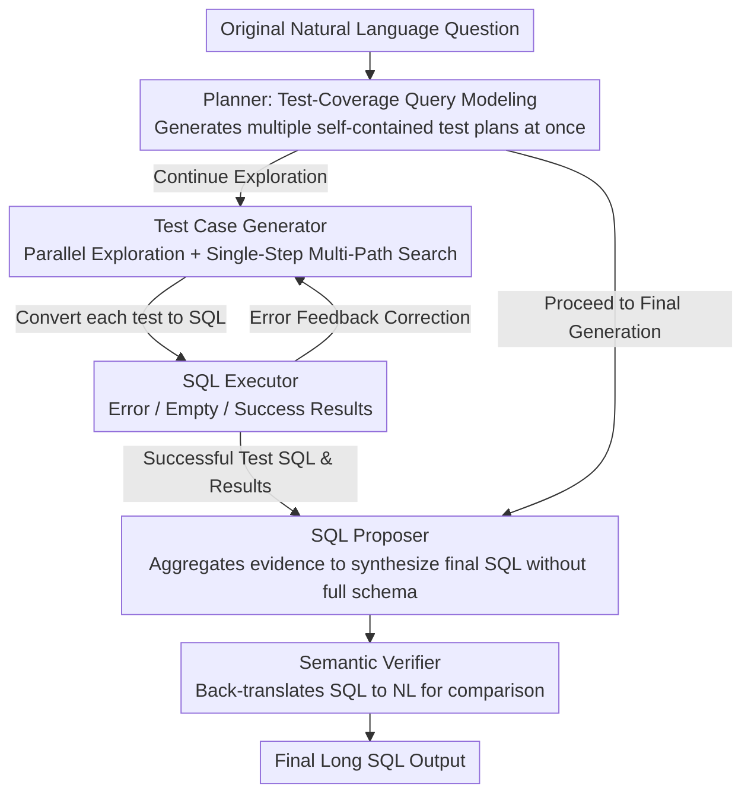

# PExA: Parallel Exploration Agent for Complex Text-to-SQL

**Conference**: ACL2026  
**arXiv**: [2604.22934](https://arxiv.org/abs/2604.22934)  
**Code**: Not disclosed  
**Area**: LLM Agent / Text-to-SQL / Database Question Answering  
**Keywords**: Text-to-SQL, LLM Agent, Parallel Exploration, Software Testing, Spider 2.0  

## TL;DR
PExA reformulates complex Text-to-SQL as a parallel exploration problem of "generating and executing a set of semantic test cases for a natural language query." Through three sub-agents—Planner, Test Case Generator, and SQL Proposer—it improves execution accuracy on Spider 2.0 while maintaining latency levels comparable to strong baselines.

## Background & Motivation
**Background**: Text-to-SQL has evolved from early parsing models to LLM agents. Facing realistic and complex database benchmarks like Spider 2.0, systems typically require schema linking, database compression, multi-step reasoning, execution feedback, and self-correction to handle large tables, multiple databases, nested types, and long SQL queries.

**Limitations of Prior Work**: Strong performance often comes at the cost of longer sequential reasoning or more tool calls. An agent that sequentially plans, queries schema, writes SQL, executes, and corrects may show performance gains, but latency accumulates per step. In interactive data analysis, users find it difficult to accept long wait times for every question.

**Key Challenge**: While complex queries indeed require exploring more database information, exploration does not necessarily have to be serial. Existing methods treat user questions as a single long SQL generation task, which easily gets stuck in one reasoning chain. If decomposed into parallelizable semantic requirements, evidence can be collected simultaneously.

**Goal**: Ours aims to improve the performance-latency Pareto frontier for Text-to-SQL: achieving higher execution accuracy on Spider 2.0 while avoiding performance gains through linearly increasing reasoning steps.

**Key Insight**: The paper draws inspiration from software testing. Complex programs are not proven correct all at once but are verified through test suites covering different functional requirements. Complex NL queries can also be viewed as a collection of several semantic requirements. A batch of simpler SQL "test cases" can be generated first to cover local semantics like filtering, joining, aggregation, and existence checks, with these execution results supporting the final SQL.

**Core Idea**: Transform Text-to-SQL from single-chain generation to test-coverage-style parallel exploration. Use multiple executable test-case SQLs to probe the database simultaneously, and finally aggregate evidence to generate the complete SQL.

## Method
The key to PExA is prepending the "thinking through the final SQL" with "first verifying a set of small questions." These small questions are not ordinary query decomposition, as they can explore database information beyond the original question but related to it, such as identifying existing values in a field, whether a join returns non-empty results, or whether a filter condition is reasonable. The execution results of the test cases become the grounding context for the final SQL.

### Overall Architecture
The system consists of three sub-agents and two tools. The Planner receives the original natural language question, generates a set of self-contained test cases, and decides whether to continue exploration or proceed to final generation. The Test Case Generator converts each natural language test case into SQL, calls the SQL Executor to run it, and corrects based on error feedback. The SQL Proposer takes only the original question, test-case SQLs, and execution results—without the full database metadata—and synthesizes the final long SQL. The two tools are the SQL Executor and the Semantic Verifier: the former returns compilation errors, empty results, or success results; the latter back-translates the SQL into natural language and compares it with the original question to identify semantic deviations.

Parallelism is integrated at three levels. The Planner generates multiple test plans in one forward pass; the Test Case Generator generates and executes independent test cases in parallel; and within each test case, multiple candidate SQLs are generated at once, forming a single-step multi-path search. The final latency is approximately determined by the slowest branch rather than the sum of all branch latencies.

### Key Designs

**1. Test-driven query modeling: Decomposing complex problems into a set of independently executable SQL tests, using coverage to approximate original semantics.**

Complex Text-to-SQL is difficult because a single reasoning chain must simultaneously resolve schema selection, value constraints, join paths, and aggregation logic; a mistake in any link breaks the final long SQL. PExA utilizes intuition from software testing: instead of proving the entire program correct at once, utilize a suite of tests covering different functional requirements to verify items individually. It generates several self-contained, executable small SQL "test cases" for the original question, each covering a local requirement—filter, join, aggregation, existence check, or field value distribution.

The difference from ordinary query decomposition is critical: decomposition merely restates explicit semantics already written in the original question, while test cases can actively probe database information adjacent to the original query but not directly stated, such as "will this join return an empty set" or "which values does this filter condition actually capture." These test SQL execution results then serve as the grounding context for final synthesis, allowing the Proposer to assemble the SQL based on verified local evidence rather than guessing from scratch.

**2. Three-agent division of labor: Separating planning, local execution, and final synthesis, with each facing a narrower context.**

Errors in complex Text-to-SQL are often concentrated in early planning and long-context reasoning—an agent reading the full schema while thinking about global logic can easily miss details. PExA splits the process into three sub-agents: the Planner receives the original question and generates test plans; the Test Case Generator combines lightweight schema linking with compressed schemas to convert each natural language test into executable SQL, iterating based on executor feedback; the SQL Proposer takes only the original question, the successful test SQLs, and their results to synthesize the final long SQL, intentionally ignoring the full database metadata.

Two tools support this chain: the SQL Executor returns compilation errors or results; the Semantic Verifier back-translates the SQL to NL to identify semantic deviations. With this division, each agent only solves one sub-problem, and the Proposer specifically avoids the contextual burden of a massive schema, focusing solely on "integrating evidence."

**3. Parallel exploration and single-step multi-path search: Expanding search width without letting width accumulate linearly into latency.**

Uncertainty in Text-to-SQL stems from schema selection, value constraints, and join paths. Expanding search width increases the probability of hitting the correct semantics—but if expanded serially, width translates directly into wait time, which is unacceptable for interactive analysis. PExA implements parallelism in three places: the Planner generates multiple test plans in one forward pass; the Test Case Generator runs independent test cases in parallel; and each test case produces multiple candidate SQLs in a single LLM call, forming a single-step multi-path search where failed paths are quickly eliminated via execution feedback. The resulting final latency is approximately determined by the slowest branch. Experimental results on the same search space showed serial expansion took ~680 seconds, while parallel execution reduced it to 351 seconds.

### Key Experimental Results

### Main Results
Experiments were conducted on the Snow and Lite* versions of Spider 2.0. Snow contains 547 samples from 150+ databases with an average of ~800 columns per database using the Snowflake dialect; Lite* excludes BigQuery samples. Metrics include Execution Accuracy (EX), EX@4, and average wall time.

| Method | Snow EX | Snow EX@4 | Lite* EX | Lite* EX@4 | Wall Time (min) |
|------|---------|-----------|----------|------------|-----------------|
| Spider-Agent | 25.2 | 27.4 | 26.2 | 28.7 | 5.90 |
| ReFoRCE | 36.6 | 39.7 | 36.2 | 39.5 | 5.44 |
| Chat2DB | 44.1 | - | - | - | - |
| AgenticData | - | - | 44.5 | - | - |
| **Ours (PExA)** | **45.7** | **49.5** | **46.6** | **49.9** | **5.55** |

| Additional Comparison | Snow EX | Snow EX@4 | Description |
|------|---------|-----------|------|
| Ours (PExA) | 45.7 | 49.5 | Default schema linking |
| Ours w/ Gold Schema | 47.2 | 50.8 | Using gold schema only gives ~1.5 point gain |
| Updated Leaderboard | 70.2 | - | Claimed new SOTA on Spider 2.0 at submission |

### Ablation Study

| Configuration | EX | Relative to Full | Description |
|------|----|-----------|------|
| **Ours (PExA) Full** | **42.9** | - | Analysis on Snow single-run |
| w/o Plan-time parallelization | 40.0 | -2.9 | Planning parallel test suites is critical |
| w/o Test-time parallelization | 39.9 | -3.0 | Parallel test generation/execution contributes most |
| w/o Semantic Verifier | 42.3 | -0.6 | Verifier fixes some deviations but is not the main bottleneck |
| w/o Proposer | 41.1 | -1.8 | Returning directly from test phases loses integration ability |

### Key Findings
- PExA outperforms ReFoRCE on both Snow and Lite*, increasing Snow EX from 36.6 to 45.7 and Lite* EX from 36.2 to 46.6, with a wall time of 5.55 min comparable to ReFoRCE's 5.44 min.
- Ablations show the two parallel components each contribute ~3 EX points, more than the Semantic Verifier’s 0.6, indicating performance comes from search width rather than final checking.
- Gold schema only provides a ~1.5 point gain, suggesting the current bottleneck is not schema linking but complex semantic planning and long-range logic composition.
- Error analysis indicates main failures come from semantic misunderstanding and initial planning flaws rather than SQL syntax errors.

## Highlights & Insights
- The software testing perspective fits complex Text-to-SQL perfectly. High-quality SQL is not guessed; it is built on local hypotheses verified against the database.
- Parallelization is not mere multi-sampling; each path has a clear semantic goal, avoiding uncontrolled token waste.
- The small performance gap between default and gold schema suggests that in large-scale schemas like Spider 2.0, high-level planning and semantic coverage are more critical than optimizing schema linking.

## Limitations & Future Work
- Dependency on strong closed-source LLMs (GPT-o3). Multi-agent systems with open models require further verification.
- Parallel exploration reduces wall time but does not necessarily reduce total token count or API costs.
- Test case quality depends heavily on the Planner. If initial coverage is wrong, parallel execution merely collects irrelevant evidence faster.
- Semantic Verifier back-translation may still be affected by the LLM's own misjudgments.

## Related Work & Insights
- **vs Spider-Agent**: While Spider-Agent is a tool-augmented agent, PExA explicitly organizes exploration into parallel test suites, achieving a better accuracy-latency frontier.
- **vs ReFoRCE**: ReFoRCE emphasizes database compression and inference-time scaling. PExA uses lightweight linking but adds parallel test-case coverage and evidence aggregation.
- **vs Query Decomposition**: Standard decomposition only splits explicit sub-semantics; PExA test cases can actively explore adjacent schemas and value distributions.

## Rating
- Novelty: ⭐⭐⭐⭐⭐ Reframing Text-to-SQL as test-driven parallel exploration is highly distinct and provides a natural justification for parallelism.
- Experimental Thoroughness: ⭐⭐⭐⭐☆ Strong results on Spider 2.0 with detailed ablations, though open-model replication is missing.
- Writing Quality: ⭐⭐⭐⭐☆ Method is clear and tables support the claims.
- Value: ⭐⭐⭐⭐⭐ Offers reusable insights for Text-to-SQL and tool-use agents, specifically the "test-first" parallel exploration paradigm.

<!-- RELATED:START -->

## Related Papers

- [\[ACL 2026\] R$^3$-SQL: Ranking Reward and Resampling for Text-to-SQL](r3-sql_ranking_reward_and_resampling_for_text-to-sql.md)
- [\[ACL 2026\] PV-SQL: Synergizing Database Probing and Rule-based Verification for Text-to-SQL Agents](pv-sql_synergizing_database_probing_and_rule-based_verification_for_text-to-sql_.md)
- [\[ACL 2026\] DPC: Training-Free Text-to-SQL Candidate Selection via Dual-Paradigm Consistency](dpc_training-free_text-to-sql_candidate_selection_via_dual-paradigm_consistency.md)
- [\[ACL 2025\] STaR-SQL: Self-Taught Reasoner for Text-to-SQL](../../ACL2025/code_intelligence/star-sql_self-taught_reasoner_for_text-to-sql.md)
- [\[ACL 2025\] SHARE: An SLM-based Hierarchical Action CorREction Assistant for Text-to-SQL](../../ACL2025/code_intelligence/share_text_to_sql_correction.md)

<!-- RELATED:END -->
