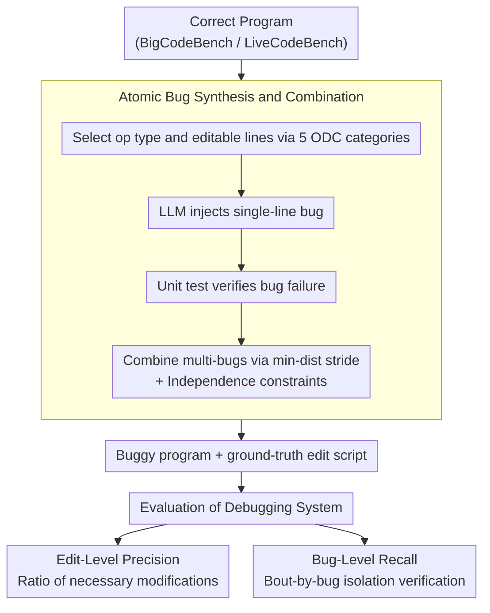

# Precise Debugging Benchmark: Is Your Model Debugging or Regenerating?

**Conference**: ACL 2026 Findings  
**arXiv**: [2604.17338](https://arxiv.org/abs/2604.17338)  
**Code**: [GitHub](https://github.com)  
**Area**: Code Intelligence / Debugging Evaluation  
**Keywords**: Code Debugging, LLM Programming, Precise Editing, Benchmark, Code Regeneration

## TL;DR

This paper reveals the "regeneration" tendency of frontier LLMs in debugging tasks. By introducing the PDB framework and edit-level precision/bug-level recall metrics, the study finds that while models like GPT-5.1-Codex can pass over 76% of unit tests, their edit precision is below 45%. Furthermore, iterative and agent debugging strategies fail to significantly improve precision.

## Background & Motivation

**Background**: LLMs have achieved significant success in code generation, synthesizing complex algorithms from natural language descriptions. However, the primary work in real-world software development is debugging and maintenance rather than generation from scratch.

**Limitations of Prior Work**: (1) When provided with buggy code, models often rewrite large portions or even the entirety of the code to "fix" it—while this passes tests, it is costly, risky, and difficult to review in production codebases; (2) Existing debugging benchmarks rely solely on unit test pass rates, failing to distinguish between precise fixes and massive rewrites—rewriting a whole function and fixing a single-line bug receive the same score; (3) For multi-bug programs, models that fix only a portion of the bugs receive the same zero score as models that fix none.

**Key Challenge**: There is a negative correlation between unit test pass rates and debugging precision—the more aggressively a model rewrites code, the more likely it is to pass tests (functional correctness), but the lower its edit precision becomes. Existing evaluation systems reward regeneration behavior and fail to incentivize precise debugging.

**Goal**: (1) Design an evaluation framework capable of distinguishing "precise debugging" from "code regeneration"; (2) Quantify the gap between current frontier models and precise debugging; (3) Evaluate whether iterative and agent debugging strategies improve precision.

**Key Insight**: Define two new metrics—"Edit-Level Precision" and "Bug-Level Recall." Precision measures how many of the model's modifications are necessary, while recall measures how many bugs are correctly fixed. A debugging benchmark with ground-truth edit scripts is constructed by automatically injecting verified atomic bugs and combining them into multi-bug programs.

**Core Idea**: Shift debugging evaluation from the program level (pass/fail) to the edit level (which modifications are necessary vs. redundant). Construct a precise evaluation benchmark through atomic bug synthesis and independence verification.

## Method

### Overall Architecture

The core of PDB (Precise Debugging Benchmark) is shifting debugging evaluation from "whether the program as a whole passes tests" to "which edits are necessary and which bugs are truly fixed." This requires buggy programs with ground-truth edit scripts. The framework consists of two stages: the generation stage starts from existing programming datasets, uses LLMs to inject verified atomic bugs into correct programs, and combines them into multi-bug programs; the evaluation stage requires the debugging system to fix these buggy programs, measuring "precision" rather than just "functional correctness" using edit-level precision and bug-level recall. The benchmark includes PDB-Single-Hard (5,751 single-line bug samples) and PDB-Multi (256 multi-line bug samples) built from BigCodeBench and LiveCodeBench. The bug generator pool consists of GPT-5.1-Codex, Claude-4.5-Sonnet, and Gemini-2.5-Pro. The framework involves no model training.

### Key Designs

**1. Atomic Bug Synthesis and Combination: Constructing buggy programs with ground-truth edit scripts and precise measurability**

To measure "whether modifications are necessary," it is essential to know exactly which lines should be changed. Bug mining from historical commits often lacks clean ground-truth edits and contains irrelevant changes. PDB uses active injection: for each ground-truth program, operation types (insert/delete/replace) and editable lines are randomly selected based on 5 ODC (Orthogonal Defect Classification) categories (Assignment, Checking, Algorithm, Build/Package, Timing). LLMs inject single-line bugs, verified via unit tests. Multi-bug programs are then synthesized by combining independent atomic bugs with a minimum stride and independence constraints. This ensures atomicity (fixing cannot succeed by only addressing a subset of bugs) and independence (fixing one bug does not affect others), which are prerequisites for defining edit-level precision and bug-level recall.

**2. Edit-Level Precision: Quantifying how many of the model's modifications are truly necessary**

Traditional unit test pass rates fail to penalize redundant changes, such as rewriting a function to fix a one-line bug. The precision metric shifts evaluation to the line level, answering "is this modification necessary?": $$\text{precision}_\epsilon = \frac{1}{|\hat{E}|} \sum_{i=1}^k F_\mathcal{U}(\hat{C}_i) \cdot (|\hat{E}_i|)_\epsilon$$. A mapping function is used to correspond ground-truth edits with predicted edits, and an essential function searches for the minimum sub-edit that allows tests to pass, while a tolerance $\epsilon$ allows for minor redundancy. The denominator is the actual edit volume, and the numerator is the part determined to be necessary; thus, large-scale rewrites directly lower the score.

**3. Bug-Level Recall: Providing partial credit for partial fixes in multi-bug scenarios**

If program-level "all-or-nothing" scoring is used, a model fixing 2 out of 3 bugs scores zero, which is unfair and fails to characterize debugging capability. Recall shifts the granularity to individual bugs: $$\text{recall} = \frac{1}{k} \sum_{i=1}^k F_\mathcal{U}(\hat{C}_i)$$. For each bug $i$, a pseudo-fixed version is constructed—retaining ground-truth fixes for all other bugs and only using the model's fix for bug $i$—to see if unit tests pass. Because the previous step ensures bug independence, this "isolated verification" allows the multi-bug repair rate to be represented as the proportion of correctly fixed bugs.

## Key Experimental Results

### Main Results

| Model | Precision | Recall | Unit Test (%) |
|------|------|------|-------------|
| Claude-Sonnet-4.5 | **71.8** | **81.4** | 75.7 |
| Gemini-2.5-Pro | 71.4 | 83.5 | 78.1 |
| Qwen3-Coder-480B | 65.8 | 77.2 | 70.3 |
| DeepSeek-V3.2 | 48.4 | 70.0 | 71.4 |
| DeepSeek-V3.2-Thinking | 45.0 | 71.2 | **79.0** |
| GPT-5.1-Codex | 39.7 | 71.7 | 76.1 |

### Ablation Study

| Analysis Dimension | Result |
|----------|------|
| Free Prompt vs. Minimal Edit Prompt | Precision plummeted for all models under free prompt; Gemini dropped 40 absolute points. |
| Iterative Debugging (3 rounds) | Improved pass rate and recall, but precision remained stagnant or decreased. |
| Agent Debugging (with test feedback) | Claude-Code precision remained at ~50%; extra feedback exacerbated regeneration. |
| Impact of Bug Count | More bugs led to lower precision (more redundant edits); recall depended on the dataset. |

### Key Findings

- **Ranking Reversal**: GPT-5.1-Codex ranked high in unit test pass rate (76.1%) but last in precision (39.7%)—it is the most severe "regenerator."
- Qwen3-Coder-480B, despite a lower pass rate (70.3%), achieved high precision (65.8%)—"weak but precise."
- Model debugging behaviors can be categorized into four types: Precise Pass, Weak but Precise, Weak but Locating, and Pass-Oriented (Regeneration).
- Iterative and agent strategies improve functional correctness but not precision—current methods fix bugs by expanding the scope of modification rather than precise localization.
- Bug interaction occurs in approximately 1.65% of cases, meaning PDB's independence assumption holds in the vast majority of scenarios.

## Highlights & Insights

- The question "Debugging or Regenerating?" targets a core pain point of current code LLMs, revealing the fundamental flaw of unit test evaluation.
- The definitions of Edit-Level Precision and Bug-Level Recall are precise and practical, with direct utility for improving post-training pipelines.
- The finding that GPT-5.1-Codex has a precision of only 39.7% is striking—the strongest model is the least precise, suggesting that post-training processes may be reinforcing regeneration behaviors.

## Limitations & Future Work

- The assumption of bug independence often fails in real-world software—interacting bugs are the true challenge of debugging.
- Only Python is evaluated; the applicability to other languages needs verification.
- Semantic equivalents that differ from the ground-truth form may be unfairly penalized.
- How to improve post-training to enhance precision remains unexplored—this represents the most valuable future direction.

## Related Work & Insights

- **vs DebugBench**: DebugBench mines bugs from historical commits but uses only unit tests for evaluation, failing to measure precision; PDB fills this gap with edit-level evaluation.
- **vs SWE-bench**: SWE-bench focuses on real repo-level fixes involving complex localization but lacks precision metrics; the two are complementary.
- **vs APR (Automated Program Repair)**: Traditional APR focuses on minimal fixes; PDB introduces this philosophy to LLM evaluation.

## Rating

- Novelty: ⭐⭐⭐⭐⭐ Proposes a paradigm shift in debugging evaluation from program-level to edit-level.
- Experimental Thoroughness: ⭐⭐⭐⭐⭐ Evaluates 9 frontier models, iterative/agent/multi-line/categorical analysis, and manual verification of metric accuracy.
- Writing Quality: ⭐⭐⭐⭐⭐ Precise problem definitions, rigorous formalization, and in-depth analysis.
- Value: ⭐⭐⭐⭐⭐ Reveals fundamental issues in code LLM post-training with significant implications for the community.

<!-- RELATED:START -->

## Related Papers

- [\[ACL 2025\] MLDebugging: Towards Benchmarking Code Debugging Across Multi-Library Scenarios](../../ACL2025/code_intelligence/mldebugging_towards_benchmarking_code_debugging_across_multi-library_scenarios.md)
- [\[ACL 2025\] Revisit Self-Debugging with Self-Generated Tests for Code Generation](../../ACL2025/code_intelligence/revisit_self-debugging_with_self-generated_tests_for_code_generation.md)
- [\[ACL 2026\] QiMeng-PRepair: Precise Code Repair via Edit-Aware Reward Optimization](qimeng-prepair_precise_code_repair_via_edit-aware_reward_optimization.md)
- [\[ACL 2026\] River-LLM: Large Language Model Seamless Exit Based on KV Share](river-llm_large_language_model_seamless_exit_based_on_kv_share.md)
- [\[ACL 2025\] CoCo-Bench: A Comprehensive Code Benchmark for Multi-task Large Language Model Evaluation](../../ACL2025/code_intelligence/coco-bench_a_comprehensive_code_benchmark_for_multi-task_large_language_model_ev.md)

<!-- RELATED:END -->
