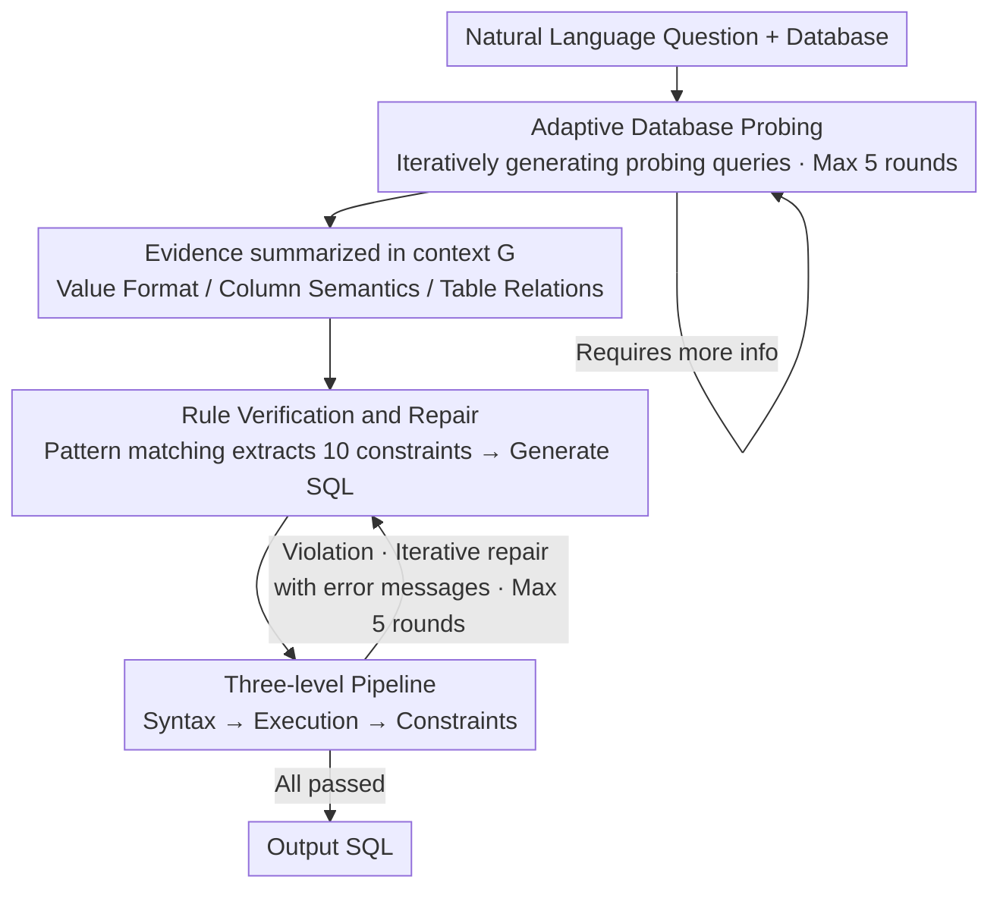

# PV-SQL: Synergizing Database Probing and Rule-based Verification for Text-to-SQL Agents

**Conference**: ACL 2026 Findings  
**arXiv**: [2604.17653](https://arxiv.org/abs/2604.17653)  
**Code**: [GitHub](https://github.com/magic-YuanTian/PV-SQL)  
**Area**: Text-to-SQL / Agent  
**Keywords**: Text-to-SQL, Database Probing, Rule Verification, Semantic Constraints, Agent Framework

## TL;DR

This paper proposes PV-SQL, an agentic Text-to-SQL framework. By integrating two complementary components—Probe (iteratively generating probing queries to discover database value formats, column semantics, and table relationships) and Verify (extracting verifiable constraints via pattern matching to build checklists)—it achieves a 5% higher Execution Accuracy and a 20.8% higher Valid Efficiency Score on the BIRD benchmark compared to state-of-the-art baselines.

## Background & Motivation

**Background**: Text-to-SQL has made significant progress with the support of LLMs, yet it faces persistent challenges: schema understanding, value anchoring (mapping natural language to precise database values), and constraint satisfaction (ensuring SQL faithfully captures all semantics).

**Limitations of Prior Work**: (1) Approximately 41% of failures result from database misunderstanding—e.g., the model does not know if "California" is stored as "CA" or the full name. (2) Even with correct understanding, SQL generation lacks internal verification mechanisms, potentially producing syntactically correct but semantically incorrect queries. (3) Existing verification methods (LLM self-correction or test case generation) are often unreliable or computationally expensive.

**Key Challenge**: Relying solely on schema descriptions (DDL) lacks actual data values, yet including all values in the prompt is infeasible. An on-demand, question-driven exploration of database content is required.

**Goal**: Solve understanding errors through adaptive database probing and address synthesis errors through deterministic rule-based verification.

**Key Insight**: Probe enhances the input (enriching context with real database evidence), and Verify enhances the output (ensuring semantic constraints are met). These two components address complementary failure types.

**Core Idea**: Enable the SQL Agent to "examine what the data looks like" before writing the query, much like a data analyst, and then conduct a line-by-line check of constraints like a code reviewer.

## Method

### Overall Architecture

PV-SQL categorizes Text-to-SQL failures into two types: database/question misunderstanding on the input side, and SQL synthesis errors on the output side. These are addressed in two complementary stages. Given a natural language question and a database, the Agent first enters the Probe phase: it iteratively generates temporary probing queries (up to 5 rounds) to inspect real data. Discovered evidence regarding value formats, column semantics, and table relationships is accumulated into the context $G$. Subsequently, it enters the Verify & Repair phase: deterministic pattern matching extracts verifiable constraints from the question to generate the SQL. The SQL is then checked against the constraints line-by-line; if satisfied, it is output; otherwise, it is iteratively repaired using error messages (up to 5 rounds). This framework is training-free and compatible with various base LLMs (GPT-4o/4.1, Claude 3.5/3.7, Gemini 2.0/2.5).

### Key Designs

**1. Adaptive Database Probing: Inspecting data before querying to fill value gaps in DDL**

About 41% of failures stem from database misunderstanding—for instance, the model being unaware whether "California" is stored as "CA". Since DDLs provide structure without actual values, and including all values is impractical, PV-SQL allows the Agent to judge if more information is needed. It generates SELECT queries with LIMIT clauses to retrieve samples, then summarizes findings into natural language evidence (e.g., "California is stored as CA", "late means ship_date > required_date") appended to context $G$. Unlike static retrieval-based augmentation, this probing is question-adaptive, exploring only the database facets necessary for the current query.

**2. Verify & Repair: Converting implicit semantic constraints into a deterministic checklist**

Correct understanding does not guarantee correct SQL synthesis. As LLM self-verification is unreliable and test case generation is costly, PV-SQL uses deterministic pattern matching to extract 10 types of verifiable constraints from the question (e.g., DISTINCT from "unique", TOP-K from "first N", COUNT from "how many"). The generated SQL undergoes a pipeline of syntax, execution, and constraint checks. Each violation produces a descriptive error message to guide the discovery of synthesis errors. This approach is reliable (deterministic), lightweight (no extra LLM calls), and interpretable, prioritizing precision over recall to avoid misleading the repair process with false positives.

**3. Complementarity of Probe and Verify: Addressing failures at both input and output stages**

The design is driven by error analysis: Probe enhances input with real database evidence, targeting 41.3% of database misunderstandings $\varepsilon_D$ and 24.8% of question misunderstandings $\varepsilon_Q$. Verify enhances output with a constraint checklist, targeting 33.9% of synthesis errors $\varepsilon_S$. Because they target non-overlapping failure sources, the cumulative gain is nearly the sum of their individual contributions—observed in the ablation where Probe (+4.3pp) and Verify (+3.0pp) show additive improvements.

## Key Experimental Results

### Main Results

**BIRD Benchmark Execution Accuracy**

| Method | Execution Accuracy (%) | Valid Efficiency Score |
|------|-------------|---------|
| Prev. SOTA (TS-SQL) | ~60 | ~66 |
| **Ours (PV-SQL)** | **65.12** | **86.9** |

### Ablation Study

| Configuration | Execution Accuracy | Note |
|------|---------|------|
| PV-SQL | 65.12 | Full |
| w/o Probe | 60.8 | Removed Probing, -4.3pp |
| w/o Verify | 62.1 | Removed Verification, -3.0pp |
| w/o Both | 57.3 | Reverted to baseline |

### Key Findings

- Probe and Verify contribute approximately 4.3pp and 3.0pp respectively, with their effects being nearly additive.
- PV-SQL has lower token consumption than TS-SQL, as rule verification is more efficient than generating LLM-based test cases.
- Probe provides the largest Gain on "hard" difficulty questions, where value anchoring is most critical.
- The precision of constraint extraction exceeds 90%, validating the "precision-first" strategy.

## Highlights & Insights

- The "inspect data before querying" strategy is practical and intuitive, simulating a human data analyst's workflow.
- Using rules as "test cases" for SQL is a clever analogy; while SQL lacks intrinsic test cases, the question itself contains verifiable semantic constraints.
- Simple pattern matching for 10 constraint types is highly effective, embodying the engineering philosophy of "simple solutions first."

## Limitations & Future Work

- Rule-based verification only covers 10 constraint types; complex semantic constraints still rely on LLM understanding.
- A maximum of 5 probing rounds may be insufficient for highly complex databases.
- Evaluation is currently limited to the BIRD benchmark series.
- Probing queries might potentially leak sensitive data information.

## Related Work & Insights

- **vs TS-SQL**: TS-SQL uses LLMs to generate verification test cases, while PV-SQL's rule-based verification is more reliable and lightweight.
- **vs DIN-SQL**: DIN-SQL decomposes the problem but lacks database probing; PV-SQL adds the dimension of database understanding.
- **vs MAC-SQL**: A multi-agent framework that lacks an explicit verification mechanism.

## Rating

- **Novelty**: ⭐⭐⭐⭐ The complementary design of Probe+Verify is innovative; the rule-based verification is a practical entry point.
- **Experimental Thoroughness**: ⭐⭐⭐⭐⭐ Comprehensive evaluation across 7 baselines, 6 LLMs, and 3 benchmarks, featuring detailed ablation and error analysis.
- **Writing Quality**: ⭐⭐⭐⭐⭐ Problem-driven, clear motivation, and vivid examples.
- **Value**: ⭐⭐⭐⭐⭐ Directly advances the practical application of Text-to-SQL.

<!-- RELATED:START -->

## Related Papers

- [\[ACL 2026\] R$^3$-SQL: Ranking Reward and Resampling for Text-to-SQL](r3-sql_ranking_reward_and_resampling_for_text-to-sql.md)
- [\[ACL 2026\] PExA: Parallel Exploration Agent for Complex Text-to-SQL](pexa_parallel_exploration_agent_for_complex_text-to-sql.md)
- [\[ACL 2025\] STaR-SQL: Self-Taught Reasoner for Text-to-SQL](../../ACL2025/code_intelligence/star-sql_self-taught_reasoner_for_text-to-sql.md)
- [\[ACL 2026\] DPC: Training-Free Text-to-SQL Candidate Selection via Dual-Paradigm Consistency](dpc_training-free_text-to-sql_candidate_selection_via_dual-paradigm_consistency.md)
- [\[ACL 2025\] SHARE: An SLM-based Hierarchical Action CorREction Assistant for Text-to-SQL](../../ACL2025/code_intelligence/share_text_to_sql_correction.md)

<!-- RELATED:END -->
