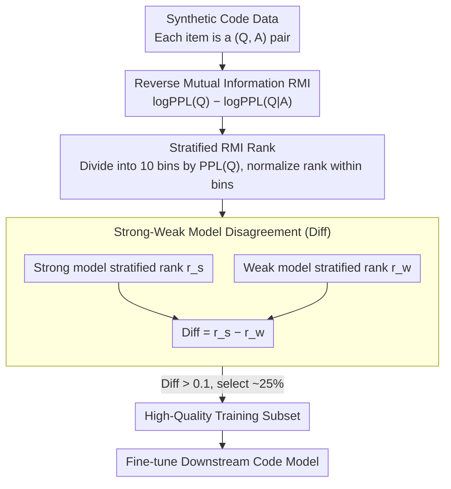

# QAQ: Bidirectional Semantic Coherence for Selecting High-Quality Synthetic Code Instructions

**Conference**: ACL2026  
**arXiv**: [2603.12165](https://arxiv.org/abs/2603.12165)  
**Code**: Not open-sourced  
**Area**: Code Intelligence / Synthetic Data Selection  
**Keywords**: Synthetic Code Instructions, Data Selection, Reverse Mutual Information, Hard Samples, Model Disagreement

## TL;DR
QAQ starts from the reverse semantic consistency of "whether the answer can infer the question," utilizing stratified RMI and disagreement between strong and weak models to filter synthetic code instructions. Using only 25% of WarriorCoder data, it approaches full-scale training performance and significantly outperforms traditional data selection metrics like IFD.

## Background & Motivation
**Background**: Code generation models increasingly rely on large-scale synthetic instruction-response data. Seedless synthesis pipelines like Magpie and WarriorCoder can generate massive code tasks directly from alignment model interactions, but they also introduce noise such as hallucinated terms, nonsensical queries, mismatched Q&A pairs, and templated answers.

**Limitations of Prior Work**: Many data selection methods only consider the answer direction; for instance, IFD measures the difficulty of generating an answer given a query, i.e., the $A|Q$ direction. While this perspective can find "unlearned" samples in clean data, it confuses two scenarios in noisy synthetic code data: the task itself is difficult, or the query/answer are inherently mismatched.

**Key Challenge**: Quality issues in synthetic code data are often hidden on the query side. An answer might be syntactically correct code, but the query could be a forged term or a non-code request. Evaluating only the answer quality misidentifies such samples as high-quality.

**Goal**: To design a scalable data selection method that filters semantic mismatches and surface-level repetitions while retaining hard samples truly valuable for code model training, thereby reducing fine-tuning costs.

**Key Insight**: The authors reverse the direction, asking "whether the model can better predict the original question after seeing the answer." A code answer that truly fits the question should contain sufficient information for the model to infer what kind of task it solves; conversely, a mismatched answer has almost no explanatory power for the question.

**Core Idea**: Evaluate the explanatory power of the answer for the query using Reverse Mutual Information (RMI), and retain samples where "the strong model recognizes its validity while the weak model still finds it difficult" through disagreement between strong and weak models.

## Method
The key to QAQ is not simply selecting samples with the largest RMI. The authors first define RMI and then discover that both extremes of RMI can be problematic: too low often indicates a query-answer mismatch, while too high may indicate the answer directly repeats the query or contains flawed patterns easily recognized by the model. Consequently, QAQ incorporates question complexity stratification and strong-weak model disagreement, shifting the selection logic from "high-score priority" to "moderate quality within the same complexity + cognitive gap."

### Overall Architecture
The input is a large-scale synthetic code instruction-tuning dataset $D=\{(Q_i, A_i)\}$. QAQ first uses language models to calculate the perplexity of the query $PPL(Q)$ and the perplexity of the query given the answer $PPL(Q|A)$ to obtain RMI. It then divides samples into 10 complexity bins based on $PPL(Q)$ and performs RMI ranking within each bin. Finally, it uses a strong model and a weak model to calculate stratified RMI ranks separately, retaining "Diff-High" samples where the strong model rank is high and the weak model rank is low, forming a training subset of approximately 25%.

### Key Designs

**1. Reverse Mutual Information (RMI): Instead of "can the code be written from the question," ask "can the question be inferred from the code"**

Traditional data selection (e.g., IFD) only looks at the $A|Q$ direction—the difficulty of generating an answer given a query. However, on noisy synthetic code data, this perspective cannot distinguish between two cases: whether the task is truly hard or if the query and answer simply do not match—both make the answer difficult to generate. Quality issues often reside on the query side (forged terms, non-code requests); evaluating only the answer misjudges syntactically correct but irrelevant samples as high-quality. QAQ reverses this by defining $RMI(Q, A) = \log PPL(Q) - \log PPL(Q|A)$. If the query becomes significantly easier to predict after seeing the answer (perplexity drops sharply), it indicates the answer carries the specification of the question, showing semantic consistency. If it barely changes, it is likely a mismatch or irrelevant. The intuition is that a truly relevant code answer should contain function names, inputs/outputs, algorithmic structures, and boundary conditions, which reflect the task it solves; thus, reverse prediction is particularly explanatory for code tasks.

**2. Stratified RMI Rank by Question Complexity: Comparing simple questions only with simple questions to avoid global ranking bias**

Directly sorting all samples by RMI is problematic: the paper finds a heteroscedastic relationship between RMI and $\log PPL(Q)$—low-complexity questions naturally have low $PPL(Q)$, leading to a lower RMI ceiling. Global sorting systematically removes a batch of simple but effective samples. QAQ's approach is to first shard the data into $K=10$ deciles by $PPL(Q)$, then independently calculate the RMI rank within each bin and normalize it to $[0, 1]$. This ensures simple questions compete only with other simple questions, and complex ones with complex ones, calibrating the RMI signal to "relative quality within the same difficulty" rather than being polluted by the question's difficulty scale.

**3. Strong-Weak Model Disagreement (Diff): Further identifying "valid yet still valuable for learning" samples from RMI signals**

Selecting high RMI scores alone is insufficient because both extremes of RMI can be detrimental: low is a mismatch, while excessively high might be an answer simply restating the query or containing templated flaws easily identified by the model—neither are good training samples. QAQ introduces a pair of strong and weak models: using DeepSeek-Coder-6.7B-Base as the strong model and Qwen3-0.6B as the weak model, it calculates the stratified RMI ranks $r_s$ and $r_w$, defining $Diff = r_s - r_w$. Finally, it retains approximately 25% of samples where $Diff > 0.1$.

$$Diff = r_s - r_w$$

A high Diff implies that "the strong model can recognize this query-answer relationship, while the weak model cannot." Samples high in both are often repetitions or restatements; samples low in both are mostly bad data or overly difficult. Only the "strong-high/weak-low" samples resemble "valid and learnable" training signals. This step shifts data selection from "finding the easiest-to-identify high-quality samples" to "finding samples the strong model understands but the weak model still needs to learn," resonating with the intuition of curriculum learning and the Zone of Proximal Development.

### Loss & Training
QAQ is a data selection strategy and does not change the loss function of downstream code models. In experiments, the authors fine-tuned DeepSeek-Coder-6.7B-Base using LlamaFactory for 3 epochs, adjusting batch size and learning rate by data scale: full data used batch size 512 and LR 1.2e-4; 50% data used batch size 256 and LR 0.8e-4; 25% data used batch size 256 and LR 0.4e-4, with a warmup ratio of 0.2 and cosine decay. Evaluation used greedy decoding, measuring pass@1 on HumanEval, HumanEval+, MBPP, and MBPP+.

## Key Experimental Results

### Main Results

| Method | Data Ratio | HumanEval | HumanEval+ | MBPP | MBPP+ |
|------|----------|-----------|------------|------|-------|
| Full Data | 100% | 78.05 | 72.56 | 71.69 | 59.52 |
| RMI Top 50% | 50% | 78.05 | 73.17 | 72.22 | 58.20 |
| RMI 50-75% | 25% | 77.44 | 72.56 | 71.43 | 58.47 |
| Random | 25% | 73.78 | 69.51 | 68.52 | 57.67 |
| IFD | 25% | 71.95 | 66.46 | 64.81 | 54.76 |
| RDS+ | 25% | 76.83 | 71.34 | 71.69 | 58.99 |
| SCAR | 25% | 75.00 | 70.73 | 70.63 | 57.67 |

### Ablation Study

| Selection Strategy | HumanEval | HumanEval+ | MBPP | MBPP+ | Description |
|----------|-----------|------------|------|-------|------|
| Diff-High | 77.44 | 71.95 | 71.43 | 58.73 | Strong-high/Weak-low (Ours) |
| Sum-High | 74.39 | 68.90 | 71.16 | 59.52 | High consensus; may include restatements |
| Sum-Low | 71.34 | 65.85 | 66.14 | 55.56 | Low consensus; worst quality |
| Diff-Low | 71.34 | 67.07 | 74.87 | 62.43 | Biased toward simple patterns; aids MBPP |

### Key Findings
- RMI and IFD show very low correlation (Spearman of only 0.252), suggesting $Q|A$ and $A|Q$ capture different quality dimensions.
- The 25% RMI 50-75% samples nearly match full-scale training effects, with HumanEval+ achieving 72.56, identical to Full Data.
- The overlap between Diff-High and Sum-High selection sets is only 13.85%, indicating model disagreement identifies a significantly different set of samples.
- The correlation of RMI rankings for a model before and after fine-tuning is 0.9539, showing RMI's strong stability, suitable for one-time static selection.
- On Magpie-Qwen2.5-Coder-Pro-300K, QAQ with 25% data also yielded balanced results: HumanEval 71.95, HumanEval+ 65.24, MBPP 68.25, MBPP+ 56.35.

## Highlights & Insights
- The most ingenious point is using "whether the code can explain the question" as a quality signal. Code generation tasks naturally feature structured answers and normalized query specifications, making reverse prediction more semantically explanatory than general text tasks.
- The observation that both extremes of RMI can be bad is crucial. Low RMI indicates mismatches, while high RMI can indicate keyword echoing or paraphrase shortcuts; thus, simple top-k is insufficient and must be combined with stratification and disagreement.
- Strong-weak model disagreement shifts data selection from "finding the easiest-to-identify high-quality samples" to "finding samples the strong model understands but the weak model needs to learn," aligning with curriculum learning and the zone of proximal development.
- The method is training-cost friendly: RMI calculation can be performed offline, and fine-tuning with only 25% of the data can approach full performance.

## Limitations & Future Work
- Main experiments focused on WarriorCoder, with supplementary validation on only one other seedless synthetic code dataset; more evidence is needed for generalization to seed-based data, general instruction data, and domain-specific code.
- RMI calculation requires running teacher-forcing perplexity on large-scale data; while cheaper than full fine-tuning, it still depends on multi-GPU offline scoring.
- The choice of strong and weak models affects the Diff signal. While different pairs proved effective, the paper has not yet proposed a principle for automatic model pair selection.
- For very short questions or long answers, RMI might still be affected by length, templates, or linguistic style, requiring further calibration.
- The implementation is not open-sourced; details regarding chat templates, per-token normalization, and selection thresholds in reproduction experiments require careful attention.

## Related Work & Insights
- **vs IFD**: IFD looks at the $A|Q$ direction, focusing on instruction-following difficulty; QAQ looks at the $Q|A$ direction, focusing on the answer's explanatory power for the question, making it more sensitive to query quality.
- **vs Superfiltering**: Superfiltering uses a weak model to approximate strong model scores for cost efficiency; QAQ instead leverages strong-weak inconsistency, treating the disagreement itself as a signal.
- **vs SCAR**: SCAR focuses on instruction-response style consistency; QAQ models semantic consistency more directly, leading to more balanced cross-benchmark performance.
- **vs RDS+ / Coreset**: RDS+ requires target task seeds, whereas QAQ does not depend on downstream test set seeds, making it more suitable for general synthetic data cleaning.

## Rating
- Novelty: ⭐⭐⭐⭐ The combination of reverse mutual information and model disagreement is very distinctive.
- Experimental Thoroughness: ⭐⭐⭐⭐ Covers main results, disagreement ablation, cross-dataset, and model pair sensitivity.
- Writing Quality: ⭐⭐⭐⭐ Clear motivation, intuitive failure mode examples, and high information density in tables.
- Value: ⭐⭐⭐⭐ Provides practical significance for code instruction data cleaning, synthetic data denoising, and low-cost fine-tuning.

<!-- RELATED:START -->

## Related Papers

- [\[ACL 2026\] SciCoQA: Quality Assurance for Scientific Paper–Code Alignment](scicoqa_quality_assurance_for_scientific_paper--code_alignment.md)
- [\[ACL 2026\] DeepGuard: Secure Code Generation via Multi-Layer Semantic Aggregation](deepguard_secure_code_generation_via_multi-layer_semantic_aggregation.md)
- [\[ACL 2026\] Sense and Sensitivity: Examining the Influence of Semantic Recall on Long Context Code Understanding](sense_and_sensitivity_examining_the_influence_of_semantic_recall_on_long_context.md)
- [\[ACL 2026\] ChatHLS: Towards Systematic Design Automation and Optimization for High-Level Synthesis](chathls_towards_systematic_design_automation_and_optimization_for_high-level_syn.md)
- [\[ACL 2026\] CuBridge: An LLM-Based Framework for Understanding and Reconstructing High-Performance Attention Kernels](cubridge_an_llm-based_framework_for_understanding_and_reconstructing_high-perfor.md)

<!-- RELATED:END -->
