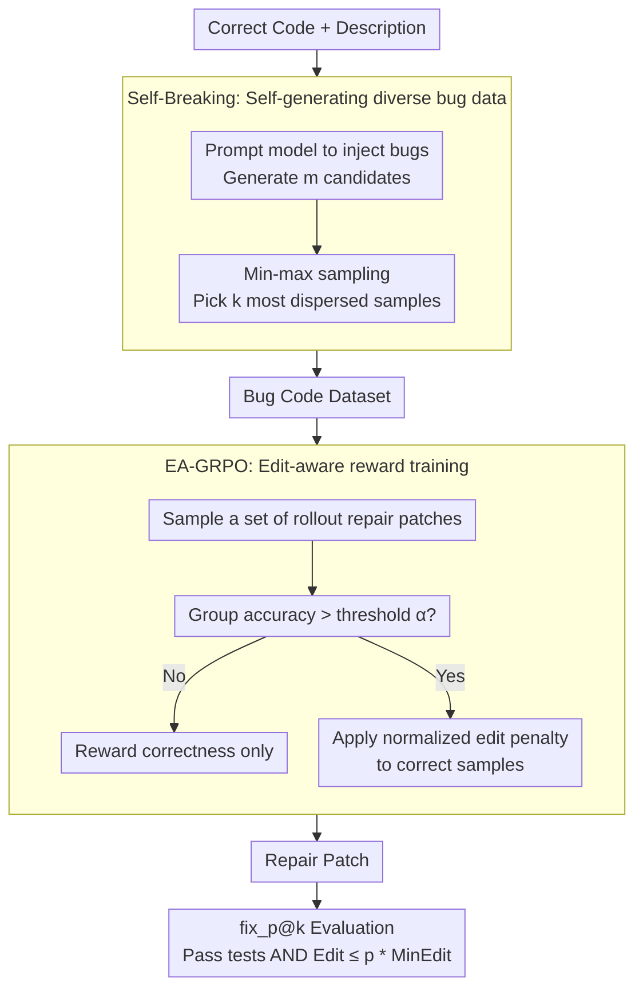

# QiMeng-PRepair: Precise Code Repair via Edit-Aware Reward Optimization

**Conference**: ACL 2026  
**arXiv**: [2604.05963](https://arxiv.org/abs/2604.05963)  
**Code**: [GitHub](https://github.com/...)  
**Area**: Code Intelligence / Program Repair  
**Keywords**: Precise Code Repair, Over-editing, Edit-Aware Reward, GRPO, Speculative Editing

## TL;DR

This paper identifies the "over-editing" problem in LLM code repair—where models tend to rewrite large portions of code instead of precisely locating and fixing bugs. It proposes the PRepair framework, which uses Self-Breaking (diverse bug injection) and Self-Repairing (edit-aware GRPO training) to significantly improve repair precision while maintaining correctness, and accelerates speculative decoding inference.

## Background & Motivation

**Background**: LLMs exhibit excellent performance in program repair. Existing training methods (SFT and RL) usually optimize only for repair correctness, treating code repair as a pure correctness objective.

**Limitations of Prior Work**: (1) In GRPO training, as correctness improves, the editing cost also increases—the model does not learn precise repair but rather "stumbles upon" the correct solution through massive modifications; (2) Over-editing destroys the original code structure and increases the review burden for developers; (3) Over-editing fails to locate bugs, limiting the actual effectiveness and maintainability of the repair.

**Key Challenge**: A tension exists between repair correctness and editing minimality—optimizing only for correctness leads the model to take "rewriting" shortcuts rather than learning to understand and precisely locate bugs.

**Goal**: Design a Precise Repair framework that maximizes the reuse of original code while maintaining repair correctness.

**Key Insight**: It is observed that editing cost grows synchronously with correctness during GRPO training (Figure 2), indicating the need to explicitly introduce editing constraints into the reward.

**Core Idea**: Edit-Aware GRPO (EA-GRPO)—editing penalties are applied to correct samples only when the group-level accuracy exceeds a threshold, balancing correctness and editing minimality.

## Method

### Overall Architecture

PRepair decomposes "precise repair" into a closed-loop pipeline of self-constructed data and self-consistent rewards. First, the model is prompted to inject diverse bugs into correct code (**Self-Breaking**), creating a large number of training samples that are "mostly logically correct but locally flawed." Then, the model is trained on these bug-ridden codes using edit-aware GRPO (**Self-Repairing**), where the reward adds an editing penalty only after correctness reaches a certain standard. The entire link from input bug code to output repair patch does not rely on human annotation. Finally, the newly proposed $\text{fix}_p@k$ metric is used to measure both correctness and editing efficiency.

### Key Designs

**1. $\text{fix}_p@k$ Precise Repair Metric: Monitoring correctness and editing simultaneously**

The pass@k metric only asks "is it fixed," ignoring "bad repairs" that pass tests by rewriting the entire code block, thus failing to reflect real repair quality. $\text{fix}_p@k$ adds an editing gate on top of pass@k: a generation is successful only if it passes all tests and the editing cost does not exceed $p$ times the theoretical minimum edit. Here, the editing cost is normalized using line-level Levenshtein distance, $\mathbf{D}_{\text{EC}}(X,Y) = \mathbf{D}(X,Y)/|X|$, converting the "number of lines changed" into a ratio proportional to the original code size, making samples of different lengths comparable.

**2. Self-Breaking: Self-generating diverse bug data via min-max sampling**

Training data for precise repair requires code with "mostly correct logic and only local errors," which is extremely scarce in reality. PRepair provides the model with correct code and descriptions, prompting it to actively inject bugs, and then selects the $k$ most dispersed samples from $m$ candidates: $\mathcal{X}_s = \min_{\mathcal{X}' \subset \mathcal{X}, |\mathcal{X}'|=k} \max_{X_i,X_j \in \mathcal{X}', i \neq j} (1 - \mathbf{D}_{\text{EC}}(X_i, X_j))$. This min-max criterion deliberately minimizes the maximum similarity within the selected set to avoid bug pattern clustering, ensuring the model encounters a rich variety of error types.

**3. EA-GRPO: Edit-aware reward, learning correctness before precision**

Directly penalizing editing volume in RL can be counterproductive—the model might fail to learn how to repair if editing constraints are applied before correctness is established. EA-GRPO introduces a "switch" for the penalty: it first calculates the accuracy of each rollout group $\text{Acc}_{\mathcal{G}^t}$, and activates the editing penalty only when it exceeds a threshold $\alpha$. Once activated, a normalized edit penalty $\mathcal{P}_i^{\mathcal{G}} = \sigma(\frac{\mathbf{D}_{\text{EC}}(X_t, o_i) - \text{mean}}{\text{std}})$ is calculated for correct samples in the group. The final reward is $\mathcal{R}_i = 1 - \mathcal{T}(\mathcal{G}) \cdot \beta \cdot \mathcal{P}_i^{\mathcal{G}}$ for correct samples and $0$ for incorrect ones. This allows the model to first stabilize its group-level accuracy before being guided to compress the editing volume.

### Loss & Training

EA-GRPO follows the PPO-style clipped objective with KL regularization. Reward calculation does not require ground-truth code throughout the process, relying solely on the editing cost between the bug input and the generated output. The trained model is evaluated on both Python (HumanEvalFix) and Verilog (self-built benchmark).

## Key Experimental Results

### Main Results

**Comparison of Precise Repair Metrics**

| Metric | Description |
|------|------|
| $\text{fix}_1@1$ Gain | Up to +31.4% |
| pass@k Maintenance/Gain | Correctness does not decrease |
| Cross-language Validity | Effective on both Python and Verilog |

### Ablation Study

**EA-GRPO vs Standard GRPO**

| Configuration | Description |
|------|------|
| Standard GRPO | Correctness improves but editing cost continues to grow |
| EA-GRPO | Correctness improves and editing cost is controlled |
| Speculative Edit Acceleration | Lower editing cost → Higher speculative decoding acceptance → Inference acceleration |

### Key Findings

- PRepair achieves up to a 31.4% improvement on $\text{fix}_1@1$ while maintaining or improving pass@k.
- The dynamic activation design of EA-GRPO is crucial—penalizing editing too early significantly harms correctness.
- Min-max sampling in Self-Breaking ensures bug diversity for training, outperforming random sampling.
- The model learns implicit error localization capabilities—precise repair forces the model to focus on the lines containing bugs.
- When combined with speculative editing, reduced editing costs directly translate into inference acceleration—offering significant practical value.

## Highlights & Insights

- The identification and quantification of the over-editing problem is a major contribution—revealing a systematic flaw in RL training that only optimizes for correctness.
- The "learn correctness before precision" strategy of EA-GRPO is elegant—avoiding a hard conflict between correctness and precision.
- Natural synergy with speculative decoding—precise repair reduces edits → more n-gram matches → higher inference throughput—translating training improvements into deployment speedups.

## Limitations & Future Work

- Evaluation is limited to Python and Verilog; more programming languages remain to be covered.
- The choice of threshold $p$ in $\text{fix}_p@k$ significantly impacts evaluation results.
- Self-Breaking depends on the model's own bug injection capability, which may not cover all real-world bug types.
- Editing cost is based on line-level Levenshtein distance, which may not capture semantic-level minimal editing.

## Related Work & Insights

- **vs Standard GRPO (Shao et al., 2024)**: The latter only optimizes correctness leading to over-editing; EA-GRPO resolves this via dynamic edit penalties.
- **vs HumanEvalFix (Muennighoff et al., 2023)**: The latter only evaluates using pass@k; the $\text{fix}_p@k$ in this paper is more comprehensive.

## Rating

- Novelty: ⭐⭐⭐⭐ Identification of over-editing and the design of EA-GRPO are novel and practical.
- Experimental Thoroughness: ⭐⭐⭐⭐ Python + Verilog cross-language + speculative decoding acceleration analysis.
- Writing Quality: ⭐⭐⭐⭐ Clear problem motivation and reasonable metric design.
- Value: ⭐⭐⭐⭐⭐ Direct impact on code repair practice; speculative decoding synergy has deployment value.

<!-- RELATED:START -->

## Related Papers

- [\[NeurIPS 2025\] QiMeng-SALV: Signal-Aware Learning for Verilog Code Generation](../../NeurIPS2025/code_intelligence/qimeng-salv_signal-aware_learning_for_verilog_code_generation.md)
- [\[ICML 2026\] NEMO: Execution-Aware Optimization Modeling via Autonomous Coding Agents](../../ICML2026/code_intelligence/nemo_execution-aware_optimization_modeling_via_autonomous_coding_agents.md)
- [\[ICML 2026\] BoostAPR: Boosting Automated Program Repair via Execution-Grounded Reinforcement Learning with Dual Reward Models](../../ICML2026/code_intelligence/boostapr_boosting_automated_program_repair_via_execution-grounded_reinforcement_.md)
- [\[ACL 2026\] ChatHLS: Towards Systematic Design Automation and Optimization for High-Level Synthesis](chathls_towards_systematic_design_automation_and_optimization_for_high-level_syn.md)
- [\[ACL 2026\] LogicEval: A Systematic Framework for Evaluating Automated Repair Techniques for Logical Vulnerabilities in Real-World Software](logiceval_a_systematic_framework_for_evaluating_automated_repair_techniques_for_.md)

<!-- RELATED:END -->
