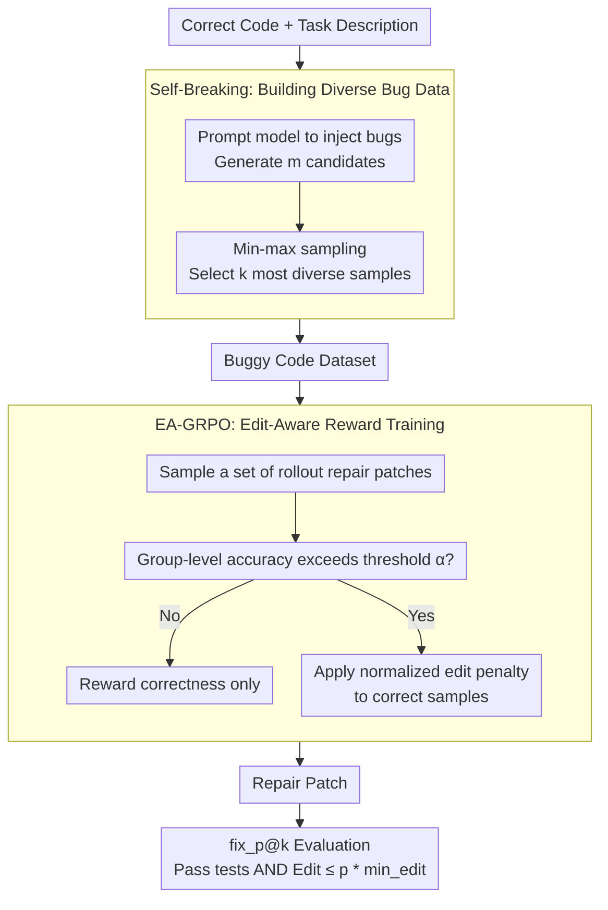

# QiMeng-PRepair: Precise Code Repair via Edit-Aware Reward Optimization

**Conference**: ACL 2026  
**arXiv**: [2604.05963](https://arxiv.org/abs/2604.05963)  
**Code**: [GitHub](https://github.com/...)  
**Area**: Code Intelligence / Program Repair  
**Keywords**: Precise Code Repair, Over-editing, Edit-aware Reward, GRPO, Speculative Editing

## TL;DR

This paper identifies the "over-editing" problem in LLM-based code repair—where models tend to rewrite large portions of code instead of precisely locating and fixing bugs. It proposes the PRepair framework, which utilizes Self-Breaking (diverse bug injection) and Self-Repairing (edit-aware GRPO training) to significantly enhance repair precision while maintaining correctness and accelerating speculative decoding inference.

## Background & Motivation

**Background**: LLMs have shown excellent performance in program repair. Existing training methods (SFT and RL) typically optimize only for the correctness of the fix, treating code repair as a pure correctness objective.

**Limitations of Prior Work**: (1) As correctness improves during GRPO training, the edit cost increases continuously—models fail to learn precise fixes and instead "stumble upon" correct solutions through massive modifications; (2) Over-editing destroys the original code structure, increasing the review burden on developers; (3) Over-editing fails to pinpoint bugs, limiting the actual effectiveness and maintainability of the repair.

**Key Challenge**: There is a tension between repair correctness and edit minimality—optimizing only for correctness leads the model to take "rewriting" shortcuts rather than learning to understand and precisely locate bugs.

**Goal**: Design a Precise Repair framework that maximizes the reuse of original code while maintaining repair correctness.

**Key Insight**: It is observed that edit cost grows synchronously with correctness during GRPO training (Figure 2), indicating the need to explicitly introduce edit constraints into the reward function.

**Core Idea**: Edit-Aware GRPO (EA-GRPO)—imposing an edit penalty on correct samples only when the group-level accuracy exceeds a threshold, balancing correctness and edit minimality.

## Method

### Overall Architecture

PRepair decomposes "precise repair" into a closed-loop pipeline of self-constructed data and self-consistent rewards. First, the model is prompted to inject diverse bugs into correct code (Self-Breaking), creating a large volume of training samples that are "mostly correct logically but locally erroneous." Then, the model is trained on this bug-ridden code using edit-aware GRPO (Self-Repairing), where the reward includes an edit penalty only after correctness reaches a certain level. The entire path from input bug code to output repair patch does not depend on manual annotation. Finally, the newly proposed $\text{fix}_p@k$ metric is used to evaluate the ability to "fix correctly with minimal changes."

### Key Designs

**1. $\text{fix}_p@k$ Precise Repair Metric: Balancing Correctness and Edit Volume**

pass@k only asks "is it fixed," ignoring "bad repairs" where the entire code block is rewritten to pass tests by chance, thus failing to reflect true repair quality. $\text{fix}_p@k$ adds an edit threshold on top of pass@k: a fix is successful only if it passes all tests and the edit cost does not exceed $p$ times the theoretical minimum edit. Here, the edit cost is normalized using line-level Levenshtein distance, $\mathbf{D}_{\text{EC}}(X,Y) = \mathbf{D}(X,Y)/|X|$, converting the number of "edited lines" into a ratio relative to the original code size to make samples of different lengths comparable.

**2. Self-Breaking: Diverse Bug Data Construction via Min-Max Sampling**

Precise repair requires training data consisting of code with "mostly correct logic and only local errors," which is extremely scarce in reality. PRepair reverses the process: given correct code and descriptions, it prompts the model to inject bugs and selects the $k$ most dispersed samples from $m$ candidates: $\mathcal{X}_s = \min_{\mathcal{X}' \subset \mathcal{X}, |\mathcal{X}'|=k} \max_{X_i,X_j \in \mathcal{X}', i \neq j} (1 - \mathbf{D}_{\text{EC}}(X_i, X_j))$. This min-max criterion deliberately minimizes the maximum similarity within the selected set to avoid bug pattern clustering, ensuring the model encounters a rich variety of error types.

**3. EA-GRPO: Edit-Aware Reward, "Learn Right then Learn Precise"**

Directly penalizing edit volume in RL can be counterproductive—the model may fail to learn how to fix bugs correctly if restricted by edit constraints too early. EA-GRPO introduces a "switch" for the penalty: it first calculates the accuracy of each rollout group $\text{Acc}_{\mathcal{G}^t}$, and activates the edit penalty only when it exceeds a threshold $\alpha$. When activated, a normalized edit penalty $\mathcal{P}_i^{\mathcal{G}} = \sigma(\frac{\mathbf{D}_{\text{EC}}(X_t, o_i) - \text{mean}}{\text{std}})$ is calculated for correct samples in the group. The final reward $\mathcal{R}_i$ is $1 - \mathcal{T}(\mathcal{G}) \cdot \beta \cdot \mathcal{P}_i^{\mathcal{G}}$ for correct samples and $0$ for incorrect ones. This allows the model to stabilize its group-level accuracy before being guided to compress edits, preventing a direct conflict between correctness and precision.

### Loss & Training

EA-GRPO follows the PPO-style clipped objective with KL regularization. The reward calculation does not require ground-truth code, relying solely on the edit cost between the buggy input and generated output. The trained model is evaluated on two benchmarks: Python (HumanEvalFix) and Verilog (self-constructed).

## Key Experimental Results

### Main Results

**Comparison of Precise Repair Metrics**

| Metric | Description |
|------|------|
| $\text{fix}_1@1$ Gain | Up to +31.4% |
| pass@k Performance | Maintained or improved |
| Cross-lingual | Effective for both Python and Verilog |

### Ablation Study

**EA-GRPO vs. Standard GRPO**

| Configuration | Description |
|------|------|
| Standard GRPO | Correctness increases but edit cost grows continuously |
| EA-GRPO | Correctness increases with controlled edit cost |
| Speculative Speedup | Lower edit cost → higher speculative decoding acceptance → faster inference |

### Key Findings

- PRepair achieves up to a 31.4% gain in $\text{fix}_1@1$ while maintaining or improving pass@k.
- The dynamic activation design of EA-GRPO is crucial—penalizing edits too early significantly harms correctness.
- Min-max sampling in Self-Breaking ensures training bug diversity, outperforming random sampling.
- The model learns implicit bug localization—precise repair forces the model to focus on the lines containing bugs.
- When combined with speculative editing, lower edit costs directly translate into inference acceleration—providing significant practical value.

## Highlights & Insights

- The identification and quantification of the over-editing problem are significant contributions—revealing systemic flaws in RL training that optimizes only for correctness.
- The "learn right then learn precise" strategy of EA-GRPO is elegant—avoiding the hard conflict between correctness and precision.
- Natural synergy with speculative decoding—precise repair reduces edits → more n-gram matches → higher inference throughput—transforming training improvements into inference speedups.

## Limitations & Future Work

- Evaluation is limited to Python and Verilog, lacking coverage of more programming languages.
- The choice of threshold $p$ in $\text{fix}_p@k$ significantly influences evaluation results.
- Self-Breaking depends on the model's own bug injection capability, which may not cover all real-world bug types.
- Edit cost is based on line-level Levenshtein distance, which might not capture semantic-level edit minimality.

## Related Work & Insights

- **vs. Standard GRPO (Shao et al., 2024)**: The latter only optimizes correctness leading to over-editing; EA-GRPO solves this through dynamic edit penalties.
- **vs. HumanEvalFix (Muennighoff et al., 2023)**: The latter evaluates only via pass@k; $\text{fix}_p@k$ in this paper is more comprehensive.

## Rating

- Novelty: ⭐⭐⭐⭐ Identification of over-editing and the design of EA-GRPO are both novel and practical.
- Experimental Thoroughness: ⭐⭐⭐⭐ Cross-lingual (Python + Verilog) and speculative decoding acceleration analysis.
- Writing Quality: ⭐⭐⭐⭐ Clear motivation and well-designed metrics.
- Value: ⭐⭐⭐⭐⭐ Direct impact on code repair practices; speculative decoding synergy offers deployment value.

<!-- RELATED:START -->

## Related Papers

- [\[NeurIPS 2025\] QiMeng-SALV: Signal-Aware Learning for Verilog Code Generation](../../NeurIPS2025/code_intelligence/qimeng-salv_signal-aware_learning_for_verilog_code_generation.md)
- [\[ICML 2026\] NEMO: Execution-Aware Optimization Modeling via Autonomous Coding Agents](../../ICML2026/code_intelligence/nemo_execution-aware_optimization_modeling_via_autonomous_coding_agents.md)
- [\[ICML 2026\] BoostAPR: Boosting Automated Program Repair via Execution-Grounded Reinforcement Learning with Dual Reward Models](../../ICML2026/code_intelligence/boostapr_boosting_automated_program_repair_via_execution-grounded_reinforcement_.md)
- [\[ACL 2026\] LogicEval: A Systematic Framework for Evaluating Automated Repair Techniques for Logical Vulnerabilities in Real-World Software](logiceval_a_systematic_framework_for_evaluating_automated_repair_techniques_for_.md)
- [\[ACL 2026\] Precise Debugging Benchmark: Is Your Model Debugging or Regenerating?](precise_debugging_benchmark_is_your_model_debugging_or_regenerating.md)

<!-- RELATED:END -->
