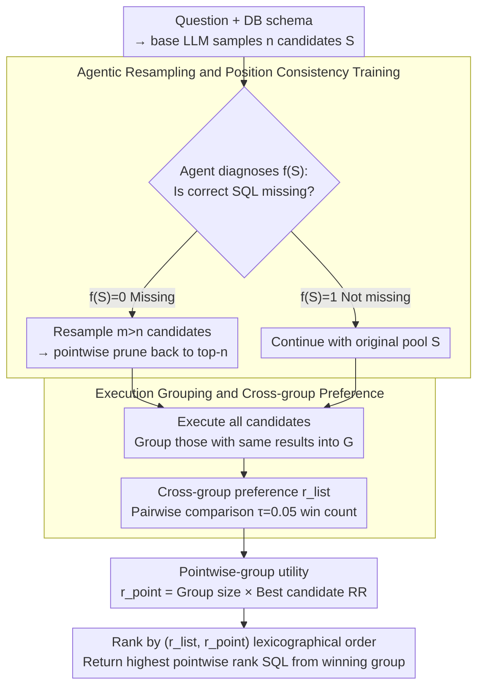

# R$^3$-SQL: Ranking Reward and Resampling for Text-to-SQL

**Conference**: ACL2026 Findings  
**arXiv**: [2604.25325](https://arxiv.org/abs/2502.01525)  
**Code**: Not open-sourced  
**Area**: LLM Agent / Text-to-SQL  
**Keywords**: Text-to-SQL, Candidate Ranking, Execution Result Grouping, agentic resampling, Position Bias

## TL;DR
R3-SQL targets generate-then-rank Text-to-SQL by grouping equivalent SQLs according to execution results and ranking them through a combination of pairwise/listwise and pointwise rewards. It further employs an LLM agent to determine if the candidate pool lacks correct SQLs for selective resampling, achieving 75.03 EX on BIRD-dev.

## Background & Motivation
**Background**: Modern Text-to-SQL systems frequently adopt a generate-then-rank paradigm: an LLM samples multiple SQL candidates, which are then selected by a pointwise, listwise, or majority voting ranker. Methods such as CSC-SQL, Contextual-SQL, CHASE-SQL, and XiYan-SQL all follow this framework.

**Limitations of Prior Work**: Existing rankers face two core issues. First is functional inconsistency, where SQLs that are superficially different but have identical execution results are assigned different scores, potentially ranking correct equivalent SQLs lower. Second is bounded recall; if the correct SQL is absent from the candidate pool, no ranker can recover the answer.

**Key Challenge**: The correctness of Text-to-SQL is determined by execution semantics rather than SQL string surface forms; however, common rankers still score individual SQL strings. Additionally, the ranking stage typically assumes that a correct candidate is already present, lacking a mechanism to detect if the generation stage missed the correct answer.

**Goal**: To establish a framework that concurrently addresses ranking consistency and candidate recall, enabling rankers to make decisions at the execution equivalence class level and actively expand the search space when the candidate pool is insufficient.

**Key Insight**: The authors decompose candidate selection into exploration and exploitation. Exploration utilizes agentic resampling to improve candidate pool recall, while exploitation employs execution-result grouping and dual-reward ranking to enhance precision.

**Core Idea**: Instead of ranking individual SQL strings, rank execution result equivalence groups. Rather than performing unconditional resampling, an agent triggers replacement with a larger resampled pool only when it identifies that the candidate pool lacks a correct SQL.

## Method

### Overall Architecture
R3-SQL aims to solve two persistent issues in generate-then-rank Text-to-SQL: inconsistent scoring of equivalent SQLs and the inability to recover when no correct SQL exists in the candidate pool. It divides candidate selection into two paths: exploration for recall and exploitation for precision. Given a natural language question and database schema, a base LLM first samples $n$ SQL candidates $S=\{s_1,\dots,s_n\}$. An agent then diagnoses this pool; if it determines $f(S)=0$ (correct answer missing), it resamples $m>n$ candidates and uses a pointwise ranker to prune them back to top-$n$ for pool replacement. Subsequently, all SQLs are executed, and candidates with identical results are clustered into groups $G=\{g_1,\dots,g_M\}$, each representing a distinct semantic outcome. Group-level ranking is performed by calculating cross-group preferences $r_{list}$ and within-group pointwise utility $r_{point}$, ranked by lexicographical order $(r_{list},r_{point})$. The SQL with the highest pointwise rank from the winning group is returned.

### Key Designs

**1. Agentic resampling and position consistency training: Bridging candidate recall gaps and mitigating ranker position bias**

The ranking stage assumes a correct candidate is already in the pool, but reality often involves bounded recall. R3-SQL lets an agent diagnose the initial pool: if it judges the correct SQL is missing ($f(S)=0$), the original pool is discarded for a larger sampled pool ($m>n$), which is then pruned via pointwise ranking to manage costs and noise. Another risk is that listwise rankers are biased by the input order of candidates. During training, the same pair of correct/incorrect SQLs are fed in both original and swapped orders, with a consistency reward $R=R_{base}+\lambda_c R_c$ ($\lambda_c=0.5$) added in GRPO to force the ranker to provide consistent judgments regardless of input order. This step corresponds to the exploration line, improving candidate pool recall.

**2. Execution result grouping and cross-group preference: Shifting from "string ranking" to "semantic grouping" to eliminate functional inconsistency**

The pain point is functional inconsistency—different SQL strings yielding the same execution result might receive different scores. R3-SQL executes candidates first and groups those with identical outputs, ensuring surface differences no longer interfere with semantic judgment. A pairwise ranker then performs cross-group comparisons: for groups $g_i,g_j$, it estimates $P(g_i>g_j)$, recording a decisive win only if the preference margin exceeds a threshold $\tau=0.05$. The group score $r_{list}(g_i)$ is its total win count. This is more sophisticated than functional majority voting, as it identifies "small but correct" groups rather than letting large, incorrect groups win by sheer number.

**3. Pointwise-group utility as a stable anchor: Providing an order-invariant signal when cross-group preferences are tied**

Relying solely on listwise preferences can lead to ties, while relying solely on group size favors large, incorrect groups, and relying solely on pointwise scores reintroduces surface form bias. R3-SQL calculates a utility $r_{point}(g)=w(g)\cdot u(g)$ for each group: $w(g)=|g|$ reflects execution consistency (how many candidates reached the same result), and $u(g)=\max_{s\in g} RR_s$ retains the reciprocal rank of the strongest candidate in the group. The final selection uses the lexicographical order of $(r_{list}, r_{point})$, using relative preferences for the overall decision while stabilizing close calls with group consistency and individual quality.

### Loss & Training
R3-SQL ranking training involves both a pointwise ranker and a listwise/pairwise ranker. R3-POINT-32B is fine-tuned from Contextual-RM-32B. The R3-7B listwise ranker is trained using GRPO with an input order consistency reward. During inference, group ranking primarily follows $r_{list}$ with $r_{point}$ as a tie-breaker, followed by a final SQL-level comparison between the top-2 groups to select the candidate with the highest pointwise rank from the winning group.

## Key Experimental Results

### Main Results

| SQL Selection Method | Ranker | BIRD-dev | Spider-test | Spider-DK | EHRSQL | ScienceBenchmark | Avg. |
|--------------|--------|----------|-------------|-----------|--------|------------------|------|
| CSC-SQL | FMV | 71.58 | 86.64 | 76.97 | 41.04 | 56.68 | 66.58 |
| Contextual-SQL | Pointwise | 73.14 | 86.36 | 75.50 | 41.41 | 63.13 | 67.91 |
| CHASE-SQL | Listwise | 73.34 | 86.18 | 75.94 | 44.44 | 63.59 | 68.70 |
| XiYan-SQL | Listwise + FMV | 72.03 | 85.89 | 75.28 | 43.43 | 63.59 | 68.04 |
| **Ours (R3-SQL)** | Groupwise Point+List+FMV | **75.03** | **87.19** | **77.92** | **46.30** | **66.82** | **70.65** |

### Ablation Study

| Configuration | BIRD-dev EX | Description |
|------|-------------|------|
| R3-SQL | 75.03 | Full system |
| w/o Agentic Resampling | 74.25 | Decrease in candidate recall |
| w/o Pointwise Pruning | 73.92 | Increased noise in resampled pool |
| w/o Exec. Group Scoring | 73.47 | Decrease in equivalent SQL consistency |
| w/o Pointwise Ranker | 73.34 | Lacks order-invariant anchors |
| w/o Listwise Ranker | 73.14 | Lacks cross-group relative preference |

### Key Findings
- R3-SQL outperforms all baselines across five benchmarks, with an average EX of 70.65, making it the only method to exceed 70.
- Functional inconsistency is directly eliminated by grouping: the score variance for the same execution result dropped from 0.8571 in Contextual-SQL to 0.0000 in R3-SQL.
- Agentic resampling improves candidate recall: the ranking upper bound increased from 78.80 to 82.72 on average, and from 81.23 to 84.62 on BIRD-dev.
- Position consistency reward is effective: R3-7B input consistency reached 57.49%, dropping to 45.60% without the consistency reward and 37.82% without GRPO.
- Agent triggers are not random: Trigger Resampling precision is 93.27 with a recall of 56.02, while Skip Resampling recall is 83.17, helping to reduce redundant resampling.
- Computationally, R3-SQL uses 32 pointwise calls and 107 listwise calls per query, totaling 1.56 sec/query—faster and more accurate than CHASE-SQL (1.68 sec/query).

## Highlights & Insights
- The core insight is that "SQL correctness is execution semantics, not token semantics." Ranking after grouping is more aligned with the evaluation criteria of Text-to-SQL than individual string ranking.
- Agentic resampling migrates the bounded recall concept from retrieval to SQL generation: no matter how strong a ranker is, it cannot select a non-existent correct candidate, necessitating initial pool diagnosis.
- Lexicographic combination is simple yet effective: cross-group preferences handle relative correctness, while pointwise utility stabilizes groups with close scores.
- Agentic replacement is superior to always-resampling, indicating that increasing candidate counts is not a "free lunch"; noisy candidates can interfere with the ranker, making selective triggering critical.

## Limitations & Future Work
- The authors note R3-SQL is stronger in-domain and depends on a supervised pointwise ranker; a domain gap in out-of-domain scenarios causes a marginal difference of 0.46-0.67 in the pointwise module.
- Execution grouping depends on successful SQL execution and may be fragile in scenarios involving timeouts, empty results, non-deterministic functions, or restricted database permissions.
- Agentic resampling requires additional LLM inference and more candidate generation; although more efficient than always-resampling, deployment costs remain high.
- The pool replacement strategy outperformed union in experiments but might discard valuable candidates from the original pool; more granular retain/replace strategies are worth exploring.
- The code is not open-sourced, making it difficult to reproduce R3-POINT-32B, R3-7B, GRPO rewards, and agent prompts.

## Related Work & Insights
- **vs Contextual-SQL**: Contextual-SQL uses pointwise scoring for each SQL; R3-SQL merges equivalent execution results to prevent inconsistent scoring.
- **vs CSC-SQL / functional majority voting**: FMV only considers group size, allowing large but incorrect groups to win; R3-SQL ranks groups using listwise preference and pointwise utility.
- **vs CHASE-SQL**: CHASE-SQL relies on a listwise ranker; R3-SQL additionally handles position bias and bounded recall, achieving higher precision with slightly lower computation.
- **vs XiYan-SQL**: XiYan-SQL combines listwise with FMV but lacks agentic resampling; R3-SQL performs active repair during the candidate generation phase.

## Rating
- Novelty: ⭐⭐⭐⭐ The combination of execution grouping, dual-reward ranking, and agentic resampling is comprehensive.
- Experimental Thoroughness: ⭐⭐⭐⭐⭐ Well-covered across five benchmarks, seed stability, computational costs, and multiple ablations.
- Writing Quality: ⭐⭐⭐⭐ Clear problem definitions, intuitive diagrams, and well-supported experimental tables.
- Value: ⭐⭐⭐⭐⭐ Highly valuable for candidate selection and generation repair in practical Text-to-SQL systems.

<!-- RELATED:START -->

## Related Papers

- [\[ACL 2026\] PV-SQL: Synergizing Database Probing and Rule-based Verification for Text-to-SQL Agents](pv-sql_synergizing_database_probing_and_rule-based_verification_for_text-to-sql_.md)
- [\[ACL 2026\] PExA: Parallel Exploration Agent for Complex Text-to-SQL](pexa_parallel_exploration_agent_for_complex_text-to-sql.md)
- [\[ACL 2025\] STaR-SQL: Self-Taught Reasoner for Text-to-SQL](../../ACL2025/code_intelligence/star-sql_self-taught_reasoner_for_text-to-sql.md)
- [\[ACL 2026\] DPC: Training-Free Text-to-SQL Candidate Selection via Dual-Paradigm Consistency](dpc_training-free_text-to-sql_candidate_selection_via_dual-paradigm_consistency.md)
- [\[ACL 2025\] SHARE: An SLM-based Hierarchical Action CorREction Assistant for Text-to-SQL](../../ACL2025/code_intelligence/share_text_to_sql_correction.md)

<!-- RELATED:END -->
