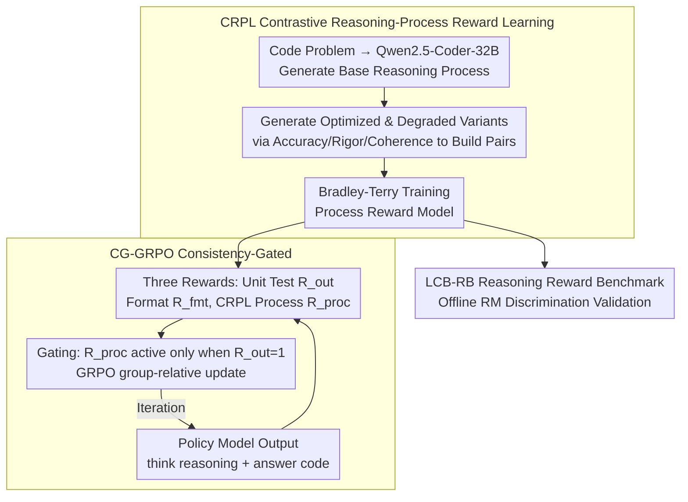

# ReCode: Reinforcing Code Generation with Reasoning-Process Rewards

**Conference**: ACL 2026  
**arXiv**: [2508.05170](https://arxiv.org/abs/2508.05170)  
**Code**: https://github.com/ZJU-CTAG/ReCode  
**Area**: Code Intelligence / Reinforcement Learning / Reasoning Process Reward  
**Keywords**: Code Generation, Process Rewards, GRPO, Reward Model, Reasoning-Process

## TL;DR
ReCode trains a reward model capable of evaluating the quality of code reasoning processes via CRPL and utilizes CG-GRPO to activate process rewards only when code execution is correct, thereby improving the Pass@1 of code generation models while avoiding reward hacking.

## Background & Motivation
**Background**: Code generation naturally provides executable verification signals. Recently, many RL methods directly use unit test pass rates as outcome rewards to train models, improving Pass@1 on benchmarks like HumanEval, MBPP, and LiveCodeBench.

**Limitations of Prior Work**: Relying solely on final test results ignores "why the model generated this code." When two programs both pass tests, one reasoning process might be rigorous while the other is coincidental; when both fail, one might have the correct logic but minor implementation errors. Pure outcome rewards lack fine-grained supervision for these differences.

**Key Challenge**: While reasoning quality affects code correctness, directly incorporating neural process rewards into RL often leads to "reward hacking." Models may learn to generate high-quality reasoning text that does not truly lead to correct code.

**Goal**: To construct scalable reasoning-process preference data for training a reliable reward model and to design a safe RL fusion method where process rewards supplement rather than replace execution correctness.

**Key Insight**: The authors treat the reasoning process as an intermediate product in code generation and construct contrastive preferences using optimized/degraded reasoning variants. They then use execution results as a hard gate, ensuring process rewards only function for correct code.

**Core Idea**: Process rewards are only credible when the result is correct. Therefore, execution correctness should act as a "gate," allowing the reasoning reward to distinguish the quality of reasoning only between correct solutions.

## Method

### Overall Architecture
ReCode addresses the issue that code RL typically only uses unit test results as outcome rewards. However, fine-grained supervision is missing when two programs pass with different reasoning qualities or fail with different logical proximities. Directly adding neural process rewards into RL risk reward hacking, where the model generates plausible reasoning text for incorrect code. ReCode's two components address these issues: CRPL (Contrastive Reasoning-Process Reward Learning) trains a reward model using synthetic contrastive data, and CG-GRPO (Consistency-Gated GRPO) integrates it into RL using execution results as a gate. During training, the policy model outputs a `<think>...</think><answer>...</answer>` structure. Three rewards are derived: unit test (outcome), format check (format), and CRPL (process). To validate the RM's ability to judge reasoning quality, the authors also introduce the LCB-RB evaluation benchmark.

### Key Designs

**1. CRPL: Using "Optimized/Degraded" variants to create strong contrastive preferences for reward model training.**

Having LLMs provide absolute scores for reasoning processes often results in poor calibration; relative preferences are more stable. CRPL first uses Qwen2.5-Coder-32B-Instruct to generate a base reasoning process for each code problem. It then generates optimized and degraded versions across three dimensions: factual accuracy, logical rigor, and logical coherence. This constructs three types of preference pairs: strong contrast, optimized, and degraded. These explicit quality gaps allow the reward model to learn fine-grained reasoning features rather than just looking at the final answer.

**2. LCB-RB: A benchmark to specifically evaluate the ability to judge reasoning quality.**

Existing RewardBench focuses on the quality of the final answer and cannot measure reasoning-process discrimination. LCB-RB is derived from LiveCodeBench v6. For each problem, 50 reasoning-solution pairs are generated, filtered by execution results, checked for logical consistency by GPT-4o, and manually reviewed by the authors. This results in 219 high-quality preference pairs designed to verify if a reward model truly judges the reasoning process rather than relying on luck.

**3. CG-GRPO: Using execution correctness as a hard gate to compare reasoning quality only among "correct code".**

Code tasks provide strict execution signals which should be treated as hard constraints; otherwise, the model might optimize for text preferred by the RM rather than executable code. CG-GRPO does not simply add the process reward as a constant term; instead, it is formulated as:

$$R = R_{fmt} + R_{out} + \mathbb{I}(R_{out}=1)\cdot R_{proc}$$

The process score $R_{proc}$ only participates in the reward when the code passes all tests. Thus, when multiple answers in a sampling group are correct, the process reward provides a non-zero advantage to distinguish reasoning quality. Incorrect answers receive no process bonus regardless of reasoning quality, effectively preventing reward hacking.

### Loss & Training
The CRPL reward model uses the Bradley-Terry pairwise loss: for each `(problem, preferred reasoning, rejected reasoning)`, it increases the score difference between the preferred and rejected reasoning. Policy optimization is based on GRPO using group-relative advantage. The unique aspect of ReCode is the reward composition: the process reward is not added as a constant but is gated by the outcome reward. This provides a discriminative signal even when the entire group is correct, while avoiding reward hacking on incorrect samples.

## Key Experimental Results

### Main Results
On Qwen2.5-Coder-7B-Instruct, ReCode achieves an average improvement of 16.1% over the base model and a 6.7% relative improvement over outcome-only GRPO, approaching the average performance of GPT-4-Turbo.

| Model | HE | HE+ | MBPP | MBPP+ | LCB Easy | LCB Medium | LCB Hard | BigCode Full | BigCode Hard | Avg |
|------|----|-----|------|-------|----------|------------|----------|--------------|--------------|-----|
| GPT-4-Turbo | 90.2 | 86.0 | 85.7 | 73.3 | 68.5 | 24.2 | 4.6 | 58.2 | 35.1 | 58.4 |
| Qwen2.5-Coder-14B | 89.6 | 87.2 | 86.2 | 72.8 | 61.0 | 11.3 | 2.8 | 48.4 | 22.2 | 53.5 |
| Qwen2.5-Coder-7B | 88.4 | 84.1 | 83.5 | 71.7 | 56.1 | 3.8 | 6.9 | 41.0 | 18.2 | 50.4 |
| +SFT | 66.2 | 57.3 | 73.3 | 63.5 | 34.1 | 3.8 | 0.0 | 39.9 | 13.5 | 39.1 |
| +GRPO | 85.9 | 81.1 | 86.7 | 75.1 | 58.5 | 15.1 | 9.7 | 52.0 | 29.7 | 54.9 |
| +ReCode | 90.9 | 86.0 | 87.0 | 76.2 | 68.3 | 20.8 | 9.7 | 54.0 | 33.8 | 58.5 |

The CRPL reward model performs strongly on LCB-RB and RewardBench reasoning subsets, indicating that synthetic contrastive preferences capture transferable process quality signals.

| Reward Model | Size | LCB-RB | RewardBench Code | RewardBench Math | Avg |
|----------|------|--------|------------------|------------------|-----|
| DeepSeek-V3 | 671B | 66.9 | 98.5 | 78.5 | 81.3 |
| GPT-4-Turbo | - | 63.7 | 98.1 | 67.3 | 76.4 |
| EURUS-RM | 7B | 57.0 | 92.8 | 79.9 | 76.5 |
| Qwen2.5-Coder-7B | 7B | 53.8 | 43.9 | 65.8 | 54.5 |
| +Score | 7B | 57.7 | 80.2 | 71.8 | 69.9 |
| +CRPL | 7B | 62.6 | 88.6 | 99.8 | 83.7 |

### Ablation Study
ReCode generalizes to mathematics tasks and Qwen3-4B, complementing compiler-based supervision.

| Setting | Metric | Baseline | +GRPO / Process Method | +ReCode | Conclusion |
|------|------|------|------------------|---------|------|
| Qwen2.5-Math-7B | Avg on MATH500/Minerva/AIME24 | 24.5 | 48.0 | 51.5 | Process rewards also effective for math |
| Qwen3-4B-Instruct | LiveCodeBench Avg | 30.7 | 32.5 | 36.1 | Transferable across model families |
| Compiler-based reward | LiveCodeBench Avg | 18.1 | 24.1 | 25.3 | ReCode outperforms compiler process rewards |
| ReCode + Compiler | LiveCodeBench Avg | 18.1 | 24.1 | 27.1 | Two types of signals are complementary |

Efficiency experiments show ReCode does not win by generating longer reasoning, but by being shorter and more effective.

| Difficulty | GRPO Pass@1 | GRPO Avg Tokens | ReCode Pass@1 | ReCode Avg Tokens |
|------|-------------|-----------------|---------------|-------------------|
| Easy | 58.5 | 427.3 | 68.3 | 324.1 |
| Medium | 15.1 | 568.2 | 20.8 | 441.7 |
| Hard | 9.7 | 813.6 | 9.7 | 619.8 |

### Key Findings
- Improvements from ReCode stem from more rigorous reasoning rather than longer reasoning. Average token counts on LiveCodeBench decreased by 23.4% while Pass@1 increased.
- Adding process rewards directly to the total reward leads to reward hacking; process scores quickly approach 1.0 while downstream performance plateaus.
- Hard gating allows process rewards to compare quality only between correct programs, retaining fine-grained signals while preventing incorrect programs from profiting from text quality.
- CRPL is stronger than score-based reward models, suggesting relative preferences are better for training process quality discriminators than scalar scoring.
- Preference data from a single strong generator outperformed mixed generators; the authors suggest this yields a higher signal-to-noise ratio under a fixed budget.

## Highlights & Insights
- The paper transforms "reasoning process quality" from a slogan into a trainable, evaluable, and RL-compatible component. CRPL and LCB-RB form a complete loop.
- The consistency gate is a crucial engineering insight. Since code generation has execution signals, neural rewards should be subordinate to execution correctness rather than added with equal weight.
- Results show process supervision improves token efficiency, which is vital for practical code models: shorter reasoning with higher accuracy reduces inference costs.
- ReCode's effectiveness on math tasks suggests that reasoning-process rewards are a transferable training paradigm, not limited to code.

## Limitations & Future Work
- Output length is limited to 4K tokens; performance during reasoning processes exceeding 30K tokens has not been verified.
- LCB-RB contains only 219 high-quality, manually verified preference pairs; while reliable, coverage is limited and needs extension to more problem types and languages.
- Policy models were evaluated up to the 7B scale; it is unclear if marginal gains from process rewards hold for much larger models.
- CRPL depends on strong code models to generate optimized/degraded reasoning; generator quality may limit the reward model's potential.
- Process rewards might still learn stylistic preferences; while the execution gate reduces risk, the reward model itself needs more fine-grained auditing.

## Related Work & Insights
- **vs outcome-only GRPO**: Standard GRPO only considers test passes, resulting in sparse rewards that cannot distinguish between multiple correct solutions. ReCode continues to optimize reasoning quality within correct solutions.
- **vs StepCoder / PRLCoder**: These methods lean towards implementation-level or compiler/test signals. ReCode focuses on the logical quality of the reasoning process and complements compiler signals.
- **vs General RewardBench RMs**: General reward models do not specifically examine code reasoning. CRPL, trained on optimized/degraded reasoning, is stronger on LCB-RB and RewardBench reasoning subsets.
- **Insight**: For verifiable tasks, neural process rewards should function as "ranking signals after verification" rather than as a replacement for verification itself.

## Rating
- Novelty: ⭐⭐⭐⭐☆ Process rewards are not a brand-new concept, but the CRPL + consistency-gated RL combination is solid.
- Experimental Thoroughness: ⭐⭐⭐⭐⭐ Covers code, reward models, math transfer, cross-model analysis, compiler supervision, and efficiency; the chain of evidence is complete.
- Writing Quality: ⭐⭐⭐⭐☆ Logical framework is clear with rich experimental tables; some appendix details are dense.
- Value: ⭐⭐⭐⭐⭐ High practical value for code model RL, process reward design, and preventing reward hacking.

<!-- RELATED:START -->

## Related Papers

- [\[ICML 2025\] Reasoning Through Execution: Unifying Process and Outcome Rewards for Code Generation](../../ICML2025/code_intelligence/reasoning_through_execution_unifying_process_and_outcome_rewards_for_code_genera.md)
- [\[ACL 2026\] StoryCoder: Narrative Reformulation for Structured Reasoning in LLM Code Generation](storycoder_narrative_reformulation_for_structured_reasoning_in_llm_code_generati.md)
- [\[ACL 2026\] CodeRL+: Improving Code Generation via Reinforcement with Execution Semantics Alignment](coderl_improving_code_generation_via_reinforcement_with_execution_semantics_alig.md)
- [\[ACL 2026\] MARS2: Scaling Multi-Agent Tree Search via Reinforcement Learning for Code Generation](mars2_scaling_multi-agent_tree_search_via_reinforcement_learning_for_code_genera.md)
- [\[AAAI 2026\] ReCode: Updating Code API Knowledge with Reinforcement Learning](../../AAAI2026/code_intelligence/recode_updating_code_api_knowledge_with_reinforcement_learning.md)

<!-- RELATED:END -->
