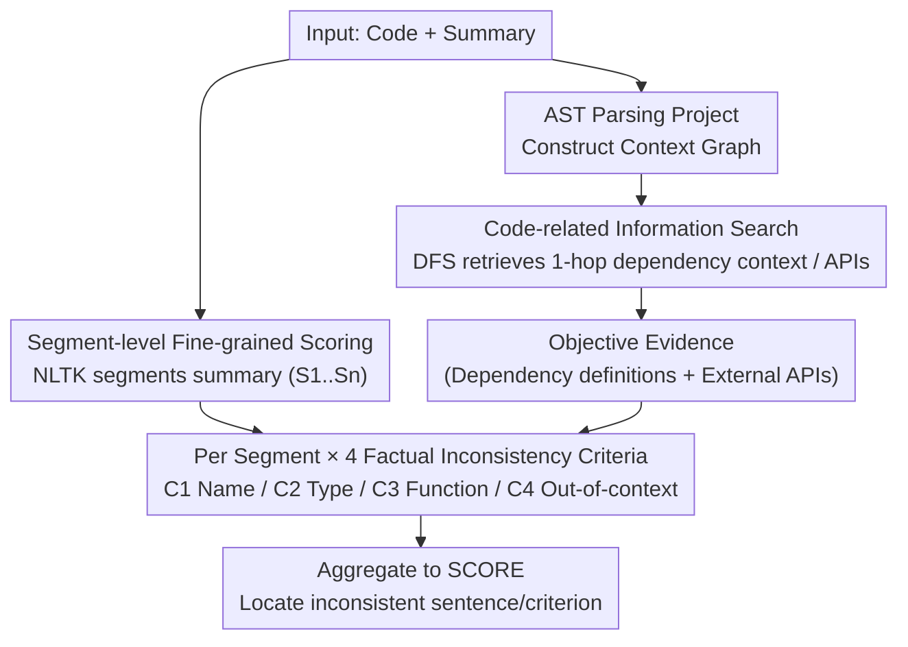

# ReFEree: Reference-Free and Fine-Grained Method for Evaluating Factual Consistency in Real-World Code Summarization

**Conference**: ACL 2026  
**arXiv**: [2604.10520](https://arxiv.org/abs/2604.10520)  
**Code**: [GitHub](https://github.com/bsy99615/ReFEree)  
**Area**: Code Intelligence / Code Summarization Evaluation  
**Keywords**: Factual Consistency, Code Summarization, Reference-free Evaluation, Fine-grained Evaluation, Dependency Analysis

## TL;DR

Ours proposes ReFEree, a reference-free and fine-grained factual consistency evaluation method for real-world code summarization. It defines four categories of inconsistency criteria, evaluates at the sentence/segment level, and incorporates a dependency information search mechanism. ReFEree achieves a 15-18% improvement in correlation with human judgment on Python and Java compared to the Prev. SOTA.

## Background & Motivation

**Background**: LLMs (such as GPT-4, Codex, GitHub Copilot, and Claude Code) are being widely integrated into real-world development workflows to automatically generate long and descriptive code summaries. However, when summaries inaccurately reflect the actual implementation of the code, it leads to developer misunderstanding, delayed debugging, and increased maintenance costs.

**Limitations of Prior Work**: (1) Reference-based methods (ROUGE, BLEU, METEOR) rely on human-written reference summaries, but code summarization is a one-to-many task—semantically correct summaries might use completely different wording. (2) LLM-as-judge methods treat the summary as a whole, using a single criterion to produce binary or coarse 5-point scores, failing to provide fine-grained evaluation or locate which specific sentences are inconsistent and why. (3) Existing methods evaluate based solely on the input code, ignoring external dependency definitions of functions/classes in real-world code. Summaries often describe elements defined externally, but evaluation lacks this context.

**Key Challenge**: Real-world code summaries are increasingly long and descriptive, containing multiple sentences covering various functional points and frequently involving external dependency elements. However, existing evaluation methods are neither fine-grained nor aware of dependency contexts.

**Goal**: To design a reference-free, fine-grained, and dependency-aware factual consistency evaluation method that can locate inconsistencies and explain the underlying reasons.

**Key Insight**: Starting from the actual error patterns in LLM-generated summaries, the authors empirically analyze and induce four typical inconsistency criteria, which are then inspected sentence-by-sentence.

**Core Idea**: The summary is segmented into sentences, and each segment is evaluated against four criteria. Simultaneously, relevant dependency information is retrieved via project context graph search as objective evidence, and results are finally aggregated into an overall score.

## Method

### Overall Architecture

ReFEree replaces the "single score for the whole summary" approach with a "sentence-by-sentence, multi-dimensional factual check." Given code and its summary, it first parses the project into a context graph using AST and searches for 1-hop dependency information around the evaluated function as objective evidence. Then, it utilizes NLTK to segment the summary, directing the LLM to judge each segment against four inconsistency criteria. Finally, the judgments across all segments and criteria are aggregated into an explainable overall consistency score. This pipeline requires no reference summaries or training, providing both a total score and identifying "which sentence and which criterion" caused the issue.

### Key Designs

**1. Four Factual Inconsistency Criteria: Decomposing "Factual Consistency" into Orthogonal Dimensions**

A single "factual consistency" criterion is too general and masks how different errors impact code understanding differently. The authors empirically analyzed 300 LLM-generated summaries (3 models × 100 functions). After human labeling, they induced four actionable criteria: [C1] Name Inconsistency (14%, identifier name errors), [C2] Type Inconsistency (15%, return/variable type errors), [C3] Functional Inconsistency (35%, mismatch between description and implementation, often due to ignoring dependencies), and [C4] Out-of-context (33%, inclusion of irrelevant content/hallucinations). C3 and C4 account for 68%, indicating that functional errors and hallucinations are the primary issues; thus, evaluation must isolate these categories.

**2. Code-Related Information Search: Completing Evidence with 1-hop Dependency Graphs**

Real summaries often describe elements defined outside the function. Evaluating solely on the input code lacks sufficient context. ReFEree retrieves evidence in two steps: first, it traverses the AST to build a project context graph with code entities as nodes and dependencies as directed edges; second, it uses DFS to search for the 1-hop dependency context of core entities (functions, classes, variables) and retrieves external API documentation for outside dependencies. The 1-hop limit is used because multi-hop search introduces noise rapidly, whereas 1-hop strikes a balance between "sufficient context" and "controllable noise," enabling accurate verification of descriptions involving external elements.

**3. Segment-Level Fine-Grained Scoring: Decomposition-Aggregation for Explainability**

After segmenting the summary into $\mathcal{D} = \{S_1, ..., S_n\}$, each segment is judged against the four criteria. $f(S, C)$ outputs 0 (inconsistency detected) or 1 (consistent). These are aggregated into $\text{SCORE} = \frac{1}{|\mathcal{D}| \times |Criteria|} \sum_{S} \sum_{C} f(S, C)$. This decomposition-aggregation structure achieves two goals: it precisely locates which sentence and which criterion failed, and it ensures the final score has a clear, traceable derivation rather than being a "black-box" number.

### Loss & Training

ReFEree is a training-free evaluation method. The main experiments utilize GPT-4.1-mini as the segment-level criterion evaluator (temperature 0.1, top-p 0.9, top-k 50). The evaluation cost per sample is approximately $0.004, and the evaluator can be replaced with various open-source or closed-source LLMs.

## Key Experimental Results

### Main Results

| Method | Python Avg($r_p/r_s/\tau$) | Java Avg($r_p/r_s/\tau$) |
|--------|------|------|
| ROUGE-L | 0.037 | 0.172 |
| BERTScore | 0.005 | 0.150 |
| G-Eval (Prev. SOTA) | 0.400 | 0.406 |
| CODERPE | 0.392 | 0.401 |
| ReFEree (w/o info) | 0.404 | 0.438 |
| ReFEree (w/ info) | **0.459** (+15%) | **0.480** (+18%) |

### Ablation Study

| Configuration | Python | Java | Description |
|------|---------|------|----|
| C1 only (Name) | 0.394 | 0.318 | Weakest single criterion, lower than G-Eval |
| C3 only (Function) | 0.419 | 0.391 | Strongest single criterion, exceeds G-Eval |
| All Four Criteria | **0.459** | **0.480** | Multi-criteria synergy is optimal |
| No Dependency Info | 0.404 | 0.438 | Search module contributes ~0.05 gain |

### Key Findings
- ReFEree significantly outperforms all 13 baselines on both Python and Java, achieving a 15-18% improvement over the Prev. SOTA (G-Eval).
- Segment-level evaluation accuracy reaches 93.4% (Python) and 93.0% (Java), indicating that LLMs can reliably execute fine-grained criteria judgments.
- Reference-based methods (BLEU/ROUGE) show extremely low correlation with human judgment ($<0.05$), rendering them almost useless in code summarization scenarios.
- Functional inconsistency (C3) has the greatest impact on human judgment, while name inconsistency (C1) has the least.
- The method performs robustly across different LLM evaluators (Llama-8B, Mistral-7B, GPT-4.1-mini, etc.).

## Highlights & Insights
- Refining factual inconsistency criteria from "overall consistency" into four orthogonal dimensions is the core methodological contribution, making evaluation explainable and actionable.
- The design of constructing a project context graph based on AST and limiting it to 1-hop search balances information completeness and noise control.
- The construction of the evaluation benchmark (Human-AI collaborative labeling, reaching a Krippendorff's $\alpha$ of 0.74-0.84) ensures reliability.
- The cost of $0.004 per sample makes the method highly practical for deployment.

## Limitations & Future Work
- Validated primarily on Python and Java; generalizability to other programming languages remains unverified.
- Dependency on LLMs as evaluators subject the method to the code-understanding limits of the LLM.
- The four criteria were empirically induced from 300 samples and might not cover all types of inconsistency.
- Currently supports static code analysis for dependency info; handling dynamic analysis or complex cross-file dependencies is limited.

## Related Work & Insights
- **vs G-Eval**: G-Eval uses a single "factual consistency" criterion for the whole summary; ReFEree improves by 15-18% through multi-criteria segment-level evaluation.
- **vs FactScore**: FactScore decomposes into atomic facts but uses only a single consistency criterion for each; ReFEree's multi-criteria design is more comprehensive.
- **vs SIDE**: SIDE uses contrastive learning to evaluate semantic fit but performs poorly on long descriptive summaries; ReFEree is specifically designed for long summaries.
- **vs Maharaj et al.**: That work performs binary detection at the entity level without explanations and relies on LLM internal knowledge; ReFEree provides reasons and explicitly models dependencies.

## Rating
- Novelty: ⭐⭐⭐⭐ Combination of four-criteria fine-grained evaluation and dependency search is novel and practical, though the core concept (LLM-as-judge + decomposition) has precedents.
- Experimental Thoroughness: ⭐⭐⭐⭐⭐ Comprehensive comparison with 13 baselines, multi-language validation, segment/summary-level evaluation, robustness across LLMs, and thorough ablation.
- Writing Quality: ⭐⭐⭐⭐⭐ Clear motivation, intuitive flowcharts, rigorous experimental organization, and balanced quantitative/qualitative analysis.
- Value: ⭐⭐⭐⭐ High practical value for code summarization quality evaluation; low-cost deployment; evaluation criteria extendable to other code understanding tasks.

<!-- RELATED:START -->

## Related Papers

- [\[ACL 2026\] LogicEval: A Systematic Framework for Evaluating Automated Repair Techniques for Logical Vulnerabilities in Real-World Software](logiceval_a_systematic_framework_for_evaluating_automated_repair_techniques_for_.md)
- [\[ACL 2026\] DPC: Training-Free Text-to-SQL Candidate Selection via Dual-Paradigm Consistency](dpc_training-free_text-to-sql_candidate_selection_via_dual-paradigm_consistency.md)
- [\[ACL 2026\] SecureVibeBench: Evaluating Secure Coding Capabilities of Code Agents with Realistic Vulnerability Scenarios](securevibebench_evaluating_secure_coding_capabilities_of_code_agents_with_realis.md)
- [\[ACL 2025\] CompileAgent: Automated Real-World Repo-Level Compilation with Tool-Integrated LLM-based Agent System](../../ACL2025/code_intelligence/compileagent_automated_real-world_repo-level_compilation_with_tool-integrated_ll.md)
- [\[ACL 2026\] CodeWiki: Evaluating AI's Ability to Generate Holistic Documentation for Large-Scale Codebases](codewiki_evaluating_ai39s_ability_to_generate_holistic_documentation_for_large-s.md)

<!-- RELATED:END -->
