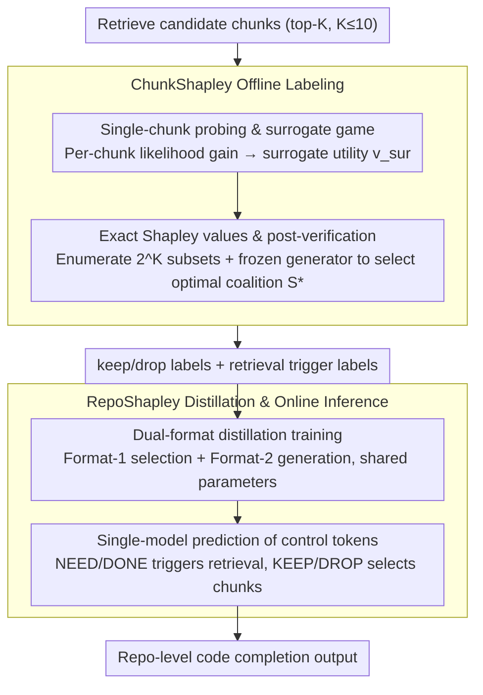

# RepoShapley: Shapley-Enhanced Context Filtering for Repository-Level Code Completion

**Conference**: ACL 2026 Findings  
**arXiv**: [2601.03378](https://arxiv.org/abs/2601.03378)  
**Code**: [github](https://github.com/yuhuo03/RepoShapley)  
**Area**: Information Retrieval / Code Completion  
**Keywords**: Shapley Value, Context Filtering, Repository-Level Code Completion, Retrieval-Augmented Generation, Coalitional Game

## TL;DR

RepoShapley is proposed as a coalition-aware context filtering framework based on Shapley values. It determines whether to retain or discard retrieved code snippets by estimating their interactive contributions within combinations, significantly improving the quality of repository-level code completion.

## Background & Motivation

**Background**: Repository-level code completion requires parsing cross-file dependencies (e.g., project APIs, shared contracts). Retrieval-Augmented Generation (RAG) enhances code LMs by injecting cross-file evidence.

**Limitations of Prior Work**: The utility of retrieved code snippets exhibits interactive dependencies—some snippets are useless in isolation but become critical when paired with complementary contexts, while others appear relevant but degrade generation quality when coexist with conflicting evidence. Existing methods (e.g., CODEFILTER) score each snippet independently, failing to capture these combinatorial effects.

**Key Challenge**: Under a fixed context budget, there is a systematic bias between the utility of snippets scored independently and their actual utility when consumed in multi-snippet combinations.

**Goal**: Design a coalition-aware context filtering mechanism that uses Shapley marginal contribution signals to supervise snippet selection.

**Key Insight**: Context selection is modeled as a cooperative game—each retrieved snippet acts as a player, any subset forms a coalition, and Shapley values quantify the average marginal contribution of a snippet across all possible combinations.

**Core Idea**: Approximate Shapley values through a lightweight surrogate game paired with bounded post-verification to select the optimal coalition, then distill the verification results into discrete control tokens for online inference.

## Method

### Overall Architecture

A two-stage pipeline: (1) ChunkShapley offline labeling: single-chunk probing $\rightarrow$ surrogate game $\rightarrow$ exact Shapley values $\rightarrow$ bounded post-verification to generate keep/drop labels; (2) RepoShapley online inference: distilling verification labels into control tokens (`<KEEP>`/`<DROP>`/`<NEED>`/`<DONE>`), enabling a single model to simultaneously perform retrieval triggering, snippet selection, and code generation.

### Key Designs

1.  **Single-chunk probing and surrogate game**: For each candidate snippet $cc_i$, the individual teacher-forced log-likelihood gain $\Delta_i = \ell(X_{in}, \{cc_i\}) - \ell(X_{in})$ is calculated to obtain the sign $y_i = \text{sign}(\Delta_i)$ and weight $\omega_i = |\Delta_i|$. The surrogate utility is defined as $v_{sur}(S) = \sigma(\beta \sum_{i \in S} \omega_i y_i) - \sigma(0)$, where the saturation of the logistic (sigmoid) function naturally captures redundancy effects, and negative votes ($y_i=-1$) model conflicts. This step compresses combinatorial effects into a 1D weighted vote using $O(K)$ probes, paving the way for exact enumeration.

2.  **Exact Shapley values and post-verification**: Since the surrogate utility $v_{sur}$ has a closed-form solution, $2^K$ subsets can be exactly enumerated for a retrieval set of $K \leq 10$ to calculate Shapley values. A candidate pool $\mathcal{C}$ (Shapley prefixes + $\Delta$ prefixes + size-2/3 combinations of top-L snippets) is constructed, and a frozen generator is used for decoding to select the optimal coalition $S^\star$ based on ES/EM.

3.  **Dual-format distillation training**: Format-1 supervises selection (predicting the keep/drop token sequence for each snippet); Format-2 supervises generation (FIM completion using only retained snippets). Both formats share parameters, allowing the model to learn selection and generation within a unified autoregressive interface.

### Loss & Training

The training loss consists of a retrieval control loss $\mathcal{L}_R$ (predicting `<NEED>`/`<DONE>`) and a snippet selection loss $\mathcal{L}_S$ (predicting the keep/drop sequence), both utilizing standard cross-entropy. During inference, a threshold $t_c$ determines whether to trigger retrieval.

## Key Experimental Results

### Main Results

| Method | RepoEval Line EM | RepoEval API EM | CCLongEval Chunk ES | CCEval Line EM |
|---|---|---|---|---|
| No-Retrieve (SC-1B) | 43.14 | 38.03 | 47.29 | 18.72 |
| Full-Retrieve | 52.27 | 44.18 | 55.93 | 22.38 |
| RepoFormer | 54.71 | 45.73 | 57.69 | 25.42 |
| CODEFILTER | 57.19 | 48.37 | 59.91 | 27.81 |
| **RepoShapley** | **61.34** (+4.15) | **53.62** (+5.25) | **64.39** (+4.48) | **32.26** (+4.45) |

*Code completion performance on StarCoder-Base-1B*

### Ablation Study

RepoShapley outperforms all baseline methods (including No-Retrieve, Full-Retrieve, RepoFormer, and CODEFILTER) across 11 evaluation metrics. It demonstrates consistent advantages on StarCoder-Base-7B and CodeLlama-13B, proving the method's backbone-agnostic nature.

### Key Findings

- Coalition-aware supervision improves performance by 4-5 percentage points compared to independent scoring.
- Shapley prefix selection outperforms simple $\Delta$-based ranking, validating the importance of interaction effects.
- Retrieval trigger control effectively reduces unnecessary retrievals without sacrificing performance.
- The $\beta$ parameter in the surrogate game controls the saturation scale; values that are too large or too small lead to degradation.

## Highlights & Insights

- **Paradigm Shift from Independence to Coalition**: Upgrading context filtering from "individual scoring" to a "combinatorial game" represents a significant evolution in RAG control logic.
- **Clever Design for Computational Feasibility**: Using a lightweight surrogate game avoids exponential generator evaluations, while bounded post-verification ensures precision, excellently balancing efficiency and effectiveness.
- **Distillation to Control Tokens**: Compressing offline combinatorial reasoning capabilities into online single-token predictions is an elegant engineering solution.

## Limitations & Future Work

- The retrieval set size is limited to $K \leq 10$; larger sets would require sampling approximations.
- The sigmoid assumption in the surrogate game may not be applicable to certain code structures.
- Post-verification requires the target sequence $Y$, meaning it can only be used for offline labeling and not for online updates.
- Future work could explore adaptive $\beta$ adjustments and more sophisticated interaction modeling.

## Related Work & Insights

- An extension of Data Shapley (Ghorbani & Zou, 2019) data value evaluation concepts to the RAG scenario.
- Difference from SHAP: This work focuses on forward supervision (constructing training labels) rather than backward explanation.
- The control token distillation approach can be generalized to other scenarios requiring dynamic context selection.

## Rating

- **Novelty**: ⭐⭐⭐⭐⭐ Introducing Shapley values to RAG context control from a coalitional game perspective is highly novel.
- **Experimental Thoroughness**: ⭐⭐⭐⭐ Thoroughly validated across multiple benchmarks and backbones with detailed ablation analysis.
- **Writing Quality**: ⭐⭐⭐⭐ Clear mathematical formalization and comprehensive explanation of methodological motivation.
- **Value**: ⭐⭐⭐⭐⭐ Provides a systematic solution for context control in RAG scenarios, offering broad potential impact.

<!-- RELATED:START -->

## Related Papers

- [\[ACL 2026\] SWE-QA: Can Language Models Answer Repository-level Code Questions?](swe-qa_can_language_models_answer_repository-level_code_questions.md)
- [\[ICML 2026\] MatchFixAgent: Language-Agnostic Autonomous Repository-Level Code Translation Validation and Repair](../../ICML2026/code_intelligence/matchfixagent_language-agnostic_autonomous_repository-level_code_translation_val.md)
- [\[ACL 2025\] FEA-Bench: A Benchmark for Evaluating Repository-Level Code Generation for Feature Implementation](../../ACL2025/code_intelligence/feabench_repo_code_gen.md)
- [\[ACL 2026\] Sense and Sensitivity: Examining the Influence of Semantic Recall on Long Context Code Understanding](sense_and_sensitivity_examining_the_influence_of_semantic_recall_on_long_context.md)
- [\[ICLR 2026\] Improving Code Localization with Repository Memory](../../ICLR2026/code_intelligence/improving_code_localization_with_repository_memory.md)

<!-- RELATED:END -->
