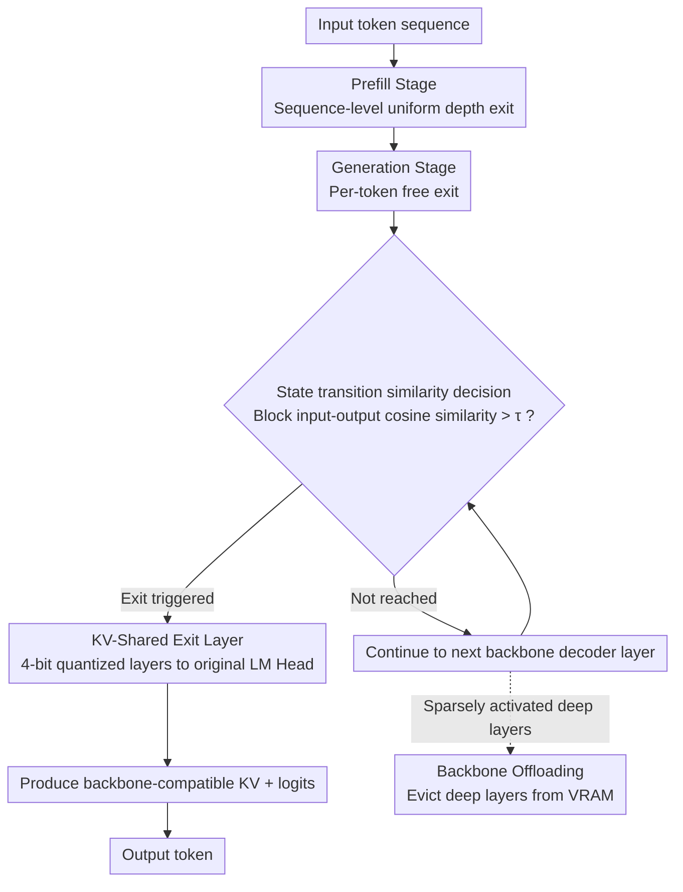

# River-LLM: Large Language Model Seamless Exit Based on KV Share

**Conference**: ACL 2026  
**arXiv**: [2604.18396](https://arxiv.org/abs/2604.18396)  
**Code**: None  
**Area**: Code Intelligence  
**Keywords**: Early Exit, KV Cache, Dynamic Inference, Model Acceleration, Quantization

## TL;DR
This paper proposes River-LLM, a training-free framework that solves the missing KV Cache issue in Early Exit for decoder-only architectures by constructing lightweight KV-shared exit channels (Exit River). It utilizes state transition similarity to guide exit decisions, achieving 1.71×-2.16× wall-clock inference speedup while maintaining near-lossless generation quality.

## Background & Motivation

**Background**: Early Exit is a mainstream direction for LLM dynamic inference acceleration, reducing computation by dynamically skipping redundant layers based on input complexity. Existing methods like SkipDecode (monotonic exit), EE-LLM (batch recomputation), CALM (state propagation), and D-LLM (KV masking) attempt to solve this from various perspectives.

**Limitations of Prior Work**: In decoder-only architectures, the efficiency of Early Exit is severely bottlenecked by the **KV Cache missing problem**. When a token exits early, the skipped layers fail to provide the necessary historical KV states for subsequent tokens. Empirical analysis by the authors shows that while theoretically over 50% of tokens can exit at early layers, actual wall-clock acceleration is negligible.

**Key Challenge**: The four existing KV recovery strategies have fundamental flaws: batch recomputation introduces significant latency overhead; monotonic exit strictly limits exit flexibility; state propagation sacrifices accuracy for speed; and KV masking leads to severe precision loss. No method simultaneously satisfies "per-token free exit" and "KV integrity."

**Goal**: To design a "Seamless Exit" mechanism where individual tokens can exit independently at any layer (granularity freedom), while the KV cache for skipped layers is automatically filled as a byproduct of the exit path execution (intrinsic KV integrity), without post-exit recovery or recomputation.

**Key Insight**: Inspired by research on KV cache redundancy, the authors found that KV generation of the backbone decoder can be replicated through lightweight, quantized exit layers with minimal overhead. The cosine similarity between KV produced by exit layers and backbone layers remains above 0.97.

**Core Idea**: Construct a lightweight "Exit River" mapping one-to-one with the backbone decoder. Use 4-bit quantized weights to accelerate token traversal through the exit channel (2.4× throughput improvement) while naturally generating backbone-compatible KV caches.

## Method

### Overall Architecture

River-LLM sets up an "Exit River" in parallel with the backbone decoder—a string of 4-bit quantized lightweight exit layers corresponding to backbone layers, specifically responsible for completing the remaining computation and KV cache for early-exiting tokens. Inference occurs in two stages: in the Prefill stage, all tokens exit at a uniform depth to maintain parallel attention efficiency; in the Generation stage, it switches to per-token free exit, where each token terminates at its optimal depth. Once a token triggers the exit condition, its remaining computation is offloaded to the Exit River, processed by quantized exit layers up to the original LM Head to produce logits, while simultaneously generating complete, backbone-compatible KV—ensuring subsequent tokens do not lack historical KV, thus completely bypassing the KV missing bottleneck of decoder-only Early Exit.

### Key Designs

**1. KV-Shared Exit Layer: Approximating KV with quantized layers instead of precise recovery**

Exit layers directly inherit the architecture and parameters of backbone layers, applying 4-bit weight quantization (W4A16) to Attention and FFN blocks. However, KV Cache is intentionally kept in FP16 to preserve representation density and shares the same KV Cache addressing scheme with the corresponding backbone layers. The core insight is that KV cache does not require perfect precision—the error introduced by 4-bit quantization falls within an acceptable range, yielding massive computational savings: combined with quantization and partial graph-compiled optimized kernels, the exit layer achieves 2.4× throughput, while its generated KV maintains a cosine similarity of over 0.97 with the native backbone KV. Weight migration typically finishes within one minute and is entirely training-free.

**2. Exit Decision based on State Transition Similarity: Using early layer signals to predict exit**

The exit metric is the cosine similarity between the input and output of a decoder block (state transition similarity). The exit criterion is defined as $\mathcal{D}^{(l)} = \mathbb{I}(\min_{b \in \mathcal{B}} s_{t,b}^{(l)} > \tau)$, where $s_{t,b}^{(l)} = \frac{\mathbf{h}_{t,b}^{(l-1)\top} \mathbf{h}_{t,b}^{(l)}}{\|\mathbf{h}_{t,b}^{(l-1)}\| \|\mathbf{h}_{t,b}^{(l)}\|}$. The authors found a moderate positive correlation ($r=0.5536$) between state transition similarity in early layers and the final backbone-exit value vector similarity, allowing the former to predict the latter. As this similarity is largely monotonic, it aligns with Early Exit rules—most layers after the exit layer also satisfy the exit condition. The decision logic has a complexity of $\mathcal{O}(d)$, taking about 100 microseconds, which is only 0.0688% of total inference time.

**3. Backbone Offloading: Evicting sparsely activated deep layers from VRAM**

Since the majority of tokens terminate backbone traversal early, the framework can automatically evict deep backbone layers that are rarely activated from main VRAM. This allows the model to run with a memory footprint close to a full-quantization baseline, while the Exit River remains resident in VRAM to provide continuous semantic completion. This is a key advantage of River-LLM over full-model quantization: it retains selective computational fidelity—"difficult" or high-entropy tokens still pass through the full-precision backbone, while "simple" tokens are offloaded to the quantized Exit River, achieving a better trade-off between memory and accuracy.

### Loss & Training

River-LLM is entirely training-free: exit layer weights are directly copied from backbone layers and then subjected to PTQ quantization without any fine-tuning. A flexible trade-off between accuracy and speed is achieved solely by adjusting the threshold $\tau$.

## Key Experimental Results

### Main Results
Actual wall-clock speedup comparison on GSM8K, MATH, and HumanEval.

| Model | Task | Backbone Acc | Full Quant. Acc | River-LLM Acc | River-LLM Gain |
|------|------|------|------|------|------|
| Llama3.2 1B | GSM8K | 33.2 | 25.1 | 29.3 | 2.16× |
| Llama3.2 1B | MATH | 17.8 | 12.2 | 14.6 | 1.88× |
| Llama3.1 8B | GSM8K | 78.2 | 69.8 | 74.4 | 1.78× |
| Llama3.1 8B | HumanEval | 57.3 | 50.2 | 55.5 | 1.77× |
| Ministral3 8B | MATH | 48.1 | 46.0 | 46.6 | 1.85× |

### Ablation Study

| KV Strategy | Actual Latency | Accuracy Retention | Description |
|---------|---------|---------|------|
| KV Mask | Highest backbone latency | Poor | Requires deeper execution to compensate for accuracy loss |
| KV Recompute | High compute overhead | Good | Overhead accumulates in long sequence generation |
| State Propagation | Medium | Medium | Accuracy-speed trade-off |
| Mono-Decreasing | Medium | Good | Limits exit flexibility |
| KV Share (Ours) | Lowest | Good | No recovery operations required |

### Key Findings
- River-LLM executes an average of only 3-4 backbone layers to reach accuracy close to the full model; on Llama3.1 8B, most tasks terminate before the median layer.
- On HumanEval, River-LLM even exceeds the full model baseline (57.3 vs 55.5), possibly by skipping redundant deep layers to reduce cumulative noise or "overthinking."
- Compared to the full-quantization baseline, River-LLM throughput is approximately 10% lower, but accuracy retention is far superior.
- The exit decision logic takes only ~100 microseconds (0.0688% of total inference time), making the overhead negligible.
- GPU memory consumption is significantly lower than backbone models and current Early Exit baselines, approaching full-quantization models.

## Highlights & Insights
- **Conceptual Definition of "Seamless Exit"**: The combination of granularity freedom + intrinsic KV integrity is valuable, clearly distinguishing River-LLM from all previous methods. This definition is a contribution to Early Exit research.
- **Quantized Exit Layers as KV Proxies**: The idea is ingenious—not aiming for precise KV recovery, but using 4-bit quantized layers for "approximate" generation. A cosine similarity of 0.97+ is sufficient to maintain autoregressive generation quality, leveraging the inherent redundancy of KV cache.
- **Training-free Convenience**: Being entirely training-free is a major practical advantage. Weight migration completes in under a minute, making it plug-and-play for any decoder-only model.
- **Extensible Backend**: The quantization backend is replaceable (HQQ→AWQ further improves accuracy), showing good scalability.

## Limitations & Future Work
- Evaluation currently only covers models up to 8B parameters; behavior on 24B and 70B models remains unverified.
- Speedup is less pronounced for prefill-dominated tasks (e.g., MMLU) because the prefill stage uses sequence-level exit.
- The exit threshold $\tau$ requires manual selection; optimal values may vary across different models and tasks.
- Cumulative quantization errors still exist at very early exit points (though controllable), and the impact on extremely long sequence generation has not been fully studied.

## Related Work & Insights
- **vs LayerSkip/SpecEE**: These methods combine Early Exit with speculative decoding but are limited by sequence-level exit or short draft sequences. River-LLM achieves true token-level free exit.
- **vs CALM**: CALM uses state propagation to fill KV, which is an accuracy-speed trade-off; River-LLM eliminates this trade-off by generating high-fidelity KV via quantized exit layers.
- **vs Full-model Quantization**: Full quantization imposes uniform accuracy loss on all tokens. River-LLM selectively allows "hard" tokens to use the full-precision backbone while "easy" tokens use the quantized Exit River, achieving a better Pareto frontier.

## Rating
- Novelty: ⭐⭐⭐⭐⭐ The concept of a KV-shared Exit River is novel and elegant, clearly solving the core bottleneck of Early Exit.
- Experimental Thoroughness: ⭐⭐⭐⭐ Four models, multiple benchmarks, and thorough comparisons with full quantization and existing strategies, though lacking verification for models >8B.
- Writing Quality: ⭐⭐⭐⭐ Motivation derivation is clear and charts are informative, although some content is repetitive.

<!-- RELATED:START -->

## Related Papers

- [\[ICLR 2026\] KV Cache Transform Coding for Compact Storage in LLM Inference](../../ICLR2026/code_intelligence/kv_cache_transform_coding_for_compact_storage_in_llm_inference.md)
- [\[ACL 2025\] CoCo-Bench: A Comprehensive Code Benchmark for Multi-task Large Language Model Evaluation](../../ACL2025/code_intelligence/coco-bench_a_comprehensive_code_benchmark_for_multi-task_large_language_model_ev.md)
- [\[ACL 2026\] KoCo-Bench: Can Large Language Models Leverage Domain Knowledge in Software Development?](koco-bench_can_large_language_models_leverage_domain_knowledge_in_software_devel.md)
- [\[ACL 2026\] Precise Debugging Benchmark: Is Your Model Debugging or Regenerating?](precise_debugging_benchmark_is_your_model_debugging_or_regenerating.md)
- [\[ACL 2026\] StoryCoder: Narrative Reformulation for Structured Reasoning in LLM Code Generation](storycoder_narrative_reformulation_for_structured_reasoning_in_llm_code_generati.md)

<!-- RELATED:END -->
