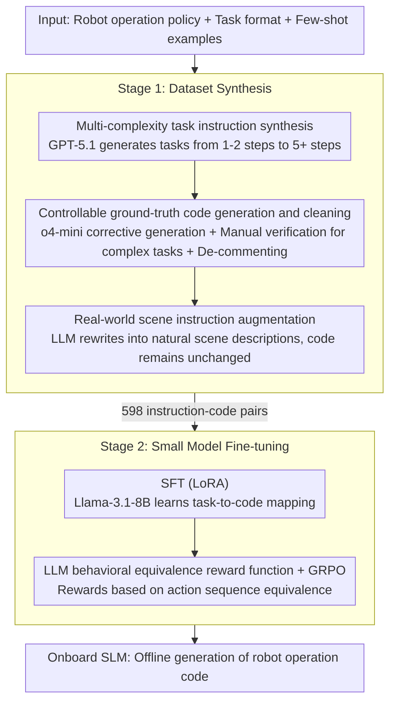

# Ro-SLM: Onboard Small Language Models for Robot Task Planning and Operation Code Generation

**Conference**: ACL2026  
**arXiv**: [2604.10929](https://arxiv.org/abs/2604.10929)  
**Code**: https://github.com/ai-uavsec/Ro-SLM  
**Area**: Code Intelligence  
**Keywords**: Small Language Models, Robot Planning, Code Generation, Knowledge Distillation, Edge Deployment

## TL;DR
Ro-SLM utilizes LLMs to synthesize and verify robot task-code data, followed by SFT and GRPO optimization of Llama-3.1-8B using LLM rewards. This allows the small model to approach the planning and operation code generation capabilities of cloud-based LLMs for UAV and ground vehicle tasks.

## Background & Motivation
**Background**: LLMs have been widely applied to robot task understanding, planning, and operation code generation. Through structured prompting, large models like GPT and Gemini can transform natural language tasks into robot API calls or control scripts, demonstrating strong capabilities in complex spatial reasoning.

**Limitations of Prior Work**: Many LLM-driven robot solutions rely on cloud APIs or high-performance local GPUs. In scenarios such as small UAVs, ground vehicles, disaster rescue, or mountain patrols, network connectivity, power consumption, compute capacity, and payload constraints may limit the deployment of cloud or ultra-large models. Small Language Models (SLMs) are more suitable for onboard inference, but original SLMs exhibit significantly weaker reasoning and code generation capabilities compared to LLMs.

**Key Challenge**: Robots require low-latency, offline-available, and resource-friendly onboard models; however, robot planning and code generation necessitate strong semantic understanding, spatial reasoning, and action sequence planning. Distilling the knowledge and reasoning capabilities of LLMs into deployable small models is the core problem addressed in this paper.

**Goal**: The authors aim to build an end-to-end framework that enables SLMs to learn the generation of executable robot operation code from natural language tasks through high-quality synthetic data and LLM feedback optimization, approaching LLM baselines on complex tasks.

**Key Insight**: Instead of relying solely on prompting to make SLMs mimic LLMs, the paper focuses on data construction. LLMs are responsible for generating task instructions of varying complexity, mapping ground-truth code, expanding concise instructions into realistic scene descriptions, and serving as reward functions during the reinforcement phase.

**Core Idea**: Use LLMs to construct task-code supervision and serve as behavioral equivalence evaluators to distill robot task knowledge from cloud LLMs into onboard-deployable SLMs.

## Method
Ro-SLM consists of two stages: dataset synthesis and small model fine-tuning. The first stage generates robot task instructions of different complexities and maps them to correct operation code; the second stage trains the SLM using these instruction-code pairs and optimizes the behavioral equivalence of model outputs via LLM rewards.

### Overall Architecture
The data synthesis stage defines robot operation policies, task formats, and a few demonstrations to enable GPT-5.1 to generate task instructions ranging from simple to complex. Subsequently, o4-mini generates corresponding robot operation code through corrective code generation. For high-complexity tasks (five steps and above), human expert verification and correction are introduced to ensure ground truth reliability. LLMs then rewrite concise task instructions into real-world application scene descriptions while keeping the corresponding code unchanged, thereby improving model robustness against natural human expressions.

During the training stage, Llama-3.1-8B serves as the SLM backbone. LoRA-based supervised fine-tuning (SFT) is first performed to let the model learn the mapping from robot APIs and tasks to code. GRPO is then used for further optimization, with rewards generated by an LLM that compares whether the robot behaviors implied by the SLM-generated code and the ground truth code are equivalent, rather than just looking at string similarity.

### Key Designs

**1. Multi-complexity task instruction synthesis: Spreading the distribution from simple actions to long-horizon planning**

If trained only on simple tasks, SLMs fail to learn complex planning; if trained only on complex tasks, basic action capabilities are lost—ablation shows that "simple-only" results in 0% SR on Advanced tasks, while "complex-only" results in 0% SR on Basic tasks. To address this, an LLM agent generates task instructions based on robot capabilities, operational constraints, and few-shot examples, using various system prompt configurations to control the complexity distribution, covering basic movements to long-horizon planning with dynamic reasoning. Task diversity is thus a prerequisite of the framework rather than an afterthought.

**2. Controllable ground-truth code generation and cleaning: Reliable supervision with minimal human cost**

A single error in robot control code can cause physical failure. Relying entirely on LLM automated generation introduces errors in complex samples. Ro-SLM uses a "divide and conquer" approach: simple tasks use corrective code generation, while tasks with five or more steps are reviewed by human experts. Code comments are uniformly removed—since comments are "explanations for humans," they may induce SLMs to learn superficial language patterns rather than action logic. Hybrid verification ensures reliable ground truth for complex samples, while de-commenting forces the model to focus on the code itself.

**3. Real-world instruction augmentation: Making SLMs resilient to natural human expression**

To avoid misunderstandings, synthesized instructions are often concise and mechanical (e.g., "fly up 5 meters, then fly down 4 meters"), which differs from natural human commands. Ro-SLM uses LLMs to augment each concise instruction into a corresponding real-world deployment scene description while keeping the code unchanged. Consequently, the instruction side becomes naturally diverse while the code side still points to the same ground truth. To prevent augmentation from introducing redundant actions, system prompts restrict the rewriting to only common vocabulary and single-paragraph human-like expressions. Ablation shows this improves SR/Completeness by at least 2% on Basic tasks and over 5% on Advanced tasks, with significant robustness gains on real-world test sets.

**4. LLM as behavioral equivalence reward function: Aligning optimization with robot actions rather than code text**

Different variable names or coding styles in robot code do not necessarily mean different behaviors; conversely, semantically similar text might produce different actions. Pure string similarity leads to misjudgments in both cases. During the GRPO phase, Ro-SLM requires the LLM to explain the robot behaviors corresponding to the SLM-generated code and the ground truth code separately, judging whether the two action sequences are equivalent. This equivalence signal is used as a reward to optimize the SLM's step-level reasoning. The reward is thus tied to the essence of the task—consistency of action—making it more suitable for robot control than lexical matching.

### Loss & Training
Ro-SLM first performs SFT on Llama-3.1-8B using LoRA to learn the mapping from task instructions to operation code. GRPO is then used for optimization, with rewards provided by a function implemented via GPT-5.1. The training data consists of 203 original task instructions, with 150 automatically grounded and 53 high-complexity tasks manually assisted. After augmentation, 598 instruction-code pairs were obtained, split into 492 for training and 106 for evaluation.

## Key Experimental Results

### Main Results
Experiments were conducted in the AirSim block environment, evaluating Success Rate (SR) and Completeness on Basic, Advanced, and their real-world mapping versions. Comparison methods include original Llama-3.1-8B, GSCE, Corrective GSCE, and Ro-SLM variants.

| Dataset | Metric | Ro-SLM | Original Llama-3.1-8B | GSCE | Corrective GSCE |
|--------|------|------|----------|------|------|
| Basic | SR / Completeness | 97.7% / 98.9% | 9.1% / 9.1% | 100% / 100% | 100% / 100% |
| Advanced | SR / Completeness | 70.0% / 83.7% | 5.0% / 9.0% | 75.0% / 91.5% | 90.0% / 97.8% |
| Basic real-world | SR / Completeness | 93.2% / 95.5% | 11.4% / 26.1% | 100% / 100% | 100% / 100% |
| Advanced real-world | SR / Completeness | 75.0% / 87.0% | 0% / 8.4% | 75.0% / 94.8% | 81.7% / 96.3% |
| Ground vehicle | SR / Completeness | 75.0% / 81.1% | N/A | Not reported | 87.5% / 97.2% |

Results indicate that the original SLM is almost incapable of generating robot code, while Ro-SLM significantly narrows the gap with LLM-based GSCE. On Advanced real-world tasks, Ro-SLM achieves 75% SR, matching GSCE, though Completeness remains lower than Corrective GSCE.

### Ablation Study
The authors analyzed the contribution of each component through comments, augmentation, task complexity distribution, and GRPO optimization.

| Configuration | Basic SR / Comp. | Advanced SR / Comp. | Description |
|------|---------|------|------|
| Ro-SLM | 97.7% / 98.9% | 70.0% / 83.7% | Full framework |
| with Comments | 95.5% / 96.6% | 50.0% / 76.2% | Comment noise hurts complex tasks |
| without Augmentation | 95.5% / 96.6% | 55.0% / 74.8% | Lack of natural expression reduces robustness |
| Simple Task Only | 90.9% / 93.2% | 0% / 1.9% | Fails to generalize to complex planning |
| Complex Task Only | 0% / 2.3% | 75.0% / 83.8% | Loses basic action capabilities |
| without GRPO | 97.7% / 98.9% | 70.0% / 83.1% | GRPO primarily improves step-level completeness |

### Key Findings
- Prompting that works for LLMs does not necessarily work for SLMs. Original Llama-3.1-8B often repeats task instructions or generates incorrect reasoning code.
- Augmentation is particularly important for real-world mapping. In Advanced real-world tasks, Ro-SLM's Completeness reached 87.0%, higher than the 83.7% on original Advanced tasks, indicating that natural scene description training improves robustness.
- On Very High complexity tasks, Ro-SLM's SR reached 50%, higher than GSCE's 25%. This likely stems from the accurate human-verified ground truth code for high-complexity samples.
- In ground vehicle experiments, Ro-SLM remained close to Corrective GSCE, showing that the framework does not just memorize UAV APIs but migrates to different robot platforms.

## Highlights & Insights
- The paper identifies the core bottleneck for robot control on SLMs as data and alignment rather than complex prompting. It forms a complete reusable pipeline by stringing together synthesis, verification, augmentation, and reward optimization.
- The detail of removing code comments is insightful. It suggests SLMs may be highly sensitive to superficial language patterns in training data; "explanations for humans" in robot code might interfere with the model learning action logic.
- The LLM reward function focuses on behavioral equivalence rather than code text similarity, which aligns well with robot tasks. Future work could integrate simulator execution feedback or formal action checking to reduce LLM judge uncertainty.
- The value of Ro-SLM lies not in surpassing the strongest cloud LLMs, but in reaching usable levels for offline, low-compute, and low-latency scenarios. This trade-off is highly practical for real robot deployment.

## Limitations & Future Work
- Evaluation is primarily in simulated environments. Real robots face sensor noise, localization errors, dynamic biases, and safety constraints, requiring stronger verification before deployment.
- Data synthesis remains task-specific. Migrating to new robots, APIs, or task domains requires redefining operation policies and re-generating/verifying data.
- Llama-3.1-8B requires approximately 16GB of VRAM, which is still unsuitable for all compact edge devices. The capabilities of smaller 3B or 1B models under this framework have not been verified.
- Ground truth code for high-complexity tasks still requires human expert review, which increases labor costs when scaling to larger or more complex robot systems.
- Unlike Corrective GSCE, Ro-SLM performs single-turn inference and cannot self-correct intermediate errors. Future work could explore lightweight onboard verifiers or step-by-step execution-feedback mechanisms.

## Related Work & Insights
- **vs GSCE**: GSCE uses structured prompts for cloud LLMs to generate robot code; Ro-SLM distills this capability into small models, sacrificing some performance for onboard deployment.
- **vs Corrective GSCE**: Corrective GSCE achieves higher success rates using multi-turn LLM corrections but relies on multiple inferences; Ro-SLM's single-turn inference is better suited for resource-constrained platforms.
- **vs PRISM / LLM-Trainer**: These works also utilize LLMs for robot data synthesis or planner distillation; Ro-SLM emphasizes operation code generation, task complexity distribution, and LLM reward optimization.
- **Insight**: For edge agents, LLMs can handle data generation, verification, and reward modeling during training, while the SLM performs execution during inference. This "heavy cloud training, light edge inference" pattern is worth promoting.

## Rating
- Novelty: ⭐⭐⭐⭐☆ The framework combination is engineering-oriented, but the complete pipeline for onboard SLM robot code generation has clear value.
- Experimental Thoroughness: ⭐⭐⭐⭐☆ Covers UAVs, real-world augmentation, and ground vehicles with sufficient ablation; real hardware experiments are still missing.
- Writing Quality: ⭐⭐⭐⭐☆ Clear structure with intuitive experimental figures; some data construction details depend on appendix prompts.
- Value: ⭐⭐⭐⭐☆ High reference value for resource-constrained robots, edge agents, and LLM-to-SLM distillation practices.

<!-- RELATED:START -->

## Related Papers

- [\[ACL 2026\] PaT: Planning-after-Trial for Efficient Test-Time Code Generation](pat_planning-after-trial_for_efficient_test-time_code_generation.md)
- [\[ICLR 2026\] LearNAT: Learning NL2SQL with AST-guided Task Decomposition for Large Language Models](../../ICLR2026/code_intelligence/learnat_learning_nl2sql_with_ast-guided_task_decomposition_for_large_language_mo.md)
- [\[ACL 2025\] Personality-Guided Code Generation Using Large Language Models](../../ACL2025/code_intelligence/personality_guided_code_gen.md)
- [\[ICLR 2026\] CrossPL: Systematic Evaluation of Large Language Models for Cross Programming Language Interoperating Code Generation](../../ICLR2026/code_intelligence/crosspl_systematic_evaluation_of_large_language_models_for_cross_programming_lan.md)
- [\[ACL 2026\] Static Program Slicing Using Language Models With Dataflow-Aware Pretraining and Constrained Decoding](static_program_slicing_using_language_models_with_dataflow-aware_pretraining_and.md)

<!-- RELATED:END -->
