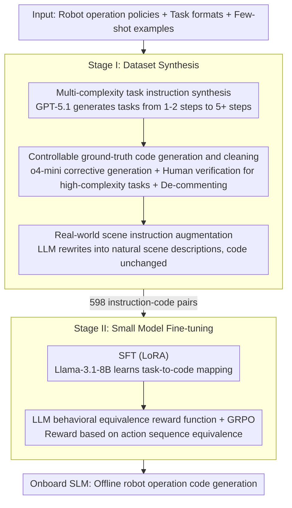

# Ro-SLM: Onboard Small Language Models for Robot Task Planning and Operation Code Generation

**Conference**: ACL2026  
**arXiv**: [2604.10929](https://arxiv.org/abs/2604.10929)  
**Code**: https://github.com/ai-uavsec/Ro-SLM  
**Area**: Code Intelligence  
**Keywords**: Small Language Models, Robot Planning, Code Generation, Knowledge Distillation, Edge Deployment

## TL;DR
Ro-SLM utilizes LLMs to synthesize and verify robot task-code data, followed by SFT and GRPO optimization with LLM rewards applied to Llama-3.1-8B. This enables the small model to approach the planning and operation code generation capabilities of cloud-based LLMs for UAV and ground vehicle tasks.

## Background & Motivation
**Background**: LLMs have been applied to robot task understanding, planning, and operation code generation. Through structured prompting, large models such as GPT and Gemini can convert natural language tasks into robot API calls or control scripts, demonstrating strong performance in complex spatial reasoning.

**Limitations of Prior Work**: Many LLM-driven robotics solutions rely on cloud APIs or high-performance local GPUs. In scenarios such as small UAVs, ground vehicles, disaster rescue, or mountain inspections, network connectivity, power consumption, compute power, and payload capacity may limit the deployment of cloud or ultra-large models. Small Language Models (SLMs) are better suited for onboard inference, but original SLMs exhibit significantly weaker reasoning and code generation capabilities compared to LLMs.

**Key Challenge**: Robots require low-latency, offline-capable, and resource-friendly onboard models; however, robot planning and code generation necessitate strong semantic understanding, spatial reasoning, and action sequence planning. The core problem of this paper is how to distill the knowledge and reasoning capabilities of LLMs into deployable small models.

**Goal**: The authors aim to construct an end-to-end framework that allows SLMs to learn to generate executable robot operation code from natural language tasks through high-quality synthetic data and LLM feedback optimization, approaching LLM baselines on complex tasks.

**Key Insight**: Instead of relying solely on prompting for SLMs to mimic LLMs, the paper focuses on data construction. LLMs are responsible for generating task instructions of varying complexity, mapping ground-truth code, expanding concise instructions into real-world scene descriptions, and serving as reward functions during the reinforcement optimization phase.

**Core Idea**: Use LLMs to construct task-code supervision and serve as behavioral equivalence evaluators to distill robot task knowledge from cloud LLMs into onboard-deployable SLMs.

## Method
Ro-SLM consists of two stages: dataset synthesis and small model fine-tuning. The first stage generates robot task instructions across different complexities and maps them to correct operation code. The second stage uses these instruction-code pairs to train the SLM, followed by optimizing the behavioral equivalence of the model output using LLM rewards.

### Overall Architecture
The data synthesis stage first defines robot operation policies, task formats, and a few-shot set of demonstrations, allowing GPT-5.1 to generate task instructions ranging from simple to complex. Subsequently, o4-mini generates corresponding robot operation code through corrective code generation; for high-complexity tasks (five steps or more), human expert verification and correction are introduced to ensure reliable ground truth. Then, the LLM rewrites concise task instructions into real-world application scene descriptions while keeping the corresponding code unchanged, thereby improving the model's robustness against natural human expressions.

During the training phase, Llama-3.1-8B serves as the SLM backbone. Supervised fine-tuning (SFT) is first performed using LoRA to let the model learn the mapping from robot APIs and tasks to code. Then, GRPO is used for further optimization, with rewards generated by an LLM that compares whether the robot behaviors implied by the SLM-generated code and the ground truth code are equivalent, rather than just looking at string similarity.

### Key Designs

**1. Multi-complexity task instruction synthesis: Spreading the distribution from simple actions to long-horizon planning**

If trained only on simple tasks, the SLM fails to learn complex planning; if trained only on complex tasks, it loses basic action capabilities. Ablation studies showed that simple-only training resulted in a 0% Success Rate (SR) on Advanced tasks, while complex-only training resulted in a 0% SR on Basic tasks. To address this, an LLM agent generates task instructions based on robot capabilities, operational constraints, and few-shot examples, using various system prompt configurations to control the complexity distribution. This ensures coverage from basic 1-2 step movements to long-horizon planning involving dynamic reasoning and 5+ steps. Task diversity is thus a prerequisite of the framework rather than an afterthought.

**2. Controllable ground-truth code generation and cleaning: Reliable instruction-code supervision at minimal human cost**

A single error in robot control code can cause physical actions to fail. Relying entirely on LLM automated generation introduces noise into complex samples. Ro-SLM adopts a divide-and-conquer approach: simple tasks use corrective code generation by LLMs, while high-complexity tasks (5+ steps) are reviewed and corrected by human experts. Finally, code comments are removed because they are "explanations for humans" that might induce the SLM to learn surface linguistic patterns rather than action logic. Hybrid verification ensures the reliability of complex ground truths, while de-commenting forces the model to focus on the code itself.

**3. Real-world scene instruction augmentation: Enhancing SLM robustness against natural expressions**

To prevent misunderstandings in code generation, synthesized instructions are often concise and mechanical (e.g., "fly up 5 meters, then fly down 4 meters"), which differs from natural human commands. Ro-SLM uses an LLM to augment each concise instruction into a corresponding real-world deployment scene description while keeping the code identical. This makes the instruction side naturally diverse while the code side still points to the same ground truth. To avoid introducing new actions or verbosity, system prompts constrain the augmentation to maintain the same robot actions using common vocabulary in a single-paragraph human-like tone. Ablations show this augmentation improves SR/Completeness by at least 2% on Basic tasks and over 5% on Advanced tasks, with significant robustness gains on real-world mapped versions.

**4. LLM as a behavioral equivalence reward function: Aligning optimization goals with robot actions instead of code text**

Different variable names or coding styles do not necessarily mean different behaviors; conversely, semantically similar text might produce different actions. Simple string similarity leads to misjudgment. During the GRPO phase, Ro-SLM has an LLM interpret the robot behaviors corresponding to both the SLM-generated code and the ground truth code, judging whether the two action sequences are equivalent. This equivalence signal is used as a reward to optimize the SLM's step-level reasoning. This reward aligns with the "action consistency" essence of the task, making it more suitable for robot control than form matching.

### Loss & Training
Ro-SLM first performs SFT on Llama-3.1-8B using LoRA to learn the mapping from task instructions to operation code. Subsequently, GRPO is used for optimization, with rewards provided by a reward function implemented via GPT-5.1. The training data is derived from 203 original task instructions, of which 150 are automatically grounded and 53 high-complexity tasks are human-assisted. After augmentation, 598 instruction-code pairs are obtained, split into 492 for training and 106 for evaluation.

## Key Experimental Results

### Main Results
Experiments were conducted in the AirSim block environment, evaluating Success Rate (SR) and Completeness on Basic, Advanced, and their real-world mapping versions. Baselines include the vanilla Llama-3.1-8B, GSCE, Corrective GSCE, and Ro-SLM variants.

| Dataset | Metric | Ro-SLM | Vanilla Llama-3.1-8B | GSCE | Corrective GSCE |
|--------|------|------|----------|------|------|
| Basic | SR / Completeness | 97.7% / 98.9% | 9.1% / 9.1% | 100% / 100% | 100% / 100% |
| Advanced | SR / Completeness | 70.0% / 83.7% | 5.0% / 9.0% | 75.0% / 91.5% | 90.0% / 97.8% |
| Basic real-world | SR / Completeness | 93.2% / 95.5% | 11.4% / 26.1% | 100% / 100% | 100% / 100% |
| Advanced real-world | SR / Completeness | 75.0% / 87.0% | 0% / 8.4% | 75.0% / 94.8% | 81.7% / 96.3% |
| Ground vehicle | SR / Completeness | 75.0% / 81.1% | N/A | Reported as N/A | 87.5% / 97.2% |

Results show that the vanilla SLM is almost incapable of robot code generation, whereas Ro-SLM significantly bridges the gap with LLM-based GSCE. On Advanced real-world tasks, Ro-SLM achieved a 75% SR, matching GSCE, though its Completeness remained lower than Corrective GSCE.

### Ablation Study
The authors analyzed the contributions of components via comments, augmentation, task complexity distribution, and GRPO optimization.

| Configuration | Basic SR / Comp. | Advanced SR / Comp. | Description |
|------|---------|------|------|
| Ro-SLM | 97.7% / 98.9% | 70.0% / 83.7% | Full framework |
| with Comments | 95.5% / 96.6% | 50.0% / 76.2% | Comment noise hurts complex tasks |
| without Augmentation | 95.5% / 96.6% | 55.0% / 74.8% | Lack of natural expression reduces robustness |
| Simple Task Only | 90.9% / 93.2% | 0% / 1.9% | Simple-only fails to generalize to complex planning |
| Complex Task Only | 0% / 2.3% | 75.0% / 83.8% | Complex-only loses basic action capabilities |
| without GRPO | 97.7% / 98.9% | 70.0% / 83.1% | GRPO mainly boosts complex task step-level completeness |

### Key Findings
- Prompting strategies effective for LLMs do not necessarily work for SLMs. Vanilla Llama-3.1-8B often repeats instructions or generates incorrect reasoning code.
- Augmentation is particularly vital for real-world mapping. On Advanced real-world tasks, Ro-SLM's Completeness reached 87.0%, higher than the corresponding 83.7% on standard Advanced tasks, indicating that training with natural scene descriptions enhances robustness.
- On Very High complexity tasks, Ro-SLM achieved a 50% SR, higher than GSCE's 25%, likely due to the accurate human-verified ground truth code for highly complex samples.
- In ground vehicle experiments, Ro-SLM remained close to Corrective GSCE, indicating the framework does not just memorize UAV APIs but can transfer to different robot platforms.

## Highlights & Insights
- The paper identifies the core bottleneck for robot control on SLMs as data and alignment, rather than just more complex prompting. The combination of synthesis, verification, augmentation, and reward optimization forms a complete, reusable pipeline.
- The removal of code comments is an insightful detail. It suggests that SLMs are highly sensitive to surface linguistic patterns in training data; in robot code generation, "explanations for humans" may actually interfere with the model learning action logic.
- The LLM reward function focuses on behavioral equivalence rather than code text similarity, which aligns perfectly with robotics tasks. Future work could integrate simulator execution feedback or formal action checking to reduce the uncertainty of the LLM judge.
- The value of Ro-SLM lies not in surpassing the strongest cloud LLMs, but in reaching a usable performance level for offline, low-compute, and low-latency scenarios. This tradeoff is highly practical for real-world robot deployment.

## Limitations & Future Work
- Evaluation is primarily conducted in simulation. Real robots face sensor noise, localization errors, dynamic biases, and safety constraints, requiring stronger verification and protection before deployment.
- Data synthesis remains task-specific. Moving to new robots, new APIs, or new task domains requires redefining operation policies and re-generating/verifying complex sample data.
- Llama-3.1-8B requires approximately 16GB of memory, which may not be suitable for all compact edge devices. The capabilities of smaller 3B or 1B models under this framework have not yet been validated.
- High-complexity tasks still require human expert review of ground truth code, which increases labor costs when scaling to larger or more complex robot systems.
- Unlike Corrective GSCE, Ro-SLM performs single-turn generation during inference and cannot iteratively correct intermediate errors. Future work could explore lightweight onboard verifiers or step-by-step execution-feedback mechanisms.

## Related Work & Insights
- **vs GSCE**: GSCE uses structured prompts for cloud LLMs to generate robot code; Ro-SLM distills this capability into small models, sacrificing some performance for onboard deployment.
- **vs Corrective GSCE**: Corrective GSCE uses multi-turn LLM correction for higher success rates but depends on multiple model inferences; Ro-SLM's single-turn inference is better suited for resource-constrained platforms.
- **vs PRISM / LLM-Trainer**: These works also use LLMs to synthesize robot data or distill planners; Ro-SLM emphasizes operation code generation, task complexity distribution, and LLM reward optimization.
- **Insight**: For edge agents, LLMs can handle data generation, verification, and reward modeling during the training phase, while SLMs execute during inference. This "heavy cloud training, light edge inference" paradigm is worth promoting.

## Rating
- Novelty: ⭐⭐⭐⭐☆ The framework components are somewhat engineering-heavy, but the complete pipeline for onboard SLM robot code generation provides clear value.
- Experimental Thoroughness: ⭐⭐⭐⭐☆ Covers UAVs, real-world scene rewriting, and ground vehicles with sufficient ablation; real hardware experiments are still lacking.
- Writing Quality: ⭐⭐⭐⭐☆ Clear structure with intuitive experimental figures; some data construction details rely on prompts in the appendix.
- Value: ⭐⭐⭐⭐☆ Highly relevant for resource-constrained robots, edge agents, and LLM-to-SLM distillation practices.

<!-- RELATED:START -->

## Related Papers

- [\[ACL 2026\] PaT: Planning-after-Trial for Efficient Test-Time Code Generation](pat_planning-after-trial_for_efficient_test-time_code_generation.md)
- [\[ACL 2025\] Personality-Guided Code Generation Using Large Language Models](../../ACL2025/code_intelligence/personality_guided_code_gen.md)
- [\[ICML 2026\] SWE-rebench V2: Language-Agnostic SWE Task Collection at Scale](../../ICML2026/code_intelligence/swe-rebench_v2_language-agnostic_swe_task_collection_at_scale.md)
- [\[ACL 2025\] CodeIF: Benchmarking the Instruction-Following Capabilities of Large Language Models for Code Generation](../../ACL2025/code_intelligence/codeif_benchmarking_the_instruction-following_capabilities_of_large_language_mod.md)
- [\[ACL 2026\] Static Program Slicing Using Language Models With Dataflow-Aware Pretraining and Constrained Decoding](static_program_slicing_using_language_models_with_dataflow-aware_pretraining_and.md)

<!-- RELATED:END -->
