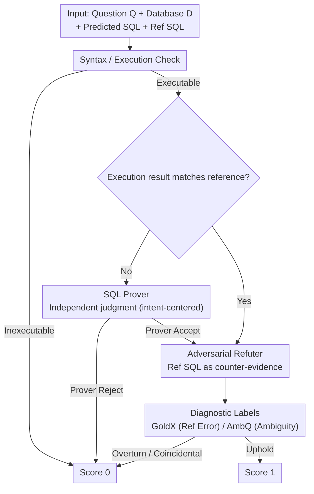

# ROSE: An Intent-Centered Evaluation Metric for NL2SQL

**Conference**: ACL2026  
**arXiv**: [2604.12988](https://arxiv.org/abs/2604.12988)  
**Code**: https://github.com/CedricPei/ROSE  
**Area**: NL2SQL / Evaluation Metrics / Database Question Answering  
**Keywords**: Intent-centered evaluation, Text-to-SQL, Prover-Refuter, Execution Accuracy, Dataset Diagnosis

## TL;DR
ROSE shifts NL2SQL evaluation from "predicting whether SQL matches a single reference SQL" to "predicting whether SQL satisfies user intent." Through a two-stage reasoning process involving a SQL Prover and an Adversarial Refuter, it achieves nearly 24 percentage points higher Cohen's Kappa than existing state-of-the-art metrics on ROSE-VEC. It also reveals an evaluation crisis caused by reference SQL errors and question ambiguity in benchmarks like BIRD.

## Background & Motivation
**Background**: The goal of NL2SQL is to convert natural language questions into executable SQL. Evaluation has long relied on Execution Accuracy (EX). The criterion for EX is straightforward: a predicted SQL is considered correct if its execution result on the database matches that of the annotated SQL; otherwise, it is incorrect. This metric is simple, automated, and scalable, making it the core standard for benchmarks like Spider and BIRD.

**Limitations of Prior Work**: As the generative capabilities of LLMs enhance, the deficiencies of EX become increasingly apparent. First, the same semantics can be expressed through multiple SQL implementations or output representations; EX misjudges non-standard but correct implementations. Second, user questions may have multiple reasonable interpretations, which a single reference SQL cannot cover. Third, annotated SQLs themselves contain errors; incorrect references penalize correct predictions. The paper cites analyses showing that non-canonical but correct forms can lead to up to 28.9% false negatives, and approximately 6.91% of ground-truth SQLs in BIRD Dev are reported as incorrect.

**Key Challenge**: The true objective of NL2SQL evaluation should be "whether the question was answered," not "whether the reference SQL was replicated." Reference SQLs are useful but should not be the sole source of truth; however, completely discarding references might lead to overly lenient LLM-based judges. Thus, a mechanism is needed that is intent-centered while still utilizing reference SQLs as evidence for refutation.

**Goal**: The authors propose ROSE as an intent-centered metric, construct the ROSE-VEC expert consensus validation set to verify the alignment between ROSE and human experts, and re-evaluate 19 NL2SQL methods using ROSE to analyze the gap between EX and semantic correctness in the era of powerful models.

**Key Insight**: Instead of simply having an LLM compare the predicted SQL with the reference SQL, the evaluation is decomposed into proving and refuting phases. The Prover first evaluates whether the predicted SQL satisfies the user intent independently without viewing the reference SQL; the Refuter then uses the reference SQL as counter-evidence to challenge the Prover's judgment and diagnose reference errors or question ambiguity.

**Core Idea**: Downgrade the ground-truth SQL from "the sole answer" to "evidence for refutation." Use a Prover-Refuter cascade to balance the leniency of intent-centered evaluation with the constraints of reference signals.

## Method
ROSE evaluates a natural language question, a database, a predicted SQL, a reference SQL, execution results, and a set of acceptance criteria. It first ensures the predicted SQL is executable; if not, it is marked incorrect. If the execution results of the predicted and reference SQLs differ, the SQL Prover independently judges whether the prediction satisfies user intent. If the results are the same, the Refuter still checks for "coincidental correctness" or reference errors. A prediction only receives a score of 1 if it passes all stages.

### Overall Architecture
The main workflow of ROSE consists of three steps. The first is a syntax and execution check to filter out non-runnable SQL. The second is the SQL Prover: when execution results are inconsistent with the reference, the Prover considers only the question, database, predicted SQL, and predicted results to judge semantic correctness based on acceptance criteria. The third is the Adversarial Refuter: it reads both predicted and reference SQLs, using the reference as evidence to challenge the Prover or check for logical errors despite matching execution results. It outputs whether to overturn the Prover's judgment along with diagnostic labels.

ROSE-VEC is used to validate the metric itself. The dataset contains 585 NL-SQL pairs, with 263 from multiple system outputs on Spider Test and 322 from BIRD Dev. Each sample was independently judged by two out of five experts, and only samples with complete agreement were retained to ensure high-confidence expert labels.

### Key Designs

**1. Reference-Agnostic SQL Prover: Removing the Anchoring Effect of a Single Reference SQL**

Many correct predictions are marked incorrect simply due to formatting, ordering, redundant columns, or reasonable ambiguity where the execution result differs from the reference. The Prover does not access the ground-truth SQL but evaluates the question, schema, database content, and predicted results against acceptance criteria. By isolating the reference signal in the first step, the evaluation maintains necessary leniency for intent-centered judgment.

**2. Evidence-Based Adversarial Refuter: Downgrading Reference SQL from Judge to Counter-Evidence**

Reference-free LLM judges may overlook truly incorrect SQL. While reference SQLs are not always perfect, they remain valuable counter-evidence. When the Prover accepts a prediction that differs from the reference result, the Refuter compares the logic of both to determine if the difference affects intent fulfillment, potentially overturning the Prover. It can also identify errors in the reference itself (GoldX) or question ambiguity (AmbQ). Even if execution results match, the Refuter checks for logical fallacies, balancing leniency with constraint.

**3. Diagnostic Labels and Versioned LLM Judges: Enabling Auditability and Reproducibility**

The evaluation crisis in NL2SQL stems partly from benchmark quality. ROSE enables the Refuter to output diagnostic labels like GoldX and AmbQ, turning the metric into an auditing tool for labeling errors. Furthermore, to address the drift of LLM backbones, ROSE uses `ROSE_model-time` naming (e.g., `ROSE_o3-2504`) and requires re-validation whenever a new model is used to prevent non-reproducible leaderboard scores.

### Loss & Training
ROSE is not a trained model but an evaluation pipeline based on a reasoning backbone. The authors instantiated OpenAI o3-2504, Gemini-1.5 Pro-002, and DeepSeek-R1-2505 as backbones. To reduce costs, ROSE uses concise prompts and conditionally invokes the Refuter. To increase throughput, evaluations are processed in parallel via multi-threading.

## Key Experimental Results

### Main Results
Core results on ROSE-VEC show that ROSE's alignment with expert labels is significantly higher than EX, FLEX, and LLM-SQL-Solver.

| Backbone | Metric | Kappa (%) | Acc (%) | MCC (%) | F1 (%) |
|----------|--------|-----------|---------|---------|--------|
| Deterministic | EM | 0.51 | 27.86 | 5.07 | 1.86 |
| Deterministic | ETM | 6.60 | 35.56 | 18.47 | 20.63 |
| Deterministic | EX | 25.56 | 55.90 | 37.23 | 57.00 |
| OpenAI o3 | FLEX | 56.70 | 78.97 | 62.01 | 83.31 |
| OpenAI o3 | ROSE w/o Refuter | 60.74 | 85.47 | 61.46 | 90.40 |
| OpenAI o3 | ROSE | 80.43 | 91.79 | 81.04 | 94.16 |
| Gemini-1.5 Pro| ROSE | 69.68 | 86.84 | 71.01 | 90.41 |
| DeepSeek-R1 | ROSE | 64.49 | 84.62 | 65.68 | 88.81 |

### Ablation Study

| Backbone | Metric | Kappa (%) | Acc (%) | MCC (%) | F1 (%) | Description |
|----------|--------|-----------|---------|---------|--------|-------------|
| OpenAI o3 | Unified w/o GT | 53.35 | 80.43 | 54.00 | 86.09 | Single prompt, no reference SQL |
| OpenAI o3 | Unified | 66.35 | 83.85 | 68.22 | 86.87 | Single prompt, using reference SQL |
| OpenAI o3 | ROSE w/o GT | 71.01 | 86.34 | 72.25 | 89.11 | Multi-stage, no reference SQL |
| OpenAI o3 | ROSE | 80.68 | 90.99 | 81.64 | 92.91 | Full Prover-Refuter cascade |

### Key Findings
- The Kappa for EX is only 25.56%, indicating a massive gap compared to expert semantic judgment. ROSE_o3-2504 reaches 80.43%, roughly 23.73 percentage points higher than FLEX_o3-2504.
- The Refuter is a critical component. Under OpenAI o3, the Kappa for ROSE w/o Refuter is 60.74%, while the full ROSE reaches 80.43%, proving that a reference-free Prover alone is insufficient.
- ROSE's diagnostic labels hold practical value: OpenAI o3 achieves 84.32% precision for GoldX and 91.23% for AmbQ, making it viable for automated benchmark auditing.
- Re-evaluating 19 methods on BIRD Mini-Dev reveals that as models strengthen, the gap between ROSE and EX widens, suggesting that progress in state-of-the-art methods is likely underestimated by reference-matching metrics.
- Multi-threading significantly improves efficiency. ROSE_o3-2504 takes 22.48s per question in single-thread mode on ROSE-VEC-BIRD, reduced to 3.35s with 8 threads.

## Highlights & Insights
- The most significant contribution is the redefinition of the ground truth's role. Reference SQL is no longer the judge but the adversarial evidence; this is more reasonable than either total reliance on or total ignorance of the reference.
- ROSE bridges evaluation metrics and dataset diagnosis. It provides not just a score but also explains whether disagreements stem from reference errors or question ambiguity, which is invaluable for maintaining NL2SQL benchmarks.
- The results highlight a concerning trend: stronger models are more likely to generate semantically correct but structurally different SQL, meaning EX is increasingly prone to underestimating progress. Evaluation metrics must evolve to avoid distorting research directions.
- Versioned LLM judges are a practical engineering detail. Many LLM-as-judge metrics suffer from irreproducibility due to backbone updates; ROSE explicitly mandates tracking backbones and timestamps.

## Limitations & Future Work
- ROSE depends on the underlying reasoning model; performance varies significantly across backbones. The lower Kappa of DeepSeek-R1 and Gemini compared to o3 suggests metric reliability fluctuates with model capability.
- ROSE-VEC only includes samples with complete expert agreement, which reduces noise but may underestimate the difficulty of edge cases and truly ambiguous questions.
- The cost and latency of multi-stage LLM judging are higher than EX. While multi-threading and conditional calls mitigate this, budget control is needed for large-scale online leaderboards.
- The Refuter uses reference SQL as evidence; if the reference is subtly incorrect or database content is insufficient, misjudgments can still occur. Future work could introduce multiple reference SQLs, counterfactual data, or execution test generation.

## Related Work & Insights
- **vs Execution Accuracy**: EX is automatic and cheap but compresses semantic correctness into binary execution matching; ROSE aligns closer to user intent at the cost of LLM inference.
- **vs FLEX**: FLEX is also LLM-based but remains centered on sufficiency relative to the reference; ROSE reduces anchoring by allowing the Prover to judge independently before refutation.
- **vs LLM-SQL-Solver**: While LLM-SQL-Solver focuses on SQL equivalence, ROSE explicitly distinguishes between semantic satisfaction, reference errors, and ambiguity, offering stronger diagnostic capabilities.
- **Insight**: Many generative tasks suffer from unreliable single-reference answers (e.g., code generation, data analysis). Transforming reference answers into adversarial evidence may be a superior paradigm for the era of strong generative models than simple reference matching.

## Rating
- Novelty: ⭐⭐⭐⭐⭐ Restructures the NL2SQL evaluation paradigm; the Prover-Refuter design is highly inspiring.
- Experimental Thoroughness: ⭐⭐⭐⭐☆ Metrics validation, ablation, diagnosis, and large-scale re-evaluation are comprehensive, though expert set selection may have bias.
- Writing Quality: ⭐⭐⭐⭐☆ Clear problem statement; dense but logical tables.
- Value: ⭐⭐⭐⭐⭐ High value for NL2SQL evaluation and benchmark maintenance; applicable to other tasks with non-unique references.

<!-- RELATED:START -->

## Related Papers

- [\[ACL 2025\] UTBoost: Rigorous Evaluation of Coding Agents on SWE-Bench](../../ACL2025/code_intelligence/utboost_rigorous_evaluation_of_coding_agents_on_swe-bench.md)
- [\[ACL 2025\] CoCo-Bench: A Comprehensive Code Benchmark for Multi-task Large Language Model Evaluation](../../ACL2025/code_intelligence/coco-bench_a_comprehensive_code_benchmark_for_multi-task_large_language_model_ev.md)
- [\[NeurIPS 2025\] SWE-rebench: An Automated Pipeline for Task Collection and Decontaminated Evaluation of Software Engineering Agents](../../NeurIPS2025/code_intelligence/swe-rebench_an_automated_pipeline_for_task_collection_and_decontaminated_evaluat.md)
- [\[ACL 2026\] PExA: Parallel Exploration Agent for Complex Text-to-SQL](pexa_parallel_exploration_agent_for_complex_text-to-sql.md)
- [\[ACL 2026\] QAQ: Bidirectional Semantic Coherence for Selecting High-Quality Synthetic Code Instructions](qaq_bidirectional_semantic_coherence_for_selecting_high-quality_synthetic_code_i.md)

<!-- RELATED:END -->
