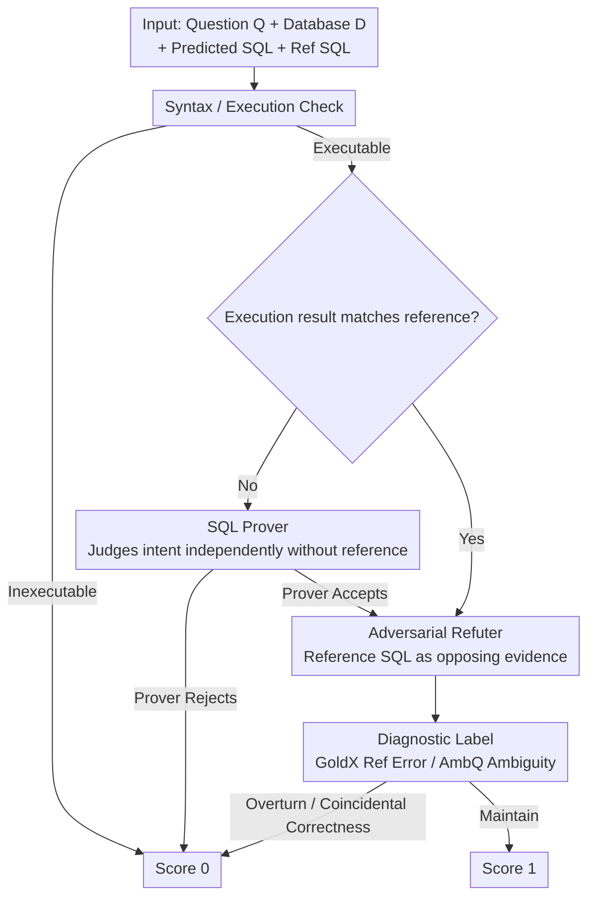

# ROSE: An Intent-Centered Evaluation Metric for NL2SQL

**Conference**: ACL2026  
**arXiv**: [2604.12988](https://arxiv.org/abs/2604.12988)  
**Code**: https://github.com/CedricPei/ROSE  
**Area**: NL2SQL / Evaluation Metrics / Text-to-SQL  
**Keywords**: Intent-centered execution, Text-to-SQL, Prover-Refuter, Execution Accuracy, Dataset Diagnosis

## TL;DR
ROSE shifts NL2SQL evaluation from "predicting whether SQL matches a single reference SQL" to "predicting whether SQL satisfies user intent." Through a two-stage reasoning process involving a SQL Prover and an Adversarial Refuter, it achieves a Cohen's Kappa nearly 24 percentage points higher than existing top metrics on ROSE-VEC, and exposes evaluation crises caused by reference errors and question ambiguities in benchmarks like BIRD.

## Background & Motivation
**Background**: The goal of NL2SQL is to convert natural language questions into executable SQL. Evaluation has long relied on Execution Accuracy (EX). The criterion for EX is straightforward: if the execution results of the predicted SQL and the annotated SQL on the database are consistent, it is considered correct; otherwise, it is wrong. This metric is simple, automatic, and scalable, making it the core standard for benchmarks such as Spider and BIRD.

**Limitations of Prior Work**: As the generative capabilities of LLMs enhance, the flaws of EX become increasingly apparent. First, the same semantics can have multiple SQL implementations or output representations, and EX misjudges non-standard but correct implementations. Second, user questions may inherently have multiple reasonable interpretations, which a single reference SQL cannot cover. Third, annotated SQLs can also be incorrect; an erroneous reference will judge a correct prediction as wrong. The paper cites existing analyses stating that non-standard but correct forms can lead to false negative rates as high as 28.9%, and approximately 6.91% of ground-truth SQLs in the BIRD Dev set are reported as incorrect.

**Key Challenge**: The true objective of NL2SQL evaluation is to determine "whether the user's question is answered," rather than "whether the reference SQL is replicated." While reference SQLs are useful, they should not be treated as the sole truth; however, completely discarding references might make the LLM judge overly lenient. Therefore, a mechanism is needed that is both intent-centered and capable of using the reference SQL as evidence for refutation.

**Goal**: The authors propose ROSE as an intent-centered metric, construct the ROSE-VEC expert consensus verification set to validate ROSE's consistency with human experts, and re-evaluate 19 NL2SQL methods using ROSE to analyze the gap between EX and semantic correctness in the era of strong models.

**Key Insight**: Instead of simply having an LLM compare the predicted SQL with the reference SQL, the paper decomposes evaluation into proof and refutation. The Prover first judges whether the predicted SQL satisfies the question intent independently without looking at the reference SQL. The Refuter then uses the reference SQL as counter-evidence to challenge the Prover's judgment and diagnose reference errors or question ambiguities.

**Core Idea**: Downgrade the ground-truth SQL from "the only answer" to "evidence usable for refutation," balancing the leniency of intent-centered evaluation with the constraints of reference signals through a Prover-Refuter cascade.

## Method
The evaluation objects of ROSE include the natural language question, database, predicted SQL, reference SQL, execution results, and a set of acceptance criteria. It first requires the predicted SQL to be executable; if not, it is directly judged as incorrect. If the execution results of the predicted SQL and the reference SQL differ, the SQL Prover independently judges whether the predicted SQL satisfies the user intent. If the results are the same, the Refuter still checks for coincidental correctness or reference errors. A prediction only receives 1 point if it passes all stages.

### Overall Architecture
The main workflow of ROSE is divided into three steps. The first step is a syntax and execution check to filter out non-runnable SQL. The second step is the SQL Prover: when the predicted execution result is inconsistent with the reference, the Prover considers only the question, database, predicted SQL, and predicted results to judge semantic correctness based on acceptance criteria. The third step is the Adversarial Refuter: it reads both the predicted and reference SQLs, using the reference as evidence to challenge the Prover or check for cases where the execution results are identical but the logic is flawed, outputting whether to overturn the Prover's judgment along with a diagnostic label.

ROSE-VEC is used to validate the metric itself. The dataset contains 585 NL-SQL pairs, with 263 from multiple system outputs on Spider Test and 322 from BIRD Dev. Each sample is independently judged by two out of five experts, and only samples with complete agreement are retained to obtain high-confidence expert labels.

### Key Designs

**1. Reference-Agnostic Judgment of SQL Prover: Removing the anchoring effect of a single reference SQL**

Many correct predictions are just different in format, sorting, redundant columns, or reasonable ambiguities of the question, leading to execution results inconsistent with the reference SQL. If the reference is treated as the only answer from the start, these predictions are immediately penalized. Therefore, the Prover does not access the ground-truth SQL but looks only at the question, database schema and content, predicted SQL, and its execution results to judge whether the prediction satisfies user intent based on acceptance criteria. By blocking the reference signal in the first step, intent-centered evaluation gains the necessary leniency.

**2. Evidence-based Refutation of Adversarial Refuter: Demoting reference SQL from judge to opposing evidence**

A completely reference-free LLM judge tends to overlook truly incorrect SQLs. Although reference SQLs are not always correct, they remain valuable counter-evidence. When the Prover accepts a prediction with a result different from the reference, the Refuter compares the reasoning logic of both to determine if the difference affects the user intent, potentially overturning the Prover. It can also reversely identify errors in the reference, tagging them as ground-truth errors (GoldX) or question ambiguity (AmbQ). Even if the execution results are identical, the Refuter checks if it was "correct by chance." This approach manages both leniency and constraint.

**3. Diagnostic Labels and Versioned LLM Judge: Enabling scoring, dataset auditing, and reproducibility**

Part of the evaluation crisis in NL2SQL stems from the benchmarks themselves—erroneous reference SQLs and ambiguous questions pollute scores. ROSE allows the Refuter to output diagnostic labels like GoldX and AmbQ for conflicting cases, turning the metric into an auditing tool for locating annotation errors and ambiguities. Additionally, since LLM judges drift with model versions, ROSE is named using `ROSE_model-time` (e.g., `ROSE_o3-2504`), requiring re-validation whenever a new model is used to prevent irreproducible scores on leaderboards due to base model updates.

### Loss & Training
ROSE is not a trained model but an evaluation pipeline based on a reasoning backbone. The authors instantiated OpenAI o3-2504, Gemini-2.5 Pro-2506, and DeepSeek-R1-2505 as the Prover/Refuter backbones. To reduce costs, ROSE uses streamlined prompts and decides whether to call the second-stage Refuter based on execution results; for higher throughput, evaluation can be executed in parallel.

## Key Experimental Results

### Main Results
The core results on ROSE-VEC show that ROSE's consistency with expert labels is significantly higher than EX, FLEX, and LLM-SQL-Solver.

| Backbone | Metric | Kappa (%) | Acc (%) | MCC (%) | F1 (%) |
|----------|--------|-----------|---------|---------|--------|
| Deterministic | EM | 0.51 | 27.86 | 5.07 | 1.86 |
| Deterministic | ETM | 6.60 | 35.56 | 18.47 | 20.63 |
| Deterministic | EX | 25.56 | 55.90 | 37.23 | 57.00 |
| OpenAI o3 | FLEX | 56.70 | 78.97 | 62.01 | 83.31 |
| OpenAI o3 | ROSE w/o Refuter | 60.74 | 85.47 | 61.46 | 90.40 |
| OpenAI o3 | ROSE | 80.43 | 91.79 | 81.04 | 94.16 |
| Gemini-2.5 Pro | ROSE | 69.68 | 86.84 | 71.01 | 90.41 |
| DeepSeek-R1 | ROSE | 64.49 | 84.62 | 65.68 | 88.81 |

### Ablation Study

| Backbone | Metric | Kappa (%) | Acc (%) | MCC (%) | F1 (%) | Note |
|----------|--------|-----------|---------|---------|--------|------|
| OpenAI o3 | Unified w/o GT | 53.35 | 80.43 | 54.00 | 86.09 | Single prompt without reference SQL |
| OpenAI o3 | Unified | 66.35 | 83.85 | 68.22 | 86.87 | Single prompt with reference SQL |
| OpenAI o3 | ROSE w/o GT | 71.01 | 86.34 | 72.25 | 89.11 | Staged but without reference SQL |
| OpenAI o3 | ROSE | 80.68 | 90.99 | 81.64 | 92.91 | Full Prover-Refuter cascade |
| Gemini-2.5 Pro | Unified | 59.90 | 81.06 | 61.02 | 84.86 | Lower performance with merged stages |
| Gemini-2.5 Pro | ROSE | 64.79 | 82.92 | 67.15 | 85.93 | Staged reasoning is more stable |

### Key Findings
- EX's Kappa is only 25.56%, indicating a massive gap with expert semantic judgment; ROSE_o3-2504 reaches 80.43%, approximately 23.73 percentage points higher than FLEX_o3-2504.
- The Refuter is a critical component. With OpenAI o3, the Kappa for ROSE w/o Refuter is 60.74%, while the full ROSE improves to 80.43%, showing that a purely reference-free Prover is insufficient.
- ROSE's diagnostic labels are of practical value: OpenAI o3 achieves a precision of 84.32% for GoldX and 91.23% for AmbQ, making it suitable for automatic benchmark auditing.
- After re-evaluating 19 methods on BIRD Mini-Dev, the authors found that in the strong model era, the gap between ROSE and EX is widening, suggesting that advances in methods might be underestimated by reference-matching metrics.
- Multi-threading significantly improves efficiency. ROSE_o3-2504 takes an average of 22.48 seconds/item on ROSE-VEC-BIRD with a single thread, effectively reduced to 3.35 seconds/item with 8 threads.

## Highlights & Insights
- The most important idea of the paper is the redefinition of the role of the ground truth. The reference SQL is no longer the judge but the opposing evidence; this is more reasonable than "trusting the reference completely" or "ignoring the reference completely."
- ROSE combines evaluation metrics with dataset diagnostics, not only providing a method score but also indicating whether disagreements stem from reference errors or question ambiguities. This is highly valuable for maintaining NL2SQL benchmarks.
- The results reveal a concerning trend: as models become stronger, they are more likely to generate semantically correct but formally different SQLs, causing EX to be more likely to underestimate progress. If evaluation metrics do not upgrade, research directions may be distorted.
- Versioned LLM judge is a very practical engineering detail. Since many LLM-as-judge metrics are prone to producing irreproducible scores due to base model updates, ROSE explicitly requires recording the backbone and its release timestamp.

## Limitations & Future Work
- ROSE relies on a basic reasoning model, and performance varies significantly across different backbones; the Kappa for DeepSeek-R1 and Gemini is lower than that of OpenAI o3, indicating that metric reliability changes with model capability.
- ROSE-VEC only retains samples where two experts completely agree, which reduces label noise but may underestimate the difficulty of edge cases and truly ambiguous questions.
- The multi-stage LLM judge is more expensive and has higher latency than EX. Although multi-threading and conditional calling mitigate this, budget control is still required for large-scale online leaderboards.
- The Refuter uses reference SQL as evidence. If the reference SQL is subtly incorrect or if database content is insufficient, it might still mislead the judgment. Future work could introduce multiple reference SQLs, counterfactual data, or execution test generation to strengthen the evidence chain.

## Related Work & Insights
- **vs Execution Accuracy**: EX is automatic, cheap, and reproducible, but compresses semantic correctness into a single execution result match; ROSE is closer to user intent but requires LLM reasoning costs.
- **vs FLEX**: FLEX is also an LLM-based metric but still centers primarily on sufficiency judgments relative to the reference SQL; ROSE reduces reference anchoring by having the Prover judge independently first.
- **vs LLM-SQL-Solver**: While LLM-SQL-Solver judges SQL equivalence directly, ROSE explicitly distinguishes semantic satisfaction, reference errors, and question ambiguity, providing stronger diagnostic capabilities.
- **Insight**: Many generative tasks face the issue of "unreliable single reference answers," such as code generation, data analysis, information extraction, and multi-hop QA. Repurposing reference answers as adversarial evidence may be more suitable for the strong generative model era than simple reference matching.

## Rating
- Novelty: ⭐⭐⭐⭐⭐ Architecturally reframes NL2SQL metrics; the Prover-Refuter design is highly inspiring.
- Experimental Thoroughness: ⭐⭐⭐⭐☆ Metric validation, ablation, diagnosis, and large-scale re-evaluation are thorough, though selection bias in expert set size and retention strategies remains.
- Writing Quality: ⭐⭐⭐⭐☆ Problems are clearly defined, and though tables are dense, the logic is sound; appendix information on cost and versioning is crucial.
- Value: ⭐⭐⭐⭐⭐ High value for NL2SQL evaluation and leaderboard maintenance, with potential transferability to other tasks with non-unique references.

<!-- RELATED:START -->

## Related Papers

- [\[ICLR 2026\] LearNAT: Learning NL2SQL with AST-guided Task Decomposition for Large Language Models](../../ICLR2026/code_intelligence/learnat_learning_nl2sql_with_ast-guided_task_decomposition_for_large_language_mo.md)
- [\[ICLR 2026\] SpotIt: Evaluating Text-to-SQL Evaluation with Formal Verification](../../ICLR2026/code_intelligence/spotit_evaluating_text-to-sql_evaluation_with_formal_verification.md)
- [\[ICML 2026\] SWE-IF: Aligning Code Evaluation with Human Preference](../../ICML2026/code_intelligence/swe-if_aligning_code_evaluation_with_human_preference.md)
- [\[ICLR 2026\] Process-Level Trajectory Evaluation for Environment Configuration in Software Engineering Agents](../../ICLR2026/code_intelligence/process-level_trajectory_evaluation_for_environment_configuration_in_software_en.md)
- [\[ICLR 2026\] VeriEquivBench: An Equivalence Score for Ground-Truth-Free Evaluation of Formally Verifiable Code](../../ICLR2026/code_intelligence/veriequivbench_an_equivalence_score_for_ground-truth-free_evaluation_of_formally.md)

<!-- RELATED:END -->
