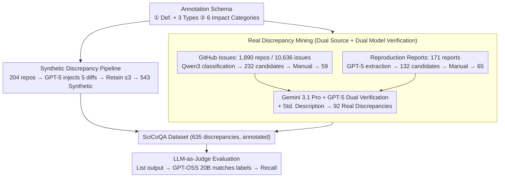

# SciCoQA: Quality Assurance for Scientific Paper–Code Alignment

**Conference**: ACL 2026  
**arXiv**: [2601.12910](https://arxiv.org/abs/2601.12910)  
**Code**: [https://github.com/ukplab/scicoqa](https://github.com/ukplab/scicoqa)  
**Area**: Scientific Reproducibility/Paper-Code Alignment Verification  
**Keywords**: Paper-code discrepancy detection, scientific reproducibility, cross-modal verification, LLM evaluation, quality assurance

## TL;DR

Ours introduces SciCoQA, the first benchmark dataset for detecting discrepancies between scientific papers and their code implementations. It contains 635 discrepancy instances (92 real + 543 synthetic). Evaluation of 22 LLMs reveals that the strongest model only detects 46.7% of real discrepancies, highlighting a critical capability gap in automated scientific quality assurance.

## Background & Motivation

**Background**: The scientific reproducibility crisis continues to plague academia. While publishing code and data has become standard, code availability does not guarantee consistency with the paper's description. In practice, implementation details often deviate from descriptions—ranging from "mathiness" (equations simulating technical depth while gains come from undocumented tricks) to differences in evaluation metric implementations (e.g., varying BLEU score implementations rendering scientific comparisons invalid).

**Limitations of Prior Work**: (1) Paper-code inconsistencies are usually only discovered during reproduction attempts, wasting resources and eroding scientific trust; (2) Reviewers face severe time pressure, making meticulous code review impractical; (3) With the rise of automated systems like "AI Scientists" (generating ideas, code, and papers), manual review is increasingly infeasible—an automatically generated codebase might run perfectly and perform well, but implement a method entirely different from the paper's claim.

**Key Challenge**: Scientific output is growing exponentially due to automation, yet the ability to verify the faithfulness of papers to code remains entirely dependent on humans. Existing evaluations (such as PaperBench’s manual rubrics, general LLM-as-judge, or "does the code run") cannot reliably detect semantic paper-code discrepancies.

**Goal**: To build the first benchmark for paper-code discrepancy detection to systematically evaluate whether LLMs can automatically discover semantic inconsistencies between scientific papers and code.

**Key Insight**: Leverage "natural discoveries" from the reproducibility community—using GitHub Issues where users report paper-code differences and reproduction reports from challenges as sources for real discrepancies. Expand the data to computational science fields beyond CS via a synthetic generation pipeline.

**Core Idea**: Formulate paper-code discrepancy detection as a cross-modal verification task (text vs. code). Construct a structured dataset including a discrepancy type taxonomy (Difference/Paper Omission/Code Omission) and impact category taxonomy (Algorithm/Model/Loss/Evaluation/Data/Training) to evaluate the long-context cross-modal reasoning capabilities of LLMs.

## Method

### Overall Architecture

SciCoQA formalizes whether "paper and code faithfully correspond" as a cross-modal verification task: given a paper's method description and its corresponding codebase, output a list of semantic discrepancies. The dataset is built via real and synthetic paths. Real discrepancies are mined from community "natural discoveries" (10,636 GitHub Issues from 1,890 repos were filtered to 59 discrepancies; 171 reproduction reports were processed via GPT-5 and manual validation to yield 65 discrepancies). These were verified by Gemini 3.1 Pro and GPT-5 to produce 92 real discrepancies with standardized descriptions. Synthetic discrepancies (543) were generated by GPT-5 injecting controlled code changes into 204 repos, extending the domain to physics, statistics, and other computational sciences. Evaluation is performed via LLM-as-Judge (GPT-OSS 20B reasoning model) to parse model outputs and match them against ground truth, achieving an F1 of 87.5% on 1,039 manually annotated samples.

### Key Designs

**1. Strict Definition and Three-Type Classification**: 
Benchmark consistency is built on a tight definition: a discrepancy is a "semantic conflict between the scientific method description in the paper and the code implementation, such that the code fails to faithfully reproduce the reported method." This is further divided into: **Difference** (logic differs, e.g., L2 vs. L1 regularization), **Paper Omission** (code contains key components not in the paper), and **Code Omission** (steps described in the paper are missing in the code). The definition explicitly excludes noise: non-paper-related bugs, hyperparameter differences switchable via CLI, and standard engineering practices like numerical stability adjustments.

**2. Six Impact Categories**: 
Each discrepancy is labeled by where it impacts the research pipeline: **Algorithm** (step order/operations), **Model** (architecture/initialization), **Loss** (definitions/terms), **Evaluation** (logic/metrics), **Data** (preprocessing/augmentation), and **Training** (schedules/optimization). Real data is dominated by Algorithm (25%) and Loss (24%), while synthetic data focuses on Algorithm (26%) and Model (21%).

**3. Real Discrepancy Mining**: 
Real discrepancies are harvested from two community channels. First, **GitHub Issues**: 10,636 issues from 1,890 repos were filtered using Qwen3 4B to find 232 candidates, resulting in 59 confirmed cases. Second, **Reproduction Reports**: 171 reports from challenges were processed by GPT-5 to extract 132 candidates, yielding 65 confirmed cases. Final validation used Gemini 3.1 Pro and GPT-5 to check paper text and code, with manual adjudication for disagreements. Models then generated standardized 3–8 sentence descriptions as ground truth.

**4. Synthetic Discrepancy Pipeline**: 
To address sparsity and domain bias (mostly CS/AI), 204 repos linked to arXiv were sampled. GPT-5 generated 5 code diffs per repo under discrepancy constraints; at most 3 non-overlapping, matching diffs were kept per repo. The correlation between detection rates on synthetic and real data is $r = 0.94$, proving the synthetic set is a reliable proxy for model ranking while resisting data contamination.

## Key Experimental Results

### Main Results

| Model | Recall (Real) | Recall (Synthetic) | Avg Recall |
|------|-------------|-------------|----------|
| Gemini 3.1 Pro | 46.7% | — | — |
| GPT-5 Mini | 46.7% | — | — |
| GPT-5 | — | 70.0% | — |
| Nemotron 49B | — | — | 23.9% |
| Qwen3 30B Coder | — | — | 23.5% |

| Model | Precision | Recall | F1 |
|------|-----------|--------|----|
| GPT-5 | 88.0 | 51.2 | 64.7 |
| Gemini 2.5 Pro | 94.6 | 41.1 | 57.3 |
| GPT-OSS 20B | 69.9 | 55.8 | 62.1 |

### Ablation Study

| Condition | Real Data | Synthetic Data | Description |
|---------|---------|---------|------|
| Paper + Code | Baseline | Baseline | Full Input |
| Code Only | -19.2pp (Relative ↓48.3%) | -16.3pp (Relative ↓30.8%) | Papers provide necessary cross-modal signals |

### Key Findings

- **Recall is the core bottleneck**: The strongest models only detect 46.7% of real discrepancies. Precision (88-94.6%) is much higher than recall, meaning models "are mostly right about what they find, but they miss too much."
- **Paper Omission is hardest to detect**: It is difficult to find discrepancies when code contains components not described in the paper because there is no anchor in the text for comparison.
- **Long context degrades performance**: Detection rates consistently drop as the token count for paper+code increases. Median input is 56,903 tokens; 73/276 papers exceed 100k tokens.
- **Data contamination is significant**: Models perform better on papers published before their pre-training cutoff; 2025 papers show the lowest detection rates.
- **Paper is required**: Removing the paper leads to a 48.3% relative drop in real data performance, confirming the cross-modal nature of the task.
- **Code-specific models lack advantage**: GPT-5 Codex underperformed GPT-5 Mini, suggesting the task requires a mix of code understanding and natural language reasoning where general instruction following is more beneficial.

## Highlights & Insights

- **Filling a critical gap**: Formulates paper-code consistency detection as a benchmarkable NLP task, which is highly relevant in the era of scientific automation.
- **Complementary Real/Synthetic design**: Real data ensures realism, while synthetic data solves scarcity and domain coverage. The high correlation ($r=0.94$) validates the design.
- **Deep insight into "High Precision, Low Recall"**: In verification scenarios, low recall is most damaging—missed discrepancies provide a false sense of security, whereas false positives can be manually filtered.
- **Natural testbed for data contamination**: Analyzing detection rates by publication year effectively reveals contamination issues; the synthetic pipeline offers a solution to generate uncontaminated data.

## Limitations & Future Work

- Real data is heavily biased toward CS/AI; non-CS domains only have synthetic data where error distributions may differ.
- Synthetic discrepancies were generated by GPT-5, and GPT-5 was also evaluated, possibly introducing self-preference bias (removing GPT-5 increased $r$ from 0.94 to 0.98).
- Dataset size (635 discrepancies) is a trade-off between quality and scale.
- Definition excludes bugs and hyperparameters, failing to cover the full spectrum of software engineering flaws in research code.
- Future work should expand real data collection in non-CS fields and develop specialized paper-code verification models.

## Related Work & Insights

- **vs. Bianchi et al. (2025)**: That work detects internal text inconsistencies; SciCoQA extends this to cross-modal paper-code inconsistencies.
- **vs. PaperBench**: PaperBench uses manual rubrics to verify implementation, which is costly and non-scalable; SciCoQA provides an automatically evaluatable benchmark.
- **vs. CCI (Code-Comment Inconsistency)**: CCI handles function-level inconsistencies; SciCoQA requires global semantic alignment across full papers and multi-file codebases.
- **vs. ProcessBench/ErrorRadar**: These benchmarks detect errors in reasoning chains; SciCoQA detects cross-modal semantic gaps between descriptions and implementations.

## Rating

- Novelty: ⭐⭐⭐⭐⭐ First formalization of paper-code consistency verification; precise and highly significant definition.
- Experimental Thoroughness: ⭐⭐⭐⭐⭐ 22 models and multi-dimensional analysis (type/source/length/year/ablation).
- Writing Quality: ⭐⭐⭐⭐⭐ Deep motivation, strict definitions, and logical experimental progression.
- Value: ⭐⭐⭐⭐⭐ Provides foundational infrastructure for verifying paper-code faithfulness in the age of automated science.

<!-- RELATED:START -->

## Related Papers

- [\[ACL 2026\] CodeRL+: Improving Code Generation via Reinforcement with Execution Semantics Alignment](coderl_improving_code_generation_via_reinforcement_with_execution_semantics_alig.md)
- [\[ACL 2026\] CodeDistiller: Automatically Generating Code Libraries for Scientific Coding Agents](codedistiller_automatically_generating_code_libraries_for_scientific_coding_agen.md)
- [\[ICLR 2026\] Paper2Code: Automating Code Generation from Scientific Papers in Machine Learning](../../ICLR2026/code_intelligence/paper2code_automating_code_generation_from_scientific_papers_in_machine_learning.md)
- [\[NeurIPS 2025\] Embedding Alignment in Code Generation for Audio](../../NeurIPS2025/code_intelligence/embedding_alignment_in_code_generation_for_audio.md)
- [\[ACL 2026\] QAQ: Bidirectional Semantic Coherence for Selecting High-Quality Synthetic Code Instructions](qaq_bidirectional_semantic_coherence_for_selecting_high-quality_synthetic_code_i.md)

<!-- RELATED:END -->
