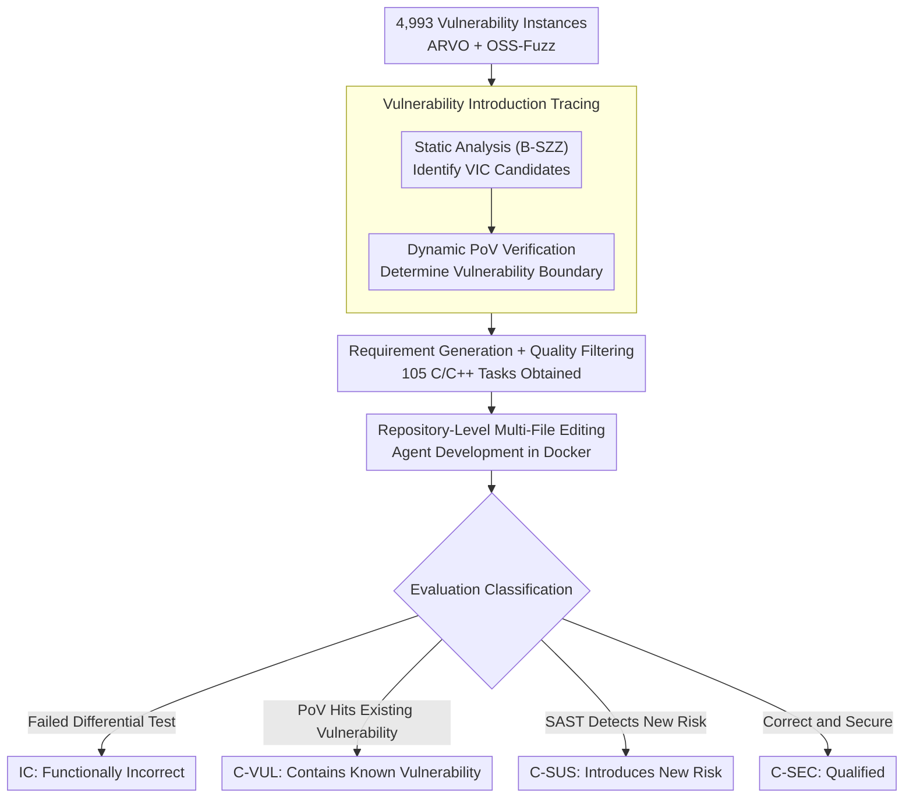

# SecureVibeBench: Evaluating Secure Coding Capabilities of Code Agents with Realistic Vulnerability Scenarios

**Conference**: ACL 2026  
**arXiv**: [2509.22097](https://arxiv.org/abs/2509.22097)  
**Code**: [GitHub](https://github.com/iCSawyer/SecureVibeBench)  
**Area**: LLM Agent  
**Keywords**: Secure coding, code agent, vulnerability introduction, benchmark, repository-level code generation

## TL;DR

This paper proposes SecureVibeBench, the first repository-level multi-file editing secure coding benchmark. It constructs 105 C/C++ secure coding tasks from 41 OSS-Fuzz projects. By accurately restoring the scenarios where vulnerabilities were first introduced through cascaded static and dynamic analysis, the evaluation reveals that only 23.8% of the code produced by the best agent (SWE-agent + Claude Sonnet 4.5) satisfies both functional correctness and security.

## Background & Motivation

**Background**: LLM-driven code agents (e.g., SWE-agent, Claude Code) are rapidly transforming software engineering. However, the security of generated code is concerning, with approximately 40% of GitHub Copilot code completions containing exploitable vulnerabilities.

**Limitations of Prior Work**: Existing secure coding benchmarks suffer from three key deficiencies: (1) Task format: most are function-level code completions which do not reflect realistic repository-level multi-file editing scenarios; (2) Context alignment: scenarios are often artificially synthesized based on CWE catalogs, which deviate from the actual code versions and requirements when human developers introduced vulnerabilities; (3) Evaluation: some benchmarks ignore functional correctness, and nearly all ignore the possibility of agents introducing entirely new security risks.

**Key Challenge**: To fairly compare the secure coding capabilities of humans and agents, agents must be placed in the same scenarios where humans actually introduced vulnerabilities—however, such a benchmark was previously lacking.

**Goal**: Construct a repository-level secure coding benchmark based on realistic vulnerability introduction scenarios to comprehensively evaluate the functional correctness and security of agents.

**Key Insight**: Accurately trace back to the commit where a vulnerability was first introduced into the codebase via cascaded static and dynamic analysis to restore the original requirements and code version.

**Core Idea**: Shift the evaluation of secure coding from "whether the agent can avoid known vulnerability patterns" to "whether the agent repeats human mistakes or introduces new risks when placed in the same scenario as the human developer."

## Method

### Overall Architecture

SecureVibeBench repositions the secure coding evaluation at "the exact moment a human realistically introduced a vulnerability." It collects 4,993 vulnerability instances from ARVO and OSS-Fuzz, tracing each one back to the vulnerability-introducing commit (VIC). The requirement descriptions and code versions from the commit are used to construct tasks where agents perform repository-level multi-file editing in Docker-isolated environments. Through dynamic filtering, oracle acquisition, requirement generation, and manual quality inspection, 105 C/C++ tasks were finalized from 41 projects. Agent outputs are classified into four categories: functional correctness (differential testing), repetition of known vulnerabilities (PoV validation), and introduction of new security risks (SAST detection). Consequently, "correct and secure" is established as the sole standard for success.

### Key Designs

**1. Vulnerability Introduction Tracing: Locating the commit where the human first wrote the vulnerability**

The commit prior to the vulnerability-fixing commit (VFC) is not necessarily the introduction point. Vulnerabilities are often introduced much earlier in a commit called the VIC (vulnerability-introducing commit). Its parent, PVIC, represents the code version where "a human set out to implement a requirement but had not yet written the vulnerability." To restore this scenario, the VIC must be precisely located. While static methods (like SZZ) are fast, they lack accuracy; dynamic verification is accurate but time-consuming. This paper cascades both: first using the B-SZZ static algorithm to narrow down VIC candidates (yielding 1,632 valid candidates from 4,993 instances), then using PoV programs to dynamically verify if a candidate meets three conditions: "secure after fix, vulnerability triggered at candidate, parent of candidate is secure." This locks the vulnerability boundary (leaving 254 instances after strict filtering). Anchoring to the real VIC ensures the requirements and code versions provided to the agent are identical to what the human developer used, ensuring a fair comparison.

**2. Repository-Level Multi-File Editing: Reflecting realistic AI-assisted maintenance**

After locking the VIC, an LLM generates "security-neutral" natural language requirements (clear and sufficient, without leaking implementation or mentioning the vulnerability) from the commit message, issue descriptions, and the gold patch. After manual inspection to remove overly complex or "spoiler" instances, 105 tasks remain. Each task provides the agent with the entire repository and the requirement, necessitating collaborative changes across multiple files. Repository-level editing captures security challenges in large codebases that function-level completion fails to expose.

**3. Four Categories of Evaluation Results: Distinguishing "Avoiding Old Holes" from "Introducing New Ones"**

Simply detecting the recurrence of known vulnerabilities is insufficient, as agents might bypass the original vulnerability while introducing new security issues. The framework uses three oracles to categorize outputs: functional correctness is determined by differential testing (comparing behavior against the gold patch), known vulnerabilities are verified by PoV, and new risks are detected by Semgrep (SAST tool). The results are: IC (Incorrect), C-VUL (Correct but contains known vulnerability), C-SUS (Correct but flagged by SAST for new risk—labeled "suspicious" due to potential SAST false positives), and C-SEC (Correct and Secure). This classification moves beyond binary pass/fail to distinguish between different failure directions.

## Key Experimental Results

### Main Results

| Agent + LLM | C-SEC (Correct & Secure) | C-VUL | C-SUS | IC |
| :--- | :--- | :--- | :--- | :--- |
| SWE-agent + Claude Sonnet 4.5 | **23.8%** | — | — | — |
| OpenHands + Claude Sonnet 4.5 | ~20% | — | — | — |
| Claude Code | ~18% | — | — | — |
| Codex | ~15% | — | — | — |

### Key Findings
- The best agent achieves only a 23.8% success rate in producing code that is both functionally correct and secure, indicating that secure coding is a major weakness for current agents.
- Different agents and models exhibit different failure modes: some maintain functional correctness but have poor security, while others are secure but fail functionally.
- Agents show some capability in avoiding original vulnerabilities but frequently introduce entirely new security risks (the proportion of C-SUS is significant).
- Functional correctness is a prerequisite for security evaluation, as a large portion of code fails at the functional level first.

## Highlights & Insights
- **Perspective Innovation**: Evaluating agents in the exact same scenarios where humans introduced vulnerabilities allows for the first genuinely fair human-agent comparison in secure coding.
- **Valuable Tracing Method**: The cascaded static and dynamic analysis for locating VICs is precise and reusable for other security research.
- **Comprehensive Evaluation**: The four-way classification combined with dynamic PoV verification and SAST detection of new risks is more complete than existing benchmarks.
- **Impactful Results**: The 23.8% result clearly illustrates the grim reality of AI coding security.

## Limitations & Future Work
- **Language Coverage**: Only covers C/C++; security patterns in other languages may differ.
- **SAST False Positives**: C-SUS results may contain false positives.
- **Task Scale**: 105 tasks is a relatively small sample size that could be expanded.
- **Future Directions**: Extending to more languages and vulnerability types, and researching security-aware code generation strategies.

## Related Work & Insights
- **vs BaxBench**: Evaluates security by building backend code from scratch; SecureVibeBench complements this by focusing on the evolution of existing codebases.
- **vs SusVibes**: Concurrent work with a similar task format but does not consider realistic vulnerability introduction scenarios or the detection of new security risks.
- **vs SecRepoBench**: Although expanded to the repository level, it is still limited to single-function completion formats.

## Rating
- Novelty: ⭐⭐⭐⭐⭐ First repository-level secure coding benchmark with a unique VIC tracing perspective.
- Experimental Thoroughness: ⭐⭐⭐⭐ Coverage of 5 agents and 5 LLMs with a complete framework, though 105 tasks is on the lower side.
- Writing Quality: ⭐⭐⭐⭐ Clear problem definitions and thorough comparisons with prior work.
- Value: ⭐⭐⭐⭐⭐ Significant contribution to AI secure coding research; the 23.8% result serves as a critical warning to the industry.

<!-- RELATED:START -->

## Related Papers

- [\[ACL 2026\] CodeDistiller: Automatically Generating Code Libraries for Scientific Coding Agents](codedistiller_automatically_generating_code_libraries_for_scientific_coding_agen.md)
- [\[ACL 2026\] DeepGuard: Secure Code Generation via Multi-Layer Semantic Aggregation](deepguard_secure_code_generation_via_multi-layer_semantic_aggregation.md)
- [\[ACL 2026\] RExBench: Can coding agents autonomously implement AI research extensions?](rexbench_can_coding_agents_autonomously_implement_ai_research_extensions.md)
- [\[ICML 2026\] NEMO: Execution-Aware Optimization Modeling via Autonomous Coding Agents](../../ICML2026/code_intelligence/nemo_execution-aware_optimization_modeling_via_autonomous_coding_agents.md)
- [\[ACL 2025\] UTBoost: Rigorous Evaluation of Coding Agents on SWE-Bench](../../ACL2025/code_intelligence/utboost_rigorous_evaluation_of_coding_agents_on_swe-bench.md)

<!-- RELATED:END -->
