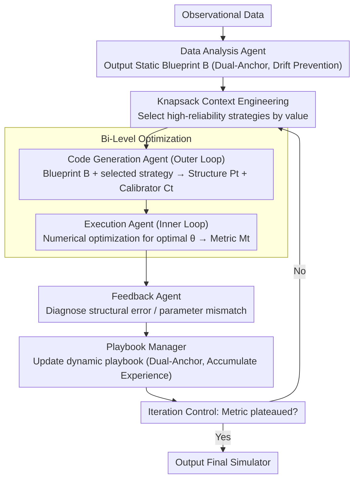

# SOCIA-EVO: Automated Simulator Construction via Dual-Anchored Bi-Level Optimization

**Conference**: ACL 2026  
**arXiv**: [2604.17351](https://arxiv.org/abs/2604.17351)  
**Code**: [https://github.com/cruiseresearchgroup/SOCIA/tree/evo](https://github.com/cruiseresearchgroup/SOCIA/tree/evo)  
**Area**: Code Intelligence  
**Keywords**: Automated Simulator Construction, Dual-Anchored Evolutionary Framework, Bi-Level Optimization, Strategy Playbook, Distributional Fidelity

## TL;DR

Ours proposes SOCIA-EVO, an LLM agent framework that redefines automated simulator construction as a dual-anchored evolutionary process. By anchoring empirical constraints via a static Blueprint, decoupling structural correction from parameter calibration through bi-level optimization, and managing repair hypotheses via a self-curated Playbook with Bayesian-weighted retrieval based on execution feedback, SOCIA-EVO significantly outperforms baselines such as Reflexion and G-SIM on user modeling, mask-wearing diffusion, and personal mobility simulation tasks.

## Background & Motivation

**Background**: Automatically constructing simulators from observational data (data-driven simulation) is fundamental to understanding complex systems. Unlike general software engineering, where functional correctness suffices, simulator construction is essentially a scientific modeling task requiring distributional fidelity—the generated programs must replicate the statistical patterns, causal mechanisms, and emergent behaviors of real-world data.

**Limitations of Prior Work**: Standard LLM agents applied to long-cycle simulator construction suffer from two key failure modes: (1) Context drift—as simulator complexity increases, constraints established in the initial data analysis lose significance, leading the agent to hallucinate mechanisms non-existent in the data; (2) Unstable optimization—agents often confuse structural errors (e.g., incorrect transition logic) with parameter mismatches (e.g., suboptimal rates), rewriting correct logic when simple tuning would suffice, leading to oscillatory "whack-a-mole" modifications.

**Key Challenge**: LLMs excel at discrete logical reasoning but struggle with high-dimensional continuous parameter search. Furthermore, they lack a persistent verification mechanism for repair strategies; attempted repairs and their quantitative results are lost as the context window advances, causing the agent to repeatedly propose seemingly plausible but empirically ineffective fixes.

**Goal**: Design an agent framework capable of maintaining long-term consistency, distinguishing structural from parametric issues, and accumulating effective repair experiences.

**Key Insight**: Introduce a dual-anchored mechanism—a static Blueprint to prevent context drift and a dynamic Playbook to accumulate and verify repair hypotheses. Bi-level optimization strictly decouples structural correction (LLM-driven outer loop) from parameter calibration (numerical optimizer-driven inner loop).

**Core Idea**: Simulator construction = Blueprint-anchored search space + Bi-level optimization decoupling structure and parameters + Playbook self-curating repair hypotheses.

## Method

### Overall Architecture

SOCIA-EVO redefines "automated simulator construction" as a closed-loop evolutionary process involving six specialized agents. The objective is distributional fidelity rather than mere functional execution. Given observational data, a data analysis agent first produces a static Blueprint $\mathcal{B}$ (an immutable authoritative specification). Subsequently, the evolutionary loop begins: a code generation agent utilizes $\mathcal{B}$ and the current Playbook strategy $\mathcal{K}$ to produce simulator code $P_t$ and a parameter calibrator $C_t$. An execution agent runs the inner loop to optimize parameters $\theta$ and obtains metrics $\mathcal{M}_t$. A feedback agent diagnoses biases based on these metrics, the Playbook manager updates the strategy library, and an iteration control agent determines convergence. This cycle continues until metrics plateau, outputting the final simulator.

### Key Designs

**1. Dual-Anchored Mechanism: Static Blueprint for Drift Prevention, Dynamic Playbook for Experience Accumulation**

Long-cycle construction faces two chronic issues: context drift (initial constraints vanish as complexity rises) and repair experience loss (results of previous fixes are forgotten). The dual anchors address these: the Blueprint $\mathcal{B}$, verified by human experts, remains locked to define simulator topology, agent patterns, and evaluation metrics, serving as an immutable constraint. The Playbook $\mathcal{K}$ is a dynamic strategy library where each strategy $S_i = \langle R_i, I_i, \Sigma_i \rangle$ contains diagnostic content (with metric bindings $\Lambda_i$), usage/success/failure counts, and a lifecycle state (Open→Queued→InProgress→Resolved). Strategies are verified as successful ($\Delta\mathcal{M}/\mathcal{M}_t > \tau$), falsified ($< -\tau$), or uncertain based on metric changes. The essence is treating repair strategies as hypotheses to be tested rather than trusted corrections, using execution evidence for self-curation.

**2. Bi-Level Optimization: Decoupling Discrete Structural Correction and Continuous Parameter Calibration**

Since LLMs are adept at discrete logic but poor at continuous parameter search, the outer loop is assigned to the LLM and the inner loop to a numerical optimizer. The outer loop involves the code generation agent searching the program space to output structural code and a calibrator $(P_t, C_t) \leftarrow \pi_{code}(P_{t-1}, \mathcal{B}, \text{Knapsack}(\mathcal{K}))$. The inner loop executes $C_t$, using numerical methods like Bayesian optimization to solve $\theta_t^* = \arg\min_\theta \mathcal{L}(\text{Sim}(P_t, \theta), \mathcal{D}_{obs})$. Crucially, the LLM does not guess parameter values directly but generates an "optimization program for finding parameters." This ensures the feedback agent evaluates the intrinsic capability of structure $P_t$ at its optimal parameters, filtering out noise from unoptimized parameters and allowing precise defect attribution to structural logic.

**3. Knapsack Context Engineering: Selecting the Most Valuable Repair Strategies within Finite Windows**

Cramming all strategies into a prompt dilutes attention—experiments show a 3200-token full Playbook performs as poorly as no memory. Thus, each round solves a 0-1 knapsack problem from the Open/Queued pools: $\max \sum_i v_i x_i$ subject to $\sum_i c_i x_i \leq L_{budget}$. Strategy value $v_i = w_{sev} \cdot U_i^{queue} \cdot \Phi_{rel}(S_i)$ balances severity $w_{sev}$, an anti-starvation backlog reward $U_i^{queue}$, and Bayesian reliability $\Phi_{rel}(S_i) = (s_i+1)/(s_i+f_i+2)$ based on a Beta-Bernoulli model. Selected strategies are laid out across system/background/instruction zones to combat "lost in the middle." Bayesian reliability allows falsified strategies to decay naturally, reserving context budget for effective repairs.

### Mechanism

Taking an iteration from a user modeling task as an example: after the execution agent runs the current simulator $P_{t-1}$, the feedback agent identifies a high MAE in the distribution and diagnoses a structural defect where "transition logic confuses two types of user behavior." This is logged as a new strategy $S_i$ in the Playbook and set to Open. In the next round, the knapsack selects this strategy based on its value $v_i$ (high severity, neutral reliability prior) and provides it alongside Blueprint $\mathcal{B}$ to the code generation agent. The agent rewrites the transition logic to obtain $P_t$ and a new calibrator $C_t$. The inner loop re-calculates optimal parameters $\theta_t^*$ via Bayesian optimization before evaluation. If the relative MAE drop exceeds threshold $\tau$, the Playbook Manager marks $S_i$ as Resolved and increases its reliability; if metrics worsen, the strategy is falsified, reducing its future selection probability. This "hypothesis → execution → verification/falsification" cycle reduced cumulative repetitive errors by 76% by the fifth iteration.

### Loss & Training

SOCIA-EVO does not train weights; it optimizes the simulator itself through iterative evolution. The inner loop employs Optuna for Bayesian optimization or random calibrators. Outer loop iteration control stops when metric improvements plateau or regression occurs to prevent over-correction. All experiments used GPT-5.1 as the backbone, with results averaged over 5 random seeds with 95% confidence intervals.

## Key Experimental Results

### Main Results

**Performance Comparison Across Three Simulation Tasks (Mean ± 95% CI, lower is better)**

| Method | User Modeling MAE↓ | Mask Simulation RMSE↓ | Mobility N→A WD↓ |
|------|-------------|-------------|------------|
| Reflexion | 0.17±0.01 | 0.26±0.02 | 0.69±0.02 |
| YuLan-OneSim | 0.21±0.02 | 0.16±0.01 | 0.64±0.01 |
| G-SIM-SBI | 0.19±0.01 | 0.11±0.02 | 0.56±0.02 |
| ACE-OL | 0.14±0.02 | 0.24±0.01 | 0.61±0.02 |
| **SOCIA-EVO** | **0.11±0.01** | **0.07±0.01** | **0.53±0.02** |

### Ablation Study

| Configuration | ΔMAE↓ | ΔRMSE↓ | ΔWD↓ |
|------|-------|--------|------|
| SOCIA-EVO (Full) | — | — | — |
| w/o Inner Loop Calibration | +0.25 | +0.47 | +0.29 |
| w/o Blueprint | +0.20 | +0.37 | +0.23 |
| w/o HITL | +0.18 | +0.34 | +0.21 |
| w/o Memory Mechanism | +0.14 | +0.30 | +0.20 |
| w/o Strategy Playbook | +0.10 | +0.23 | +0.15 |
| Context Window +2200 token | +0.12 | +0.14 | +0.13 |

### Key Findings

- Inner loop parameter calibration is the most critical component—removing it caused RMSE to surge by +0.47, as parameter updates degraded into heuristic guesses by the LLM.
- Excessive context windows (+2200 tokens to include the entire Playbook) led to performance degradation near zero-memory levels, confirming the "attention dilution effect."
- Cumulative repetitive errors decreased by 76% by the fifth iteration, proving the effectiveness of the value-based knapsack mechanism in suppressing "whack-a-mole" behavior.
- Open-source backbones (Llama-3.3-70B, Qwen3-80B) achieve competitive performance, showing the framework is not dependent on specific proprietary models.

## Highlights & Insights

- Treating repair strategies as hypotheses requiring verification/falsification, rather than trusted corrections, introduces a "scientific methodology" mindset to LLM agent design—transferable to any agent system requiring long-cycle memory management.
- The core insight of bi-level optimization is profound: letting the LLM generate the program to search for parameters rather than guessing them directly exploits the LLM's strength in code generation while avoiding its weakness in continuous optimization.
- The combination of knapsack optimization and Bayesian reliability for context engineering provides a general solution for maximizing information value within finite windows.

## Limitations & Future Work

- Peak performance relies on commercial LLM backbones (GPT-5.1); although open-source models are viable, a performance gap remains.
- Current focus is on tasks expressible via iterative structural modification and bounded parameter calibration; more complex settings (long-term planning, strategic multi-agent interaction) may require stronger reasoning modules.
- While lightweight, the HITL verification for Blueprints introduces human dependency, and Blueprint quality directly impacts all subsequent iterations.
- Strategy matching currently uses thresholded text matching; finer-grained semantic matching could improve strategy merging quality.

## Related Work & Insights

- **vs Reflexion**: Reflexion uses episodic memory for verbal reinforcement learning but lacks metric-driven repair verification, resulting in a high RMSE of 0.26 in mask simulation compared to SOCIA-EVO's 0.07.
- **vs G-SIM**: G-SIM effectively separates structure generation and parameter estimation but lacks long-term evidence tracking, leading to redundant exploration of falsified strategies.
- **vs Dynamic Cheatsheet**: DC accumulates successful strategies but may introduce negative transfer from irrelevant contexts.
- **vs YuLan-OneSim**: Generates behavior in predefined environments rather than inferring simulator logic directly from data.

## Rating

- Novelty: ⭐⭐⭐⭐⭐ Formalizing simulator construction as a dual-anchored evolutionary process with hypothesis testing is highly creative.
- Experimental Thoroughness: ⭐⭐⭐⭐⭐ Covers three tasks, six baselines, detailed ablation, convergence analysis, and backbone portability.
- Writing Quality: ⭐⭐⭐⭐⭐ Rigorous problem formalization, clear framework design, and strong integration of theory and experiments.
- Value: ⭐⭐⭐⭐ Provides a systematic solution for LLM-driven scientific modeling; the dual-anchor + bi-level optimization paradigm has broad transfer potential.

<!-- RELATED:START -->

## Related Papers

- [\[ACL 2026\] ChatHLS: Towards Systematic Design Automation and Optimization for High-Level Synthesis](chathls_towards_systematic_design_automation_and_optimization_for_high-level_syn.md)
- [\[ICML 2026\] BoostAPR: Boosting Automated Program Repair via Execution-Grounded Reinforcement Learning with Dual Reward Models](../../ICML2026/code_intelligence/boostapr_boosting_automated_program_repair_via_execution-grounded_reinforcement_.md)
- [\[ACL 2026\] Benchmarking Testing in Automated Theorem Proving](benchmarking_testing_in_automated_theorem_proving.md)
- [\[ACL 2026\] DPC: Training-Free Text-to-SQL Candidate Selection via Dual-Paradigm Consistency](dpc_training-free_text-to-sql_candidate_selection_via_dual-paradigm_consistency.md)
- [\[ACL 2026\] QiMeng-PRepair: Precise Code Repair via Edit-Aware Reward Optimization](qimeng-prepair_precise_code_repair_via_edit-aware_reward_optimization.md)

<!-- RELATED:END -->
