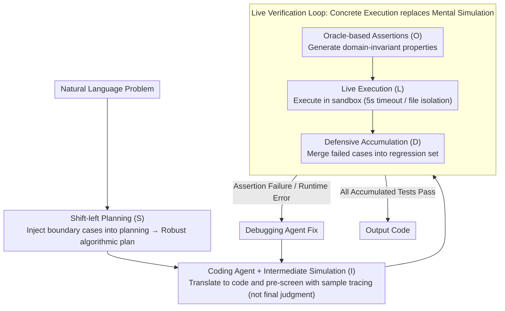

# SolidCoder: Bridging the Mental-Reality Gap in LLM Code Generation through Concrete Execution

**Conference**: ACL 2026 Findings  
**arXiv**: [2604.19825](https://arxiv.org/abs/2604.19825)  
**Code**: [https://github.com/10kH/SolidCoder](https://github.com/10kH/SolidCoder)  
**Area**: Code Generation / LLM Agent  
**Keywords**: Code Generation, Mental Simulation, Execution Verification, Multi-agent, Property Testing

## TL;DR

SolidCoder transforms code verification from "imaginary execution" to "concrete execution" through the S.O.L.I.D. architecture (Shift-left Planning, Oracle-based Assertions, Live Execution, Intermediate Simulation, Defensive Accumulation), achieving pass@1 performance of 95.7% on HumanEval, 77.0% on CodeContests, and 26.7% on APPS using GPT-4o.

## Background & Motivation

**Background**: Current state-of-the-art code generation frameworks (e.g., MapCoder, CodeSIM) employ multi-agent architectures. Notably, CodeSIM utilizes "Mental Simulation" to let the LLM verify correctness by internally tracing code execution, achieving leading results on multiple benchmarks.

**Limitations of Prior Work**: Mental simulation suffers from a fundamental flaw—LLMs generate execution hallucinations. In complex algorithmic scenarios, the model "imagines" execution trajectories that deviate from actual program behavior, confidently verifying buggy code. This is akin to playing blindfold chess and declaring victory prematurely. The CodeSIM team attempted to enhance test cases via self-consistency but abandoned execution verification after performance dropped by 9.3%.

**Key Challenge**: The Mental-Reality Gap unfolds across two orthogonal dimensions: (1) Specification Gap—ignoring boundary cases during the planning stage; (2) Verification Gap—hallucinating correct execution trajectories during the verification stage. These issues exist independently; fixing one does not resolve the other.

**Goal**: To bridge the gap in both dimensions simultaneously by forcing the model to consider boundary cases during planning and replacing imaginary execution with concrete execution for verification.

**Key Insight**: The authors observe that the failure of test generation in CodeSIM was not due to the test generation itself, but the attempt to predict precise outputs. Verification does not require exact answers—by checking properties (e.g., "output length equals input length," "result is a permutation of the input") rather than exact values, correctness can be judged without an oracle.

**Core Idea**: Replace precise output prediction with property-based assertions combined with sandbox execution to move verification from "imagination" to "execution"—don't imagine, execute.

## Method

### Overall Architecture

SolidCoder reuses the three-agent skeleton of CodeSIM (Planning, Coding, Debugging) but embeds the five S.O.L.I.D. components into the workflow. The core change is replacing the LLM's "mental simulation" with "concrete execution" in a sandbox. Given a natural language problem, the Planning Agent produces a robust algorithmic plan under boundary-aware prompts. The Coding Agent translates the plan into code and performs a lightweight internal trace pre-screening. Subsequently, it enters a Live Verification loop—generating property-based assertions, running them in a sandbox, accumulating failed cases into a regression test set, and debugging iteratively until all accumulated tests pass before outputting the code.

### Key Designs

**1. Shift-left Planning (S): Moving boundary cases from debugging to before planning**

Traditional multi-agent frameworks reactively add boundary handling during the debugging stage after code has already failed, but by then, the algorithmic skeleton is often fundamentally flawed. SolidCoder asks the LLM before planning: "What worst-case inputs would break a naive solution?" The resulting null inputs, boundary values, and corner cases are injected into the planning prompt, forcing the model to design robust algorithms from the start. Removing this component leads to a 23.7%p drop in the ablation study, the largest of any component, showing that "boundary case blindness" is the primary failure mode in algorithmic competitive programming, even surpassing execution hallucination.

**2. Oracle-based Assertions (O) + Live Execution (L): Replacing Mental Simulation with Concrete Execution**

The fatal flaw of mental simulation is the lack of an oracle—without knowing the correct answer, correctness cannot be judged, and precise output prediction is prone to hallucinations (the reason CodeSIM abandoned execution verification). SolidCoder solves this by reframing the question from "Is this output correct?" to "Does this output satisfy necessary properties?" The Oracle component generates domain-invariant property assertions (e.g., sorting should preserve length, maintain order, and be a permutation of the input), which can be verified without the exact answer. Live Execution then runs the code in a restricted sandbox (5s timeout, file system isolation). Failures or runtime errors route back to debugging. Together, these move from "imagination" to "execution." Removing O drops performance by 11.6%p, and removing L drops it by 7.9%p; notably, L captures a different class of bugs that mental simulation would confidently pass, which cannot be compensated for by improved specifications.

**3. Intermediate Simulation (I) + Defensive Accumulation (D): Low-cost Pre-screening + Monotonic Regression Prevention**

[I] lets the LLM trace the code on sample inputs immediately after generation. Unlike CodeSIM, it acts only as a cheap pre-filter and does not have final judgment authority, which is reserved for Live Execution. This prevents "imaginary judgment" from re-introducing hallucinations. [D] maintains a persistent test suite: each time Live Execution finds a new failed case, it is merged into the accumulation set. Every subsequent code modification must pass all accumulated tests, providing a monotonicity guarantee for iterative debugging and preventing "fixing one bug while breaking another." These contribute 13.0%p and 6.7%p to regression protection, respectively. The three iteration limits follow CodeSIM settings: planning iterations $p=5$, debugging iterations $d=5$, and hypothesis-breaking iterations $a=3$. The entire framework is an inference-time method involving no model training.

## Key Experimental Results

### Main Results

| Benchmark | Model | CodeSIM | SolidCoder | Gain |
|-----------|-------|---------|------------|------|
| HumanEval | GPT-4o | 95.1% | 95.7% | +0.6%p |
| CodeContests | GPT-4o | 72.7% | 77.0% | +4.3%p |
| APPS | GPT-4o | 23.3% | 26.7% | +3.4%p |
| CodeContests | GPT-OSS-120B | 87.9% | 92.1% | +4.2%p |
| CodeContests | Grok-4.1-Fast | 95.2% | 98.2% | +3.0%p |

### Ablation Study (CodeContests, GPT-4o)

| Configuration | Pass@1 | Δ |
|---------------|--------|---|
| Full SolidCoder | 77.0% | – |
| w/o Shift-left Planning [S] | 53.3% | -23.7%p |
| w/o Intermediate Simulation [I] | 64.0% | -13.0%p |
| w/o Oracle-based Assertions [O] | 65.4% | -11.6%p |
| w/o Live Execution [L] | 69.1% | -7.9%p |
| w/o Defensive Accumulation [D] | 70.3% | -6.7%p |
| GPT-4o Direct | 42.4% | -34.6%p |

### Key Findings
- **Shift-left Planning provides the largest contribution** (-23.7%p), proving that boundary case blindness is the primary failure mode for algorithmic tasks, rather than execution hallucination.
- **Live Execution captures categorically different errors** that mental simulation would incorrectly verify as correct. While its absolute contribution is smaller than [S], these errors cannot be solved by improving specifications.
- Improvements are proportional to difficulty: HumanEval (Easy) gained only +0.6%p, while CodeContests (Medium) saw the largest gain of +4.3%p. In APPS (Hard), the bottleneck shifts from verification to generation itself.
- RL post-trained models (GPT-OSS-120B, Grok-4.1-Fast) also benefit, indicating that even as generative capabilities improve, models still rely on mental simulation for self-evaluation at inference time.

## Highlights & Insights
- **Replacing precise output prediction with property testing** is a core innovation. Reframing an unsolvable oracle problem into an executable property verification task is clever and has broad generalizability.
- **The two-dimensional decomposition framework** (Specification Gap + Verification Gap) clarifies the problem analysis, and the ablation study perfectly validates that both are independent and complementary.
- **Shift-left thinking originated in software engineering**. Moving testing to the planning stage can be transferred to other multi-agent reasoning frameworks, such as mathematical or scientific reasoning tasks.

## Limitations & Future Work
- Live Execution currently only supports Python; extending to other languages requires language-specific sandboxing.
- The evaluation focuses on function-level benchmarks and has not been validated on repository-level tasks (e.g., SWE-bench).
- Systematic bias may propagate when the LLM simultaneously generates code, properties, and verification tests.
- Token overhead is significant: +50% on CodeContests and +97% on HumanEval. Difficulty-aware routing could be considered to optimize efficiency.
- The ablation study only covers one combination (CodeContests + GPT-4o).

## Related Work & Insights
- **vs CodeSIM**: CodeSIM uses mental simulation for final judgment; SolidCoder replaces it with concrete execution. The key difference is that SolidCoder's [I] is only a pre-filter, not the final arbiter.
- **vs LDB/MGDebugger**: These execution-based debuggers act as secondary corrections after code generation and require real test cases. SolidCoder integrates execution into the generation loop, using property assertions instead of real outputs.
- **vs Reflexion/LATS**: These utilize iterative self-correction and tree search, but verification still relies on internal LLM reasoning.

## Rating
- Novelty: ⭐⭐⭐⭐ The two-dimensional decomposition of the Mental-Reality Gap and the use of property testing to solve the oracle problem are meaningful innovations, though the overall architecture is incremental.
- Experimental Thoroughness: ⭐⭐⭐⭐ Three benchmarks, three models, and a full ablation study; however, ablation was performed on only one combination.
- Writing Quality: ⭐⭐⭐⭐⭐ The motivation is clear, the "blindfold chess" analogy is vivid, and the comparison examples in Figure 2 are intuitive and persuasive.
- Value: ⭐⭐⭐⭐ The property testing approach has broad transfer value, but token costs and Python limitations reduce immediate practicality.

<!-- RELATED:START -->

## Related Papers

- [\[ICML 2025\] Reasoning Through Execution: Unifying Process and Outcome Rewards for Code Generation](../../ICML2025/code_intelligence/reasoning_through_execution_unifying_process_and_outcome_rewards_for_code_genera.md)
- [\[ACL 2026\] CollabCoder: Plan-Code Co-Evolution via Collaborative Decision-Making for Efficient Code Generation](collabcoder_plan-code_co-evolution_via_collaborative_decision-making_for_efficie.md)
- [\[ACL 2026\] CodeRL+: Improving Code Generation via Reinforcement with Execution Semantics Alignment](coderl_improving_code_generation_via_reinforcement_with_execution_semantics_alig.md)
- [\[ACL 2026\] DUET: Dual Execution for Test Output Prediction with Generated Code and Pseudocode](duet_dual_execution_for_test_output_prediction_with_generated_code_and_pseudocod.md)
- [\[ICML 2026\] Bridging Functional Correctness and Runtime Efficiency Gaps in LLM-Based Code Translation](../../ICML2026/code_intelligence/bridging_functional_correctness_and_runtime_efficiency_gaps_in_llm-based_code_tr.md)

<!-- RELATED:END -->
