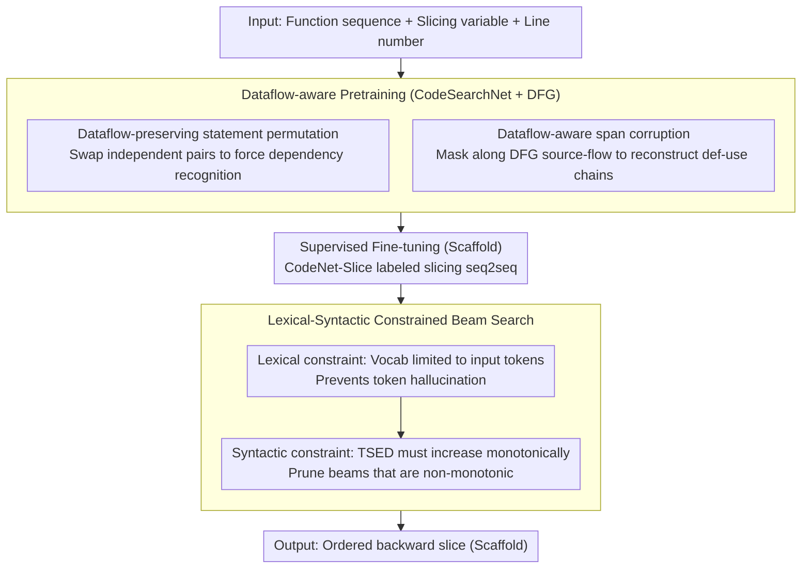

# Static Program Slicing Using Language Models With Dataflow-Aware Pretraining and Constrained Decoding

**Conference**: ACL2026  
**arXiv**: [2604.26961](https://arxiv.org/abs/2604.26961)  
**Code**: https://anonymous.4open.science/r/staticsliceT5-4E22  
**Area**: Code Intelligence / Program Analysis  
**Keywords**: Program Slicing, Dataflow Pretraining, Constrained Decoding, CodeT5+, Static Analysis

## TL;DR
Sliceformer reformulates static program slicing as a seq2seq task for small code language models. It learns dependencies through dataflow-aware pretraining and utilizes lexical and syntactic constrained decoding to prevent hallucinations, significantly improving ExactMatch on Java and Python slicing benchmarks.

## Background & Motivation
**Background**: Static program slicing, used to identify code fragments relevant to a specific variable or statement, is a fundamental technique in debugging, vulnerability analysis, and program comprehension. Traditional methods rely on System Dependence Graphs (SDGs) and graph reachability analysis, which are precise but engineering-intensive. Recent learning-based approaches attempt to automatically predict slices using CodeBERT, GraphCodeBERT, or LLMs.

**Limitations of Prior Work**: Learning-based slicing faces two core issues. First, language models often misjudge dependencies based on surface similarity or spatial proximity, missing truly relevant statements or including irrelevant ones. Second, generative models may output tokens, variable names, or statements absent from the original program, whereas program slicing must strictly be an exact subsequence of the input code.

**Key Challenge**: Code language models are proficient at generating natural code but do not naturally adhere to the hard constraints of program analysis tasks. Program slicing requires both an understanding of dataflow semantics and the output of a purely extractive, hallucination-free, and structurally valid result. Simple supervised fine-tuning (SFT) finds it difficult to satisfy both requirements simultaneously.

**Goal**: The authors aim to retain the advantages of language models in end-to-end modeling of full function contexts while explicitly injecting dataflow constraints from static analysis into the pretraining and decoding processes to enhance slicing accuracy and reliability.

**Key Insight**: The paper selects smaller encoder-decoder models like CodeT5+ rather than relying on large closed-source LLMs. The approach is divided into dataflow capability shaping during pretraining and hard-constrained decoding during inference, addressing dependency identification and hallucination suppression, respectively.

**Core Idea**: A Data Flow Graph (DFG) is used to design pretraining tasks that teach the model "which statements are truly related." Subsequently, constrained decoding—which only allows tokens from the input and ensures monotonic increases in AST similarity—guarantees that the output is a valid slice.

## Method

### Overall Architecture
The input to Sliceformer consists of a function statement sequence, a slicing variable, and the variable's line number. The output is a backward slice ordered according to the original code. The model first undergoes dataflow-aware pretraining on Python/Java functions from CodeSearchNet, followed by supervised fine-tuning on labeled slicing data from CodeNet-Slice. Finally, lexical and syntactic constraints filter illegal candidates during decoding.

The key to this pipeline is separating the two task properties of program slicing: pretraining enhances "semantic dependency identification," while constrained decoding ensures "element preservation." The former teaches the model where variable values originate and flow; the latter ensures the generation process neither creates tokens outside the original program nor constructs fragments that deviate structurally from the input.

### Key Designs

**1. Dataflow-preserving statement permutation pretraining: Forcing the model to distinguish true data dependencies**

The key to slicing is determining if a statement truly affects the slicing criterion, yet models often guess dependencies based on proximity. Given the code and DFG, this task identifies pairs of statements within the same basic block that have no connecting data edges and swaps them randomly. The model is trained to generate a dataflow-equivalent code variant. Unlike natural language where sentence order shuffling is often arbitrary, code must respect def-use relationships; thus, the model is forced to focus on data dependencies rather than memorizing original positions to reconstruct valid variants.

**2. Dataflow-aware span corruption: Reconstructing dependency chains at variable and statement levels**

Standard span corruption learns local patterns, and AST masking focuses on syntax, but neither captures the cross-statement dataflow essential for slicing. Here, a variable node is randomly selected in the DFG, and its source and flow are traced through parents and children. Masking is applied at two granularities: masking only the variables or masking entire statements containing them. This reconstructs the def-use fragments the model is exposed to during pretraining, effectively setting the dependency chains relied upon by backward slicing as the pretraining objective.

**3. Lexical-syntactic constrained beam search: Eliminating "out-of-source" generation at the decoding level**

A valid slice must be an exact subsequence of the input code, but generative models often produce identifiers not present in the source or structurally disordered statements. Constrained decoding applies two measures: first, limiting the vocabulary to tokens appearing in the input code to solve token hallucination; second, calculating the Tree Similarity Edit Distance (TSED) between the partial slice and the input AST at statement boundaries. If TSED fails to increase monotonically, the beam is judged structurally incorrect and pruned. The former prevents "inventing tokens," while the latter prevents "valid tokens in invalid order/structure."

### Loss & Training
The pretraining phase is based on CodeT5+ 0.7B, using approximately 1.0M functions from the Python and Java subsets of CodeSearchNet. ASTs and variables are extracted for each function using Tree-Sitter, with DFGs constructed in the GraphCodeBERT style. Span corruption masks 25% of tokens, and statement permutation swaps up to 3 statements per sample. The context length is 512, batch size is 32, and training lasts 100K steps.

The supervised fine-tuning phase uses Python and Java subsets from CodeNet-Slice with input/output lengths of 512. It utilizes the AdamW optimizer, batch size 32, learning rate 5e-5, 1000 warmup steps, and 10 epochs. Special control tokens (line number, code, criterion, slice) are included in the output format to help the model generate structured slices.

## Key Experimental Results

### Main Results
Sliceformer outperforms baselines across four metrics in both Java and Python, with significant gains in ExactMatch.

| Method | Java Acc-D | Java ExactMatch | Java CodeBLEU | Java TSED | Python Acc-D | Python ExactMatch | Python CodeBLEU | Python TSED |
|------|------------|-----------------|---------------|-----------|--------------|-------------------|-----------------|-------------|
| GPT-5 + CoT | 60.27 | 14.00 | 71.35 | 63.81 | 56.94 | 13.00 | 68.56 | 61.27 |
| NS-slicer CodeBERT | 95.65 | 81.72 | 88.41 | 91.00 | 82.47 | 56.32 | 74.68 | 78.91 |
| NS-slicer GraphBERT | 96.51 | 85.77 | 89.26 | 90.35 | 84.92 | 61.25 | 76.84 | 80.12 |
| CodeT5+ SFT | 95.33 | 87.24 | 89.26 | 93.42 | 87.53 | 77.24 | 79.98 | 81.75 |
| **Sliceformer** | **98.78** | **92.20** | **93.23** | **97.68** | **90.85** | **83.15** | **85.35** | **89.74** |

Compared to the strongest previous baseline, NS-slicer GraphBERT, Sliceformer's ExactMatch improved from 85.77 to 92.20 in Java (Gain: 6.4%) and from 61.25 to 83.15 in Python (Gain: 21.9%). Compared to direct SFT of CodeT5+, Java ExactMatch improved by ~5.0%, and Python by ~5.9%.

In terms of efficiency, Sliceformer is an order of magnitude faster than 7B/8B SFT models while adding minimal overhead compared to CodeT5+.

| Method | Model Size | Time per Task | Note |
|------|----------|----------------|------|
| NS-slicer CodeBERT | 125M | 0.105s | Fastest but lower accuracy |
| NS-slicer GraphCodeBERT | 125M | 0.135s | Strong prior learning baseline |
| CodeT5+ | 770M | 0.289s | Direct SFT |
| Sliceformer | 770M | 0.296s | High accuracy with similar overhead to CodeT5+ |
| CodeLlama-7B SFT | 7B | 5.75s | Significantly slower |
| Qwen3-8B SFT | 8B | 6.52s | Significantly slower |

### Ablation Study
Ablation results indicate that all four components are effective, with dataflow span corruption and lexical constraints having the most impact. The appendix compares architecture compatibility for constrained decoding.

| Config | Architecture | Pretraining | SFT | Constrained Decoding | Java ExactMatch |
|------|------|--------|-----|----------|-----------------|
| CodeT5 | Encoder-Decoder | No | Yes | No | 82.80 |
| CodeT5 + Sliceformer | Encoder-Decoder | Yes | Yes | Yes | 85.12 |
| CodeLlama-7B | Decoder-only | No | Yes | No | 75.27 |
| Qwen3-8B | Decoder-only | No | Yes | No | 80.55 |
| Qwen3-8B + Constrained | Decoder-only | No | Yes | Yes | 83.11 |

| Component | Ablation Observation | Explanation |
|------|----------|------|
| Removed span corruption | Largest performance drop | DFG-guided masking directly trains the model to recover def-use chains, critical for slicing. |
| Removed lexical constraint | Largest performance drop | Generative models easily produce out-of-voc tokens; hard constraints are vital for element preservation. |
| Removed permutation | Performance drop | The model loses exposure to the permutability of dataflow-independent statements. |
| Removed TSED constraint | Small but steady drop | Structural errors are rarer than lexical hallucinations but help filter beams in complex statements. |

### Key Findings
- Even with RAG or CoT, closed-source LLMs show very low ExactMatch, indicating that program slicing is a hard-constrained extractive task rather than general code QA.
- NS-slicer treats each statement as an independent binary classification, struggling to distinguish positions of identical statements in different control flow branches; Sliceformer generates slices within the full function context.
- Constrained decoding adds almost no latency (0.296s vs 0.289s for CodeT5+) while significantly boosting ExactMatch.
- Encoder-decoder architectures naturally support dataflow span reconstruction; while decoder-only models can benefit from constrained decoding, they cannot directly reuse all pretraining objectives.

## Highlights & Insights
- The paper transforms the "hallucination problem" of code models into an element preservation constraint for slicing and solves it via hard decoding constraints, which is far more reliable than prompting "do not hallucinate."
- The dataflow pretraining objective is perfectly tailored to program analysis: rather than general code understanding, it teaches the model def-use dependencies, the core of backward slicing.
- TSED monotonicity is an insightful structural constraint: if the output is a subsequence of the input, the AST similarity should increase rather than decrease as valid statements are added.
- The small model approach is practical. A 770M CodeT5+ with task-specific constraints significantly outperforms 7B/8B generative models and GPT prompting in precise program analysis, proving task-specific inductive bias is more critical than scale.

## Limitations & Future Work
- The experiments only cover Java and Python; extension to C/C++, JavaScript, or Rust requires re-adapting parsers, DFG construction, and slicing annotation tools.
- Dataflow pretraining is primarily designed for encoder-decoder models; equivalent objectives for decoder-only LLMs remain unresolved.
- Evaluation relies on CodeNet-Slice ground truth; if the original tools have noise, the model might learn specific labeling biases.
- TSED monotonicity targets syntax but does not directly guarantee semantic dependency completeness; complex control dependencies and exception handling remain challenging.
- Future work could integrate traditional static analysis graph constraints more tightly with neural generation, such as maintaining a reachable dependency subgraph during beam search.

## Related Work & Insights
- **vs JavaSlicer / Traditional Static Analysis**: Traditional tools rely on explicit dependency graphs and reachability rules; they are interpretable but costly to adapt to new languages. Sliceformer approximates slicing using a learned model while retaining program analysis biases via DFG constraints.
- **vs NS-slicer**: NS-slicer performs statement-level binary classification, often losing function-level context. Sliceformer outputs the full slice as a seq2seq task, better handling identical statements and cross-position dependencies.
- **vs GPT prompting**: Prompting can generate explanations, but ExactMatch is poor and prone to hallucinations; Sliceformer's hard constraints are better suited for precise extraction.
- **vs GraphCodeBERT**: GraphCodeBERT uses dataflow for representation learning; this work turns DFG into a generative pretraining objective for slicing combined with constrained decoding.
- **Insight**: For code intelligence tasks, the most effective LLM solutions often involve embedding the verifiable structure of the task into the training objectives and decoding process rather than simply scaling the model.

## Rating
- Novelty: ⭐⭐⭐⭐☆ Excellent alignment between DFG pretraining and TSED monotonicity for the task.
- Experimental Thoroughness: ⭐⭐⭐⭐☆ Main results, efficiency, ablations, and architecture studies are comprehensive, though language variety is limited.
- Writing Quality: ⭐⭐⭐⭐☆ Problem definition and method explanations are thorough.
- Value: ⭐⭐⭐⭐⭐ High practical value for program slicing, constrained decoding, and neural program analysis.

<!-- RELATED:START -->

## Related Papers

- [\[ICML 2026\] Locally Coherent Parallel Decoding in Diffusion Language Models](../../ICML2026/code_intelligence/locally_coherent_parallel_decoding_in_diffusion_language_models.md)
- [\[ACL 2026\] Ro-SLM: Onboard Small Language Models for Robot Task Planning and Operation Code Generation](ro-slm_onboard_small_language_models_for_robot_task_planning_and_operation_code_.md)
- [\[ACL 2026\] SWE-QA: Can Language Models Answer Repository-level Code Questions?](swe-qa_can_language_models_answer_repository-level_code_questions.md)
- [\[ACL 2025\] DynaCode: A Dynamic Complexity-Aware Code Benchmark for Evaluating Large Language Models in Code Generation](../../ACL2025/code_intelligence/dynacode_a_dynamic_complexity-aware_code_benchmark_for_evaluating_large_language.md)
- [\[ICML 2025\] EffiCoder: Enhancing Code Generation in Large Language Models through Efficiency-Aware Fine-tuning](../../ICML2025/code_intelligence/efficoder_enhancing_code_generation_in_large_language_models_through_efficiency-.md)

<!-- RELATED:END -->
