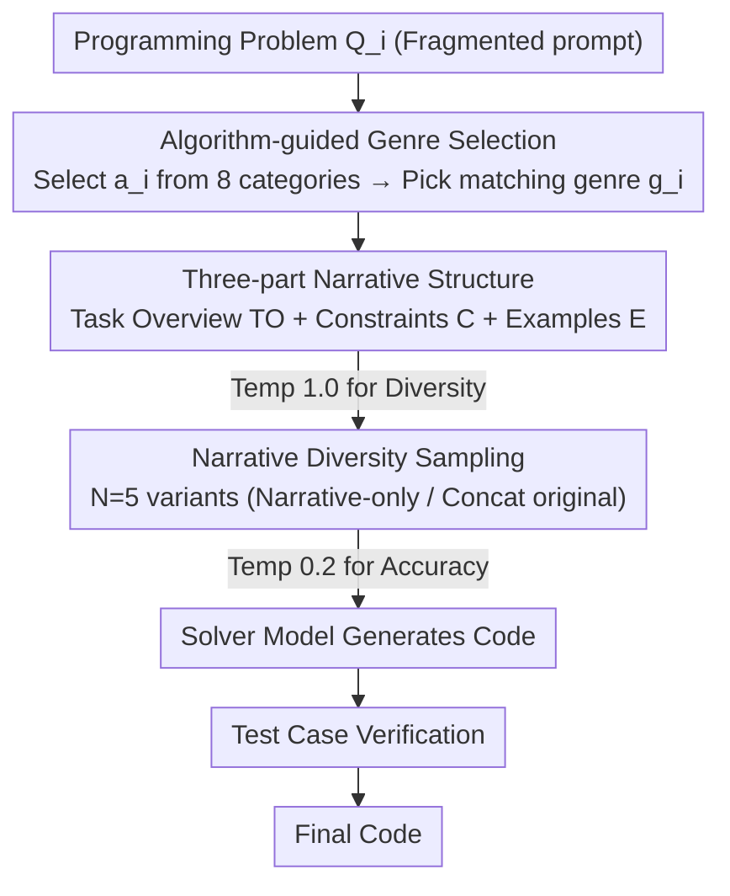

# StoryCoder: Narrative Reformulation for Structured Reasoning in LLM Code Generation

**Conference**: ACL 2026  
**arXiv**: [2604.14631](https://arxiv.org/abs/2604.14631)  
**Code**: Yes  
**Area**: Code Intelligence  
**Keywords**: Narrative Reformulation, Code Generation, Prompt Engineering, Structured Reasoning, Algorithm Selection

## TL;DR

Ours proposes StoryCoder, a prompting framework that reformulates code generation problems into coherent natural language narratives. By guiding LLMs through three narrative components—Task Overview, Constraints, and Examples—it achieves a structured reasoning process, improving zero-shot pass@10 by an average of 18.7% across 11 models.

## Background & Motivation

**Background**: The performance of code generation depends not only on model capabilities but also on problem representation. Existing methods primarily enhance performance through increased reasoning steps (CoT, SCoT) or repeated sampling, yet none change the problem description itself—leaving fragmented, imperative problem conditions as they are.

**Limitations of Prior Work**: Programming task descriptions are often incomplete or ambiguous, requiring solvers to infer missing details from context. CoT introduces reasoning steps without altering the input representation; repeated sampling expands the output space without improving understanding; while SCoT introduces program structures, these methods do not address the fundamental issue of fragmented problem formulation.

**Key Challenge**: Cognitive science research indicates that humans reason and understand more effectively when organizing fragmented conditions into coherent mental models. However, LLMs directly face fragmented problem descriptions, making it difficult to form a unified problem representation, which leads to disorganized reasoning paths.

**Goal**: To design a narrative reformulation framework that transforms coding problems into coherent natural language descriptions, providing a richer contextual structure than simple paraphrasing.

**Key Insight**: Inspired by analogical reasoning and mental model theories in cognitive science—where humans reason better by organizing information into coherent structures—transforming programming problems into "stories" allows models to understand and solve problems within more natural language structures.

**Core Idea**: The model first selects an appropriate algorithm category and narrative genre, then reformulates the programming problem into a three-part narrative containing a Task Overview, Constraints, and Examples. This structured natural language representation replaces the original fragmented descriptions to guide code generation.

## Method

### Overall Architecture

StoryCoder is a pure reasoning-time prompting framework. The core action is to rewrite fragmented problem statements into a coherent natural language "story" before writing code. Given a programming problem $Q_i$, the model first identifies its algorithm category $a_i$ (selected from 8 predefined categories) and picks a matching narrative genre $g_i$. Based on this, it reformulates the problem into a structured narrative $\mathcal{N}_i$ (containing Task Overview, Constraints, and Examples). $N=5$ narrative variants are generated for the same problem to cover different interpretive perspectives. Finally, these narratives are passed to a solver model to generate code, which is then verified by test cases.

### Key Designs

**1. Algorithm-guided Genre Selection: Aligning Narratives with Algorithmic Essence**

If the genre does not align with the algorithmic skeleton of the problem, it may mislead the model; experiments show significant performance drops when using mismatched genres. Before reformulation begins, the model identifies the most appropriate category from 8 predefined algorithms (e.g., sorting, searching, dynamic programming) and freely selects a narrative genre that fits both the algorithm and the problem. Different narrative variants can result from different algorithm-genre combinations, providing multi-perspective representations. Conversely, appropriate genres help models infer correct algorithmic strategies earlier from fragmented descriptions.

**2. Three-part Narrative Structure: Integrating Fragmented Conditions into Coherent Representations**

Programming problems are often fragmented and incomplete, requiring solvers to infer missing details, while CoT only adds reasoning steps without modifying the input. Once a genre is selected, StoryCoder rewrites the problem into $\mathcal{N}_i = \{\text{TO}_i, \text{C}_i, \text{E}_i\}$: the Task Overview (TO) presents the coding goal within the narrative framework, assembling scattered conditions into a coherent system; Constraints (C) restate input ranges, time limits, and rules as natural limitations within the story; Examples (E) embed test cases into the contextual scene rather than simply appending them. This design directly corresponds to mental model theory—effective reasoning requires forming a complete and coherent problem representation before execution.

**3. Narrative Diversity Sampling: Expanding the Solution Space via Input-side Variations**

For each problem, $N$ narrative variants are generated, each potentially having different algorithm judgments, genre selections, and developments. The experiment aggregates 5 pure narrative variants and 5 "narrative + original prompt" concatenated variants, totaling 10 responses. This fundamentally differs from simple repeated sampling; while repeated sampling only changes the random seed at the output stage, each variant here modifies the input representation itself, thus more effectively exploring the solution space. The temperature settings are also distinct: narrative generation use a temperature of 1.0 to encourage diversity, while code generation uses 0.2 to encourage accuracy.

## Key Experimental Results

### Main Results (pass@10, average across open-source models)

| Method | HumanEval | LiveCodeBench | CodeForces |
|------|-----------|---------------|------------|
| Repeat Sampling (RS) | 81.31 | 26.36 | 18.96 |
| CoT | 82.26 | 27.57 | 19.32 |
| SCoT | 82.60 | 26.93 | 19.26 |
| **StoryCoder** | **89.76** | **32.22** | **28.58** |

Representative closed-source models (pass@10):

| Model | Method | LiveCodeBench | CodeForces |
|------|------|---------------|------------|
| Claude-3.5-Haiku | RS | 33.71 | 47.17 |
| Claude-3.5-Haiku | **Ours** | **38.29** | **50.95** |
| Gemini-2.5-Flash | RS | 53.14 | 60.00 |
| Gemini-2.5-Flash | **Ours** | **57.14** | **67.55** |

### Ablation Study

| Analysis Dimension | Finding |
|---------|------|
| Algorithm Selection Accuracy | StoryCoder makes it easier for models to select the correct algorithm (Significant Gain) |
| Implementation Error Rate | Narrative reformulation reduces implementation errors |
| Code Structure | Narrative guidance produces more modular code structures |
| Genre Mismatch | Using mismatched genres leads to significant performance degradation |

### Key Findings
- Narrative reformulation consistently outperformed all baselines across all 11 models and 3 benchmarks, with an average pass@10 Gain of 18.7%.
- The improvement is particularly significant on difficult benchmarks (CodeForces), where open-source models improved from 18.96% to 28.58% (+50.7% relative gain).
- Narratives not only improve accuracy but also guide models to select correct algorithmic strategies, reduce implementation errors, and generate more modular code.
- Narrative generation quality correlates with the model's instruction-following capability—Gemma-2 27B achieved a 96% valid narrative rate, while Llama-3.1 8B only reached 36.7%.

## Highlights & Insights
- The approach of **"changing problem representation rather than the reasoning process"** is highly novel. unlike CoT which adds reasoning steps, this improves understanding by restructuring the input. The link to mental model theory from cognitive science is compelling.
- The **three-part narrative design** balances narrative coherence with computational rigor, particularly by embedding constraints and test cases into the narrative rather than appending them, ensuring organic integration of information.
- The **cross-model setup findings** have high practical value: models with strong instruction-following can be used to generate narratives, while models with strong coding capabilities generate the code, creating complementarity.

## Limitations & Future Work
- Narrative generation itself consumes extra tokens and inference time.
- Narrative quality is highly dependent on the generating model's instruction-following ability; smaller models (e.g., Llama-3.1 8B) show low valid narrative rates.
- Eight predefined algorithm categories may not cover all types of programming problems.
- The effectiveness of narrative reformulation on non-algorithmic programming tasks such as mathematical proofs or system design remains unknown.
- The combination of narratives with other reasoning enhancement methods (e.g., self-consistency, reflection) has not yet been explored.

## Related Work & Insights
- **vs CoT/SCoT**: CoT adds reasoning steps without changing input representation; SCoT introduces code structure but remains based on the original problem description. StoryCoder improves problem understanding from the input side, making it orthogonal and combinable with these methods.
- **vs Repeat Sampling**: While repeat sampling increases diversity at the output stage, StoryCoder increases diversity at the input stage through different narrative variants, more effectively exploring the solution space.

## Rating
- Novelty: ⭐⭐⭐⭐ The idea of narrative reformulation is highly novel with a solid cognitive science foundation.
- Experimental Thoroughness: ⭐⭐⭐⭐⭐ Comprehensive evaluation across 11 models, 3 benchmarks, and deep analysis of errors and code structure.
- Writing Quality: ⭐⭐⭐⭐ Motivations and methods are clearly articulated; the cognitive science connection is persuasive.
- Value: ⭐⭐⭐⭐ Provides a new dimension for improving code generation with significant practical effects.

<!-- RELATED:START -->

## Related Papers

- [\[ACL 2026\] ReCode: Reinforcing Code Generation with Reasoning-Process Rewards](recode_reinforcing_code_generation_with_reasoning-process_rewards.md)
- [\[ACL 2025\] Tree-of-Code: A Tree-Structured Exploring Framework for End-to-End Code Generation](../../ACL2025/code_intelligence/tree-of-code_a_tree-structured_exploring_framework_for_end-to-end_code_generatio.md)
- [\[ACL 2026\] SolidCoder: Bridging the Mental-Reality Gap in LLM Code Generation through Concrete Execution](solidcoder_bridging_the_mental-reality_gap_in_llm_code_generation_through_concre.md)
- [\[CVPR 2026\] GeoTikzBridge: Advancing Multimodal Code Generation for Geometric Perception and Reasoning](../../CVPR2026/code_intelligence/geotikzbridge_advancing_multimodal_code_generation_for_geometric_perception_and_.md)
- [\[NeurIPS 2025\] CodeCrash: Exposing LLM Fragility to Misleading Natural Language in Code Reasoning](../../NeurIPS2025/code_intelligence/codecrash_exposing_llm_fragility_to_misleading_natural_language_in_code_reasonin.md)

<!-- RELATED:END -->
