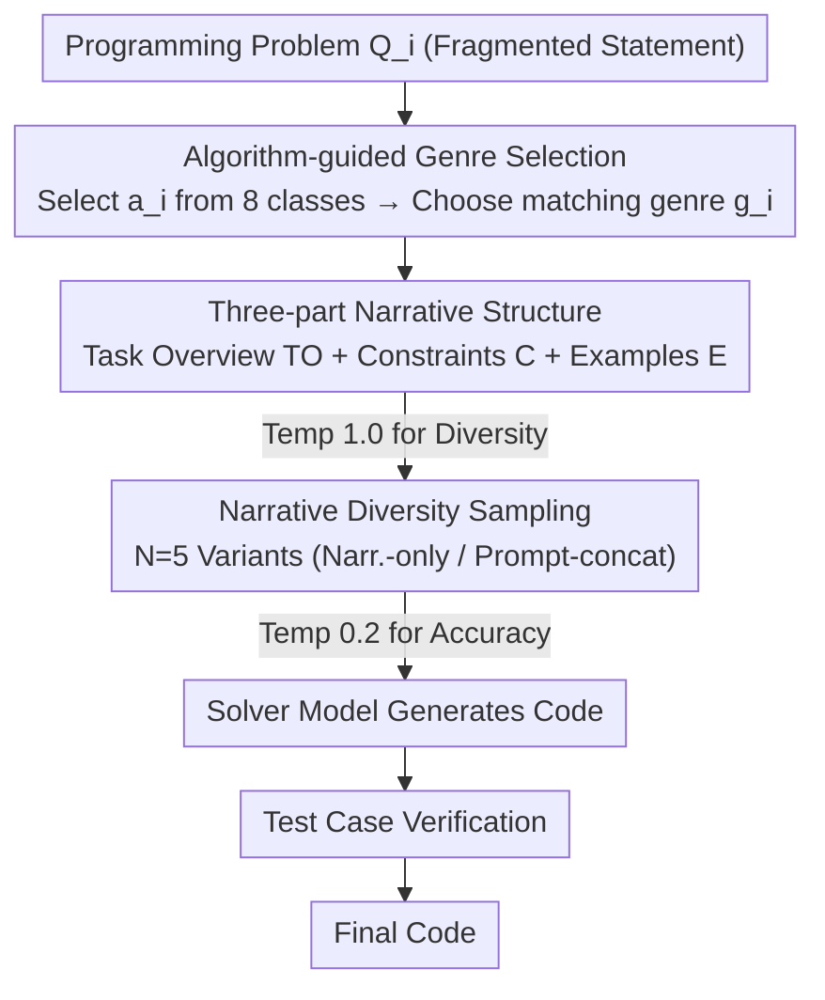

# StoryCoder: Narrative Reformulation for Structured Reasoning in LLM Code Generation

**Conference**: ACL 2026  
**arXiv**: [2604.14631](https://arxiv.org/abs/2604.14631)  
**Code**: Yes  
**Area**: Code Intelligence  
**Keywords**: Narrative Reformulation, Code Generation, Prompt Engineering, Structured Reasoning, Algorithm Selection

## TL;DR

This paper proposes StoryCoder, a prompting framework that reformulates code generation problems into coherent natural language narratives. By guiding LLMs through structured reasoning with three narrative components—Task Overview, Constraints, and Examples—it achieves an average zero-shot pass@10 improvement of 18.7% across 11 models.

## Background & Motivation

**Background**: The performance of code generation depends not only on model capability but also on how the problem is represented. Existing methods primarily improve performance by increasing reasoning steps (CoT, SCoT) or through repeated sampling, but they do not alter the problem description itself; fragmented, imperative problem conditions remain unchanged.

**Limitations of Prior Work**: Programming task descriptions are often incomplete or ambiguous, requiring the solver to infer missing details from context. CoT introduces reasoning steps without changing the input representation; repeated sampling expands the output but does not improve understanding; although SCoT introduces program structure, none of these methods address the fundamental issue of fragmented problem formulation.

**Key Challenge**: Cognitive science research indicates that humans reason more effectively when organizing fragmented conditions into coherent mental models. However, LLMs directly confront fragmented problem descriptions, making it difficult to form a unified problem representation, which leads to confused reasoning paths.

**Goal**: To design a narrative reformulation framework that transforms coding problems into coherent natural language descriptions, providing a richer contextual structure than simple paraphrasing.

**Key Insight**: Inspired by analogical reasoning and mental model theories in cognitive science—humans reason better by organizing information into coherent structures. By transforming programming problems into "stories," the model is encouraged to understand and solve problems within more natural language structures.

**Core Idea**: The model first selects an appropriate algorithm category and narrative genre, then reformulates the programming problem into a three-part narrative containing a Task Overview, Constraints, and Examples. This structured natural language representation replaces the original fragmented description to guide code generation.

## Method

### Overall Architecture

StoryCoder is a pure inference-time prompting framework. Its core action is to rewrite the fragmented problem statement into a coherent natural language "story" before writing code. Given a programming problem $Q_i$, the model first identifies its algorithm category $a_i$ (selected from 8 predefined categories) and chooses a matching narrative genre $g_i$. Based on these, the problem is reformulated into a structured narrative $\mathcal{N}_i$ (containing Task Overview, Constraints, and Examples). $N=5$ narrative variants are generated for the same problem to cover different perspectives. Finally, the narratives are passed to a solver model to generate code, which is then verified using test cases.

### Key Designs

**1. Algorithm-guided Genre Selection: Aligning Narratives with the Algorithmic Essence of Problems**

If the genre does not align with the algorithmic backbone of the problem, it may mislead the model; experiments show that using mismatched genres leads to a significant performance decline. Therefore, before reformulation begins, the model identifies the most appropriate category from 8 predefined algorithm classes (sorting, searching, dynamic programming, etc.) and freely selects a narrative genre that fits both the algorithm and the problem. Different narrative variants can fall into different combinations of algorithm judgments and genres, thereby providing multi-perspective problem representations. Conversely, an appropriate genre helps the model infer the correct algorithmic strategy earlier from fragmented descriptions.

**2. Three-part Narrative Structure: Integrating Fragmented Conditions into a Coherent Representation**

Programming problem statements are often fragmented and incomplete, requiring solvers to infer details from context, whereas CoT only adds reasoning steps without modifying the input itself. Once a genre is selected, StoryCoder rewrites the problem into three parts, $\mathcal{N}_i = \{\text{TO}_i, \text{C}_i, \text{E}_i\}$: the Task Overview (TO) presents the coding goal within a narrative framework, assembling scattered conditions into a coherent system; Constraints (C) restate input ranges, time limits, and rules as natural limitations within the story; Examples (E) embed test cases within the contextual scenario rather than simply appending them. This design aligns directly with mental model theory—effective reasoning requires forming a complete and coherent problem representation before execution. The three-part structure ensures that no critical information from the original problem is lost.

**3. Narrative Diversity Sampling: Expanding the Solution Space on the Input Side**

$N$ variants of narratives are generated for each problem, each potentially having different algorithm judgments, genre selections, and developments. In experiments, 5 pure narrative variants and 5 "narrative + original prompt" concatenated variants are aggregated for a total of 10 responses. This is fundamentally different from simple repeated sampling; while repeated sampling only changes the random seed at the output stage, each variant here changes the input representation itself, thus exploring the solution space more effectively. The temperature settings are also clearly divided: temperature 1.0 is used for narrative generation to encourage diversity, while temperature 0.2 is used for code generation to ensure accuracy.

## Key Experimental Results

### Main Results (pass@10, average across open-source models)

| Method | HumanEval | LiveCodeBench | CodeForces |
|------|-----------|---------------|------------|
| Repeated Sampling (RS) | 81.31 | 26.36 | 18.96 |
| CoT | 82.26 | 27.57 | 19.32 |
| SCoT | 82.60 | 26.93 | 19.26 |
| **StoryCoder** | **89.76** | **32.22** | **28.58** |

Representative closed-source models (pass@10):

| Model | Method | LiveCodeBench | CodeForces |
|------|-----------|---------------|------------|
| Claude-3.5-Haiku | RS | 33.71 | 47.17 |
| Claude-3.5-Haiku | **Narr.** | **38.29** | **50.95** |
| Gemini-2.5-Flash | RS | 53.14 | 60.00 |
| Gemini-2.5-Flash | **Narr.** | **57.14** | **67.55** |

### Ablation Study

| Analysis Dimension | Finding |
|---------|------|
| Algorithm Selection Accuracy | StoryCoder makes it easier for the model to select the correct algorithm (+Significant Improvement) |
| Implementation Error Rate | Narrative reformulation reduces implementation errors |
| Code Structure | Narrative guidance produces more modular code structures |
| Genre Mismatch | Using mismatched genres leads to significant performance degradation |

### Key Findings
- Narrative reformulation consistently outperforms all baselines across all 11 models and 3 benchmarks, with an average pass@10 improvement of 18.7%.
- Improvements are particularly significant on difficult benchmarks (CodeForces), where open-source models improved from an average of 18.96% to 28.58% (+50.7% relative gain).
- Narratives not only improve accuracy but also guide the model to choose correct algorithmic strategies, reduce implementation errors, and produce more modular code.
- Narrative generation quality correlates with the model's instruction-following capability—Gemma-2 27B has a 96% valid narrative rate, while Llama-3.1 8B has only 36.7%.

## Highlights & Insights
- The approach of **"changing the problem representation rather than the reasoning process"** is highly novel: unlike CoT, which adds reasoning steps, it improves understanding by reconstructing the input. The link to mental model theory in cognitive science is compelling.
- The **three-part narrative design** balances narrative coherence with computational rigor, especially by embedding constraints and test cases into the narrative rather than simply appending them, ensuring organic information integration.
- Findings from **cross-model configurations** have high practical value: a model with strong instruction-following capabilities can be used to generate narratives, while a model with strong coding capabilities generates the code, achieving complementarity.

## Limitations & Future Work
- Narrative generation itself consumes extra tokens and inference time (although the authors consider it "free," there is practical overhead).
- Narrative quality depends heavily on the instruction-following capability of the generating model; small models (like Llama-3.1 8B) have very low valid narrative rates.
- The 8 predefined algorithm categories may not cover all types of programming problems.
- The effect of narrative reformulation on non-algorithmic programming tasks, such as mathematical proofs or system design, remains unknown.
- Combinations of narratives with other reasoning enhancement methods (e.g., self-consistency, reflection) have not been explored.

## Related Work & Insights
- **vs CoT/SCoT**: CoT adds reasoning steps without changing the input representation, while SCoT introduces code structure but still relies on the original problem description. StoryCoder improves problem understanding from the input side and is orthogonal to and combinable with these methods.
- **vs Repeated Sampling**: Repeated sampling increases diversity on the output side, whereas StoryCoder increases diversity on the input side through different narrative variants, more effectively exploring the solution space.

## Rating
- Novelty: ⭐⭐⭐⭐ The idea of narrative reformulation is highly novel and has a foundation in cognitive science.
- Experimental Thoroughness: ⭐⭐⭐⭐⭐ 11 models, 3 benchmarks, and extensive analysis (algorithm selection, error types, code structure).
- Writing Quality: ⭐⭐⭐⭐ Motivation and methodology are clearly articulated, and the cognitive science connection is persuasive.
- Value: ⭐⭐⭐⭐ Provides a new dimension for improving code generation with significant practical results.

<!-- RELATED:START -->

## Related Papers

- [\[ACL 2026\] ReCode: Reinforcing Code Generation with Reasoning-Process Rewards](recode_reinforcing_code_generation_with_reasoning-process_rewards.md)
- [\[ACL 2026\] SolidCoder: Bridging the Mental-Reality Gap in LLM Code Generation through Concrete Execution](solidcoder_bridging_the_mental-reality_gap_in_llm_code_generation_through_concre.md)
- [\[ACL 2025\] Tree-of-Code: A Tree-Structured Exploring Framework for End-to-End Code Generation](../../ACL2025/code_intelligence/tree-of-code_a_tree-structured_exploring_framework_for_end-to-end_code_generatio.md)
- [\[ICLR 2026\] Breaking the SFT Plateau: Multimodal Structured Reinforcement Learning for Chart-to-Code Generation](../../ICLR2026/code_intelligence/breaking_the_sft_plateau_multimodal_structured_reinforcement_learning_for_chart-.md)
- [\[NeurIPS 2025\] CodeCrash: Exposing LLM Fragility to Misleading Natural Language in Code Reasoning](../../NeurIPS2025/code_intelligence/codecrash_exposing_llm_fragility_to_misleading_natural_language_in_code_reasonin.md)

<!-- RELATED:END -->
