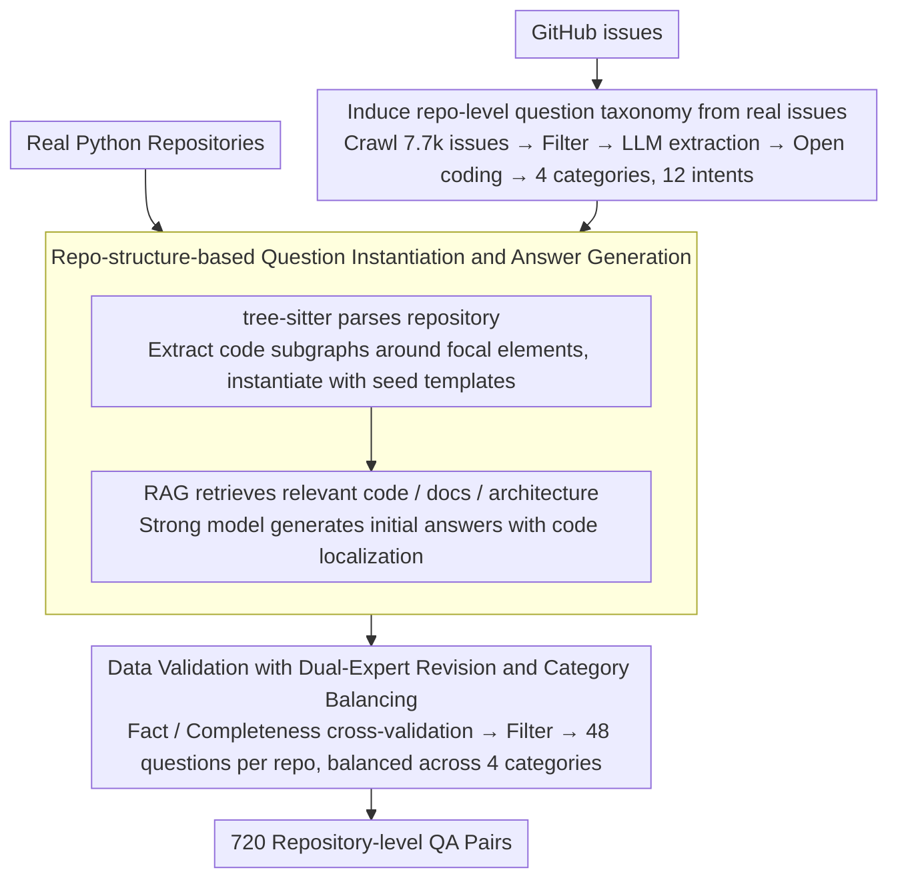

# SWE-QA: Can Language Models Answer Repository-level Code Questions?

**Conference**: ACL 2026 Findings  
**arXiv**: [2509.14635](https://arxiv.org/abs/2509.14635)  
**Code**: https://github.com/peng-weihan/SWE-QA-Bench  
**Area**: Code Intelligence / Repository-level QA  
**Keywords**: Repository-level Code Understanding, Code QA, RAG, Software Engineering Agent, SWE-Bench

## TL;DR
SWE-QA constructs a repository-level code question-answering benchmark covering 15 real-world Python repositories and 720 high-quality QA pairs. It induces question types from GitHub issues and validates answers through human experts. Experiments show that vanilla LLMs direct prompting is weak, and only RAG or tool-integrated agents like OpenHands/SWE-agent can approach the demands of real-world development QA.

## Background & Motivation
**Background**: Evaluations of code question answering have long focused on functions, code snippets, API comments, or StackOverflow-style local problems. For instance, benchmarks like CoSQA, CodeQA, and CodeQueries are more akin to testing whether a model "can explain a given piece of code." While repository-level datasets like CodeRepoQA, CoreQA, and Spyder-CodeQA have appeared in the last two years, their coverage of question types, cross-file dependencies, and human validation remains unsystematic.

**Limitations of Prior Work**: In real software development, developers rarely ask "what does this line of code mean." Instead, they ask: "Where is a certain feature implemented?" "Why does this class lazily access a certain attribute?" "How does a test take effect across routes, configurations, and request contexts?" Answering these requires the model to navigate between multiple files, classes, functions, and control flows. Relying solely on parametric memory or a single retrieved fragment can easily miss critical dependencies.

**Key Challenge**: While large code models are increasingly proficient at writing local code, the evaluation systems have not yet fully tested their ability to understand the "repository as a system." Snippet-level benchmarks can make a model appear strong without demonstrating its ability to answer questions about system design, dependency tracking, and feature localization that real maintainers encounter.

**Goal**: The authors aim to introduce an evaluation perspective closer to real software engineering. This involves two aspects: abstracting a repository-level question taxonomy from developer issues and constructing a reusable QA generation and human validation pipeline. This benchmark is then used to compare direct prompting, RAG, agents, and commercial code assistants.

**Key Insight**: Instead of creating questions from handwritten templates, the paper first crawls GitHub issues from SWE-Bench-related repositories to observe how real developers ask questions. These questions are summarized into four primary categories (What / Why / Where / How) and 12 fine-grained intents. This ensures the question distribution of the benchmark mirrors real development environments rather than being a mere collection of academic tasks.

**Core Idea**: Construct a repository-level code QA benchmark that is both scalable and capable of examining cross-file, multi-hop, and repository-level reasoning by combining a GitHub issue-driven question taxonomy with static code structures and human validation.

## Method
SWE-QA is essentially a benchmark paper, but its methodology section describes a complete repository-level QA production pipeline rather than just "data collection." The authors first understand developer questions from real issues to templatize question types, then parse target repositories to instantiate questions around specific classes, functions, or modules. They then generate initial answers via RAG and finally have experienced developers revise, cross-validate, and filter every entry.

### Overall Architecture
The input consists of real open-source Python repositories and developer questions extracted from GitHub issues. The output is 720 repository-level QA pairs, each bound to a target repository, a question type, a context requiring multi-hop reasoning, and a human-validated long-form answer.

The entire pipeline consists of four steps: 1) Crawl and analyze GitHub issues to establish a question taxonomy and seed templates; 2) Parse repository structures using tree-sitter and instantiate questions around focal code elements; 3) Generate initial reference answers using RAG; 4) Conduct expert revision, filter low-quality samples, and perform category balancing.

### Key Designs

**1. Inducing repository-level question taxonomy from real issues: Ensuring the question distribution reflects what maintainers actually ask.**

If question types are designed subjectively by researchers, they often lean towards "easy-to-label" local problems—like "what does this line of code mean?"—while the "where is a feature implemented" or "why access attributes lazily" questions critical to developers are missed. To align with real maintenance scenarios, the authors mined issues directly: they crawled 77,100 GitHub issues from 12 popular SWE-Bench repositories, filtered for 41,955 issues with at least 1,000 characters, and used LLMs to extract explicit code understanding questions, resulting in 127,415 candidate questions.

They then manually sampled 1,000 questions for open coding, summarizing them into four categories—What, Why, Where, How—and 12 fine-grained intents, such as Architecture exploration, Dependency tracing, Design rationale, Feature Location, and Algorithm Implementation. This taxonomy, grown from real-world tickets, preserves the authentic distribution of systemic maintenance issues and provides seeds for subsequent question templates.

**2. Repo-structure-based question instantiation and answer generation: Mapping abstract seed questions to specific multi-hop problems in real repositories.**

The difficulty of repository-level QA lies in the context being both long and sparse: feeding the entire repo to a model is impractical, while feeding a single function is insufficient for cross-file reasoning. The authors used tree-sitter to parse repositories and extract classes, functions, methods, and dependencies. They selected a compact code subgraph around a "focal element" and applied it to a seed template to instantiate abstract questions into concrete "in-repo" problems.

In the answer generation phase, code elements were indexed. Relevant code, documentation, and architecture information were retrieved using semantic similarity and structural dependencies. A strong model then generated initial answers based on this context, mandating the citation of specific code locations and preventing hallucination outside the provided context. This compromise between structural subgraphs and retrieval context ensures questions are realistic and answers are traceable while keeping generation costs manageable.

**3. Data Validation with Dual-Expert Revision and Category Balancing: Ensuring reliability for long repository-level answers through cross-validation.**

Repository-level answers average 266.64 words and involve 8.71 functions across 3.19 files. LLM-generated answers often appear "locally correct" but miss a link in the dependency chain. Therefore, each answer was independently checked for facts, completeness, and clarity by two experts with at least three years of development experience. Disagreements were resolved by a third expert.

This final stage also involved filtering ambiguous questions, factual errors, or answers unsupported by repo content, while ensuring 48 samples per repository and a balance across the What / Why / Where / How categories. This human cross-validation turned what might have been an "apparently correct" synthetic dataset into a credible evaluation benchmark.

### Loss & Training
This paper does not train a new model; thus, there is no traditional loss function. The evaluation strategy uses SWE-QA as a test set to compare the response quality of six LLMs under various context-enhancement methods: direct prompting, Function Chunking RAG, Sliding Window RAG, SWE-agent, and OpenHands. Automated evaluation utilized Claude Sonnet 4.5 as an LLM-as-Judge, scoring across five dimensions: correctness, completeness, relevance, clarity, and coherence. Each dimension is worth 20 points for a total of 100. Bias was mitigated through system anonymization, answer randomization, and human evaluation slices.

## Key Experimental Results

### Main Results
SWE-QA contains 720 questions covering 15 Python repositories, 13,300 files, 22,522 classes, 142,404 functions, and over 3.4 million lines of code. On average, each question requires 8.71 functions, 3.19 files, a reasoning chain of 4.72 layers, and a dependency chain of 2.96 layers. 90.9% of questions have a reasoning chain depth > 1, and 77.6% require cross-file knowledge.

| System / Method | Overall | Key Information | Conclusion |
|:---|:---:|:---|:---|
| Qwen3-Coder-30B direct | 50.80 | No repo context | Weakest performance |
| Qwen3-Coder-30B + Sliding Window RAG | 64.86 | +14.06 | Retrieval context provides significant boost |
| Qwen3-Coder-30B + OpenHands | 65.88 | +15.08 | Small model agent usage is improved but unstable |
| GLM-4.6 + OpenHands | 70.15 | Near-optimal | Strong models with agents are highly competitive |
| GPT-5.1 direct | 61.41 | Strongest base capability | Still lower than tool-integrated systems |
| GPT-5.1 + OpenHands | 70.79 | Best in table | Agent framework yields the highest total score |
| Cursor | 70.66 | Commercial tool | Approaches best open-source combination |
| Tongyi Lingma | 69.07 | Commercial tool | Shows effectiveness of end-to-end engineering |

### Ablation Study
The paper does not perform traditional ablation on data construction modules but analyzes question types, repository sources, and evaluation protocols, which serves as an analysis of benchmark difficulty.

| Analysis Dimension | Key Result | Description |
|:---|:---:|:---|
| Why questions | Avg 69.77 | Rationale and purpose explanations often have comments/semantic clues, making them easier for models. |
| How questions | Avg 69.13 | System design/algorithm implementation requires process understanding but is supported by structural context. |
| Where questions | Avg 66.76 | Requires precise localization; higher demand on retrieval recall and cross-file tracking. |
| What questions | Avg 65.81 | Architecture exploration scored only 61.84, one of the hardest subcategories. |
| SWE-Bench Repos | Avg 68.59 | Easier compared to SWE-Bench-Live. |
| SWE-Bench-Live Repos | Avg 64.98 | Scored 3.61 points lower, likely due to less data leakage. |
| Human Eval GPT-5.1 + OpenHands | 82.33 | Consistent with LLM-as-Judge ranking, supporting auto-eval credibility. |

### Key Findings
- Context acquisition methods determine the performance ceiling: Direct prompting is clearly insufficient for repo-level questions. RAG provides stable improvements, and agents like OpenHands/SWE-agent offer further gains with strong models.
- **What** and **Where** questions are harder as they require the model to accurately pinpoint implementation locations and reconstruct architectural relationships/data flows rather than providing general explanations.
- Agents come at a high cost: OpenHands averages approximately 87,045 input tokens and 1,930 output tokens per question, with SWE-agent even higher, indicating that performance gains carry significant overhead.
- Large, complex repositories like Pylint are significantly harder, while smaller repositories like Flask or Requests yield higher scores, showing that repository scale and architectural complexity directly impact QA difficulty.

## Highlights & Insights
- The greatest strength of this paper is reifying "repository-level understanding" into an evaluatable data structure rather than leaving it as a slogan. Inducing question types from issues proves that real developer queries are not just API lookups but involve massive cross-file localization, design rationale, and system behavior explanations.
- The statistics are compelling: an average question involves 3.19 files and 8.71 functions, with 77.6% requiring cross-file information. these numbers prove that SWE-QA is in a completely different difficulty tier compared to traditional snippet-level Code QA.
- The comparison between RAG and agents is practical. The results show that even a model like GPT-5.1 direct scores only 61.41, requiring retrieval and tool execution to reach 70+, which is instructive for the design of code assistant systems.
- This benchmark can be migrated to tasks like internal project doc QA, configuration understanding, and test failure explanation: by first inducing templates from internal tickets/issues and then constructing organizational evaluation sets via structural parsing and human validation.

## Limitations & Future Work
- It currently only covers Python repositories, primarily from SWE-Bench / SWE-Bench-Live; languages, engineering stacks, and ecosystems remain limited. Build systems and dependencies in Java, TypeScript, or C++ will present different challenges.
- The QA pair count is 720. While high quality, it is small in scale. Larger, continuously updated datasets would be needed for training or fine-tuning repo-level QA models.
- Automated evaluation relies on LLM-as-Judge. Despite human validation, fine-grained factual errors in complex code answers may still be missed by the judge.
- Answers are primarily in natural language. The benchmark does not yet require models to execute tests, run static analysis, or provide verifiable patches; future work could combine QA with repository manipulation tasks.

## Related Work & Insights
- **vs CoSQA / CodeQA**: These datasets focus on snippet retrieval or function-level QA. SWE-QA explicitly examines repo-level, multi-hop, and cross-file reasoning, with a difficulty level closer to real software maintenance.
- **vs CodeRepoQA / CoreQA**: These works have entered the repository level, but SWE-QA emphasizes the combination of question taxonomy, module-level information, multi-hop reasoning, and human verification, offering a more complete evaluation.
- **vs SWE-Bench**: SWE-Bench focuses on issue resolution and patch generation, while SWE-QA focuses on repository understanding. They are complementary: one tests "can it fix it," the other tests "does it understand the system."
- **Insights for Code Assistants**: Simply retrieving function blocks via embedding is insufficient. Robust assistants require structural indexing, cross-file dependency tracking, and iterative tool invocation; otherwise, they struggle with real-world **Why** / **Where** questions.

## Rating
- **Novelty**: ⭐⭐⭐⭐☆ Inducing repository-level QA taxonomy from real issues is solid; the benchmark design is much closer to software engineering than standard Code QA.
- **Experimental Thoroughness**: ⭐⭐⭐⭐☆ Covers 6 LLMs, 5 types of context enhancement, commercial tools, and extensive analysis, though lacks more languages and dynamic execution setups.
- **Writing Quality**: ⭐⭐⭐⭐☆ Pipeline, statistics, and evaluation dimensions are clearly explained, and tables are information-dense.
- **Value**: ⭐⭐⭐⭐⭐ Highly valuable for code assistants, repo-level RAG, and SE agents; provides a directly reusable evaluation benchmark.

<!-- RELATED:START -->

## Related Papers

- [\[ACL 2026\] RepoShapley: Shapley-Enhanced Context Filtering for Repository-Level Code Completion](reposhapley_shapley-enhanced_context_filtering_for_repository-level_code_complet.md)
- [\[ICML 2026\] MatchFixAgent: Language-Agnostic Autonomous Repository-Level Code Translation Validation and Repair](../../ICML2026/code_intelligence/matchfixagent_language-agnostic_autonomous_repository-level_code_translation_val.md)
- [\[ACL 2026\] KoCo-Bench: Can Large Language Models Leverage Domain Knowledge in Software Development?](koco-bench_can_large_language_models_leverage_domain_knowledge_in_software_devel.md)
- [\[ACL 2026\] Can LLMs Compress (and Decompress)? Evaluating Code Understanding and Execution via Invertibility](can_llms_compress_and_decompress_evaluating_code_understanding_and_execution_via.md)
- [\[ICLR 2026\] Improving Code Localization with Repository Memory](../../ICLR2026/code_intelligence/improving_code_localization_with_repository_memory.md)

<!-- RELATED:END -->
